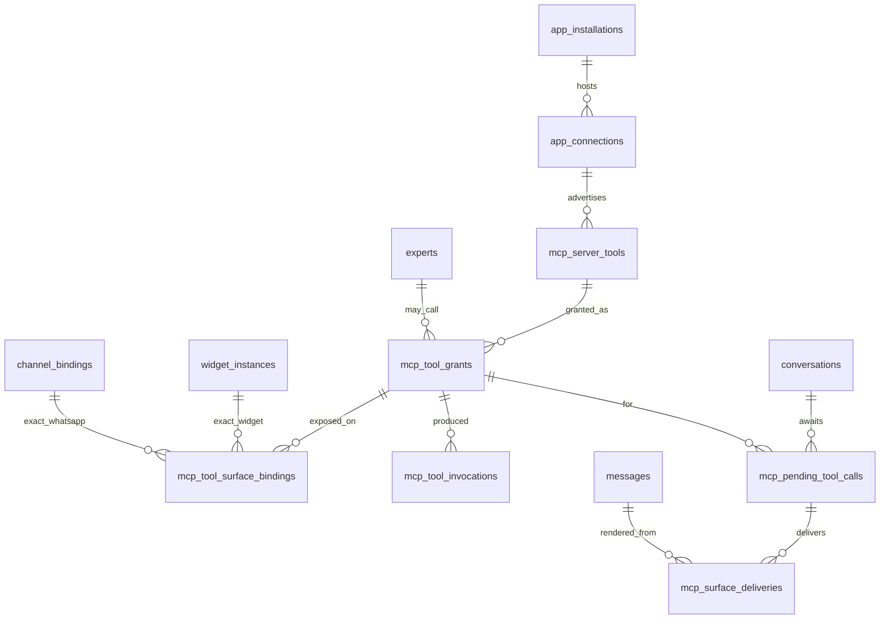

# Geem — MCP Connectors (Client/Host) Plan

## Relationship to the canonical plan

Canonical plan: [`multi-tenant_saas_plan_e28c049c.plan.md`](multi-tenant_saas_plan_e28c049c.plan.md)

The canonical plan records Phases 0–12 as complete and carries a pending Phase 13 stub, connector
kind, schema/security defaults, and testing gate that point here. This document is the detailed
source of truth for the Phase 13 protocol, authorization, egress, grant, and execution contract.

**Ordering:** Phase 13 is pending and may start when explicitly requested. It does not depend on,
modify, or merge with the separate client-owned Agent API. MCP Connectors and Agents AI are separate
paid App Store subscriptions; neither purchase grants the other. The first of Phase 13B or 14A to
land adds the shared App runtime-access fast path and the other reuses it.

---

## Scope

**In scope — Geem as the model-owning MCP client/host.** Tenants attach compatible, publicly
routable HTTPS MCP tool servers. Geem discovers and grants their tools, chooses tool calls with its
configured LLM provider, dispatches them through a controlled egress boundary, and returns the
remote result to the Geem-owned loop. The MCP server executes the tool; it does not receive or need
a Geem/OpenRouter model credential.

**Compatibility promise.** Phase 13 supports only the protocol revisions, transports, auth modes,
schema/result types, and synchronous call behavior explicitly locked below. "Remote MCP" never
means arbitrary proprietary authentication, private/on-premise reachability, or every optional MCP
capability.

**Out of scope — Geem as MCP server.** Exposing Geem Experts as tools to Claude/Cursor is a
separate, cheaper effort (one endpoint over `ExpertQueryService`, workspace API key auth,
`mcp` subdomain slug already reserved in `DEFAULT_RESERVED_WORKSPACE_SLUGS`). Track separately.

---

## Product shape

```text
Browse App Store → choose a monthly plan → hosted checkout/payment fulfillment
  → active subscription + active installation → add MCP server (URL + auth)
  → Geem discovers tools (tools/list) → permitted manager reviews specific tools
  → bind approved tools to Workspace-owned Experts and exact surfaces
  → Expert invokes tools in Workspace Chat / public API / Chat Widget / WhatsApp
```

Payment fulfillment may reactivate installation through the existing Phase 9 commerce flow, but
subscription and installation remain independent runtime gates. Install ≠ connect ≠ grant, matching
§17 semantics:

| Layer | Table | Meaning |
|-------|-------|---------|
| Install | `app_installations` | Workspace enabled the MCP Connector app |
| Connect | `app_connections` | One remote MCP server registered, credentials encrypted |
| Discover | `mcp_server_tools` | Tools the server advertises, with pinned hash |
| Grant | `mcp_tool_grants` | `(expert, connection, tool)` an Expert may actually call |
| Surface bind | `mcp_tool_surface_bindings` | Exact default-off Widget instance or WhatsApp/OpenWA channel binding that may expose one grant |

---

## Locked decisions

| Decision | Choice |
|----------|--------|
| Direction | Geem is the model-owning MCP **client/host**; remote servers execute tools only |
| Protocol versions | MCP `2026-07-28` primary; SDK-negotiated fallback only to named, pinned, conformance-tested legacy revisions (`2025-11-25` Streamable HTTP and `2024-11-05` HTTP+SSE initially) |
| Transport | **Public HTTPS remote only** — current stateless Streamable HTTP; deprecated legacy modes use bounded gateway-owned sessions/SSE channels. `stdio` and private-network targets are rejected |
| MCP implementation | Pinned current Tier-1 Python SDK plus golden wire/conformance fixtures; no handwritten "thin JSON-RPC" client |
| Local process execution | **Never.** No `command` / `args` / `env` accepted anywhere |
| Connector kind | New `ConnectorKind.TOOL_SOURCE = "tool_source"` |
| Connector key | Single generic `mcp_remote` adapter — not one per vendor |
| Auth modes | `NONE`; restricted static secret (`Authorization: Bearer` or allowlisted non-hop-by-hop header); standards-based MCP OAuth 2.1. Proprietary HMAC/cookie/mTLS schemes need later adapters |
| Credential ownership | One Workspace-shared service-account identity per `AppConnection`; every permitted user acts through that external identity. A changed or unverifiable endpoint/resource/issuer/client/external principal increments a credential epoch and invalidates grants; verified same-principal token refresh does not. Per-user delegated MCP credentials are deferred |
| Expert eligibility | Phase 13 tools bind only to Workspace-owned Experts (`experts.workspace_id = grant.workspace_id`). Platform Experts, including Geem General, cannot receive tenant MCP grants in this phase |
| Optional MCP capabilities | Tools only. `input_required`/MRTR elicitation, Tasks, prompts, resources, roots, and sampling are unsupported and fail explicitly |
| Schema profile | Locally validate the supported JSON Schema 2020-12 subset; never resolve remote `$ref`. A tool using unsupported dialect/features is inventory-visible but incompatible |
| Classification pin | Every grant stores the reviewed Geem classification. A classification change makes the grant and all external bindings inert until explicit re-review; it can never silently turn a write into a public auto-run read |
| Tool result profile | Text and `structuredContent` only enter the LLM. `isError` is preserved; image/audio/resource blocks are bounded, never dereferenced, and reported as unsupported metadata |
| Write tools | Allowed. Workspace Chat uses the initiating user. On Widget/WhatsApp, `write_policy=deny` omits the write tool entirely; `workspace_operator_approval` exposes it only through an authenticated Workspace-operator pause. External visitors/senders never approve |
| Surfaces | 13D: Workspace Chat (`source=workspace`) + public API (`source=api`). 13E: exact default-off Chat Widget (`source=widget`) + WhatsApp/OpenWA (`source=channel`) bindings; other channels remain unsupported |
| Unattended writes | Blocked everywhere by default. Only `source=api` may use explicit per-grant `unattended_write_allowed`; Widget/WhatsApp writes always require Workspace-operator approval |
| Billing | Paid App Store **`subscription`** app, monthly SAR plans `mcp-starter`, `mcp-team`, and `mcp-scale`; no free tier or implicit Agents AI bundle |
| Publication | Phase 13B seeds only the `coming_soon` App identity/typed keys. Phase 13E adds signed PlanSpecs, publishes an isolated release-candidate fixture for paid E2E, then promotes production only after the product-specific validator and E2E pass |
| Runtime paid gate | Published App + active installation + current active App subscription + matching plan row with valid typed limits are required for paid operations independently of the Workspace Geem plan. `AppPlan.is_active` controls new sale/selection, not existing subscriber revocation |
| Tier changes | Checkout selects one tier and manual renewal keeps it. Self-service upgrade/downgrade is not promised until shared App commerce gains an explicit plan-change contract; Platform Admin may use existing grant/assignment controls |
| Server count limit | Existing `connections` app plan entitlement (like WhatsApp `line`/`desk`/`ops`). **No** new workspace `EntitlementKey` |
| Tool call ceiling | `tool_calls_daily` app plan entitlement — scales with tier |
| Citations | New internal `kind` discriminator on `Citation`: `chunk` \| `tool`; default chunk kind is omitted from existing wire formats so zero-grant output remains byte-identical |
| Default Expert behavior | Tools off. An Expert with zero grants must behave **byte-identically** to today |
| Egress | All tenant-derived MCP/OAuth HTTP traverses a minimal internal mTLS egress gateway with no application-datastore route; Celery may orchestrate discovery/health and ID-only Widget/WhatsApp resume/delivery jobs but never performs direct tenant-derived HTTP |
| Tool-call concurrency | One tool call per model iteration in Phase 13; parallel calls are disabled and multiple-call upstream responses fail closed |
| Roles | `APPS_VIEW` browse; `APPS_MANAGE` subscribe/install/classify; `APPS_CONNECT` add/authenticate/remove; `EXPERTS_UPDATE` bind grants/surfaces; `CHAT_USE` invokes and approves only the caller's own Workspace-Chat call; new `mcp_tools.approve_external` decides Widget/WhatsApp writes and reconciles ambiguous external deliveries without resend; it is seeded Owner/Admin only but remains assignable through dynamic RBAC |

---

## Architecture — reuse map

Reuse the connector, billing, tenancy, and metering foundations. The egress gateway is a deliberate
security boundary, not a second connector/catalog subsystem.

| Need | Existing piece | Change |
|------|----------------|--------|
| Connector kind | `app/connectors/types.py` `ConnectorKind` | Add `TOOL_SOURCE`. `apps.connector_kind` is nullable `String(32)` with **no CHECK constraint** — no column migration |
| Adapter | `ConnectorRegistry`, `ConnectorAdapter` | Register `mcp_remote` for lifecycle/config; extend it for per-connection auth mode and server/issuer context; `is_configured()` gates on `MCP_CONNECTOR_ENABLED` |
| Protocol client | Tier-1 Python MCP SDK | Pin one reviewed release; support modern stateless headers/metadata, JSON/request-scoped SSE/cancellation/`server/discover`, plus bounded initialized session/header/SSE lifecycle for each promised legacy revision |
| Server record | `AppConnection` | Reuse. Persist canonical server/resource URL, negotiated protocol/capabilities, credential epoch, and safe principal fingerprint; status lifecycle + health as-is |
| Secrets / OAuth state | `ConnectorCredentialService`, `ConnectorOAuthStateService` | Reuse encryption and one-time-state primitives; store restricted static auth or issuer-bound pre-registration/DCR credentials per connection, and extend state for canonical resource URI, validated issuer, scopes, registration/client binding, PKCE, optional rotating refresh token, and reauthorization |
| Billing gate | `AppAccessService.require_runtime_active(...)` shared with Phase 14 | Extend the existing authority with one read-only indexed Core/scalar query returning current access + requested App entitlements; Phase 13E adds the set-valued form for MCP + Widget/WhatsApp dual-App admission; fresh before each discovery/dispatch/resume; no stale positive cache |
| Server count | `connections` app plan entitlement | Reuse |
| Errors | `ErrorCategory` (existing `CONNECTOR_*`) | Add MCP protocol/auth/tool/outcome categories below |
| Audit | `AuditAction`, `AuditResourceType.APP_CONNECTION` | Add MCP lifecycle/grant/approval actions; register only safe metadata keys in `app/audit/sanitize.py` |
| Egress | New minimal internal gateway | mTLS-authenticated operation API, current SDK, URL/DNS/IP/TLS/redirect policy, bounded bodies, bounded in-memory legacy sessions only, no DB/Redis/Qdrant/MinIO access, no secret/body logs |
| Jobs | Celery + `tenant_context` | DB-capable discovery/health and external-surface resume/delivery orchestrators carry IDs only, call the gateway/client through bounded services, and persist results/outbox state; no plaintext credentials, arguments, or tool results in the application broker |
| Metering | `MeteredWorkspaceGeneration`, `GenerationUsageContext.add_billed` | Reuse the `extra_billed_tokens` accumulator |
| Surface discrimination | `ChatInvocationContext.source` | Required argument to the grant resolver |

**Execution boundary:** session/API code and ordinary workers resolve tenancy, decrypt one
connection credential, and call the internal egress gateway over mTLS with an end-to-end deadline.
The gateway receives only one operation's canonical URL, bounded protocol payload, and ephemeral
auth material in memory; it never receives a database key or general Geem secret and never persists
task or result bodies. Modern `2026-07-28` calls are stateless request/reply. For a promised legacy
revision, the gateway alone owns the initialized session, `Mcp-Session-Id`, or live HTTP+SSE channel
behind an opaque caller/Workspace/connection-bound handle with strict TTL/concurrency limits and
explicit close/cancel. Legacy sessions never survive a human-approval pause; resume opens a fresh
session and revalidates the tool before dispatch. OAuth discovery/registration/token/refresh uses
the same egress path. The trusted caller persists inventory, health, and rotated tokens after the
gateway returns.

---

## Paid runtime authorization and fast-path contract

MCP Connectors reuses the Phase 9 commerce authority; it does not add another billing system. Extend
`AppAccessService` with the shared read-only
`require_runtime_active(workspace_id, app_slug, entitlement_keys=...)` method also used by Agents
AI. Phase 13E generalizes the same authority to
`require_runtime_active_set(workspace_id, requirements_by_app_slug=...)`; the singular method
delegates to a one-item set. One purpose-built indexed SQLAlchemy Core/scalar query, using database
time and bypassing ORM identity-map state, must establish every requested App in the set:

- active, non-deleted tenant Workspace (`Workspace.kind=tenant`);
- published catalog row (`mcp-connectors`, plus `chat-widget` or `whatsapp` for an external-surface
  dispatch/resume);
- active installation for each required App;
- active subscription for each required App whose `[current_period_start, current_period_end)` contains one
  statement-time instant from a one-row `statement_timestamp()` CTE (never PostgreSQL transaction-
  start `CURRENT_TIMESTAMP`);
- matching subscribed plan row for each same App
  (`app_plans.id=app_subscriptions.app_plan_id AND app_plans.app_id=apps.id`) and positive typed
  `connections` / `tool_calls_daily` values when requested from `mcp-connectors`. Plan `is_active`
  affects new checkout selection only and does not revoke an existing subscription.

It returns only a compact decision-timestamp/IDs/status/plan/period-end/limits snapshot. The same SELECT
joins/aggregates only the requested typed entitlement rows, so the launch hot path has exactly one
access/entitlement **data SELECT** and never calls `AppEntitlementService` afterward. Protected
admission first issues the lightweight known-key advisory-fence statement below; it is not a second
access resolve. The authorization read never
mutates an expired subscription or commits normalization side effects. No cross-request Redis
decision—access or plan limits—is authoritative at launch: cache-aside invalidation can briefly
outlive uninstall, revoke, unpublish, Workspace suspension, or an entitlement reduction. DB failure
fails the paid operation closed with retryable `APP_RUNTIME_ACCESS_UNAVAILABLE`. Query-count,
reviewed `EXPLAIN`, and latency metrics are release gates; the target is one paid-access/limit data
SELECT per check and representative end-to-end gate p95 at or below 20 ms, including the preliminary
fence statement where required.

The paid-operation matrix is explicit:

| Operation | Current active subscription + installation required? |
|-----------|------------------------------------------------------|
| Server create, OAuth start/callback credential persistence, reauthorize, discovery/health, classification, grant create/activate | Yes |
| Every actual remote tool dispatch and every approval resume | Yes — execute a fresh query immediately before quota admission/egress; never memoize across loop iterations or a human pause. Widget/WhatsApp requires both MCP Connectors and the originating surface App in one set decision |
| Create/activate an exact Widget/WhatsApp surface binding | Yes — MCP Connectors and the originating surface App must both be current; revoke remains available after expiry |
| Widget turn status / WhatsApp outbox segment send | Current originating surface App only; already-admitted result/terminal cleanup does not re-consume MCP access or quota and performs no new model/tool work |
| Catalog/detail/list, payment return, checkout/renew, disconnect/delete, grant revoke, uninstall, local credential cleanup | No — these recovery/cleanup paths remain reachable with their normal auth/permissions after expiry |

Each protected external operation uses one short admission transaction explicitly pinned and
asserted as PostgreSQL `READ COMMITTED` before any statement; never inherit an unchecked server
default. Before the access SELECT, one preliminary statement acquires transaction-scoped **shared**
advisory fences using only stable keys known in advance, in fixed lexically sorted App-slugs →
Workspace → matching lexically sorted Workspace+App → sorted exact external-surface-target-key order. A
normal MCP call has one App and no surface key; a Widget/WhatsApp call locks both required App slugs
and its server-resolved target key set (Widget instance, or OpenWA connection + ChannelBinding).
Every restrictive plan/
entitlement mutation takes the App-level **exclusive** fence before writing; Workspace/install/
subscription mutations take their matching exclusive fences in the same order. Widget origin/
Expert/state changes, OpenWA connection/account/session changes, channel disable/rebind/policy
changes, and surface-binding create/revoke take the exact target's exclusive fence and make affected
bindings inert before commit. Only after those locks return does the fresh access data SELECT run,
followed by deterministic `FOR SHARE` locks/rechecks of the MCP and originating-App connections,
tool, grant, exact surface binding, Widget instance/conversation binding or OpenWA channel/
conversation binding, conversation/message, and invocation rows. Restrictive updates take
conflicting row locks in the same order. Do not derive a selected-plan fence inside the access
statement: its snapshot can predate a lock wait, while the App fence already serializes all
restrictive plan/entitlement changes. Under `READ COMMITTED`, the later access SELECT takes a fresh
post-wait statement snapshot; an isolation mismatch fails readiness/admission closed rather than
running this protocol under `REPEATABLE READ`. A tool
dispatch atomically writes its idempotent invocation receipt and UTC-day counter in that transaction;
discovery/OAuth operations commit an access admission without a tool counter. Restrictive App/plan/
Workspace/install/subscription rules above apply; restrictive connection/grant mutations take their
matching locks, and classification changes atomically stale affected grants and surface bindings.
Shared fences do not serialize normal calls with one another. Admission commit is the cutoff, and
the gateway/OAuth network call starts only afterward with no DB transaction held: an operation
admitted before a deny commit may finish, but no admission after that commit can start new egress.

Any source with no eligible grant/exact surface binding performs no MCP App-access lookup and stays
on its original byte-compatible path. A restrictive
mutation denies locally first: mark the installation/connection/grants inert and commit before slow
best-effort remote revocation or session cleanup. A call admitted before that commit may finish, but
no check after the deny commit may start new egress. Local secret/session purge still completes when
remote revocation fails.

---

## Database schema

Migrations start at the live Alembic head and each slice owns an immutable revision: `0036` server
inventory/connection MCP state (13B), `0037` grants (13C), `0038` invocations (13D), `0039`
pending approvals (13E), and `0040` exact Widget/WhatsApp surface bindings, external attribution,
and durable external delivery state (13E). `0034` and `0035` already belong to Phase 12 and are never
reused.

Every tenant-owned MCP table has `workspace_id`, and migrations add exact composite keys/FKs:

- an MCP connection belongs to an installation in the same Workspace;
- a tool belongs to the grant's exact `(workspace_id, app_connection_id)`, not merely its Workspace;
- a grant targets a Workspace-owned Expert with the same `workspace_id` (Platform Experts fail);
- a pending row's `(conversation_id, message_id)` identifies a message in that exact conversation,
  and the conversation belongs to the row's Workspace; add the needed composite unique key because
  `messages` has no standalone `workspace_id` today; and
- each exact external surface binding proves one Widget instance or WhatsApp/OpenWA `ChannelBinding`
  belongs to the same Workspace, is currently bound to the grant's same Workspace-owned Expert, and
  names only the grant's exact tool/connection chain;
- pending/invocation rows use mutually exclusive Workspace-user, API-key, Widget-binding, or
  WhatsApp-binding attribution shapes—never a fabricated Geem user for a visitor/sender; and
- each invocation/approval/delivery references its exact grant/tool/connection/surface chain.

Repository filtering remains mandatory but is not the only integrity boundary.



### `AppConnection` MCP state + `mcp_server_tools` (0036, Phase 13B)

Extend the reused connection's encrypted MCP config with canonical endpoint/resource, auth strategy,
restricted static credential or issuer-bound client registration, and token set. Persist only safe
queryable protocol/capability, `credential_epoch`, and `principal_fingerprint` metadata outside the
encrypted blob. Discovered inventory is stored per connection:

| Column | Notes |
|--------|-------|
| `id` | UUID PK |
| `workspace_id` | FK, NOT NULL, indexed — keeps every query tenant-filtered |
| `app_connection_id` | exact same-Workspace installation/connection composite FK, NOT NULL |
| `tool_name` | exact case-sensitive MCP name; unique `(app_connection_id, tool_name)` |
| `llm_tool_name` | stable provider-safe alias unique `(workspace_id, llm_tool_name)`; maps only to `(connection, exact tool_name)` so every Expert-visible subset is collision-free |
| `title` / `description` | as advertised — **untrusted text** |
| `input_schema` / `output_schema` | JSONB, the server's declared JSON Schemas; remote `$ref` resolution forbidden |
| `annotations` | JSONB — `readOnlyHint` etc. **advisory only** |
| `raw_definition` / `normalization_version` | bounded original descriptor (including icons, execution/task declarations, and safe `_meta`) + canonicalization version for audit/re-hash |
| `protocol_version` / `compatibility_status` | negotiated revision; `compatible` \| `unsupported_schema` \| `unsupported_capability` \| `malformed` |
| `classification` | `read_only` \| `write` \| `unknown` — **Geem-assigned**; `unknown` is default-deny and never executable |
| `definition_hash` | SHA-256 over every canonical model/execution-relevant field, including exact name, title, description, input/output schemas, annotations, execution/task declarations, and required header mapping |
| `status` | `active` \| `stale` \| `withdrawn`; withdrawal only after a complete successful paginated snapshot |
| `first_seen_at` / `last_seen_at` / `discovery_generation` | complete-snapshot tracking; one malformed tool does not discard valid siblings |

### `mcp_tool_grants` (0037, Phase 13C)

| Column | Notes |
|--------|-------|
| `workspace_id`, `expert_id`, `app_connection_id`, `mcp_server_tool_id` | exact composite FKs; Expert must be Workspace-owned, tool must belong to this connection; unique `(expert_id, mcp_server_tool_id)` |
| `approved_definition_hash` | Hash pinned at approval. Mismatch → grant inert |
| `approved_classification` | Exact reviewed `read_only` or `write`; mismatch with the current Geem classification makes the grant and every dependent surface binding inert |
| `approved_principal_fingerprint`, `approved_credential_epoch` | Pin the reviewed external identity/resource; mismatch makes the grant inert and requires re-review |
| `state` | `pending_review` \| `active` \| `revoked` \| `stale_definition` \| `stale_classification` \| `stale_principal` |
| `allow_workspace_chat` | default `true` |
| `allow_public_api` | default `false` |
| `unattended_write_allowed` | default `false`. Only meaningful when `classification=write`, `allow_public_api=true`, and an explicit risk acknowledgement is recorded |
| `approved_by_user_id`, `approved_at` | |
| `outbound_data_acknowledged_at` | records that a grant authorizes sending model-generated arguments to an external service, even for read-only tools |

### `mcp_tool_surface_bindings` (0040, Phase 13E)

External surfaces never inherit an Expert-wide boolean. Each row exposes one already-active grant
to one exact existing surface target:

| Column | Notes |
|--------|-------|
| `workspace_id`, `expert_id`, `mcp_tool_grant_id` | exact same-Workspace composite FK to the grant and its Workspace-owned Expert |
| `surface_kind` | `chat_widget` \| `whatsapp_openwa`; no generic future-channel wildcard |
| `widget_instance_id`, `channel_binding_id` | nullable exact composite FKs with a CHECK requiring exactly the target matching `surface_kind`; target Workspace + bound Expert must equal the grant row |
| `state` | `active` \| `revoked` \| `stale_source` \| `stale_classification`; only `active` exposes a tool schema, and absence/any inert state means no MCP paid lookup on that surface |
| `write_policy` | `deny` (default) \| `workspace_operator_approval`; there is no unattended external-surface value |
| `approved_surface_config_hash`, `approved_source_principal_fingerprint`, `approved_source_epoch` | pin the reviewed Widget origin/Expert/state tuple or OpenWA connection/account/session + binding/Expert/direct-chat policy; any mismatch makes the row inert |
| `public_risk_acknowledged_at`, `outbound_data_acknowledged_at` | required before activation; covers untrusted public callers, shared external account, argument egress, abuse, and side effects |
| `approved_by_user_id`, `approved_at` | requires `EXPERTS_UPDATE`; exact-target partial unique indexes prevent duplicate active bindings |

Widget rows additionally require a non-empty normalized exact-HTTPS `allowed_origins` list. WhatsApp
rows are direct-chat only in Phase 13E; group/status/broadcast chats resolve no tools even if the
ordinary channel auto-reply policy is enabled. Migration `0040` adds/integrates a monotonic MCP
source epoch on each exact WidgetInstance and ChannelBinding; an OpenWA reconnect/account/session
identity change increments every affected binding epoch and principal fingerprint in the same
transaction. Origin, Expert, state, auto-reply/direct policy, or external identity changes increment
the relevant epoch under the exclusive surface-target-key set and atomically stale dependent bindings.
No target ID remaining equal is treated as proof that its audience or external identity is unchanged.

### `mcp_pending_tool_calls` (0039 core; 0040 external attribution, Phase 13E)

| Column | Notes |
|--------|-------|
| `workspace_id`, `conversation_id`, `message_id`, `mcp_tool_grant_id` | exact composite FKs; `(conversation_id, message_id)` proves the message belongs to that conversation and its Workspace |
| `initiated_by_user_id`, `mcp_tool_surface_binding_id`, `model_tool_call_id` | Workspace Chat sets the initiating user and no surface row; Widget/WhatsApp sets the exact surface row and no user. A CHECK enforces one initiator shape |
| `external_principal_fingerprint`, `initiating_origin_digest` | keyed digest of the server-resolved Widget session or WhatsApp conversation/sender binding; Widget also pins the normalized initiating Origin, which must remain allowed on resume. Never store a raw token, phone number, or chat ID |
| `external_turn_handle_digest` | keyed digest of the bundled client-generated high-entropy `client_turn_id`, used as the public Widget turn handle; the raw value is Origin/session/widget-bound, expires with the turn, is never a DB UUID, and is never stored or logged |
| `arguments_encrypted` | encrypted authoritative arguments; resume never accepts replacement arguments from the client |
| `loop_state_encrypted` | encrypted bounded loop transcript needed for deterministic resume |
| `status` | `pending` \| `approved` \| `denied` \| `expired` \| `executing` \| `executed` \| `outcome_unknown` |
| `idempotency_key`, `version` | unique logical call identity + compare-and-swap/row-lock protection against duplicate resume |
| `resume_requested_at`, `resume_enqueued_at`, `resume_attempts` | the committed `approved` row is authoritative; after-commit enqueue is best-effort and an approved-row recovery sweep may enqueue the same stable ID again |
| `claim_lease_expires_at`, `gateway_dispatch_started_at`, `execution_deadline` | worker CAS/lease and crash boundary. Only a provably pre-gateway expired claim may return to `approved`; once the durable dispatch marker is set, a stale execution becomes `outcome_unknown` and is never redispatched |
| `expires_at` / `purge_after` | terminal rows have sensitive payloads scrubbed, then are hard-purged on a bounded schedule |
| `decided_by_user_id`, `decided_at`, `executed_at` | Workspace Chat records the initiating user; external writes record an authenticated member with current `mcp_tools.approve_external`. Visitor/sender text can never populate this field |

A partial unique constraint permits at most one live external write per conversation with the exact
predicate `status IN ('pending','approved','executing')`. The inbound check and transition use the
same conversation lock. Widget retention cannot purge its conversation while that bounded row is
live; later Widget/WhatsApp messages receive a deterministic pending notice instead of creating an
interleaved loop.

### `mcp_tool_invocations` (0038, Phase 13D)

Operational ledger with immutable identity/request fields and monotonic execution transitions:
Workspace, Expert, nullable conversation/message, grant, invocation surface, initiating user,
API-key ID, or exact external surface binding plus keyed external-principal fingerprint, model
tool-call ID, unique request/idempotency/admission IDs, `quota_charged_at` + UTC
period key, duration, `status` (including `outcome_unknown`), `error_code`, argument **hash** (never
raw arguments), and response byte/content summary. Duplicate processing finds the same admission ID
and cannot charge or dispatch twice. Public answer API invocations have no Conversation row.
Complements `audit_logs`; keeps the audit table free of high-volume rows.

### `mcp_surface_deliveries` (0040, Phase 13E)

Durable external reply/follow-up outbox state references the nullable pending call, assistant
message, exact surface binding, stable turn/response revision, per-conversation monotonic sequence,
segment index, immutable bounded encrypted rendered segment + content hash, status
(`pending|dispatching|sent|delivery_unknown|cancelled|expired`), CAS version/claim lease/attempt
timestamps, delivery deadline, and safe provider message ID. It therefore covers read-only final
replies as well as write pending/terminal follow-ups. WhatsApp segments are unique by
`(assistant_message_id, response_revision, segment_index)`; one worker claims
`pending → dispatching` before network. A definite pre-dispatch failure may release/retry within its
cap, but worker loss or provider-acceptance ambiguity after claim becomes `delivery_unknown` and
never auto-resends. The ChannelConversationBinding is a single-writer stream: turn N+1 cannot send
until every segment of N is sent or its unknown state is explicitly reconciled, and MCP-enabled
paths never also call the legacy immediate sender.

For Widget, this row also acts as the idempotent turn receipt. Before work begins, atomically create
or reuse a row unique on
`(widget_instance_id, initiating_origin_digest, external_turn_handle_digest)` and bind it to the
exact conversation/message. Concurrent retries of
the same `client_turn_id` return/replay that logical turn, re-mint the audience-bound session token,
and never create a second conversation, pending call, invocation, or model/tool execution.

Unknown reconciliation records the deciding Workspace operator, timestamp, and explicit
`confirmed_sent|cancelled` resolution without resending the segment.

Immediately before every WhatsApp segment claim/send, recheck current WhatsApp App subscription +
installation, usable OpenWA connection/session, exact active ChannelBinding/Expert/direct-chat
policy, ChannelConversationBinding, and sender digest under the surface lock. Failure cancels the
delivery permanently; renewal does not resurrect it. Already-admitted terminal cleanup/delivery
does not require MCP Connectors to remain subscribed and performs no new model/tool work, but every
new MCP dispatch/resume still requires both Apps. Widget status polling similarly requires current
Chat Widget App access and resolves the exact current Widget instance and signed session, then reads
only coarse state/final assistant text.
Raw session tokens, phones/chat IDs, tool arguments/results, and credentials never enter this table
or Celery payloads.

---

## New enum / config identifiers

**`ConnectorKind`** — add `TOOL_SOURCE = "tool_source"`.

**`ConnectorAuthMode`** — add `NONE = "none"`; retain `API_KEY` for bearer or an allowlisted
static header and `OAUTH2` for the MCP authorization flow. Reject `CUSTOM` for generic MCP unless a
future reviewed adapter defines its exact signing/credential contract.

**`ErrorCategory`** — add:
`MCP_PROTOCOL_UNSUPPORTED`, `MCP_SERVER_UNREACHABLE`, `MCP_AUTH_REQUIRED`,
`MCP_REAUTHORIZATION_REQUIRED`, `MCP_TOOL_NOT_GRANTED`, `MCP_TOOL_SET_CHANGED`,
`MCP_TOOL_INCOMPATIBLE`, `MCP_TOOL_RESULT_UNSUPPORTED`, `MCP_TOOL_CALL_FAILED`,
`MCP_TOOL_OUTCOME_UNKNOWN`, `MCP_TOOL_LIMIT_REACHED`, `MCP_EXTERNAL_APPROVAL_REQUIRED`,
`MCP_EXTERNAL_TURN_PENDING`, `MCP_EXTERNAL_DELIVERY_UNKNOWN`, `EGRESS_TARGET_BLOCKED`; shared
`APP_RUNTIME_ACCESS_UNAVAILABLE` for a retryable fail-closed paid-gate database failure.

**`WorkspacePermission`** — add
`MCP_TOOLS_APPROVE_EXTERNAL = "mcp_tools.approve_external"` to the dynamic permission catalog. Seed it for Owner/Admin only;
custom roles may receive it explicitly. It authorizes only deciding an already-created exact-
argument Widget/WhatsApp pending call and listing/reconciling the same Workspace's
`delivery_unknown` rows through a constrained no-resend CAS. It never edits arguments, grants,
connections, credentials, or arbitrary delivery content/state.

**`AuditAction`** — following the existing `app.connection.created` convention:
`app.mcp.server_added`, `app.mcp.server_removed`, `app.mcp.tools_discovered`,
`app.mcp.tool_granted`, `app.mcp.tool_revoked`, `app.mcp.surface_bound`,
`app.mcp.surface_unbound`, `app.mcp.tool_approval_decided`,
`app.mcp.external_delivery_changed`.

**Settings** (`app/core/config.py`):

| Env var | Default | Purpose |
|---------|---------|---------|
| `MCP_CONNECTOR_ENABLED` | `false` | Adapter availability gate |
| `MCP_SUPPORTED_PROTOCOL_VERSIONS` | `2026-07-28,2025-11-25,2024-11-05` | Explicit reviewed negotiation allowlist |
| `MCP_CLIENT_METADATA_URL` | `""` | Public HTTPS CIMD document URL; empty disables CIMD and uses configured pre-registration/DCR fallback |
| `MCP_EGRESS_GATEWAY_URL` | `""` | Internal mTLS gateway; required outside local |
| `MCP_EGRESS_PROXY_URL` | `""` | Gateway forward proxy; required in deployed environments unless equivalent network policy is proven |
| `MCP_ALLOW_PRIVATE_EGRESS` | `false` | **Local dev only**; must be false outside `APP_ENV=local` |
| `MCP_LEGACY_SESSION_TTL_SECONDS` | `300` | Maximum idle lifetime for a gateway-owned legacy MCP session/SSE channel |
| `MCP_MAX_LEGACY_SESSIONS` | `64` | Per-gateway-instance concurrency/backpressure bound |
| `MCP_MAX_TOOL_ITERATIONS` | `5` | Loop bound |
| `MCP_MAX_TOOLS_PER_EXPERT` | `32` | Prompt-size bound |
| `MCP_MAX_DISCOVERED_TOOLS` | `512` | Per-connection paginated inventory bound |
| `MCP_TOOL_INVENTORY_TTL_SECONDS` | `300` | Maximum inventory age; refresh or fail closed before dispatch when expired |
| `MCP_TOOL_CALL_TIMEOUT_SECONDS` | `20` | Per call |
| `MCP_TOTAL_TURN_TIMEOUT_SECONDS` | `120` | End-to-end active-segment deadline, including provider, admission/backpressure, and gateway time |
| `MCP_TOOL_RESULT_MAX_BYTES` | `32768` | Per-result transport cap before normalization |
| `MCP_TOOL_RESULT_MAX_CHARS` | `8000` | Text/serialized-JSON context cap after byte validation |
| `MCP_MAX_REDIRECTS` | `3` | Each hop independently canonicalized, resolved, and policy-checked |
| `MCP_TOOL_APPROVAL_TTL_SECONDS` | `900` | Pending approval expiry |
| `MCP_MAX_EXTERNAL_PENDING_PER_WORKSPACE` | `100` | Backpressure bound across Widget/WhatsApp writes; one live row per external conversation is the stricter local bound |

No new Workspace `EntitlementKey` values — limits live in `app_plan_entitlements`. Add
`connections` and `tool_calls_daily` under both the `mcp-connectors` slug and `mcp_remote` connector
alias in the typed App entitlement-key catalog so seed validation, Platform Admin editing, and
runtime quota resolution agree. Missing, malformed, non-integer, or non-positive runtime limits fail
closed. The exact UTC-day usage-period metric is `app:mcp-connectors:tool_calls`; the unique invocation
admission ID is its idempotency receipt.

---

## Security model

### S1 — Transport restriction (blocking for 13B)

Canonical public `https://` URL only outside explicit local development. Reject URL user-info,
fragments, query-string credentials, `command`, `args`, `env`, and `stdio` at the Pydantic schema
layer so they cannot be smuggled through an encrypted blob. TLS verification and hostname/SNI
validation are mandatory; tenant-controlled CA bundles or verification-disable flags are forbidden.

Use the pinned SDK's `2026-07-28` stateless path: each request carries required `_meta`,
`MCP-Protocol-Version`, `Mcp-Method`, and when applicable `Mcp-Name`/validated `Mcp-Param-*`
headers; responses may be JSON or request-scoped SSE. `server/discover` negotiates modern servers;
fallback occurs only for the allowlisted legacy revisions and their conformance-tested handshake.
For `2025-11-25`, the gateway performs the required initialize/session lifecycle and propagates the
validated `Mcp-Session-Id`; for `2024-11-05`, it owns the initialized HTTP+SSE channel and routes
messages until close/cancel/TTL. Handles are unguessable, caller/Workspace/connection-bound, never
serialized into the application broker, and forcibly cleaned up on deadline, disconnect, gateway
shutdown, or limit pressure. Reconnect/reinitialize is allowed only before dispatch; a write with an
ambiguous outcome is never replayed. A stdio-shaped or unsupported-version payload returns a
validation/protocol error and is never saved.

### S2 — SSRF guard (blocking for 13A)

**Current gap:** no outbound URL validation exists anywhere. The existing allowlists cover CORS
origins, audit metadata keys, and API-key scopes only. `infra/docker-compose.yml` declares **no
`networks:` block**, so `api` and `worker` reach `postgres:5432`, `redis:6379`, `qdrant:6333`,
`minio:9000` by service name. A tenant registering `http://qdrant:6333` would turn the MCP
client into a read proxy over every tenant's vectors.

Code controls, enforced by the gateway and independently unit-tested:

- Scheme allowlist `https` (plus `http` only when `APP_ENV=local` and `MCP_ALLOW_PRIVATE_EGRESS`)
- Canonicalize host/IP forms; reject loopback, RFC1918, link-local, CGNAT, IPv6 ULA/loopback,
  IPv4-mapped IPv6, metadata ranges, Docker service names, and deployment network CIDRs
- Resolve once and connect to the validated address while preserving verified hostname/SNI; the
  mandatory deployed proxy must enforce the same policy rather than re-resolving unsafely
- Follow at most `MCP_MAX_REDIRECTS`; re-run the complete scheme/DNS/IP/origin policy on every hop
  and never forward `Authorization`, cookies, or static secrets across an origin change
- Disable SDK/HTTP automatic retries for every `tools/call`. A classified-write call never follows
  or replays any 3xx response (including 307/308): after request dispatch, a redirect or transport
  ambiguity is `outcome_unknown`, because the first endpoint may already have performed the side
  effect. Bounded redirect following remains available only to explicitly idempotent metadata/
  discovery GETs and classified-read operations
- Bound connect/write/read/total deadlines, redirects, headers, pages, SSE frames, and response bytes

Architectural control: the minimal mTLS egress gateway has an external route but **no route to
Postgres, application Redis, Qdrant, or MinIO** and receives no general application environment.
API and regular workers have application data access but no direct path to tenant-configured MCP or
MCP-OAuth target URLs. Existing fixed-provider connector traffic remains under its own reviewed
adapter policy. A named Celery queue alone is not an isolation boundary and is not used for
synchronous HTTP RPC.

### S3 — MCP authentication and credential lifecycle

Authorization is per connection:

1. `NONE` sends no credential. Static-secret mode sends only its configured restricted header after
   target validation. OAuth starts from the HTTP 401 `WWW-Authenticate` challenge and Protected
   Resource Metadata rather than guessing authorization endpoints.
2. Fetch and validate OAuth Authorization Server Metadata and OIDC discovery through the egress
   gateway. Bind every discovered URL to the SSRF/origin policy and the selected resource.
3. Obtain a client ID from a configured public CIMD document when supported, otherwise exact
   issuer-bound pre-registration, then legacy DCR only when advertised. Serve the configured CIMD
   document from a public read-only API route and conformance-test its content and reachability.
   Store pre-registered/DCR client IDs and secrets only in the per-connection encrypted credential.
4. Require PKCE S256, include the canonical MCP resource URI on authorization and token requests,
   and store state + PKCE verifier + Workspace + actor + connection + redirect target + expected
   issuer + scopes + registration binding in the one-time state record.
5. Validate callback `iss` before code redemption. Access tokens are bearer headers only and are
   never placed in URLs. Refresh tokens are optional, rotated under a per-connection row lock when
   issued, and never assumed to exist.
6. A runtime 401 or 403 `insufficient_scope` marks the connection `reauthorization_required`; it does
   not widen scopes or launch OAuth inside any Workspace/API/Widget/WhatsApp turn. Only an
   `APPS_CONNECT` user may explicitly
   approve the bounded scope change and start reauthorization. Public API calls return a safe,
   non-redirecting error; Workspace Chat may show an authorized management link. Recheck Workspace/
   App/connection state before persisting any returned credential. Token
   refresh/rotation uses a per-connection row lock and compare-and-swap so a losing refresh cannot
   overwrite the newest rotated refresh token.

Static-secret mode permits only `Authorization: Bearer` or a reviewed allowlist of non-hop-by-hop,
non-cookie, non-MCP-protocol header names. Connection creation accepts the header name plus write-only
value, or an OAuth registration strategy plus write-only pre-registered client credentials; response
DTOs expose only the redacted mode/status.

Derive a safe `principal_fingerprint` from canonical endpoint/resource, issuer, client registration,
and stable authenticated external subject when the server supplies one. Any endpoint/resource/
issuer/client change, static credential replacement, subject change, or reauthorization whose
identity cannot be proven equal increments `credential_epoch`, moves all grants to
`stale_principal`, and requires fresh discovery/review. Verified access/refresh-token rotation for
the same identity preserves the epoch. Disconnect, connection removal, App uninstall, and Workspace
purge attempt remote revocation when supported, then always clear tokens, static secrets, DCR/pre-
registration secrets, legacy
sessions, and registration state locally even if revocation fails. All connections are
Workspace-shared service accounts in Phase 13; the UI must disclose the external account identity
and sharing effect before activation.

### S4 — Tool authorization

Default-deny. `annotations.readOnlyHint` / `destructiveHint` are **server self-reported** and used
for UI hints only; `classification` is Geem-owned and `unknown` never resolves. Pin the complete
normalized `definition_hash` and exact Geem classification at approval. A detected definition
change moves the grant to `stale_definition`; any classification edit atomically moves every
affected grant to `stale_classification` and makes dependent surface bindings inert until re-review.
Resolution independently compares the approved classification so a partial mutation cannot widen
access. Hash pinning detects advertised drift; it cannot prove that a remote
implementation still behaves like its description.

Immediately before **every** discovery, call, or approval resume, inside the short shared-fence
admission transaction, run a fresh `require_runtime_active`/set database decision and recheck
connection health/auth/principal fingerprint/credential epoch,
complete-snapshot tool status/freshness, definition hash, classification, Workspace-owned Expert
authorization, exact source grant/binding, approved source config/principal/epoch, quota, and
initiating principal/context. Widget and WhatsApp additionally re-resolve and lock the server-owned
conversation binding, external-principal digest, originating App access, surface state, bound Expert,
and current message before every dispatch or resume; Widget resumes also require the initiating
Origin digest to remain in the current exact allowlist. Request bodies cannot name a different
surface. Validate arguments locally against the
supported JSON Schema dialect with no network `$ref` resolution and generate required `x-mcp-header`
values only after schema validation.

### S5 — Prompt injection and outbound data

Tool names, descriptions, schemas, errors, and results are attacker-controlled instruction-bearing
content. They never merge into `system_instructions`; model-facing tool/result content is bounded,
safely serialized, explicitly marked untrusted, and isolated from RAG/system policy. Unsupported
content blocks, resource links, and advertised remote icons are never fetched automatically or
rendered directly from the tenant URL.

Every MCP call sends model-generated arguments to an external server. A `read_only` classification
describes intended side effects; it does **not** make outbound arguments confidential or safe. The
grant UI must disclose the server/account and outbound-data boundary, show arguments for write
approval, and warn when an Expert has sensitive knowledge or tools that can receive/send data.
Prompt rules reduce accidental disclosure but cannot guarantee non-exfiltration.

Widget visitors and WhatsApp senders are untrusted public callers using a Workspace-shared external
account. Creating an exact surface binding requires a second public-audience/abuse acknowledgement;
the Widget bootstrap and the Workspace-configured WhatsApp first-use notice disclose that external
services may receive bounded message-derived arguments before a tool-enabled turn. Widget tool
bindings require an exact HTTPS origin allowlist, and both surfaces reuse their existing session/IP
or signed-webhook/chat rate limits plus MCP quota and pending-write caps. No prompt or UI disclaimer
is treated as authorization.

### S6 — No credential passthrough

Never forward a Geem user JWT/session, Workspace API key, OpenRouter/provider key, egress-gateway
credential, or unrelated connection token to an MCP server. Only the selected connection's
origin/resource-bound credential may be used. Secrets and raw auth/body material are absent from
DTOs, broker payloads, logs, traces, audit metadata, exception details, and invocation rows.

### S7 — Tenancy, surface, and approval principal

`workspace_id` is required on every new table and query, with the exact composite constraints above.
Platform Experts fail MCP grant creation/resolution. Grant resolution requires
`ChatInvocationContext.source`. Through 13D, `SOURCE_WIDGET` and `SOURCE_CHANNEL` resolve empty; 13E
allows them only through an active exact `mcp_tool_surface_bindings` row and a server-resolved Widget
or WhatsApp conversation binding for the same Workspace/Expert. Public answer API use is only
`/api/v1/chat/completions`, additionally requires `chat:write` and `allow_public_api`, and can never
manage connections or credentials.

A Workspace-Chat approval requires `CHAT_USE`, the same initiating user/conversation, a current
pending state, and a current grant; another ordinary member cannot approve it. Widget visitors and
WhatsApp senders have neither a Geem user nor API-key principal: their clicks/text—including words
such as “approve”—can never decide a write. An external write requires
`write_policy=workspace_operator_approval` and an authenticated current Workspace member with
`mcp_tools.approve_external`, current access to the bound Expert, exact stored arguments, and all
current dual-App/grant/surface checks. `unattended_write_allowed` is ignored and rejected for both
external surfaces. A surface binding with `write_policy=deny` omits write tools from the model tool
set and therefore creates no pending row.

---

## Engine design

### E1 — Why a separate provider method

`OpenRouterChatProvider._payload()` hardcodes `response_format: {"type": "json_object"}`, and
`_call_stream` reconstructs the visible answer by scraping a half-finished JSON string via
`extract_partial_json_string(buffer, "answer_markdown")`. Tool calling cannot be flagged onto this:
providers behave inconsistently when asked for forced JSON *and* tool calls, and the streaming
extractor would be scanning a buffer interleaved with `tool_calls` deltas.

Add a Geem-owned `ToolCapableChatProvider` contract with an OpenRouter implementation and an
`answer_with_tools` method rather than a parameter on `_payload`. Startup/contract tests must prove
that the configured primary and fallback model IDs support native tool calls and the accepted JSON
Schema subset. Select one tested tool-capable model deterministically before reserving a turn; Phase
13 performs no second-model attempt or automatic runtime fallback inside the loop, so every provider
request remains inside the N+1 reservation. The configured fallback is eligible only as that
preselected model, never as an extra call after a failed attempt. The provider receives stable
`llm_tool_name` aliases and never sees connection IDs, URLs, or credentials. Phase 13 sets
`parallel_tool_calls=false` and accepts exactly one tool call per model iteration; an upstream
multiple-call response fails closed and executes nothing.

### E2 — Two-phase streaming

Tool iterations run **non-streamed**. Workspace Chat emits `tool_call` / `tool_result` SSE status
events and periodic keepalive comments; only final synthesis uses the existing JSON-mode stream.
This preserves `extract_partial_json_string` and gives a natural pause point for approval. The
public answer API omits Geem-specific tool events but retains safe keepalives.

Phase 13E adds a separate fetch-parsed SSE
`POST /api/public/widgets/{widget_id}/messages/stream` for the bundled Widget client. The legacy JSON
`/messages` endpoint remains tool-free and byte-compatible. Widget tool streams expose only
keepalive, coarse pending/terminal status, refreshed audience-bound session token, and final answer—
never raw tool names, arguments, results, or citations. An external write closes with a safe
`pending_approval` opaque turn handle; the signed-session client polls the exact turn until a Workspace operator
decides and a background resume completes. WhatsApp remains webhook/job driven: it sends one
deduplicated generic pending notice, then one final/denied/expired/outcome-unknown follow-up through
the durable segment outbox. One deadline covers each active provider/admission/gateway segment; a
human pause ends that segment. Disconnect cancels only undispatched work, and neither MCP writes nor
ambiguous WhatsApp deliveries are assumed cancelled or safe to retry.

Before each Widget stream POST, the bundled client creates and session-stores a cryptographically
random `client_turn_id` and reuses it on every retry. The server commits the exact receipt before
model/tool work. If the connection drops before the first token, pending event, or final answer, the
same ID returns the existing logical turn and a re-minted session token rather than starting over.

### E3 — Shared tool-loop core, explicit selectors

The current paths are different: Workspace Chat's `ChatOrchestrator` calls `ExpertQueryService`
directly, while `/api/v1/chat/completions` uses `ChatTurnExecutor`; widget/channel use their existing
answer orchestration. Build one `ToolLoopTurnExecutor`/service core and add explicit selectors at
the Workspace `ChatOrchestrator` and public answer API integration points in 13D. Phase 13E adds
selectors at `WidgetService`'s exact `WidgetConversationBinding` path and
`OpenWAChannelProcessor`'s exact connection + `ChannelBinding` + `ChannelConversationBinding` path.
Only a current active grant for Workspace/API or an active exact external surface binding selects
the loop. Platform Experts always use the original path. No eligible source grant/binding selects
the original surface executor/output with no MCP access lookup; do not thread scattered
`if tools_enabled` branches through the executors.

### E4 — Metering

`MeteredWorkspaceGeneration.reserve()` reserves one flat
`effective_ai_usage_reservation_tokens` and `settle()` derives the total from a single payload. A
5-iteration loop is 6+ LLM calls, so a workspace at its last token could overshoot several-fold.

- Reserve `(MCP_MAX_TOOL_ITERATIONS + 1 final synthesis) × base` up front; Phase 13 permits no
  automatic model retry/fallback outside that bound
- Accumulate each intermediate iteration through `GenerationUsageContext.add_billed()`, exactly as
  query-time embed and rerank already fold into the chat reservation
- Settle once with the final payload; `release()` already settles accumulated extras on abort,
  which is the desired behavior mid-loop
- Atomically consume `tool_calls_daily` at exact metric `app:mcp-connectors:tool_calls` immediately
  before dispatch using the unique invocation/
  admission ID. In one transaction, lock/create the App-namespaced UTC-day usage-period counter,
  reject at the current plan limit, and mark that invocation quota-charged before committing and
  calling the gateway. This is the same shared-fence transaction as the fresh paid-access and
  grant/tool checks, and the access snapshot's one captured `statement_timestamp()` derives the UTC
  period. Duplicate
  processing/resume cannot increment twice. Failed/`isError` calls,
  ambiguous outcomes, and a crash after admission but before egress count; calls rejected before
  admission do not. Counter-store failure executes nothing

### E5 — Result normalization

Distinguish transport/JSON-RPC errors from successful MCP results with `isError=true`. Validate
`structuredContent` against `output_schema` when present, serialize it deterministically, and cap
both transport bytes and model-facing characters/tokens across the entire turn. Text is safely
delimited; duplicate compatibility text accompanying structured content is not injected twice.
Image/audio/embedded-resource/resource-link blocks are bounded, recorded only as safe type/size
metadata, never dereferenced, and return `MCP_TOOL_RESULT_UNSUPPORTED` when they are the only useful
result. `input_required`, Tasks, or other unsupported capabilities fail explicitly and never enter
an approval or retry loop.

### E6 — Citations

Extend the `Citation` model with `kind: "chunk" | "tool"`, validated through the existing
`ConversationService.normalize_citations` metadata-safe contract.

- Tool citations carry connection **display name** + tool name only. Never the server URL,
  credentials, or connection UUID — the public API exposes `citations` as a top-level extra field
- Tool citations **bypass** the `rag/service.py` chunk-id validator. Feeding them in would trigger
  its mismatch retry and double-bill
- Default `kind="chunk"` internally on read, but omit that default from legacy/current chunk DTO and
  SSE serialization. Only tool citations emit `kind="tool"`; zero-grant bytes therefore do not change
- Update `workspace_web` Chat and the public-answer citation DTO. Widget/WhatsApp may execute tools
  in 13E, and normalized tool citations remain on the internal Message/invocation record, but public
  Widget payloads and outbound WhatsApp text expose only the final answer and retain their existing
  no-citation wire behavior. No eligible external binding leaves their bytes unchanged

---

## Approval state machine (13E)

```text
loop iteration → write tool selected
  → persist mcp_pending_tool_calls (encrypted authoritative arguments + bounded encrypted loop_state)
  → settle metering for tokens used so far (new request_id on resume)
  → release conversation generation lock
  → Workspace Chat: emit SSE tool_approval_required; stream ends normally
  → Widget/WhatsApp: persist exact surface turn + safe pending delivery; external segment ends
  → [human decides, or TTL expires]
  → Workspace Chat: initiating user decides
  → Widget/WhatsApp: authenticated Workspace operator decides in external-approvals inbox
  → approve: CAS commits approved + resume_requested → after-commit ID-only enqueue/recovery sweep
      → worker lease-claims once → recheck actor/grant/hash/source/dual-App access
      → re-acquire exact conversation/session or channel-chat lock
      → new reservation → durable gateway-dispatch marker → execute stored arguments once → continue loop
      → Widget status exposes final answer OR WhatsApp durable outbox sends final answer once
  → deny: safe refusal/follow-up; loop finishes without the tool
  → expire: Celery sweep marks expired, creates safe terminal follow-up, scrubs blobs, unblocks turn
```

Eight non-obvious requirements:

1. **Stored arguments are authoritative.** Resume must never accept client-supplied arguments, or
   approval is meaningless (approve `delete(id=1)`, resume with `delete(id=*)`).
2. **Lock must drop.** Phase 4B holds a per-conversation generation lock; a human wait would
   deadlock the conversation until TTL.
3. **Metering closes and reopens.** A reservation cannot be held across an arbitrary human wait —
   it would pin quota. One logical turn therefore produces several `usage_events` rows sharing
   `conversation_id` / `message_id`; group by `message_id` in the Usage history view.
4. **The database—not Celery—is authoritative.** Row lock + compare-and-swap version allows one transition from
   `pending`; duplicate browser/API retries return the existing decision and cannot execute twice.
   The DB decision commits `approved/resume_requested` before best-effort after-commit publication.
   A bounded recovery sweep republishes unclaimed stable IDs after a broker/process failure; a
   leased worker CAS—not enqueue success—is the execution boundary. A lease abandoned before the
   durable gateway marker is provably pre-dispatch and may be reclaimed; a stale execution at/after
   that marker is changed by a watchdog to `outcome_unknown`, never redispatched, and unblocks the
   conversation with one terminal delivery.
5. **A remote write is not exactly-once.** Never automatically retry after dispatch. A timeout or
   gateway/API-process loss after a possible side effect becomes `outcome_unknown`; surface it
   for manual reconciliation. A 3xx is not followed for a write. Send an idempotency key only when
   the tool explicitly supports one.
6. **Authorization is current, not historical.** Resume rechecks the correct decision actor, active
   Workspace, every required App, connection auth/principal fingerprint/credential epoch, exact
   tool/hash/approved classification, Workspace-owned Expert, grant/exact surface binding, pinned
   source config/principal/epoch, Widget initiating Origin where applicable, external-principal
   fingerprint, quota, and deadline.
7. **External callers do not authorize.** A visitor/session or WhatsApp sender triggers the pending
   request but can never approve it. Only a current `mcp_tools.approve_external` Workspace member may
   decide exact stored arguments; `unattended_write_allowed` is API-only.
8. **External ordering and delivery are durable.** One `pending|approved|executing` write blocks
   newer tool turns in that external conversation. Resume re-acquires the same lock. WhatsApp uses
   one CAS/lease segment-outbox writer, reauthorizes the source immediately before send, and preserves
   per-conversation sequence; definite pre-send failures may retry, but provider-acceptance ambiguity
   becomes `delivery_unknown` without replaying the tool loop or resending blindly.

---

## API surface

Workspace-scoped session auth under the existing connectors/apps routers, except that the OAuth
callback is authorized by its one-time actor/Workspace/connection/issuer-bound state.

| Method | Path | Permission |
|--------|------|------------|
| `GET` | configured public `MCP_CLIENT_METADATA_URL` route | public read-only CIMD document; no tenant or secret data |
| `POST` | `/api/apps/mcp/servers` | `APPS_CONNECT` |
| `GET` | `/api/apps/mcp/servers` | `APPS_VIEW` |
| `DELETE` | `/api/apps/mcp/servers/{connection_id}` | `APPS_CONNECT` |
| `POST` | `/api/apps/mcp/servers/{connection_id}/oauth/start` | `APPS_CONNECT` |
| `GET` | `/api/connectors/oauth/mcp_remote/callback` | one-time bound OAuth state |
| `POST` | `/api/apps/mcp/servers/{connection_id}/reauthorize` | `APPS_CONNECT` |
| `GET` | `/api/apps/mcp/servers/{connection_id}/auth-status` | `APPS_VIEW` |
| `POST` | `/api/apps/mcp/servers/{connection_id}/discover` | `APPS_CONNECT` |
| `GET` | `/api/apps/mcp/servers/{connection_id}/tools` | `APPS_VIEW` |
| `GET` | `/api/apps/mcp/usage` | `APPS_VIEW`; current plan limit + authoritative UTC-day used/reset, no access-snapshot counter |
| `PATCH` | `/api/apps/mcp/tools/{tool_id}` | `APPS_MANAGE` (set `classification`) |
| `GET`/`POST`/`DELETE` | `/api/experts/{expert_id}/mcp-grants` | `EXPERTS_UPDATE` |
| `GET`/`POST`/`DELETE` | `/api/experts/{expert_id}/mcp-surface-bindings` | `EXPERTS_UPDATE`; exact active Widget/WhatsApp target, risk acknowledgement, and write policy |
| `POST` | `/api/conversations/{id}/tool-approvals/{approval_id}` | initiating user + `CHAT_USE`; atomic approve/deny |
| `GET` | `/api/apps/mcp/external-approvals` | `mcp_tools.approve_external`; safe surface/sender label + exact decrypted arguments, never credentials |
| `POST` | `/api/apps/mcp/external-approvals/{approval_id}` | `mcp_tools.approve_external`; `{decision}` only, never replacement arguments; atomic DB decision followed by recoverable best-effort scheduling |
| `GET` | `/api/apps/mcp/external-deliveries?status=delivery_unknown` | `mcp_tools.approve_external`; same-Workspace safe delivery/sequence metadata only, no rendered content or provider secrets |
| `POST` | `/api/apps/mcp/external-deliveries/{delivery_id}/reconcile` | `mcp_tools.approve_external`; same-Workspace CAS from `delivery_unknown`, `{resolution: confirmed_sent\|cancelled}` only, records actor/time, never resends, unblocks exact sequence |
| `POST` | `/api/public/widgets/{widget_id}/messages/stream` | exact allowed Origin + rate limit + required high-entropy/idempotent `client_turn_id`; audience-bound signed session after first receipt; bundled Widget only |
| `POST` | `/api/public/widgets/{widget_id}/tool-turns/status` | exact Origin + `X-Geem-Widget-Session`; bounded sensitive JSON `{turn_handle}`, coarse status/final answer only |

Encrypted credentials, client secrets, tokens, OAuth codes/verifiers, encrypted loop state, and
server URLs never appear in public/ordinary DTOs. Only the existing Workspace-Chat approval card or
permission-gated external-approvals DTO may decrypt and show the bounded authoritative arguments;
neither endpoint returns credentials or accepts replacement arguments. Every teardown trigger listed
in S3 clears local credentials/session state even when best-effort remote revocation is unavailable.

The server-create/reauthorize input is a discriminated auth schema: `none`; `static` with bearer or
allowlisted header name plus write-only value; or `oauth` with `cimd`, `pre_registered`, or
`dynamic_registration` strategy and write-only client credentials where applicable. It rejects
cookies, hop-by-hop headers, MCP protocol headers, CR/LF, duplicate authorization material, and any
secret in the URL. Read DTOs return mode, strategy, issuer/resource, safe external-identity label,
credential epoch, reauthorization status, and redacted last-four/fingerprint metadata only.

New SSE events on the Chat stream: `tool_call`, `tool_result`, `tool_approval_required`, plus
keepalive comments during silent work. The OpenAI-compatible answer path omits Geem-specific tool
events while retaining compatible keepalives and final answer/citations. The Widget stream is a
separate final-only contract and WhatsApp receives only bounded text; neither external surface
receives the Workspace tool-event schema.

The public Widget bootstrap adds only `mcp_tools_enabled`, `tool_transport="fetch_sse"`, and
localized external-service disclosure—never a tool list, connection identity, or grant detail. A
first stream request may omit a session token but must include its pre-persisted `client_turn_id` and
receives a freshly minted versioned token in its first event; a same-ID retry re-mints the token and
replays current state. Every continuation/status request requires the token. Extend the Widget CORS
middleware's exact route/method/header allowlist for the stream/status paths and
`X-Geem-Widget-Session`; do not broaden it to arbitrary public routes or headers. The public turn
handle is independently random and only its keyed digest is stored; constant-time checks bind it to
the same Widget/session/audience and expiry, so it is neither an internal UUID nor enumerable. It is
sent only in the redacted POST body—never a URL—and the DTO/logging policy treats it like a secret.
Stream and status responses set `Cache-Control: private, no-store`; SSE also disables intermediary
buffering and neither response exposes a cacheable signed token/final answer.

---

## Frontend surfaces (`apps/workspace_web`)

- App Store MCP Connectors detail: signed monthly plan cards, current subscription/period,
  checkout/payment return, installed state, same-tier renewal, connection and daily tool-call
  used/limit/reset. Expired users keep cleanup/renew controls; self-service tier switching is clearly
  unavailable at launch
- `/apps/mcp` — server list, canonical URL + auth-mode dialog, OAuth/reauth state, external account
  identity + Workspace-sharing disclosure, health/protocol/session mode, connection count vs
  `connections`; warn that endpoint/static credential/issuer/client/account changes invalidate grants
- `/apps/mcp/:connectionId` — paginated discovered tools, compatibility reason, provider alias,
  `classification` editor, definition-drift banner, approve/revoke, outbound-data acknowledgement
- Expert edit — MCP tools tab: grant picker; Workspace/API toggles; exact active Widget instance and
  WhatsApp/OpenWA connection pickers; per-target `deny|workspace_operator_approval` write policy;
  public-audience/outbound-data acknowledgement; API-only `unattended_write_allowed`; sensitive-
  knowledge warning; current service-account identity. Rebinding a target to another Expert resets
  its MCP surface rows
- `/apps/mcp/external-approvals` — permission-gated queue with exact stored arguments, masked surface/
  sender label, approve/deny, expiry, outcome-unknown, and delivery-unknown reconciliation states
- Chat — `tool_call` / `tool_result` activity rows in the message stream; approval card for
  `tool_approval_required` showing exact stored arguments; outcome-unknown state; tool citations
- Chat Widget settings + `apps/widget` bundle — external-service disclosure, MCP target summary,
  exact-origin requirement, fetch-parsed final-only SSE, pending state + signed-session polling, and
  final answer. Legacy JSON clients remain tool-free
- WhatsApp/OpenWA settings — direct-chat tool toggle/summary, first-use external-service disclosure,
  pending/final text templates, and link to the operator approval queue; group chats remain tool-free
- EN/AR + RTL; workspace-scoped React Query keys; API access via `services/api/` only

---

## Catalog seed and release configuration

Phase 13B follows `AppSpec` only for the `coming_soon` identity and registers its typed keys. It does
not create fake/zero active `PlanSpec`s before commercial sign-off. The following is the Phase 13E
release configuration using the existing `AppSpec` / `PlanSpec` dataclasses in
`app/apps_catalog/seed.py`; earlier protected-path/checkout tests use an isolated `published` fixture
with explicit non-production prices and never mutate the production seed.

```text
slug            = "mcp-connectors"
category_slug   = "automation"
billing_type    = "subscription"
status          = "coming_soon"   → "published" only at the Phase 13E paid release gate
connector_key   = "mcp_remote"
connector_kind  = "tool_source"
```

Plans (monthly SAR, mirroring the WhatsApp tier pattern; signed prices are required before
`published` and implementation must not invent them, per the 9F precedent):

| code | monthly SAR `price_amount` | servers | tool calls/day |
|------|----------------------------|---------|----------------|
| `mcp-starter` | Commercial sign-off required | `connections: 1` | `tool_calls_daily: 200` |
| `mcp-team` | Commercial sign-off required | `connections: 3` | `tool_calls_daily: 1000` |
| `mcp-scale` | Commercial sign-off required | `connections: 10` | `tool_calls_daily: 5000` |

Every `PlanSpec` supplies a signed price, `billing_interval=monthly`, active/default flag, and stable
sort order. Existing hosted checkout/payment fulfillment activates the subscription and may
reactivate installation. Manual `POST …/renew` keeps the current tier and extends by calendar-month
anniversary; no card-on-file and no self-service tier switch at launch — all inherited from §17.

**Expiry behavior:** the current single-data-SELECT runtime gate runs after its lightweight fence
statement before discovery and immediately before every dispatch/resume; Widget/WhatsApp passes
both MCP Connectors and its originating paid App to the set-valued decision. If access expires before the first call, use the original RAG path. If it
expires mid-loop, make no further external calls and synthesize safely from results already
obtained, with a Workspace notification or safe external terminal state. Renewal/reinstallation restores paid operations without
reactivating stale grants or credentials; each still passes its own current-state checks.

---

## Phases

### Phase 13A — Outbound egress safety

**Status:** pending

**Goal:** Make tenant-configured outbound HTTP safe before any MCP concept exists.

**Deliverables:** reusable canonical URL/DNS/IP/redirect policy in `app/common/`; minimal internal
mTLS bounded-operation egress gateway with its own image/config; explicit Docker/deployment networks;
mandatory deployed forward proxy or equivalent deny-by-default network policy; direct API/ordinary-
worker access to tenant-configured MCP/OAuth target URLs denied; `MCP_ALLOW_PRIVATE_EGRESS`
hard-disabled outside local; bounded request/response envelope with redacted observability. Existing
fixed-provider connector adapters keep their own reviewed egress policy. Celery is background
orchestration only.

**Acceptance:** unit tests reject alternate encodings of every internal service/private/metadata
target; a validated-address connect path defeats rebinding; every redirect hop is revalidated and
strips cross-origin auth; an integration test proves the gateway cannot reach Postgres, application
Redis, Qdrant, or MinIO and proves API/ordinary workers cannot bypass it for tenant-configured MCP/
OAuth targets; only an authenticated mTLS caller can use the gateway; secrets/bodies never enter
logs, traces, broker, or result backend.

**Not in 13A:** anything MCP-specific.

---

### Phase 13B — MCP connections

**Status:** pending

**Goal:** Register remote MCP servers per workspace and discover their tools.

**Deliverables:** `ConnectorKind.TOOL_SOURCE`; `ConnectorAuthMode.NONE`; generic `mcp_remote`
lifecycle adapter; pinned Tier-1 SDK in the egress gateway; explicit `2026-07-28` + named legacy
negotiation; required modern headers/metadata and JSON/request-SSE parsing; bounded initialized
session/header/live-SSE ownership for each legacy revision; no-auth, restricted static secret, and
complete MCP OAuth discovery/PKCE/resource/issuer/CIMD/pre-registration/DCR/refresh/step-up lifecycle;
public CIMD document; principal fingerprint/credential-epoch tracking; App identity seed at
`coming_soon` with no fake active production PlanSpecs and an isolated published commercial fixture
for slice tests;
typed `connections`/`tool_calls_daily` entitlement registration; shared one-data-SELECT
`AppAccessService.require_runtime_active` path, known-key App-slug/Workspace/Workspace+App shared/
exclusive admission-fence
primitive, explicit `READ COMMITTED` assertion/mismatch denial, restrictive-mutation wiring, and
paid-operation matrix;
connect/reauthorize/disconnect/health; complete paginated
`tools/list` snapshots via bounded TTL polling (no long-lived list subscription), stable aliases,
compatibility status, full normalized hashes; AppConnection MCP state + `mcp_server_tools` (`0036`);
DB-capable Celery discovery/health orchestrators; server-list UI.

**Acceptance:** wire fixtures pass for each advertised protocol revision, required headers, JSON and
SSE, initialize/session-ID continuity, legacy channel reconnect/close/cancel/TTL/gateway restart, and
modern cancellation. Complete/cyclic/partial/failed pagination, duplicate tool names across
connections, malformed sibling tools, and TTL refresh prove that only a complete successful snapshot
may withdraw inventory. Auth tests cover NONE, bearer, allowed custom header, forbidden/hop-by-hop/
protocol-header rejection, public CIMD correctness/reachability, pre-registration, DCR, state replay,
PKCE, issuer mix-up, resource binding, optional refresh-token rotation races, and safe explicit
runtime 401/403 reauthorization behavior across every invocation context (external surfaces receive
a safe non-redirecting failure and never start OAuth), plus SSRF on every discovered URL.
Static credential or OAuth identity/endpoint/resource/issuer/client changes increment the epoch,
while verified same-principal refresh preserves it. Disconnect/removal/uninstall/Workspace purge
clear credentials/sessions even
if revocation fails. Stdio/private targets fail before persistence; credentials are absent from every
DTO/log/error/task; exact same-Workspace constraints and query isolation hold; `connections`
entitlement and feature gate hold. Current paid access is required on server/OAuth/discovery paths,
while renew/disconnect/delete/uninstall remain available after expiry; one reviewed access SELECT is
used with no double-resolve or stale positive, and existing fixed-provider connectors remain green.

**Not in 13B:** grants, execution, LLM changes.

---

### Phase 13C — Tool grants

**Status:** pending

**Goal:** Explicit, hash-pinned, surface-scoped authorization. Still no execution.

**Deliverables:** `mcp_tool_grants` (`0037`); Geem-owned default-deny classification; complete
definition-hash, exact approved-classification, and connection-principal/credential-epoch pinning;
descriptor drift → `stale_definition`, classification edit → `stale_classification`, identity drift
→ `stale_principal`, and all require re-review;
grant CRUD with Workspace/API surface flags and outbound-data acknowledgement; unattended-write flag
validation; external exact-target bindings remain unavailable until 13E;
resolver requiring source, principal, active Workspace/App/connection, compatible tool/hash, a
Workspace-owned Expert, and exact composite constraints; review UI; audit allowlist entries
containing identifiers/digests only.

**Acceptance:** changing any model/execution-relevant descriptor field invalidates the grant after a
complete refresh; `unknown`, malformed, unsupported, stale, or withdrawn tools never resolve;
duplicate tool names across connections map to distinct stable Workspace-unique LLM aliases;
an endpoint/resource/issuer/client/static credential/external-subject epoch change moves all related
grants to `stale_principal`, while verified same-principal refresh does not; Platform Experts are
rejected; widget/channel resolve empty through 13D and cannot be widened by a 13C boolean;
unattended writes require write classification + the public API surface + explicit acknowledgement;
creating/activating a grant requires current paid App access while revoke remains available after
expiry; cross-Workspace FK and repository-isolation tests fail closed.

---

### Phase 13D — Read-only tool loop

**Status:** pending

**Goal:** Workspace-owned Experts can call read-only tools in Workspace Chat and the public API.

**Deliverables:** `ToolCapableChatProvider` + OpenRouter implementation with real configured-model
contract tests; deterministic single-model selection with no runtime fallback attempt;
`mcp_tool_invocations` (`0038`); shared `ToolLoopTurnExecutor` core plus explicit Workspace
`ChatOrchestrator` and public-answer selectors; one-call-per-iteration alias mapping; complete argument
schema validation including safe `x-mcp-header`; gateway dispatch; result/error normalization for
text + structured JSON with output-schema/byte/context caps and explicit unsupported-block handling;
two-phase streaming events + keepalives + end-to-end cancellation/deadline; reservation for
`MCP_MAX_TOOL_ITERATIONS + final synthesis`, `add_billed` accumulation, atomic `tool_calls_daily`;
idempotent invocation admission; session-authenticated daily used/limit/reset summary for the App
detail UI; fresh single-data-SELECT paid-access recheck after its lightweight fence statement for
each dispatch; citations/audit.
The production catalog remains `coming_soon` until Phase 13E's full paid release gate.

**Acceptance:** an Expert with zero grants produces **byte-identical** output to pre-13D across
Workspace Chat, Chat Widget, WhatsApp/OpenWA, and `/api/v1/chat/completions`; caller-supplied request tools remain ignored on the answer
endpoint; both Workspace and public selectors are exercised; each configured primary/fallback model
is valid when preselected, but a failed call never triggers an extra model attempt. Multiple/parallel
calls, iteration `MCP_MAX_TOOL_ITERATIONS + 1`, `input_required`, Tasks, and unsupported capabilities
execute nothing. JSON-RPC vs `isError`, structured output, unsupported blocks, no-remote-`$ref`, result
caps, legacy-session loss before dispatch, deadlines, disconnect, and keepalive fixtures pass. N+1
reservation prevents overshoot and abort settles partial usage; current access/quota is checked before
each dispatch. A daily limit of N admits exactly N concurrent unique invocation IDs; duplicate
processing charges once, N+1/counter failure performs no egress, and admitted remote failure or a
crash before egress still counts. Default chunk citations preserve serialized legacy/API/SSE bytes; tool citations and
logs reveal neither URL, credentials, raw args, nor cross-tenant IDs; all non-read-only
classifications are refused in this slice.

**Not in 13D:** write tools, approval UX, or Widget/WhatsApp tool selection; those two exact external
surface selectors land only after the 13E binding/approval/delivery safety boundary exists.

---

### Phase 13E — Write tools + Chat Widget/WhatsApp surfaces

**Status:** pending

**Goal:** Complete write safety, then enable exact default-off Chat Widget and WhatsApp/OpenWA tool
bindings. Read tools may run automatically on an explicitly bound surface; every exposed external write
waits for an authenticated Workspace operator. Only the public answer API may explicitly opt into
unattended writes.

**Deliverables:** encrypted `mcp_pending_tool_calls` (`0039`); Workspace actor-bound approval
card/event; atomic approve/deny/resume with row lock + compare-and-swap; generation-lock release/re-
acquire; fresh current-state authorization and metering on resume; `executing`/`outcome_unknown`; no
automatic post-dispatch retry; optional explicit tool idempotency key; sensitive-state scrub + TTL
hard purge; API-only unattended-write enforcement; Usage grouping; reconciliation UX for ambiguous
outcomes.

Migration `0040` adds exact `mcp_tool_surface_bindings`, external pending/invocation attribution,
`mcp_surface_deliveries`, and `mcp_tools.approve_external`. Add explicit selectors for the exact
server-resolved Widget instance/conversation binding and exact OpenWA connection/channel/conversation
binding; group/status/broadcast chats stay tool-free. Bindings default absent/revoked and require
same Workspace/Expert, public-risk + outbound-data acknowledgement, direct-chat policy for WhatsApp,
and a non-empty exact HTTPS origin allowlist for Widget. Pin the reviewed source config/principal/
epoch and exact approved classification; relevant source/classification mutations take conflicting
locks and make the row inert before commit. Read-only calls may execute; `unknown` never does. A
write with `write_policy=deny` is omitted, while `workspace_operator_approval` pauses with exact
encrypted arguments; visitor/sender input never decides, and unattended external writes are
structurally rejected.

Generalize the fast gate to one compound `require_runtime_active_set` decision and canonical sorted
fences for both `mcp-connectors` and the originating `chat-widget` or `whatsapp` App before every
external dispatch/resume; the same admission locks/rechecks the exact source target and conversation
rows against concurrent revoke/rebind/origin/account/session/policy mutation. Add audience-bound
versioned Widget session tokens, an opaque digest-stored turn handle, a final-only fetch-SSE endpoint
and exact-session turn-status polling with `private, no-store` responses. A required client-generated
`client_turn_id` receipt makes first-token/pending/final disconnect retries return the same logical
turn. Preserve the legacy JSON endpoint as tool-free; add the minimal bootstrap capability/disclosure
fields and exact CORS route/header changes.
Add transaction-aware after-commit ID-only resume enqueue plus an approved-row recovery sweep, one
live `pending|approved|executing` external write per conversation, claim leases/dispatch markers/
stale-execution watchdog, pending-turn ordering, Widget retention protection, WhatsApp signed/
deduped direct-chat intake, and a durable immutable rendered-segment CAS/lease outbox with fresh
delivery-time WhatsApp/source authorization and per-conversation ordering. It never retries an
ambiguous provider acceptance or replays the tool loop. Public
external responses contain only safe pending/terminal copy and final answer; tool citations/activity
remain internal.

Complete exact-surface controls, external approvals/reconciliation UI, EN/AR/RTL disclosures, signed
Starter/Team/Scale price verification, and the product-specific publish validator requiring the
exact three launch codes, every positive signed SAR/monthly price, exactly one default, stable sort,
positive-integer `connections` + `tool_calls_daily`, and a registered/configured `mcp_remote`
adapter. Run isolated release-candidate checkout/payment/renew/install plus all-four-surface paid
E2E; then promote production `mcp-connectors` from `coming_soon` to `published` only after every
13A–13E gate passes.

**Acceptance:** the initiating Workspace-Chat user can decide only their own pending call. An exact
external binding runs read-only tools on Widget and direct WhatsApp, but no binding/wrong target/
wrong Expert/wildcard Widget origin/group chat selects no tools and performs no MCP access lookup.
An external write with `deny` is omitted; every exposed `workspace_operator_approval` write pauses.
Visitor session actions, forged tokens/turn handles, and WhatsApp text cannot approve. Only a current
same-Workspace `mcp_tools.approve_external` operator can decide exact stored arguments. Duplicate/
tampered/concurrent decision/resume executes at most one remote dispatch. Concurrent retry before
the first Widget token or pending event reuses one receipt/conversation/pending/invocation.

Both required App subscriptions/installations, exact surface binding, external-principal digest,
connection auth, hash/classification/grant, quota, and lock are rechecked after the approval pause;
expiry, uninstall, rebind, origin/source-account/session/policy change, disable, or permission loss
yields zero egress through the serialized admission cutoff. Split usage settles; a write redirect or
API/gateway loss after possible dispatch records `outcome_unknown` without automatic retry. The
committed approval survives enqueue failure; pre-marker abandoned claims recover, while stale post-
marker executions become `outcome_unknown` and unblock without redispatch. One live nonterminal row
prevents turn interleaving. Duplicate webhook/job/resume and definite pre-send retry deliver one
WhatsApp segment revision through one worker; per-conversation ordering holds, delivery-time source
loss cancels permanently, and partial/provider-acceptance ambiguity records `delivery_unknown`
without resend. Deny/expire/outcome states release locks, create one safe terminal follow-up, and
scrub/purge payloads. The legacy Widget JSON path and every no-binding surface remain byte-compatible;
Widget stream/status are non-cacheable and external payloads reveal no arguments/results/citations/
internal IDs. Public API
still denies writes without exact unattended opt-in. A published catalog row can never have unsigned
prices, missing/non-positive typed limits, a disabled connector flag, an untested all-four-surface
flow, or bypassed external-surface safety gates.

---

## Testing strategy

**Backend:** current + promised legacy MCP conformance/wire matrix; modern JSON/request-SSE/
cancellation; legacy initialize/session-ID/SSE-channel continuity, reconnect/close/TTL/restart; complete,
partial, failed, and cyclic pagination with TTL polling; duplicate aliases and malformed sibling tools;
schema dialect, no-remote-`$ref`, `x-mcp-header`, structured/error/unsupported results; SSRF/DNS-
rebinding/validated-redirect matrix across MCP and every OAuth URL; egress bypass/network/mTLS/log-
secret tests; write-call SDK/HTTP retry disabled plus redirect-after-side-effect → `outcome_unknown`;
NONE/bearer/allowed-static and forbidden-header cases; public CIMD, pre-registration,
DCR, OAuth discovery/PKCE/resource/issuer/optional-refresh rotation races/runtime 401/403 step-up;
stdio/private rejection; exact same-Workspace/relationship constraints, Platform Expert rejection,
and repository isolation; service-account disclosure; identity/credential-epoch invalidation;
hash/default-deny/surface/principal gates; current-state recheck; all four Workspace/API/Widget/
WhatsApp selectors;
classification `write→read_only`/`read_only→write` stales grants and external bindings before any
new resolution;
single-model/one-call/max-iteration loop, deadline/keepalive/cancellation; unsupported MRTR/Tasks execute
nothing; checkout/fulfillment/renew/install/uninstall/revoke/expiry/catalog-unpublish-or-status-change/
Workspace-suspend-or-delete paid-access matrix; exact statement-time `[period_start, period_end)` boundary;
one access/entitlement data-SELECT count plus the preliminary known-key fence-statement count/index
plan/end-to-end latency; DB failure returns the shared unavailable error with zero
egress; same-App plan join, explicit `READ COMMITTED` assertion/mismatch denial, and a race that
starts the waiting admission before the restrictive commit prove its post-wait SELECT observes the
deny and starts no egress; no positive-access cache
or entitlement double-resolve; no MCP access lookup without an eligible exact source grant/binding;
N+1 metering and abort;
idempotent concurrent N/N+1 tool quota and counter failure; duplicate approval/resume, expiry lock release,
commit-before-enqueue/enqueue-before-commit and worker-crash-before/after durable gateway-marker
faults, stale-execution watchdog, timeout-after-write ambiguity, sensitive-state scrub/purge;
teardown and expiry degradation; default-
chunk and zero-grant byte identity; product-specific publish-validator bypass attempts.

**External-surface backend:** exact same-Workspace/Expert WidgetInstance + WidgetConversationBinding
and OpenWA AppConnection + ChannelBinding + ChannelConversationBinding chains; wrong target/rebind/
cross-tenant/default-off denial; audience-bound Widget session forgery/legacy-token/origin/IP/session
rate matrix; opaque turn-handle cross-session/widget enumeration, initiating-Origin removal during
approval, `private,no-store`/SSE anti-buffering headers and cache replay denial; disconnect before
first token/pending/final plus concurrent same-`client_turn_id` retry proves one logical turn and
recoverable current state, and raw IDs/handles are absent from access logs, traces, metrics, and
errors; signed and
deduplicated WhatsApp webhook, keyed sender fingerprint, direct-chat-only
policy, and group/status/broadcast denial. Read-only executes, `unknown` never does, and every exposed
write waits for `mcp_tools.approve_external`; visitor clicks/text and WhatsApp “approve” are ordinary
untrusted input. Tests cover compound MCP + `chat-widget|whatsapp` access in one statement-time
decision, canonical two-App fence ordering, expiry/uninstall/rebind of either App while admission is
waiting or approval is paused, and concurrent surface revoke/origin/Expert/source-account/session/
channel-policy mutation after the active read but before admission commit; one live nonterminal per
conversation, later-turn ordering, ID-only job payloads, duplicate/concurrent decision/resume,
Widget retention, and zero egress on any failure. WhatsApp outbox tests cover two workers racing the
same CAS/lease row, immutable rendered content despite later template/message mutation, per-chat
turn/segment order, fresh delivery-time App/connection/binding/conversation/sender denial, duplicate
webhook/Celery redelivery, stale delivery expiry, partial segment send, definite pre-send retry,
provider-accept-before-DB-ack ambiguity, `delivery_unknown`, wrong-Workspace/permission and duplicate/
concurrent/non-unknown reconciliation rejection, exact next-turn unblock, and no loop replay or
legacy immediate-send double path.
External DTO/text tests prove final-only output with no tool names, arguments, results, citations,
URLs, UUIDs, credentials, token, phone, or chat ID.

**Frontend:** auth-mode/OAuth/reauth states; shared external-account and outbound-data disclosure;
paid plan/current-period/connection/tool-usage and renewal states; permission states; protocol/tool
incompatibility and aliases; approval approve/deny/expire/
outcome-unknown; citations; hash drift; exact Widget/WhatsApp binding controls; external approvals
queue; public-risk/first-use disclosure; legacy Widget JSON vs fetch-SSE/poll states; WhatsApp
pending/final/delivery-unknown states; EN/AR + RTL; Workspace-scoped cache isolation.

**E2E:** in the isolated published fixture/release-candidate catalog, choose plan → hosted
checkout/payment fulfillment → active subscription + installation →
add public server → complete supported auth → fully discover →
classify/acknowledge/approve → bind → invoke through Workspace Chat and answer API while the caller
configures only Geem as its LLM endpoint. Then activate exact Widget and direct WhatsApp bindings
with both paid Apps current: read tool → final-only external answer; write → generic pending state →
authenticated Workspace-operator exact-argument approval → one dispatch → one final Widget status or
WhatsApp outbox delivery. The remote tool server needs no Geem/OpenRouter credential, without a
claim about the server's private internals. Deny/expire/outcome-unknown/delivery-unknown paths,
visitor/sender non-approval, no-binding/no-MCP-lookup behavior, and legacy Widget/ordinary WhatsApp
regression are explicit. Expiry then renewal, uninstall/rebind during a loop, either companion App
revoked/unpublished, and missing price/limit publication guards are release-blocking.

---

## Out of scope

- Geem as an MCP **server** (separate effort)
- `stdio`, local/private/on-prem MCP servers, container sandboxing, gVisor/Firecracker
- Proprietary HMAC/cookie/mTLS/custom-CA auth and unrestricted arbitrary request headers
- Per-user delegated MCP credentials; Phase 13 connections are Workspace-shared service accounts
- MCP **prompts** and **resources** primitives — tools only in this plan
- MRTR `input_required`/elicitation, Tasks/long-running calls, roots, and long-lived list-change
  subscriptions; inventory refresh is bounded TTL polling and servers/tools requiring subscriptions
  are marked incompatible
- MCP sampling (server asking Geem's LLM to generate) — deprecated and explicitly excluded
- Model ingestion or automatic fetch/render of image, audio, embedded-resource, or resource-link
  result blocks; Phase 13 injects only text and validated structured JSON
- Tool results ingested into Qdrant as durable knowledge
- Visitor/WhatsApp-sender self-approval or unattended writes on those external surfaces; Phase 13E
  requires an authenticated Workspace operator for every exposed external write
- Channel providers other than the exact WhatsApp/OpenWA integration
- Auto-recurring charges, usage-metered tool pricing beyond `tool_calls_daily`
- Platform Admin MCP catalog CRUD (Phase 12 territory)
- Third-party MCP marketplace / revenue share

---

## Highest-risk items

1. **SSRF into Geem infrastructure** — mitigated by 13A's separate mTLS gateway, deny-by-default
   networks/proxy, canonical address pinning, and independently validated redirects.
2. **Egress service becoming a secret/data bridge** — mitigated by no datastore route/general env,
   one-call ephemeral auth, bounded bodies, redacted telemetry, and no broker persistence.
3. **OAuth mix-up, issuer/client reuse, or token forwarding** — mitigated by resource/issuer/PKCE/
   registration binding, one-time state, origin stripping, and adversarial flow tests.
4. **Workspace-shared external account exposing the connector's data** — mitigated by explicit
   identity disclosure, permissioned connection management, narrow tool grants, and audit.
5. **Prompt/tool-schema/result injection or outbound argument exfiltration** — mitigated by untrusted
   serialization/caps, no dereference, one-call loop, data-boundary acknowledgement, and clear
   disclosure that prompt controls cannot guarantee confidentiality.
6. **Tool poisoning / rug pull** — complete advertised-definition hash pinning detects drift but
   cannot attest remote implementation behavior; trust/review remains required.
7. **Duplicate or ambiguous remote writes** — atomic local resume plus no post-dispatch retry;
   timeouts become `outcome_unknown` for reconciliation rather than false success/retry.
8. **Quota overshoot** — reserve max iterations + final synthesis and atomically meter each dispatch.
9. **Shared surface regression** — explicit selectors, exact source gates, legacy Widget JSON,
   ordinary WhatsApp behavior, and zero-binding byte-identity/no-MCP-lookup tests.
10. **Protocol/SDK drift** — pinned Tier-1 SDK, explicit version matrix, wire fixtures, and bounded
    legacy support rather than handwritten protocol code.
11. **Pricing invented without sign-off** — catalog remains `coming_soon` until approved.
12. **Slow or stale paid-access checks** — one indexed DB-time data SELECT per protected operation
    after one lightweight known-key fence statement, compound MCP + surface-App decisions with
    canonical lexical lock order, no cross-request positive authorization cache, zero lookup without
    an eligible source binding, explicit query-count/end-to-end latency metrics, and local deny
    committed before slow remote teardown.
13. **Public visitor/sender abuse or cross-binding data exfiltration** — exact default-off
    Widget/WhatsApp rows, same-Workspace/Expert composite integrity, exact Widget origins,
    direct-chat-only WhatsApp, keyed external-principal fingerprints, public-risk disclosure, rate/
    pending caps, and fresh source checks before every dispatch.
14. **External write or delivery confusion** — public callers never approve; permissioned Workspace
    operators decide stored arguments; one pending turn preserves ordering; ID-only resume jobs,
    atomic CAS, durable WhatsApp segment outbox, and distinct `outcome_unknown` versus
    `delivery_unknown` states prevent loop replay or blind resend.
