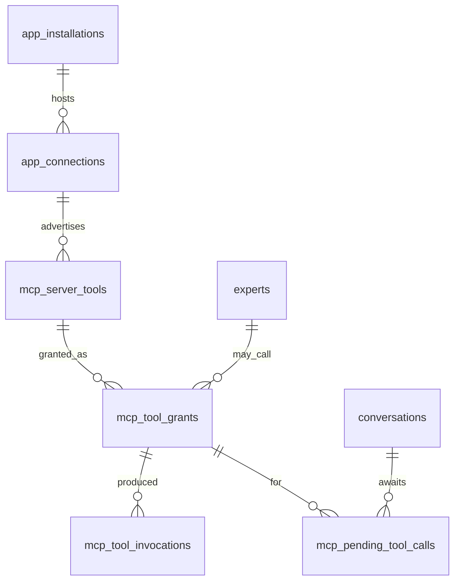

# Geem — MCP Connectors (Client/Host) Plan

## Relationship to the canonical plan

Canonical plan: [`multi-tenant_saas_plan_e28c049c.plan.md`](multi-tenant_saas_plan_e28c049c.plan.md)

That plan currently locks **MCP = "Deferred until after Experts + API"** in the cross-cutting
defaults table, and §9–10 states "MCP: deferred; future tools wrap Expert-scoped `RagService`".

This plan supersedes that row. Two edits are required in the canonical plan when 13A starts:

1. Cross-cutting table `MCP` row → "Phase 13 — remote MCP client/host; see MCP Connectors Plan"
2. Add a Phase 13 stub in §26 pointing here

**Ordering:** Phase 12 is `in_progress` (12A–12C PASS, 12D–12G not started). Do not start 13A
until Phase 12 closes or the user explicitly reprioritizes.

---

## Scope

**In scope — Geem as MCP client/host.** Tenants attach external MCP servers; Experts call their tools.

**Out of scope — Geem as MCP server.** Exposing Geem Experts as tools to Claude/Cursor is a
separate, cheaper effort (one endpoint over `ExpertQueryService`, workspace API key auth,
`mcp` subdomain slug already reserved in `DEFAULT_RESERVED_WORKSPACE_SLUGS`). Track separately.

---

## Product shape

```text
Browse App Store → subscribe (monthly SAR) → install → add MCP server (URL + auth)
  → Geem discovers tools (tools/list) → admin approves specific tools
  → bind approved tools to Experts → Expert invokes tools in Chat / public API
```

Install ≠ connect ≠ grant. Three distinct gates, matching §17 semantics:

| Layer | Table | Meaning |
|-------|-------|---------|
| Install | `app_installations` | Workspace enabled the MCP Connector app |
| Connect | `app_connections` | One remote MCP server registered, credentials encrypted |
| Discover | `mcp_server_tools` | Tools the server advertises, with pinned hash |
| Grant | `mcp_tool_grants` | `(expert, connection, tool)` an Expert may actually call |

---

## Locked decisions

| Decision | Choice |
|----------|--------|
| Direction | Geem is MCP **client/host** only |
| Transport | **Remote only** — Streamable HTTP (+ legacy HTTP+SSE). `stdio` rejected at schema validation |
| Local process execution | **Never.** No `command` / `args` / `env` accepted anywhere |
| Connector kind | New `ConnectorKind.TOOL_SOURCE = "tool_source"` |
| Connector key | Single generic `mcp_remote` adapter — not one per vendor |
| Auth modes | `ConnectorAuthMode.API_KEY` (bearer) and `OAUTH2`. No credential passthrough of Geem tokens |
| Write tools | Allowed, but **per-call human approval** on Workspace Chat |
| Surfaces | Workspace Chat (`source=workspace`) + public API (`source=api`). Widget and channel **blocked in code** |
| Unattended writes | Blocked on `source=api` by default; explicit per-grant `unattended_write_allowed` opt-in |
| Billing | App Store **`subscription`** app, monthly SAR plans tiered by `connections` entitlement |
| Server count limit | Existing `connections` app plan entitlement (like WhatsApp `line`/`desk`/`ops`). **No** new workspace `EntitlementKey` |
| Tool call ceiling | `tool_calls_daily` app plan entitlement — scales with tier |
| Citations | New `kind` discriminator on the `Citation` model: `chunk` \| `tool` |
| Default Expert behavior | Tools off. An Expert with zero grants must behave **byte-identically** to today |
| Egress | Tenant-configured HTTP runs only on a dedicated Celery queue on an isolated network |
| Roles | `APPS_VIEW` browse; `APPS_MANAGE` subscribe/install; `APPS_CONNECT` add/remove servers; `EXPERTS_UPDATE` bind grants; `CHAT_USE` invoke + approve |

---

## Architecture — reuse map

Additive changes only. No new parallel subsystem.

| Need | Existing piece | Change |
|------|----------------|--------|
| Connector kind | `app/connectors/types.py` `ConnectorKind` | Add `TOOL_SOURCE`. `apps.connector_kind` is nullable `String(32)` with **no CHECK constraint** — no column migration |
| Adapter | `ConnectorRegistry`, `ConnectorAdapter` | Register `mcp_remote`; `is_configured()` gates on `MCP_CONNECTOR_ENABLED` |
| Server record | `AppConnection` | Reuse. Server URL in `extra` JSONB; status lifecycle + health as-is |
| Secrets | `ConnectorCredentialService` | Reuse verbatim (Fernet, `merge_refresh` for OAuth) |
| Billing gate | `AppAccessService` | Reuse — checked **per turn**, not only at grant time |
| Server count | `connections` app plan entitlement | Reuse |
| Errors | `ErrorCategory` (22 existing `CONNECTOR_*`) | Add 6 new (below) |
| Audit | `AuditAction`, `AuditResourceType.APP_CONNECTION` | Add 6 actions; register metadata keys in `app/audit/sanitize.py` allowlist |
| Jobs | Celery + `tenant_context` | New tasks on dedicated `egress` queue |
| Metering | `MeteredWorkspaceGeneration`, `GenerationUsageContext.add_billed` | Reuse the `extra_billed_tokens` accumulator |
| Surface discrimination | `ChatInvocationContext.source` | Required argument to the grant resolver |

**Async boundary:** `app/connectors/adapters.py` is deliberately synchronous. Either wrap the
async MCP SDK with `asyncio.run` inside the adapter, or implement Streamable HTTP JSON-RPC
directly on sync `httpx` (thin protocol; matches every other provider client in the repo).

---

## Database schema

Migrations `0034` onward (latest existing is `0033_usage_events_partition`).



### `mcp_server_tools` (0034)

Discovered inventory per connection.

| Column | Notes |
|--------|-------|
| `id` | UUID PK |
| `workspace_id` | FK, NOT NULL, indexed — keeps every query tenant-filtered |
| `app_connection_id` | FK, NOT NULL |
| `tool_name` | `String(256)`; unique `(app_connection_id, tool_name)` |
| `title` / `description` | as advertised — **untrusted text** |
| `input_schema` | JSONB, the server's declared JSON Schema |
| `annotations` | JSONB — `readOnlyHint` etc. **advisory only** |
| `classification` | `read_only` \| `write` \| `unknown` — **Geem-assigned**, admin-editable, never derived from `annotations` alone |
| `definition_hash` | `String(64)` — SHA-256 over name + title + description + input_schema |
| `status` | `active` \| `stale` \| `withdrawn` |
| `first_seen_at` / `last_seen_at` | |

### `mcp_tool_grants` (0034)

| Column | Notes |
|--------|-------|
| `workspace_id`, `expert_id`, `app_connection_id`, `mcp_server_tool_id` | FKs; unique `(expert_id, mcp_server_tool_id)` |
| `approved_definition_hash` | Hash pinned at approval. Mismatch → grant inert |
| `state` | `pending_review` \| `active` \| `revoked` \| `stale_definition` |
| `allow_workspace_chat` | default `true` |
| `allow_public_api` | default `false` |
| `unattended_write_allowed` | default `false`. Only meaningful when `classification=write` and `allow_public_api=true` |
| `approved_by_user_id`, `approved_at` | |

### `mcp_pending_tool_calls` (0035, Phase 13E)

| Column | Notes |
|--------|-------|
| `workspace_id`, `conversation_id`, `message_id`, `mcp_tool_grant_id` | FKs |
| `arguments` | JSONB — **authoritative**. Resume executes these, never client-supplied args |
| `loop_state` | JSONB — accumulated tool-loop messages |
| `status` | `pending` \| `approved` \| `denied` \| `expired` \| `executed` |
| `expires_at` | TTL sweep, following the attachment/widget purge pattern |
| `decided_by_user_id`, `decided_at` | |

### `mcp_tool_invocations` (0034)

Append-only operational log: workspace, expert, conversation, grant, `request_id`, duration,
`status`, `error_code`, argument **hash** (not raw arguments), response byte size.
Complements `audit_logs`; keeps the audit table free of high-volume rows.

---

## New enum / config identifiers

**`ConnectorKind`** — add `TOOL_SOURCE = "tool_source"`.

**`ErrorCategory`** — add:
`MCP_SERVER_UNREACHABLE`, `MCP_TOOL_NOT_GRANTED`, `MCP_TOOL_SET_CHANGED`,
`MCP_TOOL_CALL_FAILED`, `MCP_TOOL_LIMIT_REACHED`, `EGRESS_TARGET_BLOCKED`.

**`AuditAction`** — following the existing `app.connection.created` convention:
`app.mcp.server_added`, `app.mcp.server_removed`, `app.mcp.tools_discovered`,
`app.mcp.tool_granted`, `app.mcp.tool_revoked`, `app.mcp.tool_approval_decided`.

**Settings** (`app/core/config.py`):

| Env var | Default | Purpose |
|---------|---------|---------|
| `MCP_CONNECTOR_ENABLED` | `false` | Adapter availability gate |
| `MCP_EGRESS_PROXY_URL` | `""` | Forward proxy for tenant egress |
| `MCP_ALLOW_PRIVATE_EGRESS` | `false` | **Local dev only**; must be false outside `APP_ENV=local` |
| `MCP_MAX_TOOL_ITERATIONS` | `5` | Loop bound |
| `MCP_MAX_TOOLS_PER_EXPERT` | `32` | Prompt-size bound |
| `MCP_TOOL_CALL_TIMEOUT_SECONDS` | `20` | Per call |
| `MCP_TOOL_RESULT_MAX_CHARS` | `8000` | Truncation before context injection |
| `MCP_TOOL_APPROVAL_TTL_SECONDS` | `900` | Pending approval expiry |

No new `EntitlementKey` values — limits live in `app_plan_entitlements`.

---

## Security model

### S1 — Transport restriction (blocking for 13B)

`https://` only. Reject `command`, `args`, `env`, `stdio` at the Pydantic schema layer so they
cannot be smuggled through the encrypted config blob. Test that a stdio-shaped payload is
rejected with `VALIDATION` and never persisted.

### S2 — SSRF guard (blocking for 13A)

**Current gap:** no outbound URL validation exists anywhere. The existing allowlists cover CORS
origins, audit metadata keys, and API-key scopes only. `infra/docker-compose.yml` declares **no
`networks:` block**, so `api` and `worker` reach `postgres:5432`, `redis:6379`, `qdrant:6333`,
`minio:9000` by service name. A tenant registering `http://qdrant:6333` would turn the MCP
client into a read proxy over every tenant's vectors.

Code controls:
- Scheme allowlist `https` (plus `http` only when `APP_ENV=local` and `MCP_ALLOW_PRIVATE_EGRESS`)
- Resolve hostname; reject loopback, RFC1918, link-local, CGNAT, IPv6 ULA/loopback, `169.254.169.254`
- **Connect to the validated IP**, not by re-resolving the hostname (closes DNS rebinding)
- Reject Docker service names and the compose network CIDR explicitly
- Redirects not followed
- Hard connect/read timeouts; response size cap

Architectural control (preferred, and what makes 13A worth its own slice): tenant egress runs on
a dedicated Celery queue in a Docker network with **no route to Postgres/Redis/Qdrant/MinIO**,
exiting through `MCP_EGRESS_PROXY_URL`. A bug in the IP validator then degrades availability
rather than leaking tenant data. Requires adding explicit `networks:` to compose.

### S3 — Tool authorization

Default-deny. `annotations.readOnlyHint` / `destructiveHint` are **server self-reported** and used
for UI hints only; `classification` is Geem-owned. Pin `definition_hash` at approval; on change,
move the grant to `stale_definition` and require re-approval (defends the rug-pull / tool-poisoning
attack where a benign description later mutates into injected instructions). Re-validate arguments
against `input_schema` server-side before dispatch.

### S4 — Prompt injection

Tool results are attacker-controlled text landing beside private RAG chunks, with an outbound tool
call available as an exfiltration channel. Controls: results injected in a delimited non-instruction
role; never merged into `system_instructions`; truncated to `MCP_TOOL_RESULT_MAX_CHARS`; UI warns
when one Expert holds both a data-reading and a data-sending grant.

### S5 — No credential passthrough

Never forward the user JWT, session, or workspace API key to an MCP server (confused deputy).
Per-connection credentials only. If OAuth is used, bind tokens with resource indicators (RFC 8707).

### S6 — Tenancy

`workspace_id` on every new table and every repository query. Cross-workspace isolation tests are
acceptance-blocking on 13B, 13C, and 13D.

### S7 — Surface gating

Grant resolution takes `ChatInvocationContext.source` as a **required** argument.
`SOURCE_WIDGET` and `SOURCE_CHANNEL` return an empty grant set unconditionally.

---

## Engine design

### E1 — Why a separate provider method

`OpenRouterChatProvider._payload()` hardcodes `response_format: {"type": "json_object"}`, and
`_call_stream` reconstructs the visible answer by scraping a half-finished JSON string via
`extract_partial_json_string(buffer, "answer_markdown")`. Tool calling cannot be flagged onto this:
providers behave inconsistently when asked for forced JSON *and* tool calls, and the streaming
extractor would be scanning a buffer interleaved with `tool_calls` deltas.

**Add a new provider method** (`answer_with_tools`) rather than a parameter on `_payload`.

### E2 — Two-phase streaming

Tool iterations run **non-streamed** — nothing user-visible is being generated during them. The
loop emits `tool_call` / `tool_result` SSE status events instead. Only the final synthesis pass
streams, through the existing JSON-mode path. This preserves `extract_partial_json_string`, keeps
`ChatTurnExecutor.stream`'s wire contract intact for the widget and OpenAI-compatible API, and
gives a natural pause point for approval.

### E3 — Separate executor, not conditionals

`ChatTurnExecutor` is shared by Workspace Chat, `/api/v1/chat/completions`, the chat widget, and
the WhatsApp channel. Build `ToolLoopTurnExecutor` as a sibling that the orchestrator selects when
the Expert has active grants for that surface. Do not thread `if tools_enabled` through the
existing executor.

### E4 — Metering

`MeteredWorkspaceGeneration.reserve()` reserves one flat
`effective_ai_usage_reservation_tokens` and `settle()` derives the total from a single payload. A
5-iteration loop is 6+ LLM calls, so a workspace at its last token could overshoot several-fold.

- Reserve `MCP_MAX_TOOL_ITERATIONS × base` up front — reservation is the only pre-flight gate
- Accumulate each intermediate iteration through `GenerationUsageContext.add_billed()`, exactly as
  query-time embed and rerank already fold into the chat reservation
- Settle once with the final payload; `release()` already settles accumulated extras on abort,
  which is the desired behavior mid-loop

### E5 — Citations

Extend the `Citation` model with `kind: "chunk" | "tool"`, validated through the existing
`ConversationService.normalize_citations` metadata-safe contract.

- Tool citations carry connection **display name** + tool name only. Never the server URL,
  credentials, or connection UUID — the public API exposes `citations` as a top-level extra field
- Tool citations **bypass** the `rag/service.py` chunk-id validator. Feeding them in would trigger
  its mismatch retry and double-bill
- Default `kind="chunk"` on read; existing persisted rows have no discriminator
- Three renderers to update: `workspace_web` Chat, `apps/widget`, legacy `apps/web`

---

## Approval state machine (13E)

```text
loop iteration → write tool selected
  → persist mcp_pending_tool_calls (arguments + loop_state)
  → settle metering for tokens used so far (new request_id on resume)
  → release conversation generation lock
  → emit SSE tool_approval_required; stream ends normally
  → [human decides, or TTL expires]
  → approve: POST resume → re-acquire lock → new reservation → execute stored arguments → continue loop
  → deny: assistant message explains the refusal; loop finishes without the tool
  → expire: Celery sweep marks expired; conversation unblocked
```

Three non-obvious requirements:

1. **Stored arguments are authoritative.** Resume must never accept client-supplied arguments, or
   approval is meaningless (approve `delete(id=1)`, resume with `delete(id=*)`).
2. **Lock must drop.** Phase 4B holds a per-conversation generation lock; a human wait would
   deadlock the conversation until TTL.
3. **Metering closes and reopens.** A reservation cannot be held across an arbitrary human wait —
   it would pin quota. One logical turn therefore produces several `usage_events` rows sharing
   `conversation_id` / `message_id`; group by `message_id` in the Usage history view.

---

## API surface

Workspace-scoped, session auth, under the existing connectors/apps routers.

| Method | Path | Permission |
|--------|------|------------|
| `POST` | `/api/apps/mcp/servers` | `APPS_CONNECT` |
| `GET` | `/api/apps/mcp/servers` | `APPS_VIEW` |
| `DELETE` | `/api/apps/mcp/servers/{connection_id}` | `APPS_CONNECT` |
| `POST` | `/api/apps/mcp/servers/{connection_id}/discover` | `APPS_CONNECT` |
| `GET` | `/api/apps/mcp/servers/{connection_id}/tools` | `APPS_VIEW` |
| `PATCH` | `/api/apps/mcp/tools/{tool_id}` | `APPS_MANAGE` (set `classification`) |
| `GET`/`POST`/`DELETE` | `/api/experts/{expert_id}/mcp-grants` | `EXPERTS_UPDATE` |
| `POST` | `/api/conversations/{id}/tool-approvals/{approval_id}` | `CHAT_USE` |

Encrypted credentials never appear in any DTO — same rule as `config_encrypted` in §17.

New SSE events on the Chat stream: `tool_call`, `tool_result`, `tool_approval_required`.
The OpenAI-compatible path maps these to nothing (silently omitted) so wire compatibility holds.

---

## Frontend surfaces (`apps/workspace_web`)

- `/apps/mcp` — server list, add-server dialog (URL + auth), health, connection count vs `connections`
- `/apps/mcp/:connectionId` — discovered tools, `classification` editor, hash-drift banner, approve/revoke
- Expert edit — MCP tools tab: grant picker, surface toggles, `unattended_write_allowed` with an
  explicit warning, combined read+write exfiltration warning
- Chat — `tool_call` / `tool_result` activity rows in the message stream; approval card for
  `tool_approval_required`; tool-kind citation chips
- EN/AR + RTL; workspace-scoped React Query keys; API access via `services/api/` only

---

## Catalog seed

Follows the existing `AppSpec` / `PlanSpec` dataclasses in `app/apps_catalog/seed.py`.

```text
slug            = "mcp-connectors"
category_slug   = "automation"
billing_type    = "subscription"
status          = "coming_soon"   → "published" when 13D lands
connector_key   = "mcp_remote"
connector_kind  = "tool_source"
```

Plans (monthly SAR, mirroring the WhatsApp tier pattern; **final pricing needs sign-off before
`published`** — do not invent commercial numbers, per the 9F precedent):

| code | servers | tool calls/day |
|------|---------|----------------|
| `starter` | `connections: 1` | `tool_calls_daily: 200` |
| `team` | `connections: 3` | `tool_calls_daily: 1000` |
| `scale` | `connections: 10` | `tool_calls_daily: 5000` |

`billing_interval: monthly`; manual `POST …/renew` hosted page; calendar-month anniversary; no
card-on-file — all inherited from §17.

**Expiry behavior:** `AppAccessService` is checked per turn. On expiry, tools become unavailable
and the Expert continues answering from RAG, with a workspace notification. Do not fail the
conversation.

---

## Phases

### Phase 13A — Outbound egress safety

**Status:** pending

**Goal:** Make tenant-configured outbound HTTP safe before any MCP concept exists.

**Deliverables:** reusable SSRF guard in `app/common/`; dedicated `egress` Celery queue; explicit
`networks:` in `infra/docker-compose.yml` isolating the egress worker from datastores; optional
forward proxy setting; `MCP_ALLOW_PRIVATE_EGRESS` hard-disabled outside `APP_ENV=local`.

**Acceptance:** unit tests reject every internal service name, private range, and
`169.254.169.254`; a validated-IP connect path defeats a rebinding fixture; an integration test
proves the egress worker cannot reach `qdrant` or `minio`; existing suites green.

**Not in 13A:** anything MCP-specific.

---

### Phase 13B — MCP connections

**Status:** pending

**Goal:** Register remote MCP servers per workspace and discover their tools.

**Deliverables:** `ConnectorKind.TOOL_SOURCE`; `mcp_remote` adapter (initialize, `tools/list`,
health) routed through 13A egress; catalog seed at `coming_soon`; connect/disconnect/health;
`mcp_server_tools` + `mcp_tool_invocations` (0034); Celery discovery + health tasks; server-list UI.

**Acceptance:** stdio-shaped config rejected and not persisted; credentials absent from every DTO;
two workspaces cannot see each other's servers or tools; `connections` entitlement enforced;
adapter unavailable when `MCP_CONNECTOR_ENABLED=false`; Drive/OneDrive/OpenWA regression green.

**Not in 13B:** grants, execution, LLM changes.

---

### Phase 13C — Tool grants

**Status:** pending

**Goal:** Explicit, hash-pinned, surface-scoped authorization. Still no execution.

**Deliverables:** `mcp_tool_grants`; Geem-owned `classification`; `definition_hash` drift detection
→ `stale_definition`; grant CRUD with `allow_workspace_chat` / `allow_public_api` /
`unattended_write_allowed`; grant resolver requiring `ChatInvocationContext.source`; review UI;
audit actions + `sanitize.py` allowlist entries.

**Acceptance:** changing a tool's description on the server flips the grant to `stale_definition`
and it stops resolving; `SOURCE_WIDGET` / `SOURCE_CHANNEL` resolve to empty regardless of grant
rows; `unattended_write_allowed` cannot be set on a `read_only` tool or without `allow_public_api`;
isolation tests green.

---

### Phase 13D — Read-only tool loop

**Status:** pending

**Goal:** Experts can call read-only tools in Workspace Chat and the public API.

**Deliverables:** `answer_with_tools` on `OpenRouterChatProvider`; `ToolLoopTurnExecutor`;
two-phase streaming with `tool_call` / `tool_result` events; iteration/timeout/size bounds;
metering via `add_billed` with `iterations × base` reservation; `Citation.kind` + three renderers;
`tool_calls_daily` enforcement; per-turn `AppAccessService` check with graceful degradation;
catalog → `published` once pricing is signed off.

**Acceptance:** an Expert with zero grants produces **byte-identical** output to pre-13D across
Chat, widget, and `/api/v1/chat/completions`; loop honors `MCP_MAX_TOOL_ITERATIONS`; abort mid-loop
settles partial tokens and leaves no dangling reservation; over-quota blocks before the first LLM
call; tool citations never expose server URL or credentials; write-classified tools are refused on
every surface in this slice.

**Not in 13D:** write tools, approval UX.

---

### Phase 13E — Write tools with approval

**Status:** pending

**Goal:** Write-capable tools with a human in the loop on Chat, and an explicit opt-in for
unattended API use.

**Deliverables:** `mcp_pending_tool_calls` (0035); `tool_approval_required` SSE event; resume
endpoint; generation-lock release/re-acquire; split metering across pause; TTL sweep task; Chat
approval card; `unattended_write_allowed` enforcement on `source=api`; Usage history grouping by
`message_id`.

**Acceptance:** resume executes only stored arguments — a tampered resume payload is rejected;
lock is released during the wait and the conversation stays usable; paused turn settles tokens and
resume opens a fresh `request_id`; expired approvals are swept and unblock the conversation;
`source=api` refuses write tools unless `unattended_write_allowed`; denial produces a clean
assistant message rather than an error.

---

## Testing strategy

**Backend:** SSRF guard unit matrix; egress network isolation integration test; stdio rejection;
cross-workspace isolation on servers/tools/grants/invocations; hash-drift revocation; surface
gating for all four `ChatInvocationContext` sources; loop bound enforcement; metering accumulation
and abort paths; concurrent `tool_calls_daily` exhaustion (exactly one succeeds, mirroring the
Phase 5B pattern); expired-subscription graceful degradation; zero-grant byte-identity regression.

**Frontend:** grant picker permission states; approval card approve/deny/expire; tool citation
rendering; hash-drift banner; EN/AR + RTL; workspace-scoped cache isolation.

**E2E:** subscribe → install → add server → discover → approve read-only tool → bind to Expert →
Chat turn invoking the tool with a citation. Separately: write tool → approval card → approve →
completion.

---

## Out of scope

- Geem as an MCP **server** (separate effort)
- `stdio` / local MCP servers, container sandboxing, gVisor/Firecracker
- MCP **prompts** and **resources** primitives — tools only in this plan
- MCP sampling (server asking Geem's LLM to generate) — inverts trust; explicitly excluded
- Tool results ingested into Qdrant as durable knowledge
- Tools on the Chat Widget or WhatsApp channel
- Auto-recurring charges, usage-metered tool pricing beyond `tool_calls_daily`
- Platform Admin MCP catalog CRUD (Phase 12 territory)
- Third-party MCP marketplace / revenue share

---

## Highest-risk items

1. **SSRF into Geem infrastructure** — flat compose network makes this a cross-tenant data risk,
   not a nuisance. Mitigated by 13A landing first and being independently testable.
2. **Destabilizing the shared chat path** — `ChatTurnExecutor` serves four surfaces. Mitigated by
   a sibling executor and the byte-identity acceptance criterion.
3. **Quota overshoot in the loop** — flat reservation vs N LLM calls. Mitigated by
   `iterations × base` reservation plus `add_billed` accumulation.
4. **Prompt injection via tool results** exfiltrating RAG content through a second tool. Mitigated
   by delimited injection, truncation, and a UI warning on read+write grant combinations.
5. **Tool poisoning / rug pull** after approval. Mitigated by `definition_hash` pinning.
6. **Approval bypass via resume tampering.** Mitigated by server-authoritative stored arguments.
7. **Streaming regression** from the JSON-scraping extractor. Mitigated by two-phase streaming that
   leaves `extract_partial_json_string` untouched.
8. **Pricing invented without sign-off** — 9F precedent forbids it; catalog stays `coming_soon`
   until numbers are approved.