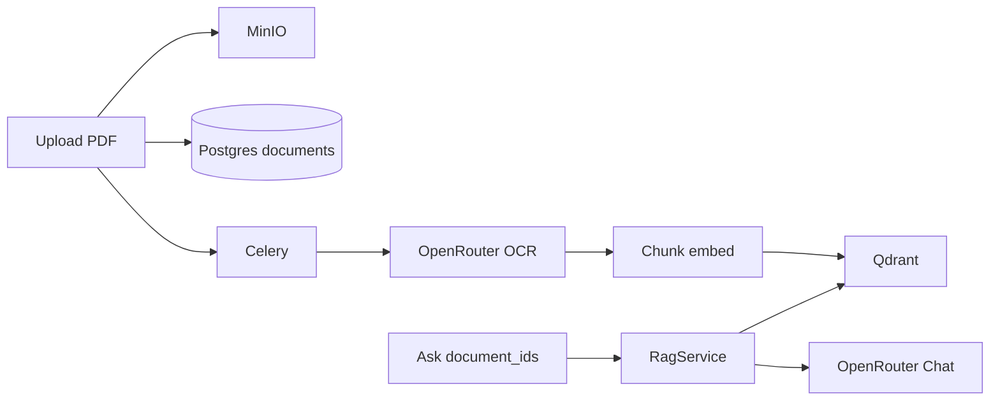
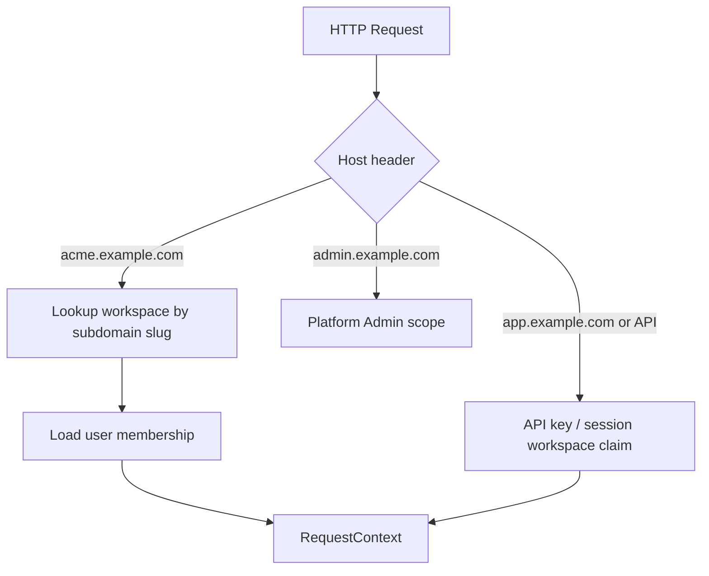
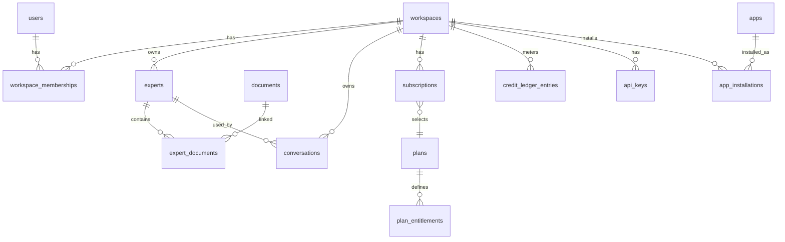

# Geem — Multi-Tenant SaaS Transformation Plan (FastAPI + React)

## Product identity (locked)

| Item | Value |
|------|--------|
| Product name | **Geem** |
| Public site / brand domain | [geem.ai](https://geem.ai) |
| Official avatar | [https://geem.ai/assets/geem-avatar.webp](https://geem.ai/assets/geem-avatar.webp) |
| Avatar character | Chibi-style figure in ghutra/agal + thobe with stacked **Ge** / **em** chest mark; friendly Arabic-first assistant persona |
| Repo codename | ArabicRag (legacy folder name may remain); product-facing strings, titles, and packages use **Geem** |

**Branding rules for UI:**
- Replace Metronic demo logos (`logo-34.svg`, mini-logo, fake avatars) with Geem brand assets in `apps/workspace_web`.
- **Vendor** the avatar into the app (e.g. `apps/workspace_web/public/brand/geem-avatar.webp`) rather than hotlinking `geem.ai` at runtime in production — avoids CDN/CORS/uptime coupling. Keep the canonical URL documented as the source of truth for updates.
- Use the Geem avatar as the default **assistant** face in Chat (Metronic AI message bubbles / empty states), and as a brand mark in sidebar header where Metronic showed its logo.
- User avatars remain user-specific; do not use the Geem mascot as a logged-in user photo.
- Theme: keep Metronic AI Concept shell/tokens; introduce Geem accent via CSS variables when implementing (navy mark on white/thobe palette as brand cue) without copying unrelated Metronic demos.
- i18n product name: keep “Geem” as proper noun in EN and AR unless a separate Arabic trade name is supplied later.
- Package/npm names for new apps: prefer `geem-workspace-web`, etc.
- Email/from names, OpenAPI titles, Helmet document titles, and SSE/client chrome should say Geem once branding lands (Phase 0–1).

Default production host pattern (when domains are wired): `{workspace}.geem.ai` for tenants; Platform Admin and marketing hosts decided with `dashboard_web` / `landpage_web` (e.g. `admin.geem.ai`, `www.geem.ai`) — confirm at deploy time.

---

## UI Boundary Rule (mandatory)

> [`samples/metronic_vite_9.5.0`](samples/metronic_vite_9.5.0) is a **read-only UI reference**. Production code must not import from, depend on, or mutate files under `samples/`. Only the **Metronic AI Concept** (`src/ai/**`) and the **shared components actually required by that concept** are the primary UI foundation. Other Metronic concept applications (CRM, Mail, Calendar, Todo, Real Estate, Store Inventory) must not be copied wholesale or used to dictate product architecture.

**Note on path spelling:** The sample lives at `samples/metronic_vite_9.5.0` (correct spelling). Do not create or reference a `metrnoic_*` path.

Recommend capturing this rule later in `AGENTS.md` / Cursor project rules when implementation begins.

```text
samples/metronic_vite_9.5.0          (read-only reference)
        │
        ▼
Metronic AI Concept (src/ai + traced shared deps)
        │  selectively port/adapt — never runtime-import samples/
        ▼
apps/workspace_web                   (Workspace SaaS UI — tenant product)
```

### Frontend apps organization (locked)

Separate Vite SPAs under `apps/` by product surface (not one monolith frontend):

```text
apps/
├── api/                 # FastAPI backend (existing)
├── web/                 # Existing MVP UI — keep as-is (do not rename or delete)
├── workspace_web/       # New Workspace tenant product UI (this plan)
├── dashboard_web/       # Platform Admin UI (future — Phase 8+)
└── landpage_web/        # Marketing / landing site (future)
```

- **Today:** MVP UI lives at [`apps/web`](apps/web) and **stays there**.
- **Phase 0:** create a **new** [`apps/workspace_web`](apps/workspace_web) app (scaffold Vite/React + Metronic AI port). Do **not** rename, move, or delete `apps/web`.
- Reuse useful patterns from `apps/web` by **copying/adapting** (e.g. SSE client ideas, `react-markdown` usage) into `workspace_web` — not by importing across apps at runtime.
- Add a Docker Compose service (or profile) for `workspace_web` alongside the existing `web` service so the MVP remains runnable during the transition.
- Do **not** implement `dashboard_web` or `landpage_web` in early phases; reserve the names so Platform Admin and marketing stay out of the Workspace app.
- Shared UI primitives may later be extracted to a package if needed; until then, prefer copying/adapting only what `workspace_web` needs from Metronic AI. Do not create a cross-app runtime dependency on `samples/`.

Metronic supplies visual design, shell, layout, chat UX, forms/modals/menus/drawers, theme, and responsive behavior for **`workspace_web`**. **FastAPI remains the source of truth** for auth, workspaces, Experts, RAG, billing, quotas, and all domain data. Discard Metronic mock data, fake chat replies, demo user menus, and demo module routing.

---

## 1. Current architecture assessment

**Stack today:** FastAPI API, Celery worker, PostgreSQL, Redis, Qdrant, MinIO, React/Vite SPA at [`apps/web`](apps/web) (**kept**; new SaaS UI will be [`apps/workspace_web`](apps/workspace_web)).

**What works and is reusable:**
- Document upload → Celery ingest → OCR/normalize/chunk/embed → Qdrant ([`apps/api/app/documents/service.py`](apps/api/app/documents/service.py), [`ingestion/pipeline.py`](apps/api/app/ingestion/pipeline.py))
- RAG retrieve → rerank → answer + citations ([`apps/api/app/rag/service.py`](apps/api/app/rag/service.py))
- Provider protocols ([`apps/api/app/core/protocols.py`](apps/api/app/core/protocols.py))
- UUID PKs, `usage_events` metering stub, MinIO/Qdrant adapters
- Existing SSE streaming client in [`apps/web/src/api.ts`](apps/web/src/api.ts) / Ask page (adapt/copy into `workspace_web`, do not move the file out of `apps/web`)

**What is missing (explicit MVP non-goals):**
- Auth, users, roles, workspaces, Experts, conversations, billing, API keys, MCP, soft deletes, tenant isolation
- File formats beyond PDF; Ask UI uses multi-select `document_ids`, not knowledge profiles
- No MCP server exists
- Production UI shell (current web app is minimal custom CSS, no Tailwind/shadcn)

**UI reference added:** Metronic Vite **9.5.0** AI Concept under [`samples/metronic_vite_9.5.0/src/ai`](samples/metronic_vite_9.5.0/src/ai) (see § Metronic Integration Strategy).



---

## 2. Components to reuse

| Component | Reuse strategy |
|-----------|----------------|
| `IngestionPipeline` | Keep; add workspace/expert context + multi-format extractors |
| `RagService` | Keep as shared orchestration for Chat + public API; change scope from `document_ids` → Expert |
| OpenRouter adapters | Keep behind protocols |
| `MinioObjectStorage` / `QdrantVectorStore` | Extend keys/payloads with `workspace_id` + `expert_id` |
| `usage_events` | Evolve into metered ledger inputs (not replace wholesale on day one) |
| Celery `ingest_document` | Keep; bind tenant context on task payload |
| SSE query client | Keep and adapt to Expert + conversation APIs |
| Metronic AI Concept UI | Port layout/chat chrome/primitives into `apps/workspace_web`; replace mocks with FastAPI adapters |

---

## 3. Components to refactor

- Global `documents.sha256` unique → **per-workspace** unique `(workspace_id, sha256)`
- MinIO key `documents/{id}/...` → `workspaces/{workspace_id}/experts/{expert_id}/documents/{id}/...`
- Qdrant payload/indexes: add `workspace_id`, `expert_id`; all searches must filter both
- `QueryRequest.document_ids` → `expert_id` (+ optional debug override for platform admin)
- Open list/delete/query routes → authenticated + workspace-scoped
- Hard delete only → soft delete + retention job for documents/experts/workspaces
- Frontend: replace minimal MVP shell with Metronic AI–derived Workspace shell; feature modules talk to FastAPI via a central API client (not Metronic mocks)

---

## 4. Proposed domain / module boundaries

### Backend (`apps/api/app/`)

```text
identity/          # users, sessions, platform roles
workspaces/        # workspace, membership, roles, settings, subdomain
experts/           # experts, expert_documents, visibility, instructions
documents/         # existing — scoped to expert/workspace
ingestion/         # existing pipeline + format extractors
rag/               # existing RagService — Expert-aware
conversations/     # chat threads/messages (new)
billing/           # plans, subscriptions, purchases, gateway abstraction
entitlements/      # quota definitions + resolution
usage/             # credit ledger, period counters, metering
api_keys/          # workspace API credentials
apps_catalog/      # app definitions + installations (foundations only)
platform_admin/    # platform admin APIs
audit/             # audit log writer
common/            # tenancy context, authz, idempotency, soft-delete mixins
```

### Frontend — `apps/workspace_web` (Workspace product only)

Production Workspace UI destination: **new** [`apps/workspace_web`](apps/workspace_web).

[`apps/web`](apps/web) remains the existing MVP app — **do not rename, delete, or replace it**. Product development for the SaaS Workspace happens only in `workspace_web`.

Future siblings (out of early-phase scope):
- `apps/dashboard_web` — Platform Admin product UI
- `apps/landpage_web` — public marketing / landing

Do **not** fold Platform Admin or marketing pages into `workspace_web`. Keep one SPA per product surface.

Feature-oriented layout inside the Workspace app (not Metronic demo folders):

```text
apps/workspace_web/src/
├── app/
│   ├── router/
│   ├── providers/          # Theme, QueryClient, Auth, Workspace, I18n, Helmet
│   └── layouts/
│       └── workspace/      # adapted from Metronic AI DefaultLayout
├── features/
│   ├── auth/
│   ├── workspaces/
│   ├── experts/
│   ├── chat/               # Metronic AI chat pages/components adapted
│   ├── conversations/
│   ├── api-keys/
│   ├── usage/
│   ├── billing/
│   ├── apps/
│   ├── members/
│   └── settings/
├── components/
│   ├── ui/                 # shadcn/Metronic primitives required by AI Concept
│   └── shared/             # product-level composites (page header, empty states)
├── services/
│   ├── api/                # FastAPI client, errors, workspace header, SSE
│   └── auth/
├── hooks/
├── lib/                    # cn(), toAbsoluteUrl, i18n helpers
├── locales/                # en.json, ar.json (separate from components)
├── types/
└── assets/                 # ported logos/media as needed
```

**Rules:**
- Controllers stay thin; domain logic in backend services
- Domain/feature code must **not** live under copied Metronic demo directory trees
- `components/ui` holds only primitives needed by the AI Concept (and later extensions of those primitives)
- Platform Admin UI is a later, separate shell; it may reuse `components/ui` but must not force the Workspace AI shell to absorb admin complexity

---

## Metronic Vite 9.5.0 AI Concept Integration Strategy

### 1. Exact AI Concept locations discovered

Sample root: [`samples/metronic_vite_9.5.0`](samples/metronic_vite_9.5.0)

AI Concept module (39 files):

```text
samples/metronic_vite_9.5.0/src/ai/
├── index.tsx                          # route module
├── components/                        # chat UI
│   ├── chat-message.tsx
│   ├── chat-messages.tsx
│   ├── chat-starter.tsx
│   ├── chat-starter-actions.tsx       # persona cards → map to Experts
│   ├── chat-starter-disclaimer.tsx
│   ├── chat-starter-header.tsx
│   └── chat-starter-input.tsx         # composer (Paperclip/Mic decorative)
├── layout/
│   ├── index.tsx                      # DefaultLayout shell
│   └── components/
│       ├── ai-model-selector.tsx
│       ├── chats-context.tsx          # mock threads — replace with API
│       ├── context.tsx                # LayoutProvider + mobile
│       ├── header.tsx                 # mobile header + Sheet
│       ├── model-selector.tsx         # UNUSED — ignore
│       ├── new-chat-button.tsx
│       ├── new-chat-context.tsx       # UNUSED — ignore
│       ├── pinned-chats.tsx
│       ├── quick-actions.tsx
│       ├── recent-chats.tsx
│       ├── section-header.tsx
│       ├── share-dialog.tsx
│       ├── sidebar.tsx
│       ├── sidebar-content.tsx
│       ├── sidebar-footer.tsx
│       ├── sidebar-header.tsx
│       ├── toolbar.tsx
│       ├── user-dropdown-menu.tsx     # fake user — replace with real auth
│       └── wrapper.tsx
├── mock/                              # DEMO ONLY — do not ship as product logic
│   ├── ai-models.ts
│   ├── chat-starter.ts
│   ├── chat-threads.ts
│   ├── messages.ts
│   ├── model-options.ts
│   └── index.ts
├── pages/
│   ├── chat.tsx                       # /ai/chat?chatId=
│   └── start.tsx                      # /ai/start
└── types/
    ├── chat.ts
    ├── pages.ts
    └── index.ts
```

Registration: [`src/providers/modules-provider.tsx`](samples/metronic_vite_9.5.0/src/providers/modules-provider.tsx) lazy-loads `@/ai` when path starts with `/ai`. App shell: [`src/App.tsx`](samples/metronic_vite_9.5.0/src/App.tsx) (`ThemeProvider`, `HelmetProvider`, `Toaster`, `BrowserRouter`).

### 2. Exact AI Concept routes

| Route | Page |
|-------|------|
| `/ai` | redirect → `start` |
| `/ai/start` | `AIStartPage` — empty chat / starter |
| `/ai/chat` | `AIChatPage` — optional `?chatId=` |

Production routes will **not** keep `/ai` as a product prefix. Map conceptually to Workspace routes such as `/`, `/chat`, `/chat/:conversationId`, `/experts`, etc., inside the Workspace shell.

### 3. Shared components the AI Concept actually depends on

Traced imports only (not entire `src/components`):

| Shared path | Role |
|-------------|------|
| `src/components/ui/avatar.tsx` | message/user avatars |
| `src/components/ui/badge.tsx` | pinned/quick actions |
| `src/components/ui/button.tsx` | actions |
| `src/components/ui/card.tsx` | starter personas |
| `src/components/ui/dialog.tsx` | share dialog |
| `src/components/ui/dropdown-menu.tsx` | menus |
| `src/components/ui/input.tsx` | composer |
| `src/components/ui/scroll-area.tsx` | sidebar scroll |
| `src/components/ui/separator.tsx` | sidebar |
| `src/components/ui/sheet.tsx` | mobile nav |
| `src/components/ui/tooltip.tsx` | tooltips + LayoutProvider |
| `src/components/ui/sonner.tsx` | App-level toaster (AI uses `toast` from `sonner`) |
| `src/components/screen-loader.tsx` | Suspense fallback when mounting module |
| `src/hooks/use-mobile.tsx` | `< 1024px` breakpoint |
| `src/lib/utils.ts` | `cn()` |
| `src/lib/helpers.ts` | `toAbsoluteUrl` (only helper AI uses) |
| `src/styles/globals.css` | Tailwind v4 + shadcn tokens + `.dark` |
| `public/media/app/logo-34.svg` | brand in sidebar/header |
| `public/media/avatars/300-2.png` | demo avatar |
| `public/media/app/mini-logo.svg` | screen loader (if kept) |

AI does **not** import CRM/Mail/Calendar/Todo/Real Estate/Store Inventory.

### 4. Required packages/dependencies (AI Concept subset)

Port into `apps/workspace_web` only what the AI shell needs (plus later product choices):

| Package | Purpose |
|---------|---------|
| `react`, `react-dom` | add to new `workspace_web` (align with Metronic / existing MVP) |
| `react-router` / `react-router-dom` | add to `workspace_web` |
| `lucide-react` | icons |
| `next-themes` | dark/light (`ThemeProvider` + user menu toggle) |
| `sonner` | toasts |
| `react-helmet-async` | document title |
| `class-variance-authority`, `clsx`, `tailwind-merge` | shadcn `cn` / variants |
| `radix-ui` | Metronic shadcn primitives (unified package) |
| `tailwindcss`, `@tailwindcss/vite`, `tw-animate-css` | design system pipeline |
| `react-markdown`, `remark-gfm` | port pattern from [`apps/web`](apps/web) for answers/citations (prefer over Metronic’s custom markdown-ish parser) |

**Introduce for production SaaS (not used by Metronic AI today, but correct for FastAPI integration):**
- `@tanstack/react-query` — present in Metronic package.json but **unused by AI**; adopt in `apps/workspace_web` for authenticated REST
- `react-i18next` (or `react-intl`) — Metronic has `react-intl` unused by AI; AI has **no i18n**; we define production EN/AR ourselves
- Form libs later as needed (`react-hook-form` + `zod`) for Expert/settings forms — add when a phase needs them, not wholesale from Metronic

### 5–7. Reuse / adapt / ignore

**Reuse (port into new apps/workspace_web):** AI layout shell, sidebar/header/mobile Sheet, chat starter + message list chrome, toolbar/share dialog patterns, UI primitives listed above, theme tokens, `use-mobile`, `cn`, logo assets (or replace with product brand). Copy SSE/streaming ideas from `apps/web` without removing that app.

**Adapt:**
- `ChatsProvider` / recent/pinned chats → FastAPI conversations API
- `user-dropdown-menu` → real user + workspace switcher + sign out
- `chat-starter-actions` personas → **Expert** cards / Expert picker
- `ai-model-selector` → Expert selector and/or model settings only if product exposes them
- Composer Paperclip → Expert knowledge upload flows / attachments when phase requires (not decorative)
- Fake `setTimeout` replies → SSE streaming via existing RAG client
- Message renderer → keep `MarkdownAnswer` / react-markdown + citation UI

**Explicitly ignore:**
- Entire concepts: `src/crm/**`, `src/mail/**`, `src/calendar/**`, `src/todo/**`, `src/real-estate/**`, `src/store-inventory/**`
- `modules-provider.tsx` multi-demo router and default `/crm` redirect
- All of `src/ai/mock/**` as product logic
- Dead AI files: `model-selector.tsx`, `new-chat-context.tsx`
- Demo scripts: `scripts/create-demo-user.js`, `scripts/debug-auth.js`
- Unused Metronic deps (apexcharts, leaflet, formik, dnd-kit, headless-tree, vaul, cmdk, etc.) unless a later phase has a clear need for an **isolated** primitive
- Most of `public/media/**` beyond AI-referenced assets
- `src/styles/demos/**`

### 8. Production mapping table (actual paths)

| Metronic AI source | Production destination |
|--------------------|------------------------|
| `samples/.../src/ai/layout/**` | `apps/workspace_web/src/app/layouts/workspace/` |
| `samples/.../src/ai/pages/start.tsx` | `apps/workspace_web/src/features/chat/pages/ChatStartPage.tsx` |
| `samples/.../src/ai/pages/chat.tsx` | `apps/workspace_web/src/features/chat/pages/ChatPage.tsx` |
| `samples/.../src/ai/components/*` | `apps/workspace_web/src/features/chat/components/` |
| `samples/.../src/ai/types/*` | `apps/workspace_web/src/features/chat/types/` (evolve to API types) |
| `samples/.../src/ai/mock/*` | **Do not port as runtime**; optional Storybook fixtures only |
| `samples/.../src/ai/index.tsx` | fold into `apps/workspace_web/src/app/router/` |
| `samples/.../src/components/ui/{avatar,badge,button,card,dialog,dropdown-menu,input,scroll-area,separator,sheet,tooltip,sonner}.tsx` | `apps/workspace_web/src/components/ui/` |
| `samples/.../src/components/screen-loader.tsx` | `apps/workspace_web/src/components/shared/ScreenLoader.tsx` |
| `samples/.../src/hooks/use-mobile.tsx` | `apps/workspace_web/src/hooks/use-mobile.ts` |
| `samples/.../src/lib/utils.ts` | `apps/workspace_web/src/lib/utils.ts` |
| `samples/.../src/lib/helpers.ts` (`toAbsoluteUrl`) | `apps/workspace_web/src/lib/helpers.ts` |
| `samples/.../src/styles/globals.css` | `apps/workspace_web/src/styles/globals.css` (+ Tailwind v4 Vite plugin) |
| `samples/.../src/App.tsx` theme/toaster shell | `apps/workspace_web/src/app/providers/` |
| `samples/.../public/media/app/logo-34.svg` | Replace with Geem mark / wordmark under `apps/workspace_web/public/brand/` |
| `samples/.../public/media/avatars/300-2.png` | Do **not** use; Geem assistant uses vendored `geem-avatar.webp` |
| Canonical Geem avatar URL | Source: `https://geem.ai/assets/geem-avatar.webp` → vendor to `apps/workspace_web/public/brand/geem-avatar.webp` |
| `samples/.../components.json` | `apps/workspace_web/components.json` if keeping shadcn workflow |
| Existing [`apps/web/src/api.ts`](apps/web/src/api.ts) | Adapt/copy SSE client into `apps/workspace_web/src/services/api/` — leave `apps/web` intact |
| Existing `AskPage` / `DocumentsPage` | retired/replaced by Experts + Chat features across Phases 3–4 |

### 9. Authentication adaptation

- Metronic AI has **no auth screens and no auth backend** — only a decorative user dropdown.
- Build login/register/forgot-password using **AI Concept UI primitives** (Card, Input, Button) so visuals match the product; do **not** import another Metronic concept’s auth demo.
- Wire exclusively to FastAPI Identity (`/api/auth/*`); session/JWT refresh owned by `services/auth`.

### 10. Workspace adaptation

- Extend AI sidebar: Overview, Chat, Experts, API, Apps, Members, Storage, Billing, Settings (role-aware nav).
- Workspace switcher in header/sidebar footer; hostname `slug.example.com` sets **UX context** only.
- Backend independently resolves + authorizes workspace (subdomain / membership / API key). Frontend context is not a security boundary.
- `VITE_ROOT_DOMAIN` + local header/slug fallback for DX.

### 11. Chat adaptation

- Phase 4 milestone: Metronic AI Chat becomes production Chat.
- Flow: Workspace → Chat → Conversation → selected Expert → instructions + knowledge → RAG → SSE stream → markdown + citations.
- Preserve AbortController cancellation; map loading/error/retry to composer + message list.
- Replace mock threads with `conversations` / `messages` APIs.

### 12. Expert adaptation

- Visual language from AI cards/sidebar (starter personas → Expert cards).
- Screens: My Experts, Platform Experts, Create/Edit, Detail (instructions, knowledge sources, status, usage).
- Knowledge sources model must allow non-upload sources later (`expert_sources` polymorphic); initial UI: PDF/TXT/Markdown upload + indexing status.
- Do not build a permanent Documents-first product IA; Phase 2 upload UI stays lightweight.

### 13. i18n / RTL approach

- AI Concept: dark mode via `next-themes`; **no i18n**; only incidental logical Tailwind classes (`start-`/`end-`).
- Production: `locales/en.json` + `locales/ar.json`; `dir="rtl"|"ltr"` on `<html>` from locale; reuse logical CSS properties.
- No hardcoded user-visible English strings in components.
- Library choice: `react-i18next` (clean Vite SPA fit) unless team prefers `react-intl` already listed in Metronic lockfile — decide in Phase 0 and stick to one.

### 14. API integration approach

```text
UI → feature hooks (React Query / SSE hooks) → services/api client → FastAPI
```

Client responsibilities: auth headers/cookies, workspace context header/slug, standardized errors (401/403/404/409/422/quota/billing), AbortController, SSE path separate from REST Query cache.

### 15. Theme approach

- Port `globals.css` tokens + `ThemeProvider` (`attribute="class"`, `storageKey` product-specific).
- Keep light default; system theme optional.
- All SaaS pages (Experts, Billing, API Keys) use the same tokens — one coherent AI product, not mixed Metronic demos.

### 16. Mobile / responsive

- Reuse `use-mobile` (1024px), desktop Sidebar vs mobile Header+Sheet from AI layout.
- Chat and Experts must remain usable on mobile in Phases 3–4 acceptance criteria.

### 17. Upgrade / maintenance

- Treat Metronic upgrades as **manual cherry-picks** of AI Concept + required UI primitives into `apps/workspace_web`.
- Never `npm link` or path-import `samples/`.
- Document ported file versions (9.5.0) in a short `apps/workspace_web/METRONIC_PORT.md` when Phase 0 lands.

### 18. Rules protecting `samples/`

- Read-only; no edits; no production imports; CI optional check forbidding `from '.../samples/` imports.
- Add to `AGENTS.md` / Cursor rules when coding starts.

### 19. Migration from existing frontend

1. Phase 0: scaffold **new** `apps/workspace_web`; keep `apps/web` MVP running in parallel.
2. Phase 1+: build authenticated Workspace product only in `workspace_web`.
3. Phase 3–4: Expert + Chat live in `workspace_web`; `apps/web` Ask/Documents remain available as legacy MVP until deliberately retired later (optional; not required for SaaS launch).
4. Do not delete `apps/web` as part of this plan unless a later explicit decision says so.

### 20. Frontend testing strategy

- Component tests for Expert picker, chat composer states, RTL smoke.
- Playwright: login → workspace shell → Expert → chat stream (from Phase 4) against `workspace_web`.
- Visual regression optional later; prioritize tenant-isolation and authz nav tests.

### Compatibility concerns (`apps/workspace_web` vs Metronic sample)

| Area | Metronic AI | Existing MVP `apps/web` | New `apps/workspace_web` |
|------|-------------|-------------------------|--------------------------|
| React | 19.2.x | 19.0.x | Start on React 19.x aligned with Metronic |
| Vite | 7.x | 6.x | Prefer Vite 7 from scaffold |
| Tailwind | v4 via `@tailwindcss/vite` | none (plain CSS) | Tailwind v4 from day one |
| Router | RR 7 | RR 7 | RR 7 |
| Markdown | custom parser in AI | `react-markdown` | Use `react-markdown` (copy pattern from `apps/web`) |
| Data fetching | Context + local state | raw `fetch` | React Query + SSE helper |
| App path | n/a | **kept** at `apps/web` | **new** `apps/workspace_web`; reserve `dashboard_web` / `landpage_web` |

---

## 5. Multi-tenancy architecture

**Chosen model:** Shared database, shared schema, **row-level tenant isolation** via `workspace_id` on all tenant-owned tables. No schema-per-tenant.

**Isolation layers:**
1. **HTTP:** resolve Workspace from subdomain Host → attach `RequestContext(workspace, user, membership)`
2. **AuthZ:** membership role checks + Expert visibility rules
3. **DB:** every query filters `workspace_id` (repository helpers enforce this)
4. **Storage:** workspace-prefixed MinIO keys
5. **Vectors:** Qdrant payload filter `workspace_id` + `expert_id` (indexed)
6. **Queues:** Celery task args include `workspace_id`; worker sets context var
7. **Cache:** Redis keys prefixed `ws:{workspace_id}:...`
8. **Platform Admin:** separate host (`admin.example.com` or `APP_ADMIN_HOST`) with `platform_role`, never mixed into workspace membership

Frontend hostname context is UX only; backend authorization remains authoritative.

---

## 6. Workspace resolution strategy



- Workspace fields: `id` (UUID), `slug` (unique, subdomain-safe), `name`, `status`, `settings` JSONB, soft-delete
- Local/dev: `acme.localhost:5173` or `X-Workspace-Slug` header fallback (config-gated, never in prod)
- Public API (`api.example.com`): workspace from API key, not subdomain
- SPA: Vite env `VITE_ROOT_DOMAIN`; workspace-aware API base URL

**Target Workspace nav (AI Concept look-and-feel):**

```text
Workspace
├── Overview
├── Chat
├── Experts
├── API
│   ├── API Keys
│   └── Usage
├── Apps
├── Members
├── Storage
├── Billing
│   ├── Subscription
│   ├── Usage
│   ├── Credits
│   └── Billing History
└── Settings
```

---

## 7–8. Proposed database schema (core)



**Identity / tenancy**
- `users` — email, password_hash (argon2), status, platform_role (`none|admin`), timestamps, soft-delete
- `workspaces` — name, slug, status, created_by, soft-delete
- `workspace_memberships` — workspace_id, user_id, role (`owner|admin|member`), unique `(workspace_id, user_id)`
- `sessions` or JWT refresh tokens — hashed refresh tokens, device meta

**Experts / knowledge**
- `experts` — workspace_id nullable (null = platform expert), type (`platform|workspace`), name, description, icon_url, system_instructions, rag_config JSONB, status, visibility (`private|workspace|platform_published`), created_by, soft-delete
- `expert_documents` — expert_id, document_id, unique pair
- Optional early `expert_sources` (polymorphic: upload | future connectors) so UI never assumes uploads-only
- Extend `documents` with `workspace_id`, `byte_size`, `deleted_at`; drop global sha256 unique
- Extend chunks / Qdrant payload with `workspace_id`, `expert_id`

**Chat**
- `conversations` — workspace_id, expert_id, user_id, title, soft-delete
- `messages` — conversation_id, role, content, token usage refs, citations JSONB

**Billing / plans / usage / API keys / apps / audit** — unchanged from prior plan decisions:
- plans, plan_entitlements, subscriptions, purchases, credit_packs
- payment_gateway_configs (exactly one `enabled=true`), billing_customers, billing_events
- credit_accounts, credit_ledger_entries (append-only), usage_period_counters, storage events
- api_keys (hashed secrets, scopes, revocation)
- apps, app_prices, app_installations (not boolean flags)
- audit_logs
- evolve `usage_events` with workspace/user/expert/api_key attribution

---

## 9–10. Expert architecture and RAG changes

**Expert = instructions + RAG config + knowledge sources + visibility.**

```text
Chat/API → Expert → system_instructions + expert knowledge set
       → RagService.retrieve(workspace_id, expert_id)
       → LLM with expert instructions merged into prompt
```

**Code changes (must):**
- [`schemas.py`](apps/api/app/api/schemas.py): `expert_id` required for query
- [`rag/service.py`](apps/api/app/rag/service.py): `_prepare_context` resolves Expert → documents; inject instructions
- [`qdrant_store.py`](apps/api/app/storage/qdrant_store.py): filter `workspace_id` + `expert_id`
- [`pipeline.py`](apps/api/app/ingestion/pipeline.py): write expert/workspace to payload
- Documents nested under Experts (or scoped via context)
- Chat UI: Expert picker (Metronic starter-actions pattern) replaces document multi-select
- Platform Experts: `workspace_id IS NULL` + explicit workspace grant list

**Formats:** PDF + TXT + Markdown extractors; pluggable parser per mime.

**MCP:** deferred; future tools wrap Expert-scoped `RagService`.

---

## 11–14. Subscription, entitlements, credits, storage

Unchanged architectural intent:
- `EntitlementService` / `QuotaService` — no `if plan == 'pro'`
- AI tokens: daily/weekly/monthly entitlements + purchased credit ledger (FIFO), atomic consume with `request_id` idempotency, reserve/settle
- Expert allowance via entitlement key; storage quota with byte ledger and workspace-isolated paths
- Additional credits as proper ledger entries, not bare integers on workspaces

---

## 15–16. API auth/metering and Chat integration

**Public API:** `POST /api/v1/chat` with workspace API keys (hashed), scopes, rate limits, shared `ChatOrchestrator`.

**Internal chat:** Metronic AI Chat UX + persisted conversations + Expert selection + existing SSE; one orchestration path for UI and API.

---

## 17. App Store foundations

Catalog + installation tables + encrypted config; no connector implementations yet. UI in Phase 9 uses AI Concept visual language (cards/dialogs), not another Metronic concept app.

---

## 18. Billing abstraction (multi-gateway, one enabled)

```text
BillingGateway (protocol)
  ├── StripeGateway
  ├── MoyasarGateway (or regional)
  ├── TapGateway
  └── Manual/NoopGateway (dev)
```

- `payment_gateway_configs`: multiple rows; **exactly one `enabled=true`**
- Domain never imports a specific SDK directly; webhooks per provider; encrypted credentials

---

## 19. Queue / background processing

Celery tasks carry `workspace_id`, `expert_id`, `document_id`, `actor_id`; ContextVar on workers; jobs for purge, period reset, storage recompute, reindex; keep reprocess modes with workspace authz.

---

## 20. Security and tenant isolation

Argon2 passwords; JWT/session; authorized downloads / signed URLs; mandatory Qdrant filters; repository requires `workspace_id`; encrypt integration secrets; soft-delete + retention; frontend never trusted for isolation.

---

## 21–23. Caching, rate limiting, audit

Redis entitlement/slug/rate-limit keys; entitlement-driven API rate limits; structured logs + `audit_logs`; keep model `usage_events` for cost.

---

## 24. Testing strategy

- Backend: entitlements, ledger races, expert visibility, tenant isolation, webhook idempotency
- Frontend: auth shell, Expert flows, chat SSE, RTL smoke, role-aware nav
- Preserve chunker/normalize unit tests; update RAG tests for expert filters

---

## 25. Migration strategy for existing data

1. Bootstrap platform admin user + default workspace
2. Attach existing documents; create Expert “Legacy Library”
3. Backfill Qdrant payloads / MinIO rekey (dual-read window)
4. Composite sha256 uniqueness
5. Enable `AUTH_REQUIRED` after bootstrap — **done in Phase 2C** (`AUTH_REQUIRED=true`; Document/Query/Jobs require Workspace auth)
6. Frontend: create new `apps/workspace_web` alongside kept `apps/web`; build SaaS UI there (Phases 0→4)

---

## 26. Implementation phases (app stays functional after each)

### Phase 0 — Foundations + new `workspace_web` + Metronic preparation

**Status:** completed

**Goal:** Backend module layout / RequestContext / feature flags; scaffold new Workspace frontend; Metronic prep. Existing MVP at `apps/web` keeps working unchanged.

**Backend:** package boundaries, `AUTH_REQUIRED=false` default, Alembic hygiene.

**Frontend apps layout:**
- **Create new** [`apps/workspace_web`](apps/workspace_web) (Vite + React scaffold)
- **Keep** [`apps/web`](apps/web) exactly where it is — no rename, no deletion, no forced cutover
- Add Compose service/profile for `workspace_web` without breaking the existing `web` service
- Document reserved future apps: `apps/dashboard_web` (Platform Admin), `apps/landpage_web` (marketing) — create empty placeholder dirs only if useful; do not scaffold full apps yet
- Package name e.g. `geem-workspace-web`
- Brand assets: download/vendor [Geem avatar](https://geem.ai/assets/geem-avatar.webp) into `apps/workspace_web/public/brand/geem-avatar.webp`; add placeholder wordmark/favicon stubs as needed
- App title / Helmet defaults: **Geem**

**Frontend (Metronic):**
- Confirm `samples/metronic_vite_9.5.0` read-only; document boundary in prep notes / future `AGENTS.md`
- Inventory already done in this plan; freeze AI Concept dependency tree
- Add Tailwind v4 + port **only** required `components/ui` + `globals.css` + `lib/utils` into **new** `apps/workspace_web`
- Define feature folder structure in `workspace_web`
- Choose i18n library; add empty `locales/en.json` + `ar.json` scaffolding
- Optional: `apps/workspace_web/METRONIC_PORT.md` listing ported files
- Optionally copy SSE helper patterns from `apps/web/src/api.ts` into `workspace_web` services (leave original in place)

**Acceptance:** `apps/web` MVP still works as before; `apps/workspace_web` boots with Metronic primitives + vendored Geem avatar; no runtime imports from `samples/`; no production hotlink dependency on `geem.ai` for the avatar.

---

### Phase 1 — Identity + Workspaces + Metronic Workspace shell

**Status:** completed

**Goal:** Users, memberships, subdomain resolution; authenticated AI Concept–derived shell.

**DB:** users, workspaces, memberships, sessions.

**Services:** AuthService, WorkspaceService, MembershipService.

**APIs:** `/api/auth/*`, `/api/workspaces/*`.

**Frontend:**
- Login/register UI from AI primitives (not Metronic demo auth)
- Port AI `DefaultLayout` → Workspace layout (sidebar, mobile header/Sheet, theme, toasts)
- Sidebar brand: Geem avatar + product name (not Metronic logo)
- Chat empty/assistant states prepared to use Geem avatar (fully wired in Phase 4)
- Workspace switcher + account menu wired to FastAPI
- Protected routes; role-aware nav stubs
- Subdomain/hostname UX context + API client workspace handling
- EN/AR + `dir` switching baseline

**Authorization:** owner/admin/member matrix.

**Tests:** membership isolation; slug uniqueness; unauthenticated redirect.

**Acceptance:** Multi-user membership works; shell matches AI Concept look; backend authorizes workspace independently of hostname.

---

### Phase 2 — Tenant-scoped Documents + light upload UI

**Status:** completed — Phase 2A/2B/2C done. Final knowledge isolation gate: **PASS**. `documents.workspace_id` NOT NULL; MinIO canonical Workspace keys; Qdrant `workspace_id` filter mandatory; Celery tenant context; legacy HTTP Document/Query/Jobs removed; `AUTH_REQUIRED=true`; legacy population migrated into `DEFAULT_WORKSPACE_SLUG` (`default`). Do **not** start Phase 3 until explicitly requested.

**Goal:** Documents belong to workspaces; MinIO/Qdrant scoped.

**DB:** `documents.workspace_id`, composite sha256, soft-delete; migrate rows.

**Jobs:** storage rekey / payload reindex.

**Frontend:** Minimal upload/status UI using AI Concept cards/dialogs **only as needed**; do **not** invest in a large Documents product IA (Experts arrive next).

**Acceptance:** Cross-workspace document access impossible; ingest works.

---

### Phase 3 — Experts (major frontend milestone) + Expert-scoped RAG

**Status:** completed — **Phase 3A PASS** + **Phase 3B PASS** + **Phase 3C PASS** (Experts UX + Knowledge Sources + Stateless Ask Expert). Do **not** start Phase 4 until explicitly requested.

**Phase 3C delivered:**
- `features/experts/` list/create/edit/detail + Knowledge Sources upload (PDF/TXT/MD)
- Role-aware Owner/Admin mutate vs Member view/use; Platform Experts read-only ask
- Workspace-facing Platform Expert DTO redacts `system_instructions` / `rag_config`; knowledge list empty for platform
- Enriched Expert knowledge items + `knowledge_document_count`
- Stateless `/chat?expert=` SSE Ask Expert (no Conversations); Expert selector; citations metadata-safe
- EN/AR + workspace-scoped React Query keys; vitest coverage for capabilities/polling/file validation/query body

**Phase 3B delivered:**
- Product `/api/query` requires `expert_id` (extra fields including `document_ids` forbidden)
- `ExpertRagScope(consumer_workspace_id, knowledge_workspace_id, expert_id, expert_type)`
- Qdrant payload `expert_ids` keyword array + index; `search_expert` mandatory dual filter
- PostgreSQL `expert_documents` remains SoT; membership synchronizer + reconciliation CLI
- Candidate DB validation before rerank/LLM; stale payload drop
- Expert upload (Workspace + Platform) with TXT/MD/PDF; reuse-on-hash linking
- Live Docker E2E: TXT upload → Celery → Qdrant expert_ids → query answer + citation

**Phase 3A delivered:**
- Explicit Expert `type` (`workspace` | `platform`) with DB ownership check
- `experts`, `expert_sources`, `expert_documents`, `workspace_expert_grants`
- `workspaces.kind` (`tenant` | `system`) + Platform Knowledge system Workspace (`PLATFORM_KNOWLEDGE_WORKSPACE_SLUG`)
- ExpertPolicy + ExpertAccessService; Workspace Expert APIs; minimal `/api/platform/...` admin scaffolding
- Cross-Workspace / Platform Document isolation tests green

**Goal:** Experts replace file multi-select as the product unit.

**DB:** experts, expert_documents (+ optional expert_sources stub); platform experts.

**Services:** ExpertService; thin ChatOrchestrator start.

**APIs:** Expert CRUD; query requires `expert_id`.

**Frontend (AI Concept language):**
- My Experts / Platform Experts / Create-Edit / Detail
- Knowledge sources upload (PDF/TXT/Markdown) + processing status
- Instructions editor; status/usage display
- Chat entry points begin selecting Expert (full Chat chrome in Phase 4)
- Build Expert-scoped ask in `workspace_web` (do not modify/remove Ask multi-select inside kept `apps/web` MVP unless explicitly desired later)

**Modify:** RagService, prompts, Qdrant filters, pipeline payloads, web API client.

**Acceptance:** Queries retrieve only Expert knowledge; platform experts only when granted; UI coherent with AI shell.

---

### Phase 4 — Conversations + full Metronic AI Chat

**Status:** completed — **4A + 4B + 4C + 4D PASS** (Phase 4 complete). Do not start Phase 5 until requested.

**Goal:** Persisted threads; Metronic AI Chat is the production Chat experience.

**4A (done):** `conversations` / `messages` schema; scoped Conversation APIs; Expert access via `ExpertAccessService`; soft-delete; tenant+user isolation tests; citation JSONB using Phase 3 safe contract. `/api/query` unchanged.

**4B (done):** `ChatOrchestrator` persists user/assistant Messages, revalidates Expert per turn, streams via ExpertQueryService→RagService SSE (extended with `message_start` / `message_complete` + IDs), retry without duplicate user message, deterministic titles, generation lock, bounded multi-turn history. `/api/query` kept.

**4C (done):** Production Chat UX in `apps/workspace_web` — `/chat` + `/chat/:conversationId`, Metronic AI visual language (starter, bubbles, sidebar recent/pinned), real Conversations REST + SSE (`useChatStream`), Expert required + `?expert=` deep-link, markdown+citations, pin/rename/delete, EN/AR RTL, Geem assistant avatar, zero Metronic mock chat state, no `samples/` runtime imports.

**4D (done):** Geem General Platform Expert — `knowledge_mode=general`, LLM-only (no RAG/rerank), `all_workspaces` + published, bootstrap via `ensure_geem_general_expert`, Chat picker pins General first and defaults to it when no deep-link/last Expert.

**DB:** conversations, messages; `experts.knowledge_mode`.

**Frontend:**
- Port/adapt `chat-starter*`, `chat-messages`, `chat-message`, recent/pinned sidebar
- Assistant bubble avatar = Geem mascot (`/brand/geem-avatar.webp`)
- Wire SSE streaming, markdown, citations, loading/error/retry
- New conversation + history; Expert required
- Replace all mock chat state
- Document titles / empty-state copy branded as Geem

**Acceptance:** History reloads; streaming works; mobile Sheet nav works; no Metronic mocks remain in chat path.

---

### Phase 5 — Entitlements + Usage ledger + Storage quotas + usage UI

**Status:** pending

**Goal:** Plans/entitlements/quotas without hardcoded plan checks; AI-style usage surfaces.

**DB:** plans, entitlements, subscriptions (manual assign OK), credit accounts/ledger, period counters, storage events.

**Frontend:** tokens/storage/Expert allowance meters, usage history, quota warnings (same theme tokens).

**Acceptance:** Concurrent over-quota blocked; usage visible in UI.

---

### Phase 6 — Billing gateways + billing UI

**Status:** pending

**Goal:** Multi-gateway, one enabled; subscribe + credit packs.

**DB/services:** as prior plan (BillingService + gateways + webhooks).

**Frontend:** plan selection, subscription status, credit purchase, history — visually aligned to AI Concept (cards/dialogs), not a separate Metronic billing demo.

**Acceptance:** Pay via active gateway; switch gateway without domain changes.

---

### Phase 7 — API keys + public Chat API + API UI

**Status:** pending

**Goal:** `/api/v1/chat` + workspace keys; Keys/Usage pages in shell.

**Acceptance:** Key auth, revocation, metering attribution; UI for create/revoke/copy-once.

---

### Phase 8 — Platform Admin (separate scope / future `dashboard_web`)

**Status:** pending

**Goal:** Admin host APIs/UI for workspaces, plans, platform experts, usage, credits, gateways.

**UI:** Implement as a **separate** frontend app — prefer scaffolding `apps/dashboard_web` when this phase starts (not pages inside `workspace_web`). May reuse the same shadcn/Metronic **primitive patterns** (copied or later shared package), but keep Platform Admin IA, routing, authz, and deployment separate from the Workspace product.

**Acceptance:** Platform admin can grant credits, publish platform experts, disable workspaces; Workspace app remains tenant-only.

---

### Phase 9 — App Store foundations + Apps UI

**Status:** pending

**Goal:** apps + installations schema; workspace install stub UI using AI Concept visual language only.

**Acceptance:** Install/uninstall recorded; config encrypted; no connector sync yet.

---

### Phase 10 — Hardening

**Status:** pending

Soft-delete purges, audit completeness, OTEL, Playwright smoke (auth→expert→chat), load-test quotas, confirm no `samples/` imports, RTL regression pass.

---

## Cross-cutting defaults (locked for this plan)

| Decision | Choice |
|----------|--------|
| Stack | FastAPI/Python + React/Vite |
| Product name | **Geem** |
| Brand avatar | Vendored from `https://geem.ai/assets/geem-avatar.webp` |
| Brand domain | `geem.ai` (tenant subdomains e.g. `{slug}.geem.ai` when configured) |
| Frontend apps | `web` (MVP, kept); `workspace_web` (Geem SaaS); later `dashboard_web` + `landpage_web` |
| Workspace UI path | **New** `apps/workspace_web` — do **not** rename `apps/web` |
| UI foundation | Metronic Vite 9.5.0 **AI Concept only** (ported into `apps/workspace_web`), rebranded as Geem |
| Samples | Read-only; no runtime dependency |
| Tenancy | Shared DB + `workspace_id` row isolation |
| Workspace routing | Subdomain slug + API-key workspace for public API |
| Billing | Multi-gateway registry, **exactly one enabled** |
| Auth | Email/password + JWT/session; API keys for machine access |
| RAG product unit | Expert (not raw file lists) |
| Chat UX | Metronic AI Chat adapted to FastAPI SSE |
| i18n | EN + AR with RTL/LTR; strings outside components |
| MCP | Deferred until after Experts + API |
| Formats in Expert phase | PDF + TXT + Markdown |
| Platform Admin UI | Separate app `apps/dashboard_web` (not inside `workspace_web`) |
| Marketing site | Future `apps/landpage_web` |

---

## Highest-risk items to watch

1. Qdrant payload backfill / filter bugs → cross-tenant leakage (mandatory store-layer filters + isolation tests)
2. Quota race conditions (ledger + row locks + idempotent `request_id`)
3. MinIO rekey migration (dual-read window)
4. Subdomain local-dev DX (header fallback only when `APP_ENV=local`)
5. **UI port scope creep** — importing non-AI Metronic concepts (mitigate: dependency allowlist from this plan)
6. **Tailwind v4 + existing CSS collision** during Phase 0/1 (mitigate: gradual cutover; keep MVP routes working)
7. **New app bootstrap** for `workspace_web` (Vite 7 + Tailwind v4) while keeping `apps/web` runnable in parallel
8. Treating frontend hostname as security (mitigate: backend always re-resolves workspace)
