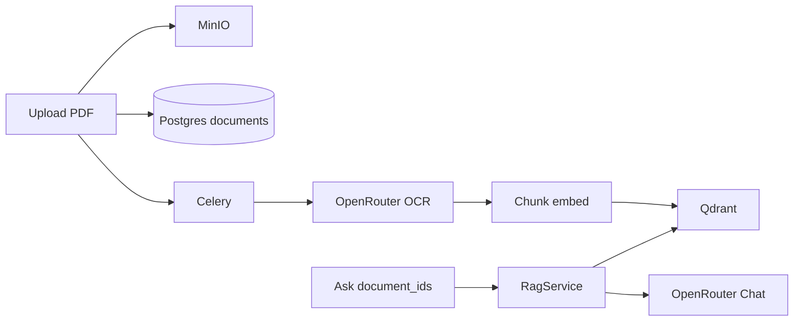
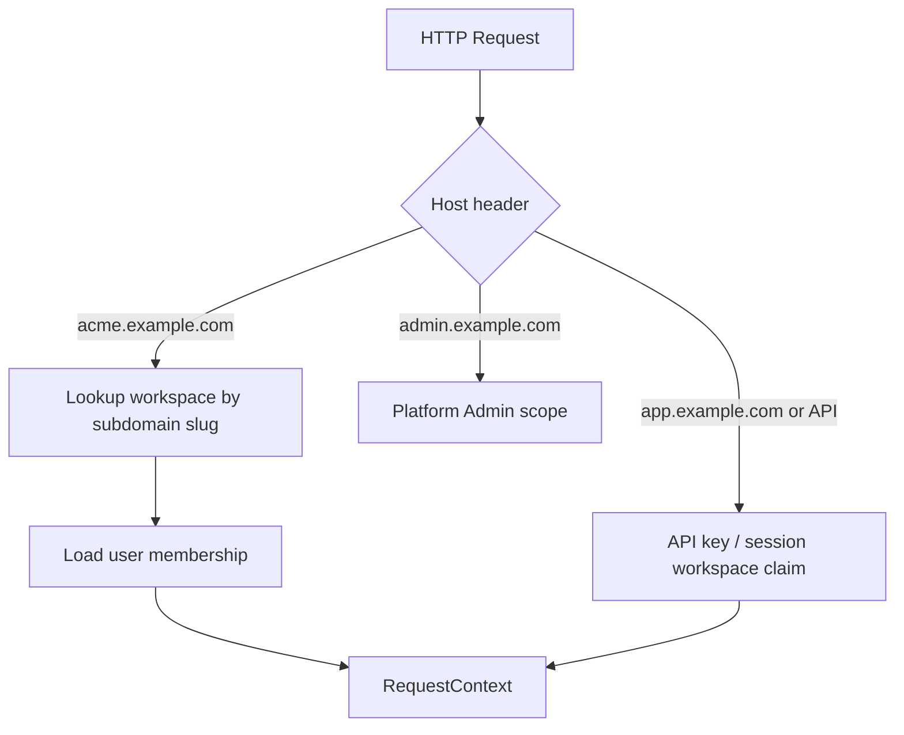
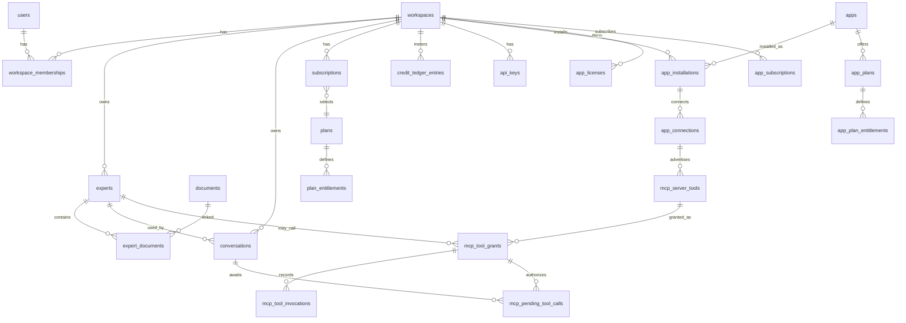

# Geem — Multi-Tenant SaaS Transformation Plan (FastAPI + React)

## Product identity (locked)

| Item | Value |
|------|--------|
| Product name | **Geem** |
| Public site / brand domain | [geem.ai](https://geem.ai) |
| Official avatar | [https://geem.ai/assets/geem-avatar.webp](https://geem.ai/assets/geem-avatar.webp) |
| Avatar character | Chibi-style figure in ghutra/agal + thobe with stacked **Ge** / **em** chest mark; friendly Arabic-first assistant persona |
| Repo | [Geem-Ai/Geem-Platform](https://github.com/Geem-Ai/Geem-Platform); product-facing strings, titles, and packages use **Geem** |

**Branding rules for UI:**
- Replace Metronic demo logos (`logo-34.svg`, mini-logo, fake avatars) with Geem brand assets in `apps/workspace_web`.
- **Vendor** the avatar into the app (e.g. `apps/workspace_web/public/brand/geem-avatar.webp`) rather than hotlinking `geem.ai` at runtime in production — avoids CDN/CORS/uptime coupling. Keep the canonical URL documented as the source of truth for updates.
- Use the Geem avatar as the default **assistant** face in Chat (Metronic AI message bubbles / empty states), and as a brand mark in sidebar header where Metronic showed its logo.
- User avatars remain user-specific; do not use the Geem mascot as a logged-in user photo.
- Theme: keep Metronic AI Concept shell/tokens; introduce Geem accent via CSS variables when implementing (navy mark on white/thobe palette as brand cue) without copying unrelated Metronic demos.
- i18n product name: keep “Geem” as proper noun in EN and AR unless a separate Arabic trade name is supplied later.
- Package/npm names for new apps: prefer `geem-workspace-web`, etc.
- Email/from names, OpenAPI titles, Helmet document titles, and SSE/client chrome should say Geem once branding lands (Phase 0–1).

Default production host pattern (when domains are wired): `{workspace}.geem.ai` for tenants; Platform Admin and marketing hosts decided with `dashboard_web` / `landpage_web` (e.g. `admin.geem.ai`, `www.geem.ai`) — confirm at deploy time.

---

## UI Boundary Rule (mandatory)

> [`samples/`](samples/) is **read-only**. Production code must not import from, depend on, or mutate files under `samples/`.
>
> - [`samples/metronic_vite_9.5.0`](samples/metronic_vite_9.5.0) — UI reference. Only the **Metronic AI Concept** (`src/ai/**`) and the **shared components actually required by that concept** are the primary UI foundation. Other Metronic concept applications (CRM, Mail, Calendar, Todo, Real Estate, Store Inventory) must not be copied wholesale or used to dictate product architecture.
> - [`samples/clickpay_gateway`](samples/clickpay_gateway) — Perfex CRM ClickPay module. Reference for hosted-page redirect only; port the flow into Python adapters, never import PHP.

**Note on path spelling:** The sample lives at `samples/metronic_vite_9.5.0` (correct spelling). Do not create or reference a `metrnoic_*` path.

Recommend capturing this rule later in `AGENTS.md` / Cursor project rules when implementation begins.

```text
samples/metronic_vite_9.5.0          (read-only reference)
        │
        ▼
Metronic AI Concept (src/ai + traced shared deps)
        │  selectively port/adapt — never runtime-import samples/
        ▼
apps/workspace_web                   (Workspace SaaS UI — tenant product)
```

### Frontend apps organization (locked)

Separate Vite SPAs under `apps/` by product surface (not one monolith frontend):

```text
apps/
├── api/                 # FastAPI backend
├── workspace_web/       # Workspace tenant product UI
├── dashboard_web/       # Platform Admin UI
└── landpage_web/        # Marketing / landing site (Astro static)
```

- Legacy MVP [`apps/web`](apps/web) was **retired** after the SaaS cutover; do not recreate it.
- Product UI is [`apps/workspace_web`](apps/workspace_web) only (Metronic AI Concept port).
- Useful MVP patterns (SSE client, `react-markdown`) were copied into `workspace_web` — not shared at runtime.
- Compose runs `workspace_web` (no legacy `web` service).
- Do **not** fold Platform Admin or marketing into `workspace_web`; keep one SPA per product surface.

Metronic supplies visual design, shell, layout, chat UX, forms/modals/menus/drawers, theme, and responsive behavior for **`workspace_web`**. **FastAPI remains the source of truth** for auth, workspaces, Experts, RAG, billing, quotas, and all domain data. Discard Metronic mock data, fake chat replies, demo user menus, and demo module routing.

---

## 1. Current architecture assessment

**Stack today:** FastAPI API, Celery worker, PostgreSQL, Redis, Qdrant, MinIO, React/Vite SPA at [`apps/web`](apps/web) (**kept**; new SaaS UI will be [`apps/workspace_web`](apps/workspace_web)).

**What works and is reusable:**
- Document upload → Celery ingest → OCR/normalize/chunk/embed → Qdrant ([`apps/api/app/documents/service.py`](apps/api/app/documents/service.py), [`ingestion/pipeline.py`](apps/api/app/ingestion/pipeline.py))
- RAG retrieve → rerank → answer + citations ([`apps/api/app/rag/service.py`](apps/api/app/rag/service.py))
- Provider protocols ([`apps/api/app/core/protocols.py`](apps/api/app/core/protocols.py))
- UUID PKs, `usage_events` metering stub, MinIO/Qdrant adapters
- Existing SSE streaming client in [`apps/web/src/api.ts`](apps/web/src/api.ts) / Ask page (adapt/copy into `workspace_web`, do not move the file out of `apps/web`)

**What is missing (explicit MVP non-goals):**
- Auth, users, roles, workspaces, Experts, conversations, billing, API keys, MCP, soft deletes, tenant isolation
- File formats beyond PDF; Ask UI uses multi-select `document_ids`, not knowledge profiles
- No MCP server exists
- Production UI shell (current web app is minimal custom CSS, no Tailwind/shadcn)

**UI reference added:** Metronic Vite **9.5.0** AI Concept under [`samples/metronic_vite_9.5.0/src/ai`](samples/metronic_vite_9.5.0/src/ai) (see § Metronic Integration Strategy).



---

## 2. Components to reuse

| Component | Reuse strategy |
|-----------|----------------|
| `IngestionPipeline` | Keep; add workspace/expert context + multi-format extractors |
| `RagService` | Keep as shared orchestration for Chat + public API; change scope from `document_ids` → Expert |
| OpenRouter adapters | Keep behind protocols |
| `MinioObjectStorage` / `QdrantVectorStore` | Extend keys/payloads with `workspace_id` + `expert_id` |
| `usage_events` | Evolve into metered ledger inputs (not replace wholesale on day one) |
| Celery `ingest_document` | Keep; bind tenant context on task payload |
| SSE query client | Keep and adapt to Expert + conversation APIs |
| Metronic AI Concept UI | Port layout/chat chrome/primitives into `apps/workspace_web`; replace mocks with FastAPI adapters |

---

## 3. Components to refactor

- Global `documents.sha256` unique → **per-workspace** unique `(workspace_id, sha256)`
- MinIO key `documents/{id}/...` → `workspaces/{workspace_id}/experts/{expert_id}/documents/{id}/...`
- Qdrant payload/indexes: add `workspace_id`, `expert_id`; all searches must filter both
- `QueryRequest.document_ids` → `expert_id` (+ optional debug override for platform admin)
- Open list/delete/query routes → authenticated + workspace-scoped
- Hard delete only → soft delete + retention job for documents/experts/workspaces
- Frontend: replace minimal MVP shell with Metronic AI–derived Workspace shell; feature modules talk to FastAPI via a central API client (not Metronic mocks)

---

## 4. Proposed domain / module boundaries

### Backend (`apps/api/app/`)

```text
identity/          # users, sessions, platform roles
workspaces/        # workspace, membership, roles, settings, subdomain
experts/           # experts, expert_documents, visibility, instructions
documents/         # existing — scoped to expert/workspace
ingestion/         # existing pipeline + format extractors
rag/               # existing RagService — Expert-aware
conversations/     # chat threads/messages (new)
billing/           # plans, subscriptions, purchases, gateway abstraction
entitlements/      # quota definitions + resolution
usage/             # credit ledger, period counters, metering
api_keys/          # workspace API credentials
apps_catalog/      # App Store: catalog, plans, licenses/subscriptions, installations, single-data-SELECT runtime paid access after a lightweight fence statement (see §17)
connectors/         # provider/server connections, encrypted credentials, OAuth, sync/webhooks; Phase 13 mcp_remote lifecycle
mcp/                # remote tool inventory, Expert grants, invocation log, approval state, tool-loop policy
egress/             # internal mTLS gateway contract/client; tenant-derived network access boundary
platform_admin/    # platform admin APIs
audit/             # audit log writer
common/            # tenancy context, authz, idempotency, soft-delete mixins
```

### Frontend — `apps/workspace_web` (Workspace product only)

Production Workspace UI: [`apps/workspace_web`](apps/workspace_web). Legacy MVP `apps/web` is **retired**.

Siblings (separate SPAs):
- `apps/dashboard_web` — Platform Admin product UI
- `apps/landpage_web` — public marketing / landing

Do **not** fold Platform Admin or marketing pages into `workspace_web`. Keep one SPA per product surface.

Feature-oriented layout inside the Workspace app (not Metronic demo folders):

```text
apps/workspace_web/src/
├── app/
│   ├── router/
│   ├── providers/          # Theme, QueryClient, Auth, Workspace, I18n, Helmet
│   └── layouts/
│       └── workspace/      # adapted from Metronic AI DefaultLayout
├── features/
│   ├── auth/
│   ├── workspaces/
│   ├── experts/
│   ├── chat/               # Metronic AI chat pages/components adapted
│   ├── conversations/
│   ├── api-keys/
│   ├── usage/
│   ├── billing/
│   ├── apps/
│   ├── members/
│   └── settings/
├── components/
│   ├── ui/                 # shadcn/Metronic primitives required by AI Concept
│   └── shared/             # product-level composites (page header, empty states)
├── services/
│   ├── api/                # FastAPI client, errors, workspace header, SSE
│   └── auth/
├── hooks/
├── lib/                    # cn(), toAbsoluteUrl, i18n helpers
├── locales/                # en.json, ar.json (separate from components)
├── types/
└── assets/                 # ported logos/media as needed
```

**Rules:**
- Controllers stay thin; domain logic in backend services
- Domain/feature code must **not** live under copied Metronic demo directory trees
- `components/ui` holds only primitives needed by the AI Concept (and later extensions of those primitives)
- Platform Admin UI is a later, separate shell; it may reuse `components/ui` but must not force the Workspace AI shell to absorb admin complexity

---

## Metronic Vite 9.5.0 AI Concept Integration Strategy

### 1. Exact AI Concept locations discovered

Sample root: [`samples/metronic_vite_9.5.0`](samples/metronic_vite_9.5.0)

AI Concept module (39 files):

```text
samples/metronic_vite_9.5.0/src/ai/
├── index.tsx                          # route module
├── components/                        # chat UI
│   ├── chat-message.tsx
│   ├── chat-messages.tsx
│   ├── chat-starter.tsx
│   ├── chat-starter-actions.tsx       # persona cards → map to Experts
│   ├── chat-starter-disclaimer.tsx
│   ├── chat-starter-header.tsx
│   └── chat-starter-input.tsx         # composer (Paperclip/Mic decorative)
├── layout/
│   ├── index.tsx                      # DefaultLayout shell
│   └── components/
│       ├── ai-model-selector.tsx
│       ├── chats-context.tsx          # mock threads — replace with API
│       ├── context.tsx                # LayoutProvider + mobile
│       ├── header.tsx                 # mobile header + Sheet
│       ├── model-selector.tsx         # UNUSED — ignore
│       ├── new-chat-button.tsx
│       ├── new-chat-context.tsx       # UNUSED — ignore
│       ├── pinned-chats.tsx
│       ├── quick-actions.tsx
│       ├── recent-chats.tsx
│       ├── section-header.tsx
│       ├── share-dialog.tsx
│       ├── sidebar.tsx
│       ├── sidebar-content.tsx
│       ├── sidebar-footer.tsx
│       ├── sidebar-header.tsx
│       ├── toolbar.tsx
│       ├── user-dropdown-menu.tsx     # fake user — replace with real auth
│       └── wrapper.tsx
├── mock/                              # DEMO ONLY — do not ship as product logic
│   ├── ai-models.ts
│   ├── chat-starter.ts
│   ├── chat-threads.ts
│   ├── messages.ts
│   ├── model-options.ts
│   └── index.ts
├── pages/
│   ├── chat.tsx                       # /ai/chat?chatId=
│   └── start.tsx                      # /ai/start
└── types/
    ├── chat.ts
    ├── pages.ts
    └── index.ts
```

Registration: [`src/providers/modules-provider.tsx`](samples/metronic_vite_9.5.0/src/providers/modules-provider.tsx) lazy-loads `@/ai` when path starts with `/ai`. App shell: [`src/App.tsx`](samples/metronic_vite_9.5.0/src/App.tsx) (`ThemeProvider`, `HelmetProvider`, `Toaster`, `BrowserRouter`).

### 2. Exact AI Concept routes

| Route | Page |
|-------|------|
| `/ai` | redirect → `start` |
| `/ai/start` | `AIStartPage` — empty chat / starter |
| `/ai/chat` | `AIChatPage` — optional `?chatId=` |

Production routes will **not** keep `/ai` as a product prefix. Map conceptually to Workspace routes such as `/`, `/chat`, `/chat/:conversationId`, `/experts`, etc., inside the Workspace shell.

### 3. Shared components the AI Concept actually depends on

Traced imports only (not entire `src/components`):

| Shared path | Role |
|-------------|------|
| `src/components/ui/avatar.tsx` | message/user avatars |
| `src/components/ui/badge.tsx` | pinned/quick actions |
| `src/components/ui/button.tsx` | actions |
| `src/components/ui/card.tsx` | starter personas |
| `src/components/ui/dialog.tsx` | share dialog |
| `src/components/ui/dropdown-menu.tsx` | menus |
| `src/components/ui/input.tsx` | composer |
| `src/components/ui/scroll-area.tsx` | sidebar scroll |
| `src/components/ui/separator.tsx` | sidebar |
| `src/components/ui/sheet.tsx` | mobile nav |
| `src/components/ui/tooltip.tsx` | tooltips + LayoutProvider |
| `src/components/ui/sonner.tsx` | App-level toaster (AI uses `toast` from `sonner`) |
| `src/components/screen-loader.tsx` | Suspense fallback when mounting module |
| `src/hooks/use-mobile.tsx` | `< 1024px` breakpoint |
| `src/lib/utils.ts` | `cn()` |
| `src/lib/helpers.ts` | `toAbsoluteUrl` (only helper AI uses) |
| `src/styles/globals.css` | Tailwind v4 + shadcn tokens + `.dark` |
| `public/media/app/logo-34.svg` | brand in sidebar/header |
| `public/media/avatars/300-2.png` | demo avatar |
| `public/media/app/mini-logo.svg` | screen loader (if kept) |

AI does **not** import CRM/Mail/Calendar/Todo/Real Estate/Store Inventory.

### 4. Required packages/dependencies (AI Concept subset)

Port into `apps/workspace_web` only what the AI shell needs (plus later product choices):

| Package | Purpose |
|---------|---------|
| `react`, `react-dom` | add to new `workspace_web` (align with Metronic / existing MVP) |
| `react-router` / `react-router-dom` | add to `workspace_web` |
| `lucide-react` | icons |
| `next-themes` | dark/light (`ThemeProvider` + user menu toggle) |
| `sonner` | toasts |
| `react-helmet-async` | document title |
| `class-variance-authority`, `clsx`, `tailwind-merge` | shadcn `cn` / variants |
| `radix-ui` | Metronic shadcn primitives (unified package) |
| `tailwindcss`, `@tailwindcss/vite`, `tw-animate-css` | design system pipeline |
| `react-markdown`, `remark-gfm` | port pattern from [`apps/web`](apps/web) for answers/citations (prefer over Metronic’s custom markdown-ish parser) |

**Introduce for production SaaS (not used by Metronic AI today, but correct for FastAPI integration):**
- `@tanstack/react-query` — present in Metronic package.json but **unused by AI**; adopt in `apps/workspace_web` for authenticated REST
- `react-i18next` (or `react-intl`) — Metronic has `react-intl` unused by AI; AI has **no i18n**; we define production EN/AR ourselves
- Form libs later as needed (`react-hook-form` + `zod`) for Expert/settings forms — add when a phase needs them, not wholesale from Metronic

### 5–7. Reuse / adapt / ignore

**Reuse (port into new apps/workspace_web):** AI layout shell, sidebar/header/mobile Sheet, chat starter + message list chrome, toolbar/share dialog patterns, UI primitives listed above, theme tokens, `use-mobile`, `cn`, logo assets (or replace with product brand). Copy SSE/streaming ideas from `apps/web` without removing that app.

**Adapt:**
- `ChatsProvider` / recent/pinned chats → FastAPI conversations API
- `user-dropdown-menu` → real user + workspace switcher + sign out
- `chat-starter-actions` personas → **Expert** cards / Expert picker
- `ai-model-selector` → Expert selector and/or model settings only if product exposes them
- Composer Paperclip → Expert knowledge upload flows / attachments when phase requires (not decorative)
- Fake `setTimeout` replies → SSE streaming via existing RAG client
- Message renderer → keep `MarkdownAnswer` / react-markdown + citation UI

**Explicitly ignore:**
- Entire concepts: `src/crm/**`, `src/mail/**`, `src/calendar/**`, `src/todo/**`, `src/real-estate/**`, `src/store-inventory/**`
- `modules-provider.tsx` multi-demo router and default `/crm` redirect
- All of `src/ai/mock/**` as product logic
- Dead AI files: `model-selector.tsx`, `new-chat-context.tsx`
- Demo scripts: `scripts/create-demo-user.js`, `scripts/debug-auth.js`
- Unused Metronic deps (apexcharts, leaflet, formik, dnd-kit, headless-tree, vaul, cmdk, etc.) unless a later phase has a clear need for an **isolated** primitive
- Most of `public/media/**` beyond AI-referenced assets
- `src/styles/demos/**`

### 8. Production mapping table (actual paths)

| Metronic AI source | Production destination |
|--------------------|------------------------|
| `samples/.../src/ai/layout/**` | `apps/workspace_web/src/app/layouts/workspace/` |
| `samples/.../src/ai/pages/start.tsx` | `apps/workspace_web/src/features/chat/pages/ChatStartPage.tsx` |
| `samples/.../src/ai/pages/chat.tsx` | `apps/workspace_web/src/features/chat/pages/ChatPage.tsx` |
| `samples/.../src/ai/components/*` | `apps/workspace_web/src/features/chat/components/` |
| `samples/.../src/ai/types/*` | `apps/workspace_web/src/features/chat/types/` (evolve to API types) |
| `samples/.../src/ai/mock/*` | **Do not port as runtime**; optional Storybook fixtures only |
| `samples/.../src/ai/index.tsx` | fold into `apps/workspace_web/src/app/router/` |
| `samples/.../src/components/ui/{avatar,badge,button,card,dialog,dropdown-menu,input,scroll-area,separator,sheet,tooltip,sonner}.tsx` | `apps/workspace_web/src/components/ui/` |
| `samples/.../src/components/screen-loader.tsx` | `apps/workspace_web/src/components/shared/ScreenLoader.tsx` |
| `samples/.../src/hooks/use-mobile.tsx` | `apps/workspace_web/src/hooks/use-mobile.ts` |
| `samples/.../src/lib/utils.ts` | `apps/workspace_web/src/lib/utils.ts` |
| `samples/.../src/lib/helpers.ts` (`toAbsoluteUrl`) | `apps/workspace_web/src/lib/helpers.ts` |
| `samples/.../src/styles/globals.css` | `apps/workspace_web/src/styles/globals.css` (+ Tailwind v4 Vite plugin) |
| `samples/.../src/App.tsx` theme/toaster shell | `apps/workspace_web/src/app/providers/` |
| `samples/.../public/media/app/logo-34.svg` | Replace with Geem mark / wordmark under `apps/workspace_web/public/brand/` |
| `samples/.../public/media/avatars/300-2.png` | Do **not** use; Geem assistant uses vendored `geem-avatar.webp` |
| Canonical Geem avatar URL | Source: `https://geem.ai/assets/geem-avatar.webp` → vendor to `apps/workspace_web/public/brand/geem-avatar.webp` |
| `samples/.../components.json` | `apps/workspace_web/components.json` if keeping shadcn workflow |
| Existing [`apps/web/src/api.ts`](apps/web/src/api.ts) | Adapt/copy SSE client into `apps/workspace_web/src/services/api/` — leave `apps/web` intact |
| Existing `AskPage` / `DocumentsPage` | retired/replaced by Experts + Chat features across Phases 3–4 |

### 9. Authentication adaptation

- Metronic AI has **no auth screens and no auth backend** — only a decorative user dropdown.
- **Delivered:** login/register/forgot-password/reset-password/check-email/verify-email (GuestRoute) and change-password (`/account`) using **AI Concept UI primitives** (Card, Input, Button) so visuals match the product; do **not** import another Metronic concept’s auth demo.
- Wire exclusively to FastAPI Identity (`/api/auth/*`); session/JWT refresh owned by `services/auth`. Password reset and email verification use HMAC tokens + email (same pattern as invitations); verification gates register outside `APP_ENV=test`; reset/verify auto-log in; change-password revokes other sessions.

### 10. Workspace adaptation

- Extend AI sidebar: Overview, Chat, Experts, API, Apps, Members, Storage, Billing, Settings (role-aware nav).
- Workspace switcher in header/sidebar footer; hostname `slug.example.com` sets **UX context** only.
- Backend independently resolves + authorizes workspace (subdomain / membership / API key). Frontend context is not a security boundary.
- `VITE_ROOT_DOMAIN` + local header/slug fallback for DX.

### 11. Chat adaptation

- Phase 4 milestone: Metronic AI Chat becomes production Chat.
- Flow: Workspace → Chat → Conversation → selected Expert → instructions + knowledge → RAG → SSE stream → markdown + citations.
- Preserve AbortController cancellation; map loading/error/retry to composer + message list.
- Replace mock threads with `conversations` / `messages` APIs.

### 12. Expert adaptation

- Visual language from AI cards/sidebar (starter personas → Expert cards).
- Screens: My Experts, Platform Experts, Create/Edit, Detail (instructions, knowledge sources, status, usage).
- Knowledge sources model must allow non-upload sources later (`expert_sources` polymorphic); initial UI: PDF/TXT/Markdown upload + indexing status.
- Do not build a permanent Documents-first product IA; Phase 2 upload UI stays lightweight.

### 13. i18n / RTL approach

- AI Concept: dark mode via `next-themes`; **no i18n**; only incidental logical Tailwind classes (`start-`/`end-`).
- Production: `locales/en.json` + `locales/ar.json`; `dir="rtl"|"ltr"` on `<html>` from locale; reuse logical CSS properties.
- No hardcoded user-visible English strings in components.
- Library choice: `react-i18next` (clean Vite SPA fit) unless team prefers `react-intl` already listed in Metronic lockfile — decide in Phase 0 and stick to one.

### 14. API integration approach

```text
UI → feature hooks (React Query / SSE hooks) → services/api client → FastAPI
```

Client responsibilities: auth headers/cookies, workspace context header/slug, standardized errors (401/403/404/409/422/quota/billing), AbortController, SSE path separate from REST Query cache.

### 15. Theme approach

- Port `globals.css` tokens + `ThemeProvider` (`attribute="class"`, `storageKey` product-specific).
- Keep light default; system theme optional.
- All SaaS pages (Experts, Billing, API Keys) use the same tokens — one coherent AI product, not mixed Metronic demos.

### 16. Mobile / responsive

- Reuse `use-mobile` (1024px), desktop Sidebar vs mobile Header+Sheet from AI layout.
- Chat and Experts must remain usable on mobile in Phases 3–4 acceptance criteria.

### 17. Upgrade / maintenance

- Treat Metronic upgrades as **manual cherry-picks** of AI Concept + required UI primitives into `apps/workspace_web`.
- Never `npm link` or path-import `samples/`.
- Document ported file versions (9.5.0) in a short `apps/workspace_web/METRONIC_PORT.md` when Phase 0 lands.

### 18. Rules protecting `samples/`

- Read-only; no edits; no production imports; CI optional check forbidding `from '.../samples/` imports.
- Add to `AGENTS.md` / Cursor rules when coding starts.

### 19. Migration from existing frontend

1. Phase 0: scaffolded `apps/workspace_web` alongside then-kept `apps/web`.
2. Phase 1+: authenticated Workspace product only in `workspace_web`.
3. Phase 3–4: Expert + Chat live in `workspace_web`.
4. **Done:** legacy `apps/web` and Compose `web` service retired; product UI is `workspace_web` only.

### 20. Frontend testing strategy

- Component tests for Expert picker, chat composer states, RTL smoke.
- Playwright: login → workspace shell → Expert → chat stream (from Phase 4) against `workspace_web`.
- Visual regression optional later; prioritize tenant-isolation and authz nav tests.

### Compatibility concerns (`apps/workspace_web` vs Metronic sample)

| Area | Metronic AI | Existing MVP `apps/web` | New `apps/workspace_web` |
|------|-------------|-------------------------|--------------------------|
| React | 19.2.x | 19.0.x | Start on React 19.x aligned with Metronic |
| Vite | 7.x | 6.x | Prefer Vite 7 from scaffold |
| Tailwind | v4 via `@tailwindcss/vite` | none (plain CSS) | Tailwind v4 from day one |
| Router | RR 7 | RR 7 | RR 7 |
| Markdown | custom parser in AI | `react-markdown` | Use `react-markdown` (copy pattern from `apps/web`) |
| Data fetching | Context + local state | raw `fetch` | React Query + SSE helper |
| App path | n/a | **kept** at `apps/web` | **new** `apps/workspace_web`; reserve `dashboard_web` / `landpage_web` |

---

## 5. Multi-tenancy architecture

**Chosen model:** Shared database, shared schema, **row-level tenant isolation** via `workspace_id` on all tenant-owned tables. No schema-per-tenant.

**Isolation layers:**
1. **HTTP:** resolve Workspace from subdomain Host → attach `RequestContext(workspace, user, membership)`
2. **AuthZ:** membership role checks + Expert visibility rules
3. **DB:** every query filters `workspace_id` (repository helpers enforce this)
4. **Storage:** workspace-prefixed MinIO keys
5. **Vectors:** Qdrant payload filter `workspace_id` + `expert_id` (indexed)
6. **Queues:** Celery task args include `workspace_id`; worker sets context var
7. **Cache:** Redis keys prefixed `ws:{workspace_id}:...`
8. **Platform Admin:** separate host (`admin.example.com` or `APP_ADMIN_HOST`) with `platform_role`, never mixed into workspace membership

Frontend hostname context is UX only; backend authorization remains authoritative.

---

## 6. Workspace resolution strategy



- Workspace fields: `id` (UUID), `slug` (unique, subdomain-safe), `name`, `status`, `settings` JSONB, soft-delete
- Local/dev: `acme.localhost:5173` or `X-Workspace-Slug` header fallback (config-gated, never in prod)
- Public API (`api.example.com`): workspace from API key, not subdomain
- SPA: Vite env `VITE_ROOT_DOMAIN`; workspace-aware API base URL

**Target Workspace nav (AI Concept look-and-feel):**

```text
Workspace
├── Overview
├── Chat
├── Experts
├── API
│   ├── API Keys
│   └── Usage
├── Apps
├── Members          ← Phase 1 stub; Phase 10 = invites + polish + role matrix
├── Storage
├── Billing
│   ├── Subscription
│   ├── Usage
│   ├── Credits
│   └── Billing History
└── Settings
```

---

## 7–8. Proposed database schema (core)



**Identity / tenancy**
- `users` — email, password_hash (argon2), status, platform_role (`none|admin`), timestamps, soft-delete
- `workspaces` — name, slug, status, created_by, soft-delete
- `workspace_memberships` — workspace_id, user_id, role (`owner|admin|member`), unique `(workspace_id, user_id)`
- `workspace_invitations` — Phase 10: email invite tokens (pending/accepted/revoked); see Phase 10 locked decisions
- `sessions` or JWT refresh tokens — hashed refresh tokens, device meta

**Experts / knowledge**
- `experts` — workspace_id nullable (null = platform expert), type (`platform|workspace`), name, description, icon_url, system_instructions, rag_config JSONB, status, visibility (`private|workspace|platform_published`), created_by, soft-delete
- `expert_documents` — expert_id, document_id, unique pair
- Optional early `expert_sources` (polymorphic: upload | future connectors) so UI never assumes uploads-only
- Extend `documents` with `workspace_id`, `byte_size`, `deleted_at`; drop global sha256 unique
- Extend chunks / Qdrant payload with `workspace_id`, `expert_id`

**Chat**
- `conversations` — workspace_id, expert_id, user_id, title, soft-delete
- `messages` — conversation_id, role, content, token usage refs, citations JSONB

**Billing / plans / usage / API keys / apps / audit** — unchanged from prior plan decisions:
- plans, plan_entitlements, subscriptions, purchases, credit_packs *(Workspace Geem plans — separate from App Store commerce; see §17)*
- payment_gateway_configs (multiple rows; **exactly one `enabled=true`**), purchases, credit_packs, billing_customers
- Phase 6 fulfillment is **redirect return + server-side query**, not `billing_events` webhooks (webhooks later)
- credit_accounts, credit_ledger_entries (append-only), usage_period_counters, storage events
- api_keys (hashed secrets, scopes, revocation)
- **App Store (Phase 9):** `app_categories`, `apps`, `app_plans`, `app_plan_entitlements`, `app_installations`, `app_licenses`, `app_subscriptions` — not boolean feature flags; price lives on `app_plans` (no flat `app_prices` table)
- **Connectors (Phase 9C+):** `app_connections`, `connector_sync_runs`, `connector_items`, `connector_webhook_events`
- **Remote MCP tools (Phase 13):** `mcp_server_tools`, `mcp_tool_grants`, `mcp_tool_invocations`, `mcp_pending_tool_calls`, `mcp_tool_surface_bindings`, `mcp_surface_deliveries`; every tenant-owned row carries `workspace_id`
- Phase 13 migrations enforce exact relational integrity in addition to repository filtering: installation↔connection share a Workspace; each tool/grant names the exact connection; grants target only Workspace-owned Experts; `(conversation_id, message_id)` proves the message belongs to that exact Workspace conversation; invocation/approval rows follow their exact grant/tool/connection chain; each 13E external row proves one same-Workspace/same-Expert WidgetInstance or exact WhatsApp/OpenWA ChannelBinding + conversation binding, with mutually exclusive real-user/API/widget/channel attribution and no fabricated Geem user
- Phase 13 starts after the current Alembic head (`0035` at this review); its first allocation is `0036`, and existing `0034`/`0035` are never reused
- Phase 13 allocation continues through `0040` for exact Widget/WhatsApp surface bindings, pinned source config/principal epochs, idempotent Widget turn receipts, external pending/invocation attribution, and durable claim/lease/reconciliation delivery state; `0036`–`0040` remain immutable per slice
- audit_logs
- evolve `usage_events` with workspace/user/expert/api_key attribution; `cost_metadata` stores family, multiplier, raw vs billed tokens

---

## 9–10. Expert architecture and RAG changes

**Expert = instructions + RAG config + knowledge sources + visibility.**

```text
Chat/API → Expert → system_instructions + expert knowledge set
       → RagService.retrieve(workspace_id, expert_id)
       → LLM with expert instructions merged into prompt
```

**Code changes (must):**
- [`schemas.py`](apps/api/app/api/schemas.py): `expert_id` required for query
- [`rag/service.py`](apps/api/app/rag/service.py): `_prepare_context` resolves Expert → documents; inject instructions
- [`qdrant_store.py`](apps/api/app/storage/qdrant_store.py): filter `workspace_id` + `expert_id`
- [`pipeline.py`](apps/api/app/ingestion/pipeline.py): write expert/workspace to payload
- Documents nested under Experts (or scoped via context)
- Chat UI: Expert picker (Metronic starter-actions pattern) replaces document multi-select
- Platform Experts: `workspace_id IS NULL` + explicit workspace grant list

**Formats:** PDF + TXT + Markdown extractors; pluggable parser per mime.

**Tool surfaces:** Geem-dispatched remote MCP tools are deferred to the separate Phase 13 MCP plan; the remote server executes them. Caller-supplied OpenAI function tools are different: Phase 14 passes their schemas to the LLM, returns exact `tool_calls`, accepts matching tool results, and never dispatches or executes those client tools.

---

## 11–14. Subscription, entitlements, credits, storage

Unchanged architectural intent:
- `EntitlementService` / `QuotaService` — no `if plan == 'pro'`
- Expert allowance via entitlement key; storage quota with byte ledger and workspace-isolated paths
- Additional credits as proper ledger entries, not bare integers on workspaces

### Workspace AI token pool (locked)

**One pool, many OpenRouter families.** Entitlement keys stay `ai_tokens_daily|weekly|monthly` plus purchased credits (FIFO). Chat, embed, rerank, OCR, and title all consume that same pool — there are no per-family entitlements.

| Family | Typical operations | Default multiplier |
|--------|--------------------|--------------------|
| `chat` | RAG generation, Geem General, general fallback | 1× |
| `embed` | ingest `embedding`, query `embed_query` | 1× |
| `rerank` | query `rerank` | 1× |
| `ocr` | ingest `pdf_parse` (per page) | **3×** |
| `title` | conversation auto-title | 1× |

Conversion (see [`apps/api/app/usage/weights.py`](apps/api/app/usage/weights.py)):

```text
billed_tokens = round(provider_tokens * multiplier)
```

- Family rates: `AI_TOKEN_MULTIPLIER_CHAT|EMBED|RERANK|OCR|TITLE`.
- Optional `AI_TOKEN_MODEL_MULTIPLIERS` JSON overrides by **exact** OpenRouter model id (wins over family). Keep in sync with `OPENROUTER_*_MODEL`.
- When the provider omits a usage payload, fall back to `AI_TOKEN_FALLBACK_EMBED` (100), `_RERANK` (50), `_OCR_PER_PAGE` (500), `_TITLE` (64), chat = reservation size.
- `usage_events.cost_metadata` records `family`, `multiplier`, raw prompt/completion/total, and `billed_tokens`. History kinds: `chat_tokens`, `embed_tokens`, `rerank_tokens`, `ocr_tokens`, `title_tokens` (legacy `ai_tokens` still accepted).

**Charge paths:**
- **Chat turn:** reserve before SSE `message_start` / LLM. Query `embed_query` + `rerank` fold into the same reservation via `usage_context` (`billed_extra_tokens`) and settle with chat totals. Release on fail/cancel.
- **Ingestion:** OCR (`pdf_parse`) and document `embedding` immediately reserve+settle (`charge_now`) against the tenant Workspace. Quota errors fail the page/job.
- **Title:** immediate charge; failure must not block persisting the title.
- Platform Knowledge / non-tenant workspaces are not billed.

Atomic consume uses `request_id` idempotency (`ai_usage_reservations`) with `SELECT … FOR UPDATE` + workspace advisory lock.

---

## 15–16. API auth/metering and Chat integration

**Public answer API (Phase 7, complete):** OpenAI-shaped answer mode at `POST /api/v1/chat/completions` + `GET /api/v1/models` + `GET /api/v1/models/{id}` with workspace API keys (hashed), scopes, rate limits on completions, Expert via `X-Geem-Expert-Id` (not `model`), and shared `ChatTurnExecutor`. It returns a final answer and intentionally ignores caller-supplied OpenAI tool schemas/results; Phase 13 may select a separate Geem-owned loop for active, surface-authorized MCP grants while keeping this endpoint answer-only. No public Conversations/Messages.

**Client agent API (Phase 14, pending):** Paid non-connector App Store product **Agents AI**
(`agents-ai`) with a separate OpenAI-compatible base `/api/v1/agent`, exposing
`POST /api/v1/agent/chat/completions` and agent-scoped Models routes. Every route requires current
published App + active installation + active subscription access in addition to `agent:write`; each
admitted completion consumes the plan's typed `agent_requests_daily` unit, while Models consumes
none. Expert remains selected by `X-Geem-Expert-Id`; keep `model` as the public Geem model identifier
reserved for later model selection. The client owns tool execution and resends the bounded
conversation transcript plus tools, controls, and client instructions on every round. Geem preserves
assistant/tool roles, call IDs, types, names, ordering, and string argument protocol (without
byte-comparing SDK-reserialized JSON across requests), requires every parallel call to resolve
exactly once before inference, and demotes caller `system`/`developer` text to one bounded synthetic
user-role block beneath the sole Geem/Expert system policy. A separate `AgentCompletionService`
keeps Phase 7 behavior/contract unchanged, verified exactly under deterministic fixtures. No public
Conversation/Message persistence is introduced.

**Internal chat:** Metronic AI Chat UX + persisted conversations + Expert selection + existing Geem named SSE; same `ChatTurnExecutor` / `ExpertQueryService` engine, different wire format.

---

## 17. App Store foundations (locked)

Canonical App Store model for Geem. **Phase 9** implements catalog, commerce, connectors, and Workspace Apps UI. This section is the source of truth for billing types, plans, install/license semantics, and what is explicitly out of scope.

UI uses AI Concept visual language (cards/dialogs/drawers) — not another Metronic concept app. FastAPI is authoritative; the SPA never invents entitlement or pricing.

### Product shape

| Concept | Meaning |
|---------|---------|
| **Catalog app** (`apps`) | Global listing (slug, name, category, `billing_type`, `status`, optional `connector_key` / `connector_kind`) |
| **App plan** (`app_plans`) | Priced SKU for one catalog app (`code`, `price_amount`, `currency`, `billing_interval`, entitlements) |
| **Installation** (`app_installations`) | Workspace opted into the app (`active` / `suspended` / `uninstalled`). Soft lifecycle — one row per `(workspace, app)` |
| **Connection** (`app_connections`) | Provider account or tenant-configured remote endpoint linked under an installation; supported per-connection credentials/OAuth are encrypted. Distinct from install |
| **License / subscription** | Commercial entitlement records — **separate** from installation and from Workspace Geem `subscriptions` |

```text
Browse catalog → (pay if required) → Install → Connect provider/server → Use (Expert sources / channel / tools)
```

### Billing types (`apps.billing_type`) — locked

Exactly three commercial models. Do not invent a fourth without a plan revision.

| `billing_type` | How access is granted | Purchase kinds | Survives uninstall? |
|----------------|----------------------|----------------|---------------------|
| **`free`** | Install alone (published apps) | none | n/a (re-install anytime while published) |
| **`one_time`** | Pay once → `app_licenses` (`active`) → then install | `app_one_time` | **Yes** — license stays; re-install without re-paying |
| **`subscription`** | Pay for period → `app_subscriptions` with time window → then install | `app_subscription`, `app_subscription_renewal` | Period access is independent of install; expired period blocks use until renew |

**Rules:**
- Free apps: `POST …/install` creates/reactivates installation; no checkout.
- Paid apps: checkout + ClickPay/Noop return (same Phase 6 gateway path) **before** install is allowed; `AppAccessService` is the gate — connectors and UI must not bypass it.
- Existing paid fulfillment may create/reactivate the installation after verified payment. That UX
  shortcut does not merge the records: runtime still requires both current commercial access and an
  active installation, and uninstall independently denies use.
- Coming-soon / draft / disabled catalog rows: browse may show them; install and checkout fail closed.
- Currency v1: **SAR** (aligned with Workspace billing / ClickPay).
- **No card-on-file auto-renew** in Phase 9 — subscription renewal is an explicit `POST …/renew` hosted-page checkout (manual renewal).
- Period math: **calendar-month anniversary** windows (`current_period_start` / `current_period_end`), not usage-meter months. Active renew extends end by one month; expired renew starts a fresh period from now.
- One active commercial entitlement per `(workspace, app)` for licenses and for subscriptions (unique constraints).
- Workspace Geem plan (`plans` / `subscriptions`) and App Store commerce are **orthogonal**: buying an App does not change Workspace AI quotas; Workspace plan does not auto-grant App licenses.

### App plans + entitlements

- Each catalog app has zero or more `app_plans` (seeded default `free` plan for free connectors; paid apps require at least one active priced plan before checkout).
- `billing_interval`: `none` (free / one-time SKUs) or `monthly` (subscription SKUs). Yearly / weekly intervals are **out of scope** for Phase 9.
- `app_plan_entitlements` — key/value JSONB per plan (e.g. `connections: 1`). Resolved via `AppEntitlementService` — **not** Workspace `plan_entitlements`.
- Do not hardcode `if app.slug == "…"` for limits; read entitlement keys.
- WhatsApp / OpenWA: seed as `subscription` + `published` with monthly SAR plans `line` / `desk` / `ops` (`connections` 1 / 3 / 10).

**Pending paid extension products (Phases 13–14):** these are independent App subscriptions; buying
one never grants the other and neither changes Workspace AI-token/RPM entitlements.

| App | Catalog identity | Monthly plans | Typed App entitlements | Publish gate |
|-----|------------------|---------------|------------------------|--------------|
| **MCP Connectors** | `mcp-connectors`; `automation`; `mcp_remote`; `tool_source` | `mcp-starter`, `mcp-team`, `mcp-scale` | `connections`, `tool_calls_daily` | Phase 13E full paid E2E + signed prices/limits |
| **Agents AI** | `agents-ai`; `automation`; non-connector | `agents-starter`, `agents-team`, `agents-scale` | `agent_requests_daily` | Phase 14C full paid E2E + signed prices/limits |

Both seed as `coming_soon`; every active SKU must have signed monthly SAR `price_amount`, positive
typed limits, one default, and stable sort order before the App becomes `published`. Launch checkout
selects a tier and manual renewal keeps it. The current shared commerce contract does not promise
self-service upgrade/downgrade; Platform Admin may use its existing grant/assignment controls until
an explicit plan-change checkout is designed.

There is no circular "E2E before publish / checkout only after publish" gate. Early slices seed only
the `coming_soon` App identity and typed-key catalog; they do not create zero/fake active production
SKUs. Slice tests use an isolated test/staging fixture that is explicitly `published` with non-
production plan values and active commercial/install rows. At each release slice, commercial
sign-off first supplies the real `PlanSpec`s while production remains `coming_soon`; an isolated
release-candidate catalog is published and passes hosted checkout/fulfillment/renewal/runtime E2E;
only then does the validated production promotion set `published`.

Extend the shared publish validator for these two products rather than relying on the generic "one
priced plan exists" rule. Before promotion it verifies the exact launch plan-code set, all active
SKUs' positive signed SAR monthly prices, exactly one default, stable sort order, every required
positive-integer typed entitlement, and operational availability (`mcp_remote` registered/configured
or `CLIENT_AGENT_API_ENABLED=true`). Missing data leaves the App `coming_soon`; neither seed
reconciliation nor Platform Admin can bypass the product-specific validator.

### Catalog status (`apps.status`)

| Status | Tenant behavior |
|--------|-----------------|
| `draft` | Hidden / unavailable |
| `published` | Install/checkout per billing rules |
| `coming_soon` | Discoverable; cannot install or pay |
| `disabled` | Unavailable (existing installs may uninstall only) |

Categories (`app_categories`): knowledge, communication, productivity, analytics, automation (i18n name keys). Starter seeds: **Google Drive** + **Microsoft OneDrive** (`free`, `knowledge_source`) + **WhatsApp / OpenWA** (`subscription`, `published`, `channel`).

### Access snapshot (`AppAccessService`) — locked UX contract

Authoritative statuses returned to API/UI: `not_entitled` | `entitled_not_installed` | `active` | `expired` | `unavailable`.

Action flags are permission-aware: `APPS_VIEW` browses, `APPS_MANAGE` installs/purchases, and `APPS_CONNECT` manages provider/server connections. Owner/admin receive these by seeded default; dynamic Workspace roles remain authoritative.

### Runtime paid-App authorization — locked hot path

Runtime use of a paid App is authorized only by
`AppAccessService.require_runtime_active(workspace_id, app_slug, entitlement_keys=...)`. Phase 13E
adds `require_runtime_active_set(workspace_id, requirements_by_app_slug=...)`; the singular method is
a one-item wrapper. Each protected operation performs one fresh, read-only SQLAlchemy Core/scalar
PostgreSQL decision over a non-deleted active tenant Workspace and every required `published` App,
active installation, matching active license/subscription, and subscription
`[current_period_start, current_period_end)` using database
statement time captured once with `statement_timestamp()` (never transaction-start
`CURRENT_TIMESTAMP`). The selected commercial row and plan must name the same App:
`app_plans.id=app_(license|subscription).app_plan_id AND app_plans.app_id=apps.id`.
`AppPlan.is_active` controls new sale/selection; deactivating a plan does not silently revoke existing
subscribers. The authorization read bypasses stale ORM identity-map state and never writes expiry
normalization.

The same purpose-built indexed SELECT joins/aggregates only the requested Apps and typed App
entitlement rows and returns one compact snapshot/map: captured statement time, IDs/status, plan code, period end,
and validated limits—no
permissions, URLs, credentials, or tenant content. Launch uses no cross-request cached `active`
decision or cached plan limits, so uninstall, suspension, revocation, unpublish, natural expiry, and
entitlement reduction take effect on the next authorization check. Database failure or a missing,
malformed, or non-positive required limit fails closed before provider/egress work with retryable
`APP_RUNTIME_ACCESS_UNAVAILABLE` where appropriate.

Hot-path acceptance is structural, not wishful caching: one access/entitlement **data SELECT**, no
second `AppEntitlementService` resolve, reviewed indexes/`EXPLAIN`, latency/query-count metrics, and
representative p95 at or below 20 ms. Agents AI runs it exactly once and reuses the result only
inside that request when an authenticated/scoped/operational `/api/v1/agent/*` request reaches the
paid gate; earlier rejects execute zero access SELECTs. MCP runs it fresh before every discovery,
dispatch, and approval resume and never memoizes across model iterations or a human pause. A Widget/
WhatsApp MCP call supplies both `mcp-connectors` and the originating `chat-widget`/`whatsapp` App;
any source without an eligible grant/exact binding performs no MCP App lookup. A later cache needs a separately reviewed version/fence protocol and
measured justification.

For an operation that will start provider/egress work or consume an App counter, the access SELECT
and quota receipt/counter update form one short **admission transaction** explicitly pinned and
asserted as PostgreSQL `READ COMMITTED` before any statement; never rely on an unchecked server
default. Before that SELECT, runtime paths use one preliminary statement to acquire transaction-
scoped shared advisory fences from stable keys known before authorization, in fixed lexically sorted
App-slugs → Workspace → matching lexically sorted Workspace+App → sorted exact external-surface-
target-key order. Single-App Agent/MCP paths have one slug and no surface key; Widget MCP paths add
the instance key, while WhatsApp adds its OpenWA connection + ChannelBinding keys.
Restrictive plan/entitlement mutations take the App-level exclusive fence before writing; restrictive
App/Workspace/install/subscription mutations take the matching exclusive fences in the same order.
No selected-plan fence is derived within the access statement: its snapshot could predate a lock
wait, while the App fence already serializes every restrictive plan/entitlement change. Thus a paid
gate is one access/entitlement data SELECT plus the lightweight fence statement where protected
admission requires it, not one total DB roundtrip. `READ COMMITTED` ensures that data SELECT receives
a new post-wait statement snapshot; an isolation mismatch fails readiness/admission closed instead
of running this protocol under `REPEATABLE READ`.
MCP additionally takes deterministic shared row locks over its current MCP/originating-App
connections, tool, grant, exact surface binding, Widget instance/conversation binding or OpenWA
channel/conversation binding, conversation/message, and invocation chain. Surface revoke/rebind,
Widget origin/Expert/state changes, and OpenWA account/session/binding/policy changes take the target
exclusive fence plus conflicting row locks and make affected bindings inert before commit. The
transaction captures one
`statement_timestamp()` for access and UTC-period selection, validates current state/limits, writes
the idempotent admission, and commits before any external I/O; shared locks do not serialize normal
requests with one another. That commit is the cutoff: an already admitted operation may finish, but
after a restrictive mutation's deny commit, no new admission can pass. Never hold a database lock or
transaction open across model, gateway, OAuth, or other network I/O.

### Install vs connect vs Expert use

| Layer | Table / surface | Notes |
|-------|-----------------|-------|
| Install | `app_installations` | Workspace enables the app |
| Connect | `app_connections` | Provider/session/remote-server credentials encrypted; counts toward `connections` entitlement |
| Use | Expert connector-sources / channel / MCP tool grants | Knowledge apps ingest documents; channels bind conversations; Phase 13 tools bind explicit approved grants to Experts |

Encrypted blobs (`config_encrypted`, connection credentials, sync state) **never** appear in API DTOs.

### Connector kinds

| `connector_kind` | Role | Phase |
|------------------|------|-------|
| `knowledge_source` | Pick files → Document / MinIO / Qdrant | 9D Drive, 9E/9E.1 OneDrive |
| `channel` | Messaging surface ↔ Expert | 9F OpenWA |
| `tool_source` | Remote MCP tools → reviewed Expert grants → Geem-owned tool loop | Phase 13 |

Non-connector catalog apps are allowed later (tooling/utilities) with `connector_key` null — still use the same install + billing model.

Phase 13 adds one generic remote MCP Connector catalog app (`connector_key=mcp_remote`,
`connector_kind=tool_source`). Tenant server URLs are connections under that app, not one catalog
app or adapter per MCP vendor.

Phase 14 adds the non-connector `agents-ai` catalog app. Its custom detail panel exposes plan,
period, daily request usage, API base/model information, and links to API Keys/Experts; it must not
fall through to a generic "integration later" placeholder. API keys and Expert flags remain separate
configuration gates and stay stored-but-inert during expiry/uninstall.

### APIs (Phase 9 surface)

Workspace-scoped under `/api/apps` (names illustrative): categories; list/detail catalog; installations list/detail; `POST/DELETE …/{slug}/install`; `POST …/{slug}/checkout`; `POST …/{slug}/renew`. Connector OAuth/sync/webhook routes live under connectors package. Purchase fulfillment reuses `purchases` + `BillingGateway` with kinds `app_one_time` | `app_subscription` | `app_subscription_renewal`.

### Explicitly out of scope (Phase 9)

- Auto-recurring charges / card vault / dunning
- App Store for personal (non-workspace) accounts
- Third-party developer upload marketplace / revenue share
- Seat-based or usage-metered App pricing (beyond plan entitlement caps like `connections`)
- Bundling Apps into Workspace Geem plans (platform admin may assign later; not self-serve in 9)
- Yearly App plans, trials, coupons, freemium tier ladders beyond the three billing types
- Public unauthenticated catalog
- Porting Metronic Store Inventory / unrelated demo apps

Platform Admin catalog CRUD / forced licenses → Phase 12 (`dashboard_web`), not Workspace UI.

---

## 18. Billing abstraction (multi-gateway, one enabled)

```text
BillingGateway (protocol)
  ├── ClickPayGateway          # Phase 6 — hosted page redirect (first)
  ├── Manual/NoopGateway       # local/dev — no real money
  └── (later) Stripe / Moyasar / Tap / …
```

- `payment_gateway_configs`: multiple rows; **exactly one `enabled=true`** for tenant checkout
- Domain (`BillingService`, purchases, subscriptions, credit ledger) never branches on gateway name and never imports a provider SDK
- Adding a gateway = new adapter + config row + credentials; fulfillment stays `create_checkout` → `redirect_url` → `complete_on_return`
- **Phase 6 is redirect-only.** No webhook/IPN/callback handlers. After the browser returns, Geem **queries the gateway** (ClickPay `tran_ref`) and applies the purchase once (`request_id` / `tran_ref` idempotent)
- ClickPay reference: read-only Perfex CRM module at [`samples/clickpay_gateway`](samples/clickpay_gateway) — never import PHP, never mutate `samples/`
- Credentials encrypted at rest; env for local (`CLICKPAY_*` sandbox/production profile id + server key)
- Currency for ClickPay v1: **SAR only** (matches the sample)
- Webhooks deferred until a later slice when async capture is required

---

## 19. Queue / background processing

Celery tasks carry `workspace_id`, `expert_id`, `document_id`, `actor_id`; ContextVar on workers; jobs for purge, period reset, storage recompute, reindex; keep reprocess modes with workspace authz.

Phase 13 Celery tasks orchestrate scheduled MCP discovery/health only: they carry identifiers, recheck
the active Workspace/App/connection, obtain credentials through the trusted service boundary, call
the internal egress gateway, and persist bounded results. Synchronous Chat calls and OAuth exchanges
use the gateway directly; decrypted credentials and raw MCP bodies never enter the Celery broker.
This boundary governs tenant-configured MCP/OAuth targets, not existing fixed-provider connector
adapters operating under their own reviewed endpoint policies.

---

## 20. Security and tenant isolation

Argon2 passwords; JWT/session; authorized downloads / signed URLs; mandatory Qdrant filters; repository requires `workspace_id`; encrypt integration secrets; soft-delete + retention; frontend never trusted for isolation.

Phase 13 tenant-configured HTTP is a separate security boundary. Outside explicit local development,
only canonical public HTTPS targets are accepted; stdio/local-process configuration is rejected;
DNS/IP policy blocks loopback, private, link-local, metadata, Docker-service, alternate-IP, and
rebinding targets; every bounded redirect is revalidated and cross-origin auth is stripped. All
MCP and OAuth discovery/registration/token/refresh traffic traverses a minimal internal mTLS egress
gateway with no route to Postgres, application Redis, Qdrant, or MinIO. API/ordinary workers cannot
directly fetch tenant-configured MCP/OAuth target URLs; existing fixed-provider connector adapters
retain their separately reviewed egress policies.

MCP credentials are per connection and Workspace-shared in Phase 13; the connected external account
and sharing effect are disclosed before activation. Geem JWTs, sessions, Workspace API keys, and
model-provider credentials are never forwarded. OAuth state is one-time and binds Workspace, actor,
connection, redirect, PKCE verifier, canonical resource, expected issuer, scopes, and client
registration. Secrets/raw bodies are absent from DTOs, logs, traces, audit, errors, and broker data.
Disconnect, connection removal, App uninstall, and Workspace purge attempt supported remote
revocation, then always clear local static/OAuth/client-registration credentials and legacy sessions
even if revocation fails.

Tool access is default-deny and revalidated immediately before every discovery, call, or resume:
active Workspace, App access, connection/auth, compatible complete-snapshot tool, pinned definition,
approved Geem classification, Expert grant, invocation surface config/principal/epoch, initiating
Widget Origin where applicable, principal, and quota must all remain valid. Classification or source-
audience/account changes atomically stale affected grants/bindings and require explicit re-review;
a stable target ID alone never preserves authorization.
Tool schemas/descriptions/results are untrusted; remote `$ref` and resource dereferencing are
forbidden; arguments/results are schema-checked and bounded. Even read-only calls send arguments to
an external service. SDK/HTTP automatic `tools/call` retries are disabled; a write never follows a
3xx, and any redirect/transport ambiguity after dispatch becomes `outcome_unknown`. Workspace
Chat binds approval to its initiating user; the answer API alone may have explicit unattended opt-in.
Chat Widget visitors and WhatsApp senders are not Geem principals and can never approve or run an
unattended write: an exact default-off same-Workspace/Expert surface binding, both paid Apps, and a
current `mcp_tools.approve_external` Workspace operator are required. `write_policy=deny` omits the
external write tool; only `workspace_operator_approval` exposes it through a pause. Widget tools
require exact HTTPS origins, an opaque session-bound turn handle, and private/no-store stream/status
responses. The bundled client persists a high-entropy `client_turn_id` before its first stream POST;
one digest-keyed receipt makes token/event-loss retries return the same logical turn. WhatsApp tools
are direct-chat only and use a freshly authorized, single-writer durable segment outbox;
`delivery_unknown` is listed/released only by the same `mcp_tools.approve_external` permission
through a constrained same-Workspace CAS reconciliation that never
resends. External responses reveal final text/coarse state but no raw tool activity,
arguments/results, citations, or internal identifiers.

---

## 21–23. Caching, rate limiting, audit

Redis Workspace-plan entitlement/slug/rate-limit keys; entitlement-driven API rate limits;
structured logs + `audit_logs`; keep model `usage_events` for cost (raw + billed tokens, family,
multiplier). Paid App runtime access and requested App-plan limits use the fresh single/compound-
App data-SELECT §17
path, not the Workspace entitlement cache and not a positive cross-request App-access cache. Atomic
App usage counters/receipts are separate from authorization snapshots.

---

## 24. Testing strategy

- Backend: entitlements, ledger races, expert visibility, tenant isolation, **checkout return idempotency** (replayed return URL must not double-GRANT)
- Frontend: auth shell, Expert flows, chat SSE, RTL smoke, role-aware nav
- Preserve chunker/normalize unit tests; update RAG tests for expert filters
- Phase 13 backend gate: current stateless + promised legacy MCP wire/version/session matrix; required headers, JSON/request-SSE/cancellation, initialize/session-ID/SSE-channel continuity/cleanup; complete/partial/cyclic pagination with TTL polling; duplicate tool aliases; schema/result/error and unsupported-capability handling; no-auth/restricted-static/full OAuth discovery/PKCE/resource/CIMD/pre-registration/DCR/issuer/refresh-race/runtime-reauth/step-up; SSRF/DNS-rebinding/redirect/origin matrix across every MCP/OAuth URL; write-call SDK retry disabled and redirect-after-side-effect ambiguity; mTLS egress isolation/bypass; secret absence and lifecycle teardown; exact same-Workspace/relationship constraints plus Platform Expert rejection; isolated published commercial fixture and paid checkout/fulfillment/renew/install/uninstall/revoke/unpublish/expiry/Workspace-suspend-or-delete matrix; one access/entitlement data SELECT plus its preliminary known-key fence statement, including compound MCP + Widget/WhatsApp App sets and exact surface targets in canonical lock order, explicit `READ COMMITTED` assertion/mismatch denial, exact statement-time `[period_start,period_end)` boundary, every same-App plan join, reviewed index/end-to-end latency, no stale positive, no lookup without an eligible source binding, fail-closed DB error with zero egress, and waiter-starts-before-deny-commit/source-rebind races proving the post-wait SELECT observes denial; definition/classification/principal/credential/source-epoch default-deny gates; all four Workspace/API/Widget/WhatsApp selectors; selected-model one-call/max-iteration loop; N+1 metering; idempotent N/N+1 App tool quota races/counter failure; approval concurrency/tampering/expiry lock release; commit/enqueue and pre/post-dispatch worker-crash recovery; external visitor/sender non-approval; permissioned operator approval; exact Widget origin/session/opaque-handle/no-store/binding plus first-token/pending/final disconnect and concurrent idempotent-turn receipt, and WhatsApp HMAC/dedupe/direct-chat/binding matrices; one external nonterminal turn ordering; ID-only resume jobs; durable immutable CAS/lease WhatsApp segment outbox, fresh delivery authorization, per-chat ordering, concurrent workers, and same-Workspace CAS delivery-unknown reconciliation/unblock; timeout-after-write ambiguity; product-specific publish-validator bypass; purge; default-citation and zero-binding byte identity
- Phase 13 frontend/E2E gate: signed plan/current-period/connection/tool-usage states; permission-aware MCP management; external-account/outbound-data/public-audience disclosure; choose plan → hosted checkout/payment fulfillment → active subscription+installation → attach/authenticate → fully discover → classify/approve → bind → invoke through Workspace Chat and answer API; then exact default-off Widget + direct WhatsApp read-tool final-answer paths and external write → generic pending → authenticated Workspace-operator exact-argument approval → one dispatch → one final delivery; legacy Widget JSON/ordinary WhatsApp regression; dual-App expiry/uninstall/rebind; deny/expire/outcome-unknown/delivery-unknown; no external tool activity/citations; Workspace caches; EN/AR + RTL
- Phase 14 contract gate: isolated published commercial fixture and paid Agents AI checkout/fulfillment/renew/install/uninstall/revoke/unpublish/expiry/Workspace-suspend-or-delete matrix; one access/entitlement data SELECT for requests reaching admission and zero for earlier rejects, plus the preliminary known-key fence statement, with explicit `READ COMMITTED` assertion/mismatch denial, exact statement-time period boundary, same-App plan join, reviewed index/end-to-end latency, no stale positive or double-resolve, fail-closed DB error with zero provider work, and waiter-starts-before-deny-commit race proving the post-wait SELECT observes denial; DB-only/no-commit/no-client-I/O AI-reserve rollback; product-specific publish-validator bypass; `agent:write` issuance and Expert-enable independence; atomic idempotent N/N+1 `agent_requests_daily`, reset/counter failure, and Models no-consumption; exact Models/non-streaming/streaming Chat Completions fixtures; complete assistant/tool call-ID state machine including parallel tools; cache-hit/miss/revision stateless replay equivalence; deterministic client-instruction privilege demotion; OpenAI-shaped errors/usage; unchanged Phase 7 behavior/contract under deterministic regression fixtures; committed exact-version real `laravel/ai` `openai-compatible` tool-loop fixtures plus an exact-locked official OpenAI SDK base-URL/header smoke test

---

## 25. Migration strategy for existing data

1. Bootstrap platform admin user + default workspace
2. Attach existing documents; create Expert “Legacy Library”
3. Backfill Qdrant payloads / MinIO rekey (dual-read window)
4. Composite sha256 uniqueness
5. Enable `AUTH_REQUIRED` after bootstrap — **done in Phase 2C** (`AUTH_REQUIRED=true`; Document/Query/Jobs require Workspace auth)
6. Frontend: create new `apps/workspace_web` alongside kept `apps/web`; build SaaS UI there (Phases 0→4)

---

## 26. Implementation phases (app stays functional after each)

### Phase 0 — Foundations + new `workspace_web` + Metronic preparation

**Status:** completed

**Goal:** Backend module layout / RequestContext / feature flags; scaffold new Workspace frontend; Metronic prep. Existing MVP at `apps/web` keeps working unchanged.

**Backend:** package boundaries, `AUTH_REQUIRED=false` default, Alembic hygiene.

**Frontend apps layout:**
- **Create new** [`apps/workspace_web`](apps/workspace_web) (Vite + React scaffold)
- **Keep** [`apps/web`](apps/web) exactly where it is — no rename, no deletion, no forced cutover
- Add Compose service/profile for `workspace_web` without breaking the existing `web` service
- Document reserved future apps: `apps/dashboard_web` (Platform Admin), `apps/landpage_web` (marketing) — create empty placeholder dirs only if useful; do not scaffold full apps yet
- Package name e.g. `geem-workspace-web`
- Brand assets: download/vendor [Geem avatar](https://geem.ai/assets/geem-avatar.webp) into `apps/workspace_web/public/brand/geem-avatar.webp`; add placeholder wordmark/favicon stubs as needed
- App title / Helmet defaults: **Geem**

**Frontend (Metronic):**
- Confirm `samples/metronic_vite_9.5.0` read-only; document boundary in prep notes / future `AGENTS.md`
- Inventory already done in this plan; freeze AI Concept dependency tree
- Add Tailwind v4 + port **only** required `components/ui` + `globals.css` + `lib/utils` into **new** `apps/workspace_web`
- Define feature folder structure in `workspace_web`
- Choose i18n library; add empty `locales/en.json` + `ar.json` scaffolding
- Optional: `apps/workspace_web/METRONIC_PORT.md` listing ported files
- Optionally copy SSE helper patterns from `apps/web/src/api.ts` into `workspace_web` services (leave original in place)

**Acceptance:** `apps/web` MVP still works as before; `apps/workspace_web` boots with Metronic primitives + vendored Geem avatar; no runtime imports from `samples/`; no production hotlink dependency on `geem.ai` for the avatar.

---

### Phase 1 — Identity + Workspaces + Metronic Workspace shell

**Status:** completed

**Goal:** Users, memberships, subdomain resolution; authenticated AI Concept–derived shell.

**DB:** users, workspaces, memberships, sessions.

**Services:** AuthService, WorkspaceService, MembershipService.

**APIs:** `/api/auth/*`, `/api/workspaces/*`.

**Frontend:**
- Login/register UI from AI primitives (not Metronic demo auth)
- Port AI `DefaultLayout` → Workspace layout (sidebar, mobile header/Sheet, theme, toasts)
- Sidebar brand: Geem avatar + product name (not Metronic logo)
- Chat empty/assistant states prepared to use Geem avatar (fully wired in Phase 4)
- Workspace switcher + account menu wired to FastAPI
- Protected routes; role-aware nav stubs (including **Members** `/members` list/role/remove)
- Subdomain/hostname UX context + API client workspace handling
- EN/AR + `dir` switching baseline

**Authorization:** owner/admin/member matrix (`WorkspacePolicy`).

**Deferred to Phase 10:** email invites, pending-invite management, Members page Metronic polish, in-product role-matrix explainer. Phase 1 ships membership CRUD for existing users only (`members.noInviteHint`).

**Tests:** membership isolation; slug uniqueness; unauthenticated redirect.

**Acceptance:** Multi-user membership works; shell matches AI Concept look; backend authorizes workspace independently of hostname.

---

### Phase 2 — Tenant-scoped Documents + light upload UI

**Status:** completed — Phase 2A/2B/2C done. Final knowledge isolation gate: **PASS**. `documents.workspace_id` NOT NULL; MinIO canonical Workspace keys; Qdrant `workspace_id` filter mandatory; Celery tenant context; legacy HTTP Document/Query/Jobs removed; `AUTH_REQUIRED=true`; legacy population migrated into `DEFAULT_WORKSPACE_SLUG` (`default`). Do **not** start Phase 3 until explicitly requested.

**Goal:** Documents belong to workspaces; MinIO/Qdrant scoped.

**DB:** `documents.workspace_id`, composite sha256, soft-delete; migrate rows.

**Jobs:** storage rekey / payload reindex.

**Frontend:** Minimal upload/status UI using AI Concept cards/dialogs **only as needed**; do **not** invest in a large Documents product IA (Experts arrive next).

**Acceptance:** Cross-workspace document access impossible; ingest works.

---

### Phase 3 — Experts (major frontend milestone) + Expert-scoped RAG

**Status:** completed — **Phase 3A PASS** + **Phase 3B PASS** + **Phase 3C PASS** (Experts UX + Knowledge Sources + Stateless Ask Expert). Do **not** start Phase 4 until explicitly requested.

**Phase 3C delivered:**
- `features/experts/` list/create/edit/detail + Knowledge Sources upload (PDF/TXT/MD)
- Role-aware Owner/Admin mutate vs Member view/use; Platform Experts read-only ask
- Workspace-facing Platform Expert DTO redacts `system_instructions` / `rag_config`; knowledge list empty for platform
- Enriched Expert knowledge items + `knowledge_document_count`
- Stateless `/chat?expert=` SSE Ask Expert (no Conversations); Expert selector; citations metadata-safe
- EN/AR + workspace-scoped React Query keys; vitest coverage for capabilities/polling/file validation/query body

**Addendum (post–Phase 3) — AI-assisted system instructions:**
- Sparkles control on Expert create/edit `InstructionsEditor` opens a brief + structured-fields dialog
- `POST /api/experts/generate-instructions` (Owner/Admin) drafts `system_instructions` via OpenRouter; does not auto-persist the Expert
- Bills workspace AI tokens with `OpenRouterFamily.CHAT` / `operation_type=expert_instructions` (same pool + chat multiplier as chat)
- Unit/integration + workspace_web vitest coverage for auth, billing family, and dialog flow

**Phase 3B delivered:**
- Product `/api/query` requires `expert_id` (extra fields including `document_ids` forbidden)
- `ExpertRagScope(consumer_workspace_id, knowledge_workspace_id, expert_id, expert_type)`
- Qdrant payload `expert_ids` keyword array + index; `search_expert` mandatory dual filter
- PostgreSQL `expert_documents` remains SoT; membership synchronizer + reconciliation CLI
- Candidate DB validation before rerank/LLM; stale payload drop
- Expert upload (Workspace + Platform) with TXT/MD/PDF; reuse-on-hash linking
- Live Docker E2E: TXT upload → Celery → Qdrant expert_ids → query answer + citation

**Phase 3A delivered:**
- Explicit Expert `type` (`workspace` | `platform`) with DB ownership check
- `experts`, `expert_sources`, `expert_documents`, `workspace_expert_grants`
- `workspaces.kind` (`tenant` | `system`) + Platform Knowledge system Workspace (`PLATFORM_KNOWLEDGE_WORKSPACE_SLUG`)
- ExpertPolicy + ExpertAccessService; Workspace Expert APIs; minimal `/api/platform/...` admin scaffolding
- Cross-Workspace / Platform Document isolation tests green

**Goal:** Experts replace file multi-select as the product unit.

**DB:** experts, expert_documents (+ optional expert_sources stub); platform experts.

**Services:** ExpertService; thin ChatOrchestrator start.

**APIs:** Expert CRUD; query requires `expert_id`.

**Frontend (AI Concept language):**
- My Experts / Platform Experts / Create-Edit / Detail
- Knowledge sources upload (PDF/TXT/Markdown) + processing status
- Instructions editor; status/usage display
- Chat entry points begin selecting Expert (full Chat chrome in Phase 4)
- Build Expert-scoped ask in `workspace_web` (do not modify/remove Ask multi-select inside kept `apps/web` MVP unless explicitly desired later)

**Modify:** RagService, prompts, Qdrant filters, pipeline payloads, web API client.

**Acceptance:** Queries retrieve only Expert knowledge; platform experts only when granted; UI coherent with AI shell.

---

### Phase 4 — Conversations + full Metronic AI Chat

**Status:** completed — **4A + 4B + 4C + 4D PASS** (Phase 4 complete). Do not start Phase 5 until requested.

**Goal:** Persisted threads; Metronic AI Chat is the production Chat experience.

**4A (done):** `conversations` / `messages` schema; scoped Conversation APIs; Expert access via `ExpertAccessService`; soft-delete; tenant+user isolation tests; citation JSONB using Phase 3 safe contract. `/api/query` unchanged.

**4B (done):** `ChatOrchestrator` persists user/assistant Messages, revalidates Expert per turn, streams via ExpertQueryService→RagService SSE (extended with `message_start` / `message_complete` + IDs), retry without duplicate user message, deterministic titles, generation lock, bounded multi-turn history. `/api/query` kept.

**4C (done):** Production Chat UX in `apps/workspace_web` — `/chat` + `/chat/:conversationId`, Metronic AI visual language (starter, bubbles, sidebar recent/pinned), real Conversations REST + SSE (`useChatStream`), Expert required + `?expert=` deep-link, markdown+citations, pin/rename/delete, EN/AR RTL, Geem assistant avatar, zero Metronic mock chat state, no `samples/` runtime imports.

**4D (done):** Geem General Platform Expert — `knowledge_mode=general`, LLM-only (no RAG/rerank), `all_workspaces` + published, bootstrap via `ensure_geem_general_expert`, Chat picker pins General first and defaults to it when no deep-link/last Expert.

**DB:** conversations, messages; `experts.knowledge_mode`.

**Frontend:**
- Port/adapt `chat-starter*`, `chat-messages`, `chat-message`, recent/pinned sidebar
- Assistant bubble avatar = Geem mascot (`/brand/geem-avatar.webp`)
- Wire SSE streaming, markdown, citations, loading/error/retry
- New conversation + history; Expert required
- Replace all mock chat state
- Document titles / empty-state copy branded as Geem

**Acceptance:** History reloads; streaming works; mobile Sheet nav works; no Metronic mocks remain in chat path.

---

### Phase 5 — Entitlements + Usage ledger + Storage quotas + usage UI

**Status:** complete — **Phase 5A PASS**, **Phase 5B PASS**, **Phase 5C PASS**, **Phase 5D PASS**. Token-pool weights (embed/rerank/OCR/title + multipliers) are locked in §11–14. Phase 6 is complete.

**Phase 5A delivered (backend foundation only):**
- `plans`, `plan_entitlements`, `subscriptions` (one active per Workspace), `credit_accounts`, append-only `credit_ledger_entries` (`request_id` idempotency), `usage_period_counters`, `storage_usage_events`
- Canonical entitlement keys (`ai_tokens_daily|weekly|monthly`, `experts_limit`, `storage_bytes`) — no `if plan.name == "pro"` branching
- `EntitlementService` / `QuotaService` lookup; UTC daily/weekly(Saturday–Friday KSA week)/monthly period utilities
- Manual subscription assignment; bootstrap/dev plan (`bootstrap_dev`) for existing tenant Workspaces (configurable, not Geem commercial pricing)
- Authenticated Workspace APIs: `GET /api/subscription`, `GET /api/entitlements`, `GET /api/usage/summary`
- No Stripe/Moyasar/Tap, checkout, invoices, webhooks, or token reserve/settle

**Phase 5B delivered (atomic AI metering):**
- `AiUsageService.reserve_ai_usage` / `settle_ai_usage` / `release_ai_usage` with `SELECT … FOR UPDATE` + workspace advisory lock; `request_id` idempotency via `ai_usage_reservations`
- Included allowance = min(daily, weekly, monthly remaining); purchased credits FIFO from GRANT `remaining_amount`; no negative balance
- **One `ai_tokens` pool** for all OpenRouter families (chat / embed / rerank / OCR / title). `billed = round(provider_tokens * family_or_model_multiplier)`; defaults chat/embed/rerank/title = 1×, OCR = 3× (`AI_TOKEN_MULTIPLIER_*`, optional `AI_TOKEN_MODEL_MULTIPLIERS`)
- ChatOrchestrator reserves before SSE `message_start` / LLM; query embed + rerank fold into the same reservation (`billed_extra_tokens`); settles billed chat + extras (fallback = reservation); release on fail/cancel
- Ingestion OCR (`pdf_parse`) and document `embedding`, plus conversation `title`, charge immediately (`charge_now`); Platform / non-tenant workspaces skipped
- `record_openrouter_event` persists `usage_events` with billed tokens + `cost_metadata` (family, multiplier, raw vs billed)
- `GET /api/usage/summary` adds `remaining` and `ai` alias; `usage_events` attribution (workspace/user/expert/conversation/message) + token fields
- Concurrent over-quota integration tests against PostgreSQL (exactly one of two competing requests succeeds)

**Goal:** Plans/entitlements/quotas without hardcoded plan checks; AI-style usage surfaces.

**DB:** plans, entitlements, subscriptions (manual assign OK), credit accounts/ledger, period counters, storage events, AI reservations.

**Frontend:** tokens/storage/Expert allowance meters, usage history, quota warnings (same theme tokens). **Delivered in 5D.**

**Phase 5C delivered (Expert allowance + storage quota):**
- `experts_limit` enforced on Workspace Expert create/restore with `pg_advisory_xact_lock` (Experts namespace); Platform Experts, Geem General, and grants do not consume slots; soft-deleted Experts do not count
- `storage_bytes` enforced before chargeable blob persist; reuse-on-hash and Expert-document links do not double-charge; Platform Knowledge (SYSTEM) never counts against tenant storage
- Logical Document delete releases billable storage; restore re-checks quota. Physical MinIO/Qdrant/RAG purge of Workspace documents is Phase 8 Storage (not Hardening).
- Concurrent last-slot Expert create and concurrent uploads: exactly one succeeds; typed `expert_limit_reached` / `storage_quota_exceeded` with metric/limit/used/remaining
- `GET /api/usage/summary` adds `storage.{limit_bytes,used_bytes,remaining_bytes,percentage}` (byte values stay exact on the API)

**Phase 5D delivered (Workspace Usage UI + quota warnings):**
- Production Usage page at `/billing/usage` (Metronic AI Concept cards/progress; no samples/ imports; `/api/usage` remains Phase 7 placeholder)
- Meters from backend summary DTOs: AI daily/weekly/monthly, Experts, storage (human-readable bytes), purchased credit balance; read-only plan/subscription
- `GET /api/usage/history` — AI token events (`chat_tokens` / `embed_tokens` / `rerank_tokens` / `ocr_tokens` / `title_tokens`) + credit grant/consume/adjust/expire (no reserve/release internals)
- Centralized UI warning thresholds: ≥80 approaching, ≥95 critical, 100 exhausted
- Chat typed `quota_exceeded` / `insufficient_credits`; Expert create `expert_limit_reached`; knowledge upload `storage_quota_exceeded` + current storage meter
- Overview snapshot (monthly AI + storage + plan); Workspace-scoped React Query keys; EN/AR + RTL
- Frontend tests for summary/meters/warnings/quota errors/cache isolation/i18n/loading/error
- Backend E2E gate: full API suite **261 passed** (5A/5B/5C + history isolation + Phase 3 RAG + Phase 4 chat/SSE)

**Deferred to Phase 6 (not started):** subscribe/upgrade checkout, ClickPay hosted-page redirect, credit packs, billing purchase history. Webhooks/IPN and extra gateways are not in the first Phase 6 slice.

**Acceptance (full Phase 5):** Concurrent over-quota blocked; usage visible in UI. **PASS.**

---

### Phase 6 — Billing gateways + billing UI

**Status:** **6A PASS** (backend registry + ClickPay hosted redirect + Noop). **6B PASS** (Workspace billing UI). Do not start Phase 7 until requested.

**Goal:** Pluggable payment gateways (add more without rewriting billing domain); **ClickPay first**; subscribe + credit packs via **hosted-page redirect**. No webhooks in this phase.

#### Locked decisions

| Decision | Choice |
|----------|--------|
| Gateway model | Protocol/adapter registry; `payment_gateway_configs` rows; **exactly one `enabled=true`** |
| First live gateway | **ClickPay** (Saudi hosted payment page) |
| Local/dev | `Manual/NoopGateway` — mark purchase paid without calling ClickPay |
| Later gateways | Stripe / Moyasar / Tap / … as new adapters only — **not implemented in Phase 6** |
| Checkout UX | Redirect to gateway hosted page (`redirect_url`); Geem does not collect card data |
| Completion | Browser **return URL** → Geem **server-side query** of the transaction → idempotent fulfill |
| Webhooks / IPN / `callback` | **Out of Phase 6.** Do not add webhook routes; do not trust unsigned return query params alone |
| Currency (ClickPay v1) | **SAR only** |
| Samples | [`samples/clickpay_gateway`](samples/clickpay_gateway) is a **read-only** Perfex CRM module. Never import, copy PHP, or mutate it. Port the *flow* into Python adapters |
| UI | `apps/workspace_web` Metronic AI Concept cards/dialogs; no `samples/` imports; EN/AR + RTL |
| Invoices/PDFs | **Added after Phase 6:** ZATCA **simplified tax invoice** PDF on paid purchases (`GET /api/billing/purchases/{id}/invoice`). Phase 1 generation (required fields + TLV QR). Not Fatoora Phase 2 XML / cryptographic stamp. Seller VAT via `INVOICE_*` settings. |
| Card-on-file / recurring charge | Not in Phase 6 — subscription change is a new hosted-page payment (or Noop in local) |

#### ClickPay redirect flow (from the Perfex sample, adapted)

Reference implementation in the sample: `POST https://secure.clickpay.com.sa/payment/request` with `authorization: {server_key}`, `profile_id`, `tran_type=sale`, `tran_class=ecom`, `cart_id`, `cart_amount`, `cart_currency=SAR`, `customer_details`, `return` URL. Response: `tran_ref` + `redirect_url` → browser redirect.

Geem must **not** copy the sample’s “trust return POST + HMAC then fulfill” as the only check. Phase 6 fulfill path:

1. Create `purchases` row (`pending`) with workspace, actor, kind (`subscription` \| `credit_pack`), amount SAR, `cart_id`, enabled gateway id
2. Adapter `create_checkout` → persist `tran_ref` + `redirect_url` (`redirected`)
3. Workspace UI sends the user to `redirect_url`
4. ClickPay returns the browser to Geem `GET /api/billing/return/{gateway}/{purchase_id}` (plus SPA success/fail pages)
5. Adapter `query_transaction(tran_ref)` against ClickPay; only `A` / paid statuses fulfill
6. Idempotent apply: subscription switch **or** credit `GRANT` with `request_id=purchase:{id}` (or `tran_ref`); mark purchase `paid`
7. Failed / cancelled / expired return → `failed` / `cancelled`; no ledger write
8. Replaying the return URL is a no-op after `paid`

Credentials (sandbox vs production): `profile_id`, `server_key` (and `client_key` only if a later hosted-JS slice needs it). Store encrypted on `payment_gateway_configs`; local `.env` `CLICKPAY_PROFILE_ID` / `CLICKPAY_SERVER_KEY` / `CLICKPAY_TEST_MODE`.

#### Suggested slices (do not skip ahead)

**6A — Backend registry + ClickPay redirect (no Workspace checkout UI required to PASS 6A)**
- `BillingGateway` protocol: `code`, `create_checkout`, `query_transaction`
- Tables: `payment_gateway_configs`, `credit_packs`, `purchases` (status, amount, currency, gateway, `cart_id`, `tran_ref`, `redirect_url`, kind/payload)
- `BillingService` creates purchases against the **enabled** gateway only
- ClickPay adapter + Noop adapter
- Return endpoint verifies via query API; idempotent fulfill into existing Phase 5 subscription/credit ledger
- Isolation: tenant A cannot complete tenant B’s purchase; SYSTEM workspaces cannot checkout
- Tests: Noop happy path; ClickPay adapter mocked; double-return does not double-GRANT; disabled gateway rejected

**6B — Workspace billing UI** — **PASS**
- Plan picker + current subscription (`/billing/subscription`); checkout sends `plan_id` only
- Credit pack purchase (`/billing/credits`); checkout sends `credit_pack_id` only
- Browser follows backend `redirect_url`; return is verified server-side then 303 to SPA
- Payment result pages fetch authoritative Purchase (provider query params ignored)
- Billing history (`/billing/history`) lists Workspace `purchases`; credit ledger linked via Usage history
- Existing `/billing/usage` kept; Overview “Manage subscription”; EN/AR + RTL; workspace-scoped React Query keys

**Explicitly not in 6A/6B:** webhook receivers, multi-currency, saved cards, dunning, Platform Admin gateway CRUD (`dashboard_web` / Phase 12), enabling two gateways at once. Invoice PDF (ZATCA simplified tax invoice) was added later — see the Invoices/PDFs row above.

**Acceptance (full Phase 6):** Pay for a plan or credit pack through the enabled gateway via redirect; return is verified server-side and applied once; switching the enabled gateway does not change `BillingService` call sites.

---

### Phase 7 — API keys + public Chat API + API UI

**Status:** **7A PASS + 7B PASS + 7C PASS** (workspace API keys + OpenAI-shaped answer-mode Chat Completions + Keys/Usage UI). Phase 8 Storage is complete. Caller-owned function tools are a separate pending Phase 14 contract and are not implied by this PASS.

**Goal:** OpenAI-shaped final-answer Chat Completions + Models + workspace keys; Keys/Usage pages in shell.

**Acceptance:** Key auth, revocation, metering attribution; UI for create/revoke/copy-once; Expert selected by header, not `model`.

#### 7A — Backend API-key foundation — **PASS**

- `api_keys` table (HMAC-SHA256 hashed secrets, scopes, persistent revocation)
- Session management: `GET/POST /api/api-keys`, `POST /api/api-keys/{id}/revoke` (owner/admin)
- `ApiKeyPrincipal` + Bearer API-key dependency; Workspace is taken from the key only
- Nullable `usage_events.api_key_id` prepared for 7B metering
- **Not in 7A:** public Chat Completions, rate-limit enforcement, Workspace API Keys/Usage UI

#### 7B — Public Chat API + rate limiting + API-key metering — **PASS**

- `POST /api/v1/chat/completions` authenticated only by Workspace API key (`chat:write`); Workspace derived from the key
- Expert from `X-Geem-Expert-Id` (alias `X-Expert-Id`); request `model` is ignored for routing and the response is canonicalized to `PUBLIC_MODEL_ID`
- `GET /api/v1/models` + `GET /api/v1/models/{id}`: same auth; ready Experts the Workspace can see (`list_for_workspace` + `status=ready`); 404 if not usable; no instructions/`rag_config`. Header not required on Models. Chat still enforces full `USE` (lifecycle + knowledge)
- OpenAI Chat Completions JSON + concatenative SSE (`data: {...}` / `data: [DONE]`); Geem `citations` extra top-level field; Geem `code` inside OpenAI `error.code` on these paths only (session APIs unchanged). `RequestValidationError` on these paths is also OpenAI-shaped (400)
- Caller-supplied tools/temperature/vision/function-calling are ignored (`extra="ignore"`); client `system` messages ignored (server-owned Expert instructions)
- Stateless Expert turn (no Conversation/Message); shared `ChatTurnExecutor` + `ExpertQueryService`
- Entitlement key `api_requests_per_minute` (Redis atomic Workspace + API-key buckets) applies to **completions**, not GET `/models`
- Phase 5 AI token pool reused; reserve before SSE; `usage_events.api_key_id` attribution (`user_id` null)
- **Not in 7B:** API Keys/Usage UI (7C), public conversations, SDKs, per-key quotas, embeddings/images/Assistants, `/v1` without the `/api` prefix

**Forward boundary:** The tools/system-message behavior above is locked historical behavior for `/api/v1/chat/completions`. Phase 14 does not reinterpret the Phase 7 PASS or add conditional branches here; it adds `/api/v1/agent/chat/completions` with a separate scope, executor, exact tool protocol, and real SDK contract tests.

**Phase 13 boundary:** Caller-supplied OpenAI tools remain ignored on the answer endpoint. An Expert
with current active MCP grants for `source=api` selects the separate Geem-owned `ToolLoopTurnExecutor`,
which dispatches registered remote MCP tools and still returns only the final OpenAI-shaped answer.
Zero active grants preserve the original Phase 7 executor and wire output byte-for-byte.

#### 7C — Workspace API Keys + API Usage UI — **PASS**

- `/api/keys` and `/api/usage` in `apps/workspace_web` (owner/admin create/revoke; members see inaccessible Keys state)
- Copy-once plaintext secret in ephemeral component state (`gcTime: 0`); list DTO never includes `key`
- `GET /api/api-usage/summary` + `GET /api/api-usage/history` (session auth, Workspace-scoped); `api_key_id IS NOT NULL` only
- Rate limit from `QuotaService.get_api_requests_per_minute`; same Workspace AI pool as Chat; link to `/billing/usage`
- Expert detail “Copy API ID” (`X-Geem-Expert-Id`); compact `/api/v1/chat/completions` cURL with `YOUR_API_KEY` + header; `stream=true` documented as OpenAI SSE chunks, not Geem named events
- **Not in 7C:** key rotation, per-key quotas, SDKs, playground, developer portal, Platform Admin

---

### Phase 8 — Workspace Storage inventory

**Status:** complete

**Goal:** `/storage` knowledge inventory (quota meter, paginated file list with Expert links, download, irreversible full purge). Not a Documents-first product IA — upload stays on Experts.

**Acceptance:** List is paged and Workspace-isolated; download returns the original blob; delete frees quota and purges MinIO + Qdrant + PG chunks/pages + Expert links; in-flight ingest no-ops; restore fails closed; same file can be re-uploaded as a new document via Expert.

---

### Phase 9 — App Store foundations + Apps UI

**Status:** completed — **9A PASS** + **9B PASS** + **9C PASS** + **9D PASS** + **9E PASS** + **9E.1 PASS** + **9F PASS** + **9G PASS** (Apps management polish + Phase 9 E2E gate). Phase 9 COMPLETE. Do not start Phase 10 until requested.

**Canonical model:** §17 App Store foundations (billing types, plans, licenses, install vs connect, out of scope).

**Revised slices:**

```text
9A — App Store Core          ✅ PASS
9B — App Billing & Plans     ✅ PASS
9C — Connector Foundation    ✅ PASS
9D — Google Drive            ✅ PASS
9E — Microsoft OneDrive      ✅ PASS
9E.1 — OneDrive dual accounts ✅ PASS
9F — OpenWA / WhatsApp       ✅ PASS (channel + published SAR plans line/desk/ops)
9G — App Management + E2E Gate ✅ PASS
9H — Chat Widget             ✅ PASS (embed + monthly standard plan 199 SAR)
```

#### Locked decisions (Phase 9)

| Decision | Choice |
|----------|--------|
| Commercial models | Exactly **`free`**, **`one_time`**, **`subscription`** on `apps.billing_type` |
| Pricing home | `app_plans.price_amount` + `currency` (SAR) — not a separate `app_prices` table |
| Workspace vs App billing | Orthogonal; shared `BillingGateway` / `purchases` only |
| One-time | `app_licenses`; survives uninstall; re-install free while license `active` |
| Subscription | `app_subscriptions`; time-aware periods; **manual** renew via hosted page (no auto-charge) |
| Free | Install/uninstall only; default plan entitlements (e.g. `connections`) |
| Roles | Dynamic permissions are authoritative: `APPS_VIEW` browse, `APPS_MANAGE` install/checkout/renew, `APPS_CONNECT` connect/disconnect; seeded owner/admin roles receive them by default |
| Secrets | Encrypted at rest; never in API responses |
| UI routes | `/apps`, `/apps/:slug`, `/apps/installed` (+ payment-result reuse from Billing) |
| Starter catalog | Drive + OneDrive **free/published**; WhatsApp **subscription/published** (`line`/`desk`/`ops` SAR); Chat Widget **subscription/published** (`standard` 199 SAR) |

**9A Goal:** global catalog (`app_categories`, `apps`, `app_plans`, `app_plan_entitlements`), workspace `app_installations`, encrypted config boundary, free install/uninstall, Workspace App Store UI (`/apps`, `/apps/:slug`, `/apps/installed`), role-aware controls, EN/AR.

**9A Acceptance:** Install/uninstall recorded for free published apps; paid/coming-soon cannot bypass billing; config encrypted at rest and never exposed via API; no connector sync yet; starter seeds: Google Drive + Microsoft OneDrive (free) + OpenWA (subscription; later published with SAR plans in 9F).

**9B Goal:** App commerce on existing `BillingGateway` — one-time `app_licenses`, monthly `app_subscriptions` (manual renewal), purchase kinds `app_one_time` / `app_subscription` / `app_subscription_renewal`, `AppAccessService` + plan entitlement resolver, checkout/renew APIs, Apps payment-result UX, billing history labels. No recurring charges, no connectors.

**9B Acceptance:** Free apps unchanged; paid install gated by license/subscription; license survives uninstall; subscription access is time-aware; renewals extend calendar months idempotently; ClickPay/Noop return path reused; owner/admin only; Workspace isolation.

**9C Goal:** Reusable connector framework — `app_connections`, adapter registry/protocols, credential encryption, OAuth state (Redis), webhook routing + idempotency, sync runs + Celery tenant context, `connector_items`, connection limits via `connections` entitlement, Workspace Apps connection UI foundation. No production Google/Microsoft/OpenWA adapters.

**9C Acceptance:** Catalog `connector_key`/`connector_kind`; registry unavailable for production keys until 9D–9F; connection lifecycle + encrypted secrets; OAuth state one-time/bound; webhook routing token ≠ connection UUID; sync/webhook infra proven with test-only fake adapter; Installed vs Connected UI; EN/AR.

**9D Goal:** Google Drive as first production `KNOWLEDGE_SOURCE` connector — least-privilege `drive.file` + Picker, Expert connector sources, existing Document/MinIO/Qdrant ingestion, change feed + `changes.watch` with Beat renewal.

**9D Acceptance:** Google Drive adapter registered at API/worker startup; `available=false` until OAuth env configured; OAuth connect/callback + picker session; Expert connector-sources → Document ingest + incremental changes.watch sync; disconnect marks sources unavailable; no OneDrive/OpenWA.

**9E Goal:** Microsoft OneDrive as second production `KNOWLEDGE_SOURCE` connector — Entra OAuth + Files.Read, File Picker v8, Graph download/Office→PDF conversion, Expert connector sources via shared knowledge domain, Graph delta + root-drive subscriptions with Beat renewal.

**9E Acceptance:** `microsoft_onedrive` adapter registered; unavailable until Entra env configured; work/school OAuth + encrypted refresh; Picker v8 with server-side revalidation; PDF/TXT/MD + Office via Graph PDF conversion through existing ingest; delta + webhook validation/notifications; Google Drive regression green; no OpenWA.

**9E.1 Goal:** Dual-account File Picker — work/school ODSP path plus personal MSA (`OneDrive.ReadOnly` + `onedrive.live.com/picker`) with backend token mint; shared Graph ingest.

**9E.1 Acceptance:** `account_kind` persisted; authorize stays Graph-only (no mixed `OneDrive.ReadOnly`); personal picker mints `OneDrive.ReadOnly` via `consumers`; personal picker-session returns live picker base URL; work/school regression green; reconnect documented when picker mint needs consent; no OpenWA.

**9F Goal:** OpenWA / WhatsApp as first production `channel` connector — publish catalog app with real subscription `app_plans` (no invented pricing until commercial numbers are locked), session/QR (or documented auth mode) connect under installed app, bind channel ↔ Expert, inbound/outbound message path into existing chat/executor boundaries, webhook/idempotency via connector foundation. Remains gated by `AppAccessService` (subscription period).

**9F Acceptance:** `openwa` (seeded `whatsapp` slug) adapter registered; catalog **published** with approved SAR `app_plans` (`line`/`desk`/`ops`); install requires active App subscription; connection counts toward `connections`; Expert binding via `channel_bindings`; inbound webhook HMAC + idempotency → ChatTurnExecutor → send-text; disconnect/revoke fails closed; Drive/OneDrive regression green; no auto-recurring charges; docs in `docs/apps/whatsapp-openwa.md`.

**9G Goal:** App Management polish + Phase 9 E2E gate — Installed apps management (status, plan/period, renew CTA, connections health), catalog edge cases (expired, entitled-not-installed, coming-soon), billing history labels for App purchase kinds, EN/AR + RTL, isolation tests across workspaces, smoke E2E for free install→connect→Expert source and paid WhatsApp subscribe→install→connect.

**9G Acceptance:** No catalog/commerce/connector regressions; owner/admin vs member matrix verified; encrypted secrets absent from all App DTOs; Phase 9 acceptance checklist signed off (`docs/apps/phase-9-acceptance.md`).

**9H Goal:** Chat Widget as a published App Store subscription product — catalog seed (`chat-widget`, plan `standard` 199 SAR, entitlement `widgets:1`), `widget_instances` (appearance + one Expert + optional `allowed_origins`), Workspace config UI + embed snippet, public bootstrap/messages APIs + `geem-widget.js` (from `apps/widget`), gated by `AppAccessService`. Non-connector app (`connector_key` null).

**9H Acceptance:** Subscribe → install → configure Expert/appearance/origins → public bootstrap respects allowlist; expired subscription fails closed; docs in `docs/apps/chat-widget.md`. **PASS.**

**Core transformation status:** Phases 0–12 are **COMPLETE** and Phase 12 is **12A–12H PASS**. Later extension plans use their own phase numbers: Phase 13 for the paid MCP Connectors App and Geem-dispatched remote MCP, and Phase 14 for the paid Agents AI App/client-owned Agent API; neither changes the completed Phase 9 acceptance or creates a second commerce system.

---

### Phase 10 — Members UX (invites + role matrix + polish)

**Status:** completed — **10A PASS** + **10B PASS** + **10C PASS**. Phase 10 COMPLETE. Do not start Phase 11 until requested.

**Baseline already shipped (Phase 1):** sidebar **Members** item → `/members`; list / change role / remove for existing members; `WorkspacePolicy` role matrix.

**Delivered:**

**10A**
- `workspace_invitations`
- secure tokenized email invitations
- resend/revoke/accept
- `EmailProvider` (console local/test; optional SMTP)
- isolation/idempotency

**10B**
- polished `/members`
- invite dialog
- pending invitations
- resend/revoke
- invite acceptance auth flow
- role matrix
- EN/AR + RTL
- Playwright invite acceptance smoke

**Gap this phase closed:** cannot add people by email; no pending invites; Members UI was a thin stub vs other AI Concept pages; role capabilities were not explained in-product.

**Goal:** Production Members experience — invite by email, manage pending invites, show owner/admin/member capabilities, polish `/members` to AI Concept visual language. Sidebar entry stays; do not invent a second nav location.

#### Locked decisions

| Decision | Choice |
|----------|--------|
| Invite model | Tokenized **email invite** (not auto-add without accept) |
| Table | `workspace_invitations` — workspace_id, email (normalized), role (`admin\|member` only on invite; promote-to-owner stays owner-only via existing role PATCH), token_hash, invited_by, expires_at, accepted_at, revoked_at, unique pending `(workspace_id, email)` |
| Accept flow | Link → `workspace_web` invite-accept route → login/register with **same email** → `POST /api/invitations/accept` → membership row; reject email mismatch |
| Email delivery | `EmailProvider` protocol + **console/log adapter** for local/tests; optional SMTP settings for non-local (same pattern as other adapters). Acceptance does **not** require a third-party ESP |
| Who can invite | owner/admin (`MANAGE_MEMBERS`); cannot invite as `owner` |
| Existing member | Invite to already-active membership → 409 |
| Resend / revoke | Owner/admin; resend rotates token + expiry; revoke sets `revoked_at` |
| Role matrix UI | Read-only capability summary on Members page aligned with `WorkspacePolicy` (EN/AR); UX helpers remain non-authoritative |
| Out of scope | SSO/SCIM, bulk CSV import, seat billing by member count, domain allowlists, invite-as-owner |

#### 10A — Invitations backend

**Status:** completed — **10A PASS**. `workspace_invitations` + HMAC invite tokens + `EmailProvider` (console local/test only, optional SMTP) + create/list/resend/revoke/accept APIs.

**DB / services:** `workspace_invitations`; focused `InvitationService`; hash invite tokens like API keys (HMAC-SHA256).

**APIs (session auth, workspace-scoped except accept):**
- `POST /api/workspaces/{id}/invitations` — create + send
- `GET /api/workspaces/{id}/invitations` — pending list (owner/admin)
- `POST /api/workspaces/{id}/invitations/{id}/resend`
- `DELETE /api/workspaces/{id}/invitations/{id}` — revoke
- `POST /api/invitations/accept` — body `{ token }` (authenticated)

**Tests:** isolation; last-owner rules unchanged; expired/revoked/mismatched-email fail closed; accept is idempotent for already-accepted token.

#### 10B — Members UI (AI Concept)

**Status:** completed — **10B PASS**.

**Frontend (`apps/workspace_web`):**
- Upgraded [`MembersPage`](apps/workspace_web/src/features/members/pages/MembersPage.tsx): members table + pending invites; invite dialog (email + `admin|member`); revoke/resend; role matrix from `WorkspacePolicy`
- Invite-accept route `/invitations/accept?token=` with login/register return-state; EN/AR + RTL
- Nav: existing [`nav-config`](apps/workspace_web/src/app/layouts/workspace/nav-config.ts) Members item only; `canManageMembers` for management controls (UX only)
- API client under `services/api/` only; no `samples/` imports; raw tokens never in query keys, toasts, or `localStorage`

**Acceptance (full Phase 10):** Owner/admin invites by email; invitee accepts after auth and appears in members list with the invited role; pending invites list/revoke/resend work; members without manage rights see list + matrix only; EN/AR + RTL; Playwright smoke: invite → accept → appear in Members; no ESP required for CI (mocked API + fixture token).

#### 10C — Dynamic Workspace Roles, Permissions & Permission-Aware UI

**Status:** completed — **10C PASS**. Dynamic RBAC migration PASS. Permission-aware navigation PASS. Do not start Phase 11 until requested.

**Locked decisions:** Permissions are Geem-defined (`WorkspacePermission`). Roles belong to a Workspace. Owner remains a protected full-access authority (`is_owner_role`), not a custom role. Administrator/Member are seeded system defaults (rename/delete protected; permissions editable). Memberships and invitations use `role_id`. Frontend permission checks are UX only.

**Delivered:**
- `permissions` / `workspace_roles` / `workspace_role_permissions` + Alembic `0024_workspace_rbac` (seed, backfill, drop legacy string `role`)
- `PermissionService` + `require_workspace_permission` on Phase 1–10 workspace APIs
- Role CRUD APIs + permission catalog; `/api/auth/me` effective `permissions`
- `usePermissions()`, sidebar filtering, nested parent hiding, `RequirePermission` 403
- Members + Roles UI, dynamic invite/role assignment, EN/AR + RTL
- Docs: [`docs/rbac.md`](../../docs/rbac.md)

**Out of scope:** ABAC, field/document ACL, SSO/SCIM, Platform Admin RBAC, Phase 11 Hardening.

---

### Phase 11 — Hardening

**Status:** completed — **11A PASS** + **11B PASS** + **11C PASS** + **11D PASS** + **11E PASS**. Phase 11 COMPLETE.

Soft-delete purges for **other entities** (workspaces/experts/conversations), audit completeness, OTEL, Playwright smoke (auth→expert→chat; optionally invite path), load-test quotas, confirm no `samples/` imports, RTL regression pass. Workspace document MinIO/Qdrant purge is Phase 8.

**Usage metering scale (saved plan):** [usage_events_scale.plan.md](usage_events_scale.plan.md) — execute in this phase, not earlier.

- Composite `(workspace_id, created_at)` indexes on `usage_events`
- Monthly RANGE partitioning of `usage_events` (Alembic on API boot)
- `usage_daily_workspace` rollups; API usage summary reads rollups
- Celery Beat service: ensure partitions, daily rollup, drop partitions older than 13 months
- `cost_metadata` allowlist + history API max date window
- Quotas remain on `usage_period_counters` (O(1)); no ClickHouse

**Acceptance (scale slice):** API usage 30d summary stays fast with ≥1M fixture events; history paginated via indexes; `docker compose up` applies schema + Beat with no manual SQL/cron.

---

### Phase 12 — Platform Admin (separate `dashboard_web`)

**Status:** **COMPLETE** — **12A PASS** + **12B PASS** + **12C PASS** + **12D PASS** + **12E PASS** + **12F PASS** + **12G PASS** + **12H PASS**.

**Goal:** Admin host APIs/UI for workspaces, plans, platform experts, usage, credits, gateways.

**UI:** Separate frontend app `apps/dashboard_web` (not pages inside `workspace_web`). May reuse the same shadcn/Metronic **primitive patterns** (copied, not runtime-imported), but keep Platform Admin IA, routing, authz, and deployment separate from the Workspace product.

**Locked security:** Workspace Owner ≠ Platform Admin. Access is `users.platform_role == admin` only. Workspace API keys cannot call `/api/platform/*`. `APP_ADMIN_HOST` is the production host boundary. `dashboard_web` is not a tenant application.

#### Phase 12A — foundation + `dashboard_web` (PASS)

Delivered:

- Canonical `require_platform_admin` + `require_platform_admin_host` (`apps/api/app/platform_admin/`)
- `GET /api/platform/me` bootstrap; existing `/api/platform/experts*` normalized onto the same deps
- Independent Vite/React SPA `apps/dashboard_web` (port **5175**): login via Identity, `RequirePlatformAdmin`, AdminLayout, Overview (no fake metrics), EN/AR + RTL, light/dark (`geem-admin-theme`), API client with **no** Workspace headers
- Docker Compose `dashboard_web`; docs: [`docs/platform-admin.md`](../../docs/platform-admin.md)
- Backend + frontend + Playwright smoke tests

**Not in 12A:** Workspace/user/plan/credit/expert/app-store/gateway/analytics CRUD (12B–12G).

#### Phase 12B — Workspace & User administration (PASS)

Delivered:

- Paginated Platform Admin Workspace list/detail/members (`GET /api/platform/workspaces*`); default `kind=tenant`; system Workspaces opt-in via filter
- Tenant Workspace disable/enable → `WorkspaceStatus.SUSPENDED` / `ACTIVE` (not soft-delete); reason required for disable; system Workspaces protected (`system_workspace_protected`)
- Central fail-closed guard `require_active_workspace` on `require_workspace`, API-key auth, Chat Widget public messages, connector webhooks
- Paginated global Users list/detail with memberships; user disable/enable (`UserStatus.DISABLED`/`ACTIVE`) with session revoke + self-disable protection
- Audit actions: `workspace.disabled`, `workspace.enabled`, `user.disabled`, `user.enabled`
- `dashboard_web` `/workspaces`, `/workspaces/:id`, `/users`, `/users/:id` with real APIs, filters, lifecycle dialogs, EN/AR + RTL
- Backend + frontend + Playwright admin smoke (incl. system Workspace protection)

**Deferred in 12B (intentional):** Platform Admin Workspace create; membership mutations (invite path remains authoritative); slug edits; billing mutations (12C); full Audit Logs UI (12G).

#### Phase 12C — Plans, entitlements, credits (PASS)

Delivered:

- Platform Admin plan CRUD + activate/deactivate (`/api/platform/plans*`); typed entitlement editor from `EntitlementKey` catalog; bootstrap plan protected from deactivate
- Workspace billing ops: subscription inspect/history/assign, effective entitlements, usage snapshot, credits balance/history, manual AI credit GRANT (append-only ledger, idempotent `request_id`)
- Reuses `PlanService` / `SubscriptionService.assign_plan` / `CreditService.append` / `EntitlementService` / `QuotaService` — no App Store tables; no ClickPay/gateway redesign
- Cache invalidation on plan entitlement updates (per-subscriber) and on subscription assign
- Audit: `plan.create|update|activate|deactivate|entitlements_update`, `workspace.subscription_assign|subscription_change|credit_grant`
- `dashboard_web`: `/plans`, `/plans/new`, `/plans/:planId`, `/credits`; Workspace Billing section; EN/AR + RTL
- Tests: backend integration 12C + Phase 5B/6A regression; dashboard vitest + Playwright admin smoke
- Deferred in 12C: credit-pack CRUD; credit `expires_at` (ledger has no expiry column); purchase/gateway admin; negative credit adjust UI

#### Phase 12D — Platform Experts + Platform Knowledge (PASS)

Delivered:

- `PlatformAdminExpertsService` orchestrating existing `ExpertService` / `ExpertAccessService` (no duplicate Platform Expert model)
- Paginated `GET /api/platform/experts` with filters + aggregate knowledge/grant counts; full Admin detail DTO (`GET /api/platform/experts/{id}`)
- Create/update; explicit `publish` / `unpublish`; `all_workspaces` access (`POST|DELETE /access/all`); workspace grants list/grant/revoke
- Platform Knowledge admin: list, upload (`/knowledge` + legacy `/upload`), reprocess, unlink/remove via existing ingestion pipeline + Platform Knowledge system Workspace
- Geem General (`knowledge_mode=general`) protected from unpublish/disable-all/access mutations
- Audit actions: `platform_expert.create|update|publish|unpublish|access_all_*|workspace_grant|workspace_revoke|knowledge_*`
- Workspace-facing Platform Expert DTO remains redacted (`system_instructions`, `rag_config`, knowledge inventory hidden)
- AI-assisted instruction generation **not** exposed on Platform Admin (tenant-billing-bound workspace route only)
- `dashboard_web`: `/experts`, `/experts/new`, `/experts/:expertId` with instructions, knowledge upload/status, access grants, EN/AR + RTL
- Tests: `test_platform_admin_phase12d.py` (11 cases); dashboard vitest; Playwright smoke extended (mocked experts flow)
- **No schema migration** — Phase 3/4 Expert domain schema was already sufficient

#### Phase 12E — App Store administration (PASS)

Delivered:

- `PlatformAdminAppsService` orchestrating existing `AppCatalogRepository`, `AppAccessService`, `AppAdminGrantService`, `AppInstallationService` (no second App Store)
- Platform Admin catalog: list (all statuses), detail, create, update, lifecycle (`publish`/`unpublish`/`set-coming-soon`/`disable`); slug/billing/connector immutability when seeded or commercially used
- App categories: read + safe `is_active`/`sort_order` patch (seed-controlled slugs)
- App Plan CRUD + activate/deactivate; typed entitlement editor from per-app catalog (`connections`, `widgets`); SAR/monthly/none billing rules preserved
- Manual commercial grants without fake purchases: `AppLicense` / `AppSubscription` with `source=platform_admin`, nullable `purchase_id`, idempotency keys; grant/revoke/extend subscription
- Workspace Apps admin view: `GET /api/platform/workspaces/{id}/apps`; per-app workspace entitlements list
- Optional Platform Admin install via existing `AppInstallationService`
- Audit: `app.create|update|publish|unpublish|disable|set_coming_soon`, `app_plan.*`, `app_license.grant|revoke`, `app_subscription.grant|extend|revoke`, `app_installation.admin_install`
- Migration `0034_app_commercial_provenance` — `source`, `grant_idempotency_key`, `granted_by_user_id`; nullable `app_licenses.purchase_id`
- `dashboard_web`: `/app-store`, `/app-store/new`, `/app-store/:appId`; Workspace detail Apps section; EN/AR + RTL
- Tests: `test_platform_admin_phase12e.py` (9 cases); Phase 9B + 12D regression; dashboard vitest (27 pass)

#### Phase 12F — Payment gateways & purchase operations (PASS)

Delivered:

- `PlatformAdminGatewaysService` + `PlatformAdminPurchasesService` orchestrating existing `BillingGateway` registry, encrypted `payment_gateway_configs`, and `Purchase` model (no parallel purchase tables)
- Gateway APIs: list/detail/create/patch/activate (`/api/platform/payment-gateways*`); registered adapters only (`clickpay`, `noop`); write-only credential rotation; Noop blocked outside `is_local` on activate
- Atomic activation with row locks + disable-then-enable flush (PostgreSQL partial unique index `uq_payment_gateway_configs_one_enabled` preserved)
- Purchase APIs: global paginated list/detail, provider-backed `POST .../reconcile`, Platform Admin invoice download delegating to `InvoiceService`
- `BillingService.reconcile_purchase` + shared `_complete_from_provider` used by browser return and Platform Admin reconcile; purchases pinned via `payment_gateway_config_id`
- Audit: `payment_gateway.create|update|credentials_rotate|activate`, `purchase.reconcile`
- `dashboard_web`: `/payment-gateways`, `/purchases`, `/purchases/:purchaseId`; configure/activate/reconcile flows; EN/AR + RTL
- Tests: `test_platform_admin_phase12f.py` (13 cases); Phase 6A/6B + Phase 9B + 12C/12E regression; dashboard vitest (30 pass); Playwright admin smoke extended
- **No schema migration** — `payment_gateway_config_id` pinning and one-enabled constraint already existed from Phase 6A

#### Phase 12G — Platform usage analytics, operations dashboard & audit logs (PASS)

Delivered:

- `PlatformDashboardService` + `GET /api/platform/dashboard/summary` — compact operational snapshot (footprint, hybrid AI usage 24h/7d/30d, commerce, App Store, gateway, recent audit)
- `PlatformUsageAnalyticsService` + usage APIs (`/api/platform/usage/*`, workspace drill-down) — **billed tokens** primary; hybrid `usage_daily_workspace` (API complete UTC days) + bounded `usage_events` (interactive chat + partial-day edges); family/source breakdown from normalized events; bounded event history
- `PlatformAuditLogsService` + `/api/platform/audit-logs*` — paginated filters, detail, read-time recursive redaction via `redact_audit_metadata_for_read`
- Migration `0035_audit_logs_created_at_index.py` for global audit ordering
- `dashboard_web`: real Overview, `/usage`, `/audit-logs`, Workspace usage section; SVG trend chart; EN/AR + RTL
- Tests: `test_platform_admin_phase12g.py` (13 cases); 12F regression; dashboard vitest (33 pass); Playwright admin smoke extended with 12G mocks

#### Phase 12H — Security, isolation, E2E, RTL & release gate (PASS)

Delivered:

- Consolidated release-gate integration tests: `test_platform_admin_phase12h.py` — API-key rejection matrix across all Platform route categories; zero-membership admin surface smoke; audit log immutability; cross-Workspace credit isolation; credit idempotency; system Workspace protection matrix; happy-path orchestration (plan assign + credit grant + audit)
- Playwright: full admin smoke (all Phase 12 nav areas), non-Platform user denial, **RTL** (`dir=rtl`) overview + workspaces
- Production gates: `dashboard_web` typecheck/lint/unit/build PASS; backend full suite PASS (933+); no `samples/` runtime imports; no cross-app `workspace_web` ↔ `dashboard_web` imports
- Regression fixes: suspended Workspace invitation list/revoke fail-closed aligned with 12B; stale entitlement boolean test updated for canonical key catalog; flaky `caplog` secure-settings test scoped to config logger
- Documentation: [`docs/platform-admin.md`](../../docs/platform-admin.md) — security boundary, data access, billing safety, deployment variables, testing

**Acceptance (full Phase 12):** Platform Admin is production-ready on separate `dashboard_web` / `APP_ADMIN_HOST` with global Workspaces/Users/Plans/Credits/Platform Experts/App Store/Payment Gateways/Purchases/Usage/Audit Logs; host + `platform_role=admin` enforced; Workspace/API-key isolation verified; EN/AR + RTL + responsive; E2E smoke PASS. **Met** — Phase 12 **COMPLETE**.

### Phase 13 — Remote MCP client/host

**Status:** pending. Canonical detailed design: [`mcp.plan.md`](mcp.plan.md).

**Goal:** Let a Workspace attach compatible public-HTTPS remote MCP tool servers while Geem remains
the model-owning host and the only LLM endpoint the caller configures. Geem authenticates, discovers
and grants tools, chooses calls with its configured model provider, dispatches them through isolated
egress, and returns results to the Geem-owned loop. The remote server executes tools and never
receives a Geem/OpenRouter model credential. Phase 13E exposes exact default-off grants on Chat
Widget and WhatsApp/OpenWA as well as Workspace Chat and the answer API; this makes no claim about
the server's private internals.

**Locked boundaries:**

- Geem is an MCP client/host only. Exposing Geem as an MCP server is a separate effort.
- Current MCP `2026-07-28` stateless Streamable HTTP is primary. Only named, pinned, conformance-
  tested legacy fallbacks are supported initially (`2025-11-25` Streamable HTTP and `2024-11-05`
  HTTP+SSE). The gateway owns bounded initialized/session-ID/live-SSE lifecycle for legacy revisions,
  closes it on cancellation/TTL, and never carries a legacy session across human approval. Use the
  pinned Tier-1 Python SDK; no handwritten thin protocol client.
- Public HTTPS remote servers only. `stdio`, local command/args/env execution, private/on-prem
  targets, tenant TLS bypass/custom CA, and arbitrary proprietary authentication are rejected.
- Supported authentication is no-auth, restricted static bearer/allowlisted header, and the full
  MCP OAuth flow: challenge/resource metadata, OAuth/OIDC discovery, PKCE, resource indicators,
  issuer validation, CIMD/pre-registration/DCR fallback, optional refresh rotation, and bounded
  `APPS_CONNECT`-approved insufficient-scope step-up outside any active Workspace/API/Widget/
  WhatsApp turn. One connection
  is a Workspace-shared external service account; per-user delegated credentials are deferred and
  the sharing effect is disclosed. Endpoint/resource/issuer/client/account changes—or an identity
  that cannot be proven unchanged—increment a credential epoch and invalidate grants; verified
  same-principal token refresh does not.
- A single generic App Store connector (`mcp_remote`, `tool_source`) owns tenant server connections.
  Install, connect/authenticate, complete discovery, classify, acknowledge outbound data, grant,
  and invoke are separate default-deny gates.
- The catalog product is the paid monthly `mcp-connectors` subscription with app-specific
  `mcp-starter|mcp-team|mcp-scale` plan codes and typed `connections` + `tool_calls_daily` limits.
  It stays `coming_soon` until 13E's isolated release-candidate paid E2E passes and all prices/limits are commercially signed;
  there is no free tier, Agents AI bundle, or launch-time self-service tier switch.
- Every paid operation uses §17's one access/entitlement data-SELECT
  `require_runtime_active`/set decision after the preliminary known-key fence statement. Server/OAuth/
  discovery/classification/grant activation and every dispatch/resume require current subscription +
  installation; Widget/WhatsApp dispatch/resume proves both MCP Connectors and its originating App in
  the same compound decision. Checkout/renew, listing, disconnect/delete, revoke, uninstall, and
  local cleanup remain reachable after expiry. No cross-request positive cache is authoritative; a
  source without an eligible grant/exact binding performs no MCP App lookup. Restrictive teardown
  commits local deny before slow remote revoke.
- All tenant-derived MCP and OAuth HTTP uses a minimal internal mTLS egress gateway with no route to
  application datastores. Celery orchestrates scheduled discovery/health and ID-only external-
  surface resume/delivery jobs; plaintext credentials, arguments, results, and raw MCP bodies never
  enter the broker. Automatic `tools/call` retry is disabled; classified writes never follow 3xx,
  and any post-dispatch redirect/transport ambiguity is `outcome_unknown`.
- Tool discovery is complete and paginated; tool names receive stable provider-safe aliases;
  inventory refresh uses bounded TTL polling rather than a long-lived subscription; model/execution-
  relevant descriptors are canonicalized and hash-pinned. `unknown`, malformed, unsupported, stale,
  or withdrawn tools never execute. Exact same-Workspace DB constraints complement required
  repository filters. Grants also pin the exact reviewed Geem classification; a classification edit
  stales the grant and dependent surface bindings. Grants bind only to Workspace-owned Experts;
  Platform Experts are rejected.
- Phase 13 injects only bounded text and output-schema-validated structured JSON into the model.
  Image/audio/resource blocks are never dereferenced. MRTR `input_required`/elicitation, Tasks,
  roots, prompts, resources, and sampling are unsupported and fail explicitly.
- The tool-capable model loop permits one call per iteration, disables parallel calls, reserves the
  maximum iterations plus final synthesis, and rechecks Workspace/App/connection/auth/tool/hash/
  grant/surface/principal/quota immediately before every dispatch or resume. `tool_calls_daily` is
  atomically admitted by unique invocation ID against the UTC-day
  `app:mcp-connectors:tool_calls` counter immediately before egress; duplicate processing charges once, a
  limit of N admits exactly N concurrent calls, and an
  admitted failure/ambiguous outcome/crash-before-egress still counts.
- Workspace Chat requires actor-bound per-call approval for writes. Approval/resume is atomic,
  executes encrypted server-authoritative arguments, never automatically retries after dispatch,
  and records `outcome_unknown` after an ambiguous remote write. Public answer mode blocks writes
  unless the exact grant has explicit current unattended-write opt-in. Widget visitors and WhatsApp
  senders are not Geem principals and can never approve: `write_policy=deny` omits external writes,
  while `workspace_operator_approval` pauses for a current `mcp_tools.approve_external` Workspace
  operator, then resumes asynchronously with current dual-App/surface checks. The committed DB
  decision is authoritative over best-effort queue publication; leased claims, a pre/post-dispatch
  marker, recovery sweep, and stale-execution watchdog prevent replay and blocked conversations.
  The same permission may list and CAS-reconcile only this Workspace's `delivery_unknown` rows with
  `confirmed_sent|cancelled`, never resend or edit content. Unattended external writes are
  structurally rejected.
- `/api/v1/chat/completions` stays answer-only and ignores caller-supplied tool schemas/results.
  Active `source=api` MCP grants may select Geem's internal tool loop; zero grants preserve the
  original Phase 7 executor and wire output byte-for-byte. Widget/channel resolve empty through 13D;
  13E permits only exact active same-Workspace/Expert WidgetInstance or direct-WhatsApp bindings.
  Bindings pin the reviewed source audience/account/config epoch and are serialized with source
  revoke/rebind/origin/account/session/policy mutation. Widget uses an opaque session-bound public
  turn handle, a client-generated idempotent receipt that survives first-event loss, and private/no-
  store final-only stream/status; WhatsApp uses a current-source-authorized immutable CAS/lease
  segment outbox with per-chat ordering and permissioned delivery-unknown reconciliation that never
  resends. External surfaces return final text/
  coarse pending state only—no tool events, arguments/results, citations, or internal IDs—and their
  no-binding/legacy paths remain byte-compatible.
- MCP migrations begin after the current Alembic head and are immutable per slice: `0036` connection
  state/inventory, `0037` grants, `0038` invocations, `0039` pending approvals, and `0040` exact
  external surface bindings/attribution/delivery at this review; existing `0034`/`0035` are never
  reused.

**Slices:** 13A secure outbound gateway; 13B protocol/auth/connections/discovery; 13C review and
Expert grants; 13D Workspace/API read-only tool loop; 13E write approval/resume, exact Chat Widget/
WhatsApp read+write surface rollout, durable external delivery, and ambiguous-outcome safety.

**Acceptance:** A tenant can choose a signed plan, complete hosted checkout/payment fulfillment into
an active subscription + installation, attach and authenticate a supported remote MCP URL, fully
discover and approve compatible tools, bind them to a Workspace-
owned Expert, and invoke them through Workspace Chat and the answer-mode public API while the caller
configures only Geem as its LLM endpoint. The tenant then binds exact Widget and direct WhatsApp
surfaces: read tools return final external answers, while writes produce a generic pending state and
resume exactly once only after authenticated Workspace-operator approval. Protocol/version/auth
conformance, SSRF and egress isolation, secret
absence, tenant/FK isolation, alias collisions, descriptor drift, default-deny surfaces, provider
tool compatibility, classification/source-identity drift, current single-data-SELECT paid access after a lightweight fence statement plus
explicit `READ COMMITTED` post-wait denial, compound dual-App gate/fence ordering, exact Widget/
WhatsApp binding/origin/session/opaque-handle/no-store/webhook/direct-chat isolation, serialized
surface mutation, visitor/sender non-approval, commit/enqueue and pre/post-dispatch crash recovery,
asynchronous ordering/at-most-once outbox delivery with fresh source authorization,
expiry/renewal/uninstall/unpublish behavior,
idempotent N/N+1 quota races, N+1 model metering, write approval concurrency/tampering/expiry,
write-redirect ambiguity, ambiguous write/delivery outcomes, publication guards, and zero-binding byte identity/no-MCP-lookup
are release-blocking.

---

### Phase 14 — Client-owned Agent API

**Status:** pending. Canonical detailed design: [`agent-api.plan.md`](agent-api.plan.md).

**Goal:** Sell **Agents AI** through the App Store so Laravel AI and other OpenAI Chat Completions
clients can use Geem as their only configured LLM provider while the caller owns and executes its
local tools.

**Locked boundaries:**

- Separate base `/api/v1/agent`; standard leaves `POST /api/v1/agent/chat/completions`, `GET /api/v1/agent/models`, and `GET /api/v1/agent/models/{model_id:path}` (path converter supports slash-containing public model IDs). Existing `/api/v1/chat/completions` remains answer-only with unchanged behavior/contract, proven exactly under deterministic fixtures.
- `agents-ai` is a paid monthly non-connector App Store product with app-specific
  `agents-starter|agents-team|agents-scale` plans and typed `agent_requests_daily`. It stays
  `coming_soon` until 14C's isolated release-candidate paid E2E passes and every price/limit is commercially signed; there is no
  free tier, MCP bundle, or launch-time self-service tier switch.
- An authenticated, `agent:write`-scoped, operational Agent route that reaches paid admission uses
  §17's one access/entitlement data SELECT after the preliminary known-key fence statement; requests
  rejected before that gate execute zero App-access SELECTs. It requires a published App, active
  installation, current subscription, and valid matching plan limits; expiry, uninstall, revoke,
  unpublish, or Workspace suspend/delete denies the next request without a positive access cache.
  Checkout/renew/uninstall remain reachable for recovery. Database failure is retryable 503
  `APP_RUNTIME_ACCESS_UNAVAILABLE` before model work.
- Workspace API key + `agent:write`; Workspace from key; completions require a Workspace-owned Expert
  from `X-Geem-Expert-Id` and full USE authorization, while agent Models routes require no Expert
  header. `agent:write` is selectable on key creation only while App access is active, never
  auto-granted, and changing scopes requires key reissue. Keep `model` for current/future public
  Geem model selection; do not repurpose it as the Expert ID.
- Both opt-in gates default closed: global `CLIENT_AGENT_API_ENABLED=false` and per-Expert `rag_config.client_agent.enabled=false`. Phase 14A extends the validated `rag_config` schema/allowlist for that nested boolean; it is not an unvalidated JSON escape hatch.
  Enabling the Expert flag requires current paid access; an existing flag/key remains stored but
  inert across expiry/uninstall and never substitutes for the runtime App gate.
- Phase 14 interoperability requires a configurable Chat Completions base URL, bearer key, and custom Expert header. Laravel AI and official OpenAI SDK clients satisfy this; a client hard-wired to base URL/key/model only is outside the contract until a future non-header Expert-selection mechanism is designed.
- Stateless continuation: caller resends the bounded conversation `messages`, model, tools/controls, and client instructions on each model step. Geem derives the last real-user retrieval question from that transcript; Redis retrieval context is revision/hash-keyed optimization only, with safe re-retrieval on miss and cache bypass if the knowledge revision cannot be computed. No proprietary session header or public Conversation persistence.
- Exactly preserve assistant/tool roles, `tool_calls`, `tool_call_id`, types, names, and ordering, including parallel calls; argument strings are opaque within a request and may be semantically reserialized by an SDK across requests. Every call must resolve exactly once before subsequent inference. Geem emits calls and ingests results but never dispatches or executes caller tools.
- One Geem-owned upstream system prompt with immutable platform/safety + agent appendix above scoped Expert/RAG policy. Caller `system`/`developer` text is accepted only as a leading prefix, size-limited, safely escaped, and demoted exactly once to a synthetic user-role block immediately after it; later/interleaved privileged roles are rejected. Only length/keyed digest and identity metadata are audited, never raw text. It never controls auth, tenancy, Expert selection, retrieval scope, billing ownership/entitlement, or server policy, though its prompt tokens are billed normally.
- Exact non-streaming response/usage/error wire and indexed streaming tool deltas, terminal finish reason, optional usage chunk, and `[DONE]`; recognized unsupported fields fail explicitly rather than being silently ignored. Successful responses emit the namespaced `geem` metadata exactly once; retrieval sources are candidates made available to the round, not a claim that the assistant cited them.
- Separate `AgentCompletionService` / provider method. After auth/scope/global and deterministic
  request/model/transcript validation, each completion consumes the existing entitlement-driven
  `api_requests_per_minute`; then one short shared-fence DB admission transaction rechecks paid
  access, authorizes the Expert, uses a DB-only/no-commit/no-client-I/O AI reserve owned by that outer
  transaction, and atomically admits one `agent_requests_daily` unit before retrieval/provider work.
  Do not invoke the current commit-owning reserve helper or Redis entitlement lookup while a fence is
  held. Any admission failure rolls back both AI and App holds. The exact App metric is
  `app:agents-ai:requests`; the unique AI reservation/request row is the quota receipt in the same
  transaction as the UTC-day conditional counter increment. N client model steps are N admitted App
  units and N Geem AI reservations; caller-local tool execution is not counted. Models routes require
  paid access + scope but consume no RPM, daily App unit, or AI tokens.

**Acceptance:** A tenant chooses a signed Agents AI plan, completes hosted checkout/payment
fulfillment into active subscription + installation, creates an `agent:write` key, enables a
Workspace-owned Expert, and completes real non-streaming/streaming local-tool loops. Expiry/renewal,
uninstall/reinstall, revoke/unpublish, Workspace suspension/deletion, exact period boundaries,
single-data-SELECT-plus-fence performance, atomic idempotent N/N+1 quota, counter failure, Models
no-consumption, explicit `READ COMMITTED` post-wait denial, and
publication guards pass. A committed exact Composer lock tests Laravel AI `openai-compatible` at the
`v0.10.3` minimum/current baseline; once Geem supports a newer 0.x release, a second exact current-
version fixture joins the retained minimum fixture. Captured first/continuation payloads prove full
replay and instruction demotion. An exact-locked official OpenAI SDK base-URL/header smoke passes.
Models allowlisting, complete parallel call-ID linkage, stateless cache hit/miss/revision equivalence,
positive/adversarial instruction behavior, tenant/scope/Expert gates, exact error/usage/SSE fixtures,
and unchanged Phase 7 behavior/contract under deterministic regression fixtures all pass.

---

### Mail egress — sealed SMTP relay + async delivery (operations)

**Status:** in_progress — code, gates, and CI publication are **complete**; the host rollout is
outstanding. Canonical detail: [`smtp_relay_container_116a9a64.plan.md`](smtp_relay_container_116a9a64.plan.md).

**Why:** `api`/`worker` sit only on `internal: true` networks and their sole outbound route is the
fixed-provider Squid proxy (`CONNECT` to 443 only), so `SmtpEmailProvider` timed out, registration
returned 502, and the browser reported it as a CORS failure. Signups were unblocked only by
`EMAIL_VERIFICATION_REQUIRED=false`.

**Locked shape:**

- A single-purpose `mail-relay` container (msmtpd on the existing `PROXY_UBUNTU_BASE_IMAGE`) accepts
  plain SMTP on port 25 over the new `internal: true` `mail_relay_control` network and performs the
  only credentialed STARTTLS/SASL hop over `mail_relay_egress`, which is the fourth external-route
  network and admits exactly that one service.
- The mailbox credential lives only in the relay's `MAIL_RELAY_UPSTREAM_*` environment. The renderer
  fails closed on any missing value, a non-submission port, a local upstream, an injected newline, or
  an unwritable spool, and the password is never written to disk (`passwordeval`).
- The app keeps its TLS guard: plaintext submission is permitted only when
  `SMTP_ALLOW_PLAINTEXT_RELAY=true` **and** the host is a bare Compose service name, so the flag can
  never enable plaintext to a public MX.
- Verification and password-reset mail is delivered by Celery tasks that create the token themselves
  from an ID-only payload, so no secret enters Redis and registration can no longer fail on SMTP.
  Workspace invitations keep the inline pre-commit path for now.
- Production topology grows to 15 services + `cloudflared`, eleven networks, and eight published
  images; the startup checksum manifest stays at 23 paths.

**Remaining rollout:** two reviewed CIDRs, the new `production.env` values, extended
`MCP_EGRESS_BLOCKED_NETWORKS`, the 8th image pulled by digest, restage + regenerated checksum
manifest, restart, proof that `api` reaches `mail-relay:25` while direct 587 egress still fails, one
real verification email, then `EMAIL_VERIFICATION_REQUIRED=true` and retirement of the mitigation
deviation record.

---

## Cross-cutting defaults (locked for this plan)

| Decision | Choice |
|----------|--------|
| Stack | FastAPI/Python + React/Vite |
| Product name | **Geem** |
| Brand avatar | Vendored from `https://geem.ai/assets/geem-avatar.webp` |
| Brand domain | `geem.ai` (tenant subdomains e.g. `{slug}.geem.ai` when configured) |
| Frontend apps | `workspace_web` (Geem SaaS); `landpage_web` (Astro marketing); `dashboard_web` (Platform Admin). Legacy MVP `apps/web` **retired** |
| Workspace UI path | `apps/workspace_web` (legacy `apps/web` removed) |
| UI foundation | Metronic Vite 9.5.0 **AI Concept only** (ported into `apps/workspace_web`), rebranded as Geem |
| Samples | Read-only (`metronic_vite_9.5.0`, `clickpay_gateway`); no runtime dependency |
| Tenancy | Shared DB + `workspace_id` row isolation |
| Workspace routing | Subdomain slug + API-key workspace for public API |
| Billing | Multi-gateway registry, **exactly one enabled**; Phase 6 = ClickPay hosted redirect + query-on-return (**no webhooks**) |
| Auth | Email/password + JWT/session; API keys for machine access |
| Remote MCP | Phase 13 — paid `mcp-connectors` App subscription; Geem is the model-owning remote MCP client/host with supported public-HTTPS connections, per-connection auth, complete hash/principal-pinned discovery, Workspace-Expert/surface grants, fresh paid access + atomic tool quota before dispatch, and Geem-owned loop. Active `source=api` grants may run it on answer-only `/api/v1/chat/completions`; 13E adds exact default-off Chat Widget/WhatsApp bindings with Workspace-operator approval for external writes; caller-supplied tools remain ignored. See [`mcp.plan.md`](mcp.plan.md) |
| Tenant outbound egress | Phase 13 — minimal internal mTLS gateway with public egress and no application-datastore route; canonical URL/DNS/IP/TLS/redirect policy; all MCP/OAuth traffic uses it; Celery handles ID-only background orchestration, including external-surface resume/delivery, but never direct tenant-target HTTP |
| Public machine API | Phase 7 answer mode at `/api/v1/chat/completions` canonicalizes responses to `PUBLIC_MODEL_ID`; pending Phase 14 client-agent base at `/api/v1/agent` adds standard `/chat/completions` and `/models` leaves and keeps `model` for future public model selection. Expert via `X-Geem-Expert-Id`; no public conversation persistence |
| Client agent API | Phase 14 — paid non-connector `agents-ai` App subscription with typed daily request quota; caller executes tools; exact OpenAI roles/linkage with complete parallel resolution; bounded-history stateless replay; demoted caller instructions; exact-version Laravel AI + OpenAI SDK contract gates. See [`agent-api.plan.md`](agent-api.plan.md) |
| Paid App runtime | Phase 13/14 protected operations use one preliminary known-key advisory-fence statement plus one fresh indexed DB-time `AppAccessService.require_runtime_active`/set data SELECT for Workspace/App/install/subscription/requested limits; Widget/WhatsApp MCP admission checks both paid Apps in canonical lexical fence order; no authoritative cross-request positive cache; fail closed before provider/egress; MCP sources without an eligible binding perform no lookup |
| RAG product unit | Expert (not raw file lists) |
| Chat UX | Metronic AI Chat adapted to FastAPI SSE |
| i18n | EN + AR with RTL/LTR; strings outside components |
| Tool execution | Caller-supplied OpenAI function tools are Phase 14 and execute only on the client; Geem-dispatched remote MCP tools execute on their server under the orthogonal Phase 13 plan |
| Formats in Expert phase | PDF + TXT + Markdown |
| Platform Admin UI | Separate app `apps/dashboard_web` (not inside `workspace_web`) |
| Marketing site | `apps/landpage_web` (Astro static; independent of Phase 11/12) |

---

## Highest-risk items to watch

1. Qdrant payload backfill / filter bugs → cross-tenant leakage (mandatory store-layer filters + isolation tests)
2. Quota race conditions (ledger + row locks + idempotent `request_id`)
3. MinIO rekey migration (dual-read window)
4. Subdomain local-dev DX (header fallback only when `APP_ENV=local`)
5. **UI port scope creep** — importing non-AI Metronic concepts (mitigate: dependency allowlist from this plan)
6. **Tailwind v4 + existing CSS collision** during Phase 0/1 (mitigate: gradual cutover; keep MVP routes working)
7. **New app bootstrap** for `workspace_web` (Vite 7 + Tailwind v4); legacy `apps/web` was retired after SaaS cutover
8. Treating frontend hostname as security (mitigate: backend always re-resolves workspace)
9. Payment return replay / forged return URLs (mitigate: server-side ClickPay query + idempotent `tran_ref` / `request_id`; no webhook trust in Phase 6)
10. Client-agent prompt injection / RAG egress through caller-owned tools (mitigate: explicit Expert opt-in, one Geem-owned system prompt, demoted/bounded caller instructions, untrusted tool-result handling, and a clear warning that prompt controls cannot guarantee egress prevention)
11. Agent transcript/cache confusion across concurrent callers (mitigate: never use transcript as authorization; exact tool-call linkage; cache key includes Workspace + Expert + API key + question hash + knowledge revision; safe retrieval on cache miss)
12. Tenant-configured MCP SSRF / DNS rebinding into Geem infrastructure (mitigate: Phase 13A first, canonical address pinning, revalidated redirects, mandatory deployed proxy/network policy, and isolated mTLS egress)
13. Egress gateway becoming a secret/data bridge (mitigate: no datastore route/general app environment, ephemeral one-call auth, bounded envelopes, redacted observability, no broker persistence)
14. MCP OAuth mix-up, issuer/client reuse, or token forwarding (mitigate: resource + issuer + PKCE + registration binding, one-time state, origin stripping, optional-refresh handling, and adversarial conformance tests)
15. Workspace-shared MCP service-account identity changes, data exposure, or outbound RAG leakage (mitigate: external-identity/data-boundary disclosure, definition + principal/credential-epoch-pinned grants, invalidation on unverified account changes, current surface/principal checks, untrusted content handling, and explicit acknowledgement that prompt controls cannot guarantee confidentiality)
16. Duplicate/ambiguous remote writes after timeout, redirect, or API-process/gateway loss (mitigate: DB-authoritative source-appropriate resume, leased claims + durable dispatch marker/watchdog, no automatic retry or write redirect replay, explicit idempotency only when supported, and `outcome_unknown` reconciliation)
17. MCP protocol/provider drift or tool-name/schema incompatibility (mitigate: pinned Tier-1 SDK/version matrix, real configured-model tool-call fixtures, stable aliases, supported-schema/result profile, and fail-closed compatibility states)
18. Slow or stale paid-App checks on high-volume Agent/MCP paths (mitigate: one purpose-built indexed
    DB-time access+limit data SELECT after one lightweight known-key fence statement for protected
    admission, canonical compound-App ordering where required, no cross-request positive
    authorization cache, Agent request-local reuse only, fresh MCP dispatch/resume checks, zero MCP
    lookup without an eligible source binding, query-count/EXPLAIN/end-to-end p95 metrics, and fail-
    closed DB errors)
19. Publishing unusable or commercially incomplete paid Apps (mitigate: app-specific plan codes,
    signed SAR price + positive typed limits, paid checkout/expiry/renewal E2E, operational feature
    gates, and `coming_soon` until Phase 13E/14C release acceptance)
20. Public Widget/WhatsApp users abusing a Workspace-shared MCP account or crossing surface bindings
    (mitigate: exact default-off same-Workspace/Expert target rows, classification + source-config/
    principal/epoch pinning, serialized target mutation, exact Widget HTTPS origins/opaque handles/
    no-store responses + idempotent first-turn receipts, direct-chat-only WhatsApp, keyed external-
    principal fingerprints, dual-App checks, disclosure, rate/pending caps, and no external-user
    approval or unattended writes)
21. Async external write/delivery confusion (mitigate: one pending turn, permissioned Workspace-
    operator exact-argument decision, DB-authoritative ID-only resume + recovery, lock reacquisition/
    current recheck, immutable single-writer WhatsApp segment outbox with fresh delivery authorization
    and per-chat ordering, permissioned CAS reconciliation without resend, and distinct
    `outcome_unknown` versus `delivery_unknown` states)
