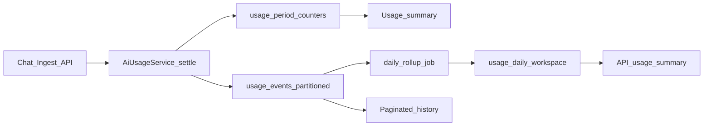

# Usage metering scale plan

**Status:** saved — **execute only as part of Phase 10 (Hardening)**. Do not start before Phase 9 unless explicitly requested.

Canonical parent: [multi-tenant_saas_plan_e28c049c.plan.md](multi-tenant_saas_plan_e28c049c.plan.md) → Phase 10.

## Locked decisions

- **Stay on Postgres** for all metering (no ClickHouse/BigQuery in this pass).
- **Quotas stay on [`usage_period_counters`](../../apps/api/app/usage/models.py)** + reservations — never recompute limits by scanning `usage_events`.
- **`usage_events` remains append-only telemetry** (cost, family, attribution). Writes stay in the same DB transaction as settle ([`record_openrouter_event`](../../apps/api/app/usage/openrouter_billing.py)).
- **Hot retention: 13 months** of raw events. Older partitions dropped by Celery.
- **Customer UI never needs full-table scans**: history paginated; period summaries read rollups or counters.
- **Fully automated after normal deploy**: Alembic on API boot + Celery Beat (new Compose service).

## Current gaps

| Path | Today | Problem at millions |
|------|--------|---------------------|
| Quota / summary | counters | OK — keep |
| API usage summary | `SUM`/`GROUP BY` on events | Full range scan per request |
| Usage history | `UNION ALL` + filter + `COUNT` | Weak `(workspace_id, created_at)` path |
| Schema | Single heap | No time pruning |
| Schedules | Worker only, no Beat | Periodic jobs never fire |

## Work packages (Phase 10)

1. **A — Indexes:** `(workspace_id, created_at DESC)` on `usage_events`; verify credit ledger workspace+created index.
2. **C — Rollups:** `usage_daily_workspace`; Beat daily upsert; `ApiActivityService.summarize` reads rollups.
3. **B — Partition:** monthly `RANGE (created_at)` via Alembic on deploy; PK `(id, created_at)`.
4. **D — Beat + retention:** Compose `celery_beat`; ensure partitions / rollup / drop older than `USAGE_EVENTS_RETENTION_MONTHS` (default 13).
5. **E — Hygiene:** `cost_metadata` allowlist; max history date window (~90 days per request).

## Acceptance (Phase 10)

- Quota checks remain O(1) via counters under load.
- API usage summary at 30d stays fast with ≥1M events in fixture DB.
- Workspace history (limit 50) uses indexed time range per tenant.
- Raw table size bounded by 13-month partitions.
- `docker compose up` alone applies schema and starts Beat; no manual SQL or cron.

## Ownership

- **Agent:** migrations, app/Beat code, Compose beat service, tests, defaults.
- **You:** normal deploy only (`docker compose up -d`). First upgrade after partition migration may be slower (still automatic).
