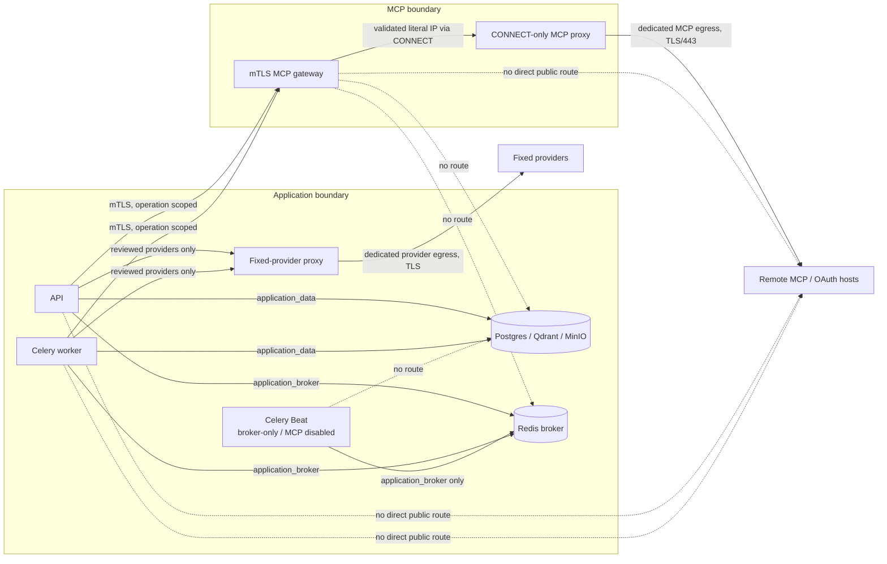

# MCP Connectors: configuration and isolation runbook

This guide is the production operator runbook for Geem MCP Connectors. It explains
how to configure the paid MCP Connectors App, deploy its isolated outbound
boundary, connect tenant-owned remote MCP servers, and prove that the boundary
is working before publication.

For a fresh installation, start with the
[shared-Linux-server deployment guide](../deployment.md#fresh-geem-installation-on-a-shared-linux-server).
That guide owns the Geem-only removal boundary, maintenance control, source and
image pinning, tunnel lifecycle, fresh datastore provisioning, startup, and
traffic release. This document supplies the MCP-specific configuration and
security contract used by that installation.

Geem is the model-owning MCP **client/host**. The remote server executes tools;
Geem owns model selection, discovery, authorization, the tool loop, metering,
approvals, and delivery. MCP Connectors does not expose Geem as an MCP server, run
local MCP processes, support `stdio`, or allow private-network targets.

The normative product and protocol contract remains the
[MCP product plan](../../.cursor/plans/mcp.plan.md). This runbook is the operational
companion to that plan and to the [deployment guide](../deployment.md).

## Release state and non-negotiable gates

The MCP-scoped reconciler creates a missing production catalog row as
`coming_soon`, but deliberately preserves the status of any existing row. An
existing row in any other state is a stop condition: obtain separate Platform
Admin lifecycle approval and restore `coming_soon` before enabling the runtime
flag. A `coming_soon` App cannot be checked out, installed, or admitted at runtime, so
paid release testing must use a separate release-candidate environment with the
same production topology, signed plans, and a deliberately **published** RC
catalog row. Production API and worker must keep
`MCP_CONNECTOR_ENABLED=false` until that RC passes for the exact release SHA and
image manifest. After RC sign-off, enable production under the controlled gate
below, verify it while the row remains `coming_soon`, and only then publish
through Platform Admin. Do not temporarily bypass status checks or invent
zero/placeholder prices to make testing succeed.

The locked production product is:

| Plan code | Connections | Tool calls/day | Billing |
| --- | ---: | ---: | --- |
| `mcp-starter` | 1 | 200 | Monthly, SAR, positive signed price |
| `mcp-team` | 3 | 1,000 | Monthly, SAR, positive signed price |
| `mcp-scale` | 10 | 5,000 | Monthly, SAR, positive signed price |

Exactly one plan must be the default. Plan order must be Starter, Team, Scale.
`app.apps_catalog.publication.validate_mcp_connectors_publish_ready()` enforces
these values, the configured `mcp_remote` adapter, and
`MCP_CONNECTOR_ENABLED=true` when an administrator publishes the App.

Do not promote MCP Connectors while any of these conditions is true:

- `MCP_CONNECTOR_ENABLED` is true before the isolated gateway is proven.
- Production `MCP_CONNECTOR_ENABLED` is true before the production-topology RC
  and paid-product gate is signed off for the exact release.
- The UAT overlay is being used as isolation evidence. It deliberately gives
  the gateway direct public egress and sets its mode to `local`.
- API, worker, or gateway can open an unaudited direct public socket.
- The gateway can reach Postgres, Redis, Qdrant, MinIO, a cloud metadata
  endpoint, or any deployment-owned network.
- A public MCP endpoint needs a port other than TCP 443. The production Squid
  policy dispatches CONNECT only to port 443.
- A write has an unresolved `outcome_unknown`, or an external response has an
  unresolved delivery-unknown record.
- The exact paid checkout, renewal, installation, discovery, approval, and
  Workspace/API/Widget/direct-WhatsApp canary has not passed.

Treat an unintended secret injection, successful forbidden network probe,
unknown image/policy checksum, or suspected unauthorized access as a security
incident. Stop promotion, preserve redacted evidence, prevent automatic
recreation, and invoke incident response. Do not dump container environments or
rotate encryption/datastore credentials ad hoc; follow the incident path under
[Emergency containment](#emergency-containment).

### Release compatibility blockers and gates

These are operationally significant and must not be hidden by the runbook:

1. Production must install the complete tracked `geem-production` systemd
   artifact set. Historical `geem-stack` units and raw two-file Compose starts
   omit the hardened MCP profile and must not be used.
2. Older Compose releases let Celery Beat inherit the full application
   environment. The approved exact SHA and final overlay must run
   `app.worker.beat_app:beat_app` with exactly `APP_ENV=production`, the
   internal `REDIS_URL`, and `MCP_CONNECTOR_ENABLED=false`. Beat receives no
   `env_file`, database/Qdrant/MinIO/provider/MCP variables, secret mounts, or
   network beyond the dedicated `application_broker`; `beat.deploy.replicas` and live Beat
   cardinality must both equal one.
3. Older Workspace builds send a WhatsApp `AppConnection.id` where the API
   requires the exact internal `ChannelBinding.id`. The approved exact SHA must
   include the UI/API contract fix and its unit/E2E evidence. Never guess or
   substitute one identifier for the other, and do not combine a fixed backend
   with an older frontend artifact.
4. Older MCP proxy images use only a static broad deny layer and do not ingest
   deployment CIDRs. The approved release must include the fail-closed proxy
   renderer, set `MCP_PROXY_REQUIRE_BLOCKED_NETWORKS=true`, prove its canonical
   set equals gateway `MCP_EGRESS_BLOCKED_NETWORKS`, and pass live parity probes
   for every reviewed class/range.
5. `infra/docker-compose.yml` is a development baseline. It contains known
   Postgres/MinIO credentials and host-published ports; the tunnel overlay does
   not remove them. Never use base + tunnel alone as a production deployment.
6. Invalid shared-egress topologies place app proxy, MCP proxy, and Cloudflared on one
   public bridge, allowing those peers to reach the unauthenticated MCP proxy.
   The approved exact SHA must split provider, MCP, and ingress outbound
   networks and prove exactly one authorized service on each.

## Supported production contract

- Remote, publicly routable HTTPS MCP servers only; deployed dispatch uses
  destination port 443.
- MCP `2026-07-28` is primary. Reviewed fallbacks, in this exact order, are
  `2025-11-25` Streamable HTTP and `2024-11-05` HTTP+SSE.
- Tools only. Prompts, resources, roots, sampling, Tasks, and elicitation are
  rejected.
- Authentication is none, one restricted static header, or MCP OAuth 2.1 with
  PKCE S256 and resource binding.
- OAuth registration is CIMD, pre-registered credentials, or Dynamic Client
  Registration.
- Only `Authorization`, `X-API-Key`, and `X-Auth-Token` are accepted as static
  authentication headers. For `Authorization`, a value without a scheme is
  normalized to `Bearer <value>`.
- Workspace-owned Experts only. Platform Experts cannot receive tenant MCP
  grants.
- One tool call per model iteration. Parallel tool calls fail closed.
- Unknown or incompatible tools are visible in inventory but never execute.
- Widget and WhatsApp are exact, default-off surface bindings. External users
  can never approve a write.

## Isolation architecture



The gateway resolves each tenant-derived hostname, rejects the entire answer
set if any address is unsafe, and asks Squid to CONNECT to the validated literal
IP. The original hostname is retained for HTTP `Host`, TLS SNI, and certificate
verification. A real dispatch resolves again; successful preflight is not a
durable allow decision. Redirect targets are revalidated separately and
cross-origin authorization is removed.

The gateway receives only an operation-scoped canonical target, bounded MCP or
OAuth payload, deadline, and ephemeral authentication material. It receives no
`/etc/geem/production.env`, database/Redis URL, JWT key, provider key, or credential
encryption key. It does not persist payloads or emit URL/body access logs.

### Compose network map

| Service | Networks | Public route | MCP role |
| --- | --- | --- | --- |
| API | data, broker, ingress, fixed-provider control, MCP control | No direct route | mTLS gateway client |
| Worker | data, broker, fixed-provider control, MCP control | No direct route | mTLS gateway client; ID-only jobs |
| Beat | broker only | No | Broker-only scheduler using `beat_app`; exact three-variable environment and no secrets |
| Redis | broker only | No | Internal Celery broker |
| PostgreSQL, Qdrant, MinIO | data only | No | No MCP access |
| MCP gateway | MCP control, MCP proxy control | No direct route | URL/DNS/TLS/protocol enforcement |
| MCP proxy | MCP proxy control, dedicated MCP public egress | Yes | CONNECT/443 with independent address denies |
| App proxy | fixed-provider control, dedicated provider egress | Yes | Fixed reviewed provider hosts only |
| Cloudflared | ingress, dedicated ingress public egress | Yes | Inbound application tunnel, not MCP |

The data/broker/control/ingress networks are `internal: true`. The three external-route
networks are separate: `application_provider_egress` contains only the app
proxy, `mcp_public_egress` only the MCP proxy, and `public_egress` only the
reviewed ingress service (Cloudflared in this topology). This prevents a
compromised app proxy or ingress peer from reaching the unauthenticated MCP
proxy over a shared public bridge. Neither MCP service publishes a host port.
API and worker set `HTTP_PROXY`/`HTTPS_PROXY` to the fixed-provider proxy, while
the MCP gateway client uses `trust_env=False`; ordinary proxy variables cannot
silently intercept or bypass MCP mTLS.
Tenant-selected MCP or OAuth hosts must never be added to the fixed-provider
proxy allowlist; they belong exclusively behind the MCP gateway.

Compose runs the gateway as UID 10001 with a read-only root filesystem, a
small no-exec `/tmp`, all capabilities dropped, `no-new-privileges`, and bounded
PID/memory limits. Its image contains the gateway package and the shared
transport-neutral outbound policy, not the application source tree. The root
`.dockerignore` excludes `.env*`, PKI, tunnel credentials, and `samples/` from
the build context. Preserve these controls when changing the image or
orchestrator.

The checked-in MCP proxy has no proxy authentication or source ACL. Its current
protection is exclusive membership in `mcp_public_egress`, its separate
`mcp_proxy_control` ingress, and no published port. Never attach the app proxy,
Cloudflared, or another workload to either MCP network. Where the deployment
threat model requires an independent source restriction, add and verify a
binding/firewall/source ACL before release. Do not describe the proxy policy as
identical to Python's complete non-global-address policy: it is an independent
broad second layer.

## MCP production configuration procedure

The commands below assume the fresh release is staged and the operator starts
at its repository root. Complete the deployment guide's
[Geem-only host inventory and removal boundary](../deployment.md#fresh-geem-installation-on-a-shared-linux-server)
before using them. Use the fixed production Compose project name and the same
file set throughout. Never select, stop, remove, or relabel containers from an
unrelated project on the shared server.

The checked-in `docker-compose.yml` is a development topology source, not a
production file. `docker-compose.tunnel.yml` supplies Geem's production domain
and baked frontend overrides, but it does not replace development datastore
credentials or close host ports. The examples therefore require the reviewed
[`docker-compose.production-hardening.example.yml`](../../infra/docker-compose.production-hardening.example.yml)
copied byte-for-byte to `/etc/geem/docker-compose.production-hardening.yml` and
applied last by the fixed wrapper. Do not run the `up`
command until that overlay satisfies the hardening checklist in step 5 and the
fresh-install guide's
[production configuration and secret gate](../deployment.md#5-prepare-production-configuration-and-secrets).

Set the fixed project name explicitly before inventory, start, inspect, and
smoke commands. Do not substitute a shared or unrelated project name:

```bash
export COMPOSE_PROJECT_NAME=geem-production
export GEEM_PUBLIC_API_ORIGIN=<approved-public-api-https-origin-without-trailing-slash>
cd infra
```

`GEEM_PUBLIC_API_ORIGIN` is the single approved public API origin for this
release. It has no trailing slash. Derive `APP_URL`, CIMD/client metadata, OAuth
callback registration, RC/production readiness probes, and every operator API
request from it; do not repeat a hard-coded API host elsewhere in the runbook.

The deployment guide creates new, explicitly named datastore volumes and proves
that the project name, volume names, networks, and tunnel belong only to Geem.
This MCP runbook does not authorize host-wide Docker cleanup, Docker Engine
removal, pruning, or changes to another project's containers, networks,
volumes, tunnel, DNS, services, or files.

### 1. Prepare application prerequisites

Before turning on MCP, the normal SaaS stack must already have:

- `APP_ENV=production` and `AUTH_REQUIRED=true`;
- public HTTPS `APP_URL` and `WORKSPACE_WEB_URL` values;
- a strong, dedicated `SECRETS_ENCRYPTION_KEY` for connector credentials,
  OAuth tokens, pending arguments, and resumable loop state;
- `OPENROUTER_API_KEY` plus reviewed primary and fallback model IDs;
- for the direct-WhatsApp release canary, `OPENWA_BASE_URL`, a non-empty
  `OPENWA_API_KEY`, and a reviewed `OPENWA_TIMEOUT_SECONDS`;
- PostgreSQL migrations through `0041_openwa_binding_backfill`;
- healthy Postgres, Redis, Qdrant, MinIO, API, and worker services;
- the normal billing provider and paid App installation flow configured.

Keep `MCP_CONNECTOR_ENABLED=false` during migration, PKI provisioning, and all
negative isolation tests.

### 2. Provision dedicated mTLS PKI

Use an internal PKI or deployment secret manager in production. The host secret
directory must have exactly this shape:

```text
<MCP_EGRESS_PKI_DIR>/
├── ca/
│   └── ca.crt
├── server/
│   ├── server.crt
│   └── server.key
└── client/
    ├── client.crt
    └── client.key
```

Requirements:

- The server certificate SAN contains `mcp-egress-gateway`.
- The server leaf is valid for server authentication and the client leaf for
  client authentication.
- The CA and client certificates are mode `0644`; the root-owned client key is
  `0400`. The root-owned gateway certificate and key are group `10001` mode
  `0440`, so the gateway can read but cannot replace them.
- The gateway server identity is actually readable as container UID/GID
  `10001`.
  Host ownership is more portable than relying on Compose file-secret UID/GID
  behavior.
- API and worker receive the client key only. The gateway receives the server
  key only. Beat receives neither.
- The checked-in Compose topology shares one client identity between API and
  worker. It authenticates the application boundary, not an individual process.
- The listener accepts client leaves signed by its configured client CA. Protect
  that CA and issue only narrowly scoped application-boundary identities.
- Use a distinct CA and identities per environment. Never reuse application
  JWT/encryption keys, provider credentials, tunnel credentials, or a public web
  certificate.
- Never deploy or mount the CA private key.

Set the host path for Compose interpolation, then verify the chain, SAN, expiry,
and matching public keys before starting containers:

```bash
export MCP_EGRESS_PKI_DIR=/etc/geem/mcp-egress/pki

openssl verify \
  -CAfile "$MCP_EGRESS_PKI_DIR/ca/ca.crt" \
  -purpose sslserver \
  "$MCP_EGRESS_PKI_DIR/server/server.crt"

openssl verify \
  -CAfile "$MCP_EGRESS_PKI_DIR/ca/ca.crt" \
  -purpose sslclient \
  "$MCP_EGRESS_PKI_DIR/client/client.crt"

openssl x509 \
  -in "$MCP_EGRESS_PKI_DIR/server/server.crt" \
  -noout -checkhost mcp-egress-gateway

openssl x509 \
  -in "$MCP_EGRESS_PKI_DIR/server/server.crt" \
  -noout -checkend 2592000
openssl x509 \
  -in "$MCP_EGRESS_PKI_DIR/client/client.crt" \
  -noout -checkend 2592000
openssl x509 \
  -in "$MCP_EGRESS_PKI_DIR/ca/ca.crt" \
  -noout -checkend 2592000
```

`2592000` is 30 days. The two `verify` commands, SAN check, and all three
server/client/CA expiry checks must succeed. Include every intermediate in the
same rotation-window review. Compare the certificate and key public-key digests
if the gateway reports a key mismatch:

```bash
openssl x509 -in "$MCP_EGRESS_PKI_DIR/server/server.crt" -pubkey -noout \
  | openssl pkey -pubin -outform DER | openssl dgst -sha256
openssl pkey -in "$MCP_EGRESS_PKI_DIR/server/server.key" -pubout -outform DER \
  | openssl dgst -sha256
```

The two digests must match. Repeat for the client pair. See the
[PKI layout note](../../infra/mcp-egress/pki/README.md) for the repository
contract. The current base Compose mounts the client files into API/worker even
while the feature is disabled, so provision them before recreating the base
stack.

### 3. Configure the application and gateway

Copy the MCP section from [`.env.example`](../../.env.example) into the
root-owned `/etc/geem/production.env`. This baseline uses Geem's checked-in
production hosts;
release-candidate/custom-domain deployments must replace all related hosts
consistently through their final overlay. Replace the example CIDRs with actual
deployment ranges and keep the switch off initially:

```dotenv
APP_ENV=production
AUTH_REQUIRED=true
APP_URL=<exact-value-of-GEEM_PUBLIC_API_ORIGIN>
WORKSPACE_WEB_URL=https://hub.geem.ai
# Use a dedicated secret-manager value. Do not derive it from JWT_SECRET.
SECRETS_ENCRYPTION_KEY=<secret-manager-value>

OPENROUTER_API_KEY=<secret-manager-value>
OPENROUTER_CHAT_MODEL=qwen/qwen3.8-max
OPENROUTER_CHAT_FALLBACK_MODEL=openai/gpt-5.6-terra

# Required only for the direct-WhatsApp release surface.
OPENWA_BASE_URL=https://whatsapp-hub.dalseen.sa
OPENWA_API_KEY=<secret-manager-value>
OPENWA_TIMEOUT_SECONDS=30

# Host-side Compose secret source, not a container mount path.
MCP_EGRESS_PKI_DIR=/etc/geem/mcp-egress/pki

MCP_CONNECTOR_ENABLED=false
MCP_SUPPORTED_PROTOCOL_VERSIONS=2026-07-28,2025-11-25,2024-11-05
MCP_CLIENT_METADATA_URL=<exact-value-of-GEEM_PUBLIC_API_ORIGIN>/api/connectors/oauth/mcp_remote/client-metadata.json

MCP_EGRESS_GATEWAY_URL=https://mcp-egress-gateway:8443
MCP_EGRESS_APP_ENV=production
MCP_EGRESS_PROXY_URL=http://mcp-egress-proxy:3128
MCP_EGRESS_CLIENT_CERT_FILE=/run/secrets/mcp-egress/client.crt
MCP_EGRESS_CLIENT_KEY_FILE=/run/secrets/mcp-egress/client.key
MCP_EGRESS_CA_CERT_FILE=/run/secrets/mcp-egress/ca.crt
MCP_EGRESS_BLOCKED_NETWORKS=10.42.0.0/16,172.30.0.0/16
MCP_ALLOW_PRIVATE_EGRESS=false
MCP_PROXY_REQUIRE_BLOCKED_NETWORKS=true

MCP_EGRESS_MAX_REQUEST_BYTES=65536
# Tool inventories include tool JSON Schemas and can be substantially larger
# than individual runtime results. This 256 KiB default remains bounded; the
# gateway enforces an absolute 1 MiB ceiling for operator overrides.
MCP_EGRESS_MAX_RESPONSE_BYTES=262144
MCP_EGRESS_CONNECT_TIMEOUT_SECONDS=5
MCP_EGRESS_READ_TIMEOUT_SECONDS=20
MCP_EGRESS_TOTAL_TIMEOUT_SECONDS=30
MCP_MAX_REDIRECTS=3

MCP_LEGACY_SESSION_TTL_SECONDS=300
MCP_MAX_LEGACY_SESSIONS=64
MCP_MAX_TOOL_PAGES=64
MCP_MAX_CONCURRENT_OPERATIONS=128
MCP_MAX_DISCOVERED_TOOLS=512

MCP_MAX_TOOL_ITERATIONS=5
MCP_MAX_TOOLS_PER_EXPERT=32
MCP_TOOL_INVENTORY_TTL_SECONDS=300
MCP_TOOL_CALL_TIMEOUT_SECONDS=20
MCP_TOTAL_TURN_TIMEOUT_SECONDS=120
MCP_TOOL_RESULT_MAX_BYTES=32768
MCP_TOOL_RESULT_MAX_CHARS=8000
MCP_TOOL_APPROVAL_TTL_SECONDS=900
MCP_MAX_EXTERNAL_PENDING_PER_WORKSPACE=100

MCP_TOOL_PROVIDER_CAPABILITY_MATRIX='{"qwen/qwen3.8-max":["function_calling","parallel_tool_calls_false"],"openai/gpt-5.6-terra":["function_calling","parallel_tool_calls_false"]}'
```

If CIMD is not part of the deployment, leave `MCP_CLIENT_METADATA_URL` empty.
If it is enabled, it must be the public HTTPS URL of Geem's exact CIMD route;
the URL itself is used as the OAuth client identifier.

`MCP_EGRESS_PROXY_URL` is the application's required declaration of the
isolated proxy origin; URL-shape validation alone is not isolation attestation.
API and worker inherit it from `/etc/geem/production.env`, but it is **not**
their general
`HTTP_PROXY`. The checked-in base Compose independently hardcodes
`EGRESS_FORWARD_PROXY_URL=http://mcp-egress-proxy:3128` for the gateway; it does
not interpolate `MCP_EGRESS_PROXY_URL`. If a deployment changes the proxy
service name or port, change both declarations and prove the resulting route.
The gateway does not receive `/etc/geem/production.env` wholesale.

The checked-in tunnel overlay is specific to the approved Geem production
hosts; it overrides application URLs and frontend build arguments. A
release-candidate deployment must provide a later overlay that consistently
replaces API/worker `APP_URL`,
`WORKSPACE_WEB_URL`, `MCP_CLIENT_METADATA_URL`, frontend build arguments, and
Cloudflared configuration. Never combine an `api.example` CIMD URL with the
unmodified Geem tunnel overlay.

#### Settings reference

| Setting | Production rule |
| --- | --- |
| `MCP_CONNECTOR_ENABLED` | Start `false`; production turns on only after live isolation, persistence, monitoring, blocker closure, and signed RC approval. |
| `MCP_SUPPORTED_PROTOCOL_VERSIONS` | Exact reviewed order; no untested revisions. |
| `MCP_CLIENT_METADATA_URL` | Optional public HTTPS CIMD route; empty disables CIMD. |
| `MCP_EGRESS_GATEWAY_URL` | Internal HTTPS origin only; no path, query, fragment, or userinfo. Outside local/test the host is exactly `mcp-egress-gateway` or ends in `.internal`, `.svc`, or `.svc.cluster.local`. |
| `MCP_EGRESS_APP_ENV` | `production` for the isolated Compose gateway. |
| `MCP_EGRESS_PROXY_URL` | Internal plain-HTTP proxy origin with an explicit port; never public. The same internal-host allowlist as the gateway applies. |
| Client cert/key/CA file settings | Container mount paths readable by API and worker. |
| `MCP_EGRESS_BLOCKED_NETWORKS` | Every Docker, VPC, host-routed, corporate, and deployment-owned CIDR that tenants must not reach. |
| `MCP_ALLOW_PRIVATE_EGRESS` | Always `false` outside explicit local/test fixtures; startup rejects otherwise. |
| `MCP_PROXY_REQUIRE_BLOCKED_NETWORKS` | `true`; proxy startup must fail if the canonical deployment CIDR set is empty. |
| Request/response byte limits | Bound gateway ingress and remote response bodies before parsing. |
| Connect/read/total egress timeouts | Total must be at least connect; the gateway charges all transit and lock time against the earlier deadline. |
| Legacy session TTL/count | Bound in-memory legacy Streamable HTTP/SSE state. TTL is non-sliding. |
| Page/tool/concurrency limits | Bound inventory pagination, discovered inventory, and simultaneous gateway work. Keep pages at 64 until the API and gateway setting are unified. |
| Iteration/tool-result/turn limits | Bound the Geem-owned model loop and model-visible result. Total turn must be at least tool-call timeout. |
| Approval TTL/pending cap | Bound paused write approvals and outstanding external work per Workspace. |
| Capability matrix | Both exact configured model IDs must declare `function_calling` and `parallel_tool_calls_false`. |

Startup fails closed when these relationships are invalid. Do not increase a
limit merely to make a hostile or incompatible server work; first review its
wire behavior, payload size, pagination, and latency.

For a direct, non-Compose gateway deployment, map the reviewed values to the
gateway-native `EGRESS_*` names in
[`gateway/config.py`](../../apps/mcp_egress_gateway/gateway/config.py). Also set
`EGRESS_BIND_PORT=8443`, `EGRESS_SERVER_CERT_FILE`,
`EGRESS_SERVER_KEY_FILE`, `EGRESS_CLIENT_CA_FILE`,
`EGRESS_FORWARD_PROXY_URL`, `EGRESS_MAX_HEADER_BYTES=16384`, and
`EGRESS_MAX_HEADERS=64`. Bind only the private workload interface where the
orchestrator supports it. If `EGRESS_BIND_HOST=0.0.0.0` is required inside a
pod/container, a same-step default-deny ingress policy must allow only API and
worker, and no public Service/load balancer/host port may expose 8443.
Production startup requires a forward proxy.

### 4. Inventory and block deployment networks

Standard private, loopback, link-local, metadata, CGNAT, multicast, mapped,
transition, reserved, and non-global addresses are already rejected in code.
`MCP_EGRESS_BLOCKED_NETWORKS` adds deployment-specific ranges and documents the
operator's intent.

The independent Squid boundary renders the tracked
[`static-deny-networks.txt`](../../infra/mcp-egress/proxy/static-deny-networks.txt)
as data before it renders deployment CIDRs. Its IPv6 policy conservatively
allows only global-unicast `2000::/3`, then blocks reviewed non-global ranges
inside that space. `2001::/23` intentionally overblocks its few globally
routable exceptions; relaxing it requires a reviewed manifest, Python-policy
parity tests, proxy-image rebuild, and live positive/negative evidence.

Prefer reviewed, explicit, non-overlapping IPAM subnets in the production
overlay. Build one canonical normalized CIDR manifest from all nine final
Compose subnets plus Docker defaults, host bridges, VPC/cloud, corporate,
internal-public, metadata, and other deployment-owned ranges. If networks
already exist, list their actual subnets without rendering
`/etc/geem/production.env`. Before the first MCP-enabled start, zero means the
reviewed overlay will
create that logical network; more than one is always fatal. After start, set
`GEEM_REQUIRE_ALL_NETWORKS=true` so every logical name must resolve to exactly
one project network:

```bash
: "${COMPOSE_PROJECT_NAME:?export the exact deployed Compose project name}"
: "${GEEM_REQUIRE_ALL_NETWORKS:=false}"

for logical_network in \
  application_data application_broker application_ingress \
  application_provider_control application_provider_egress \
  mcp_egress_control mcp_proxy_control mcp_public_egress public_egress; do
  network_ids=$(docker network ls \
    --filter "label=com.docker.compose.project=$COMPOSE_PROJECT_NAME" \
    --filter "label=com.docker.compose.network=$logical_network" \
    --format '{{.ID}}')
  network_count=$(printf '%s\n' "$network_ids" | sed '/^$/d' | wc -l)
  test "$network_count" -le 1 || {
    printf 'expected at most one %s network, found %s\n' "$logical_network" "$network_count" >&2
    exit 1
  }
  if [ "$network_count" -eq 0 ]; then
    if [ "$GEEM_REQUIRE_ALL_NETWORKS" = true ]; then
      printf 'expected one %s network after start, found zero\n' "$logical_network" >&2
      exit 1
    fi
    printf '%s: absent (will be created from reviewed IPAM)\n' "$logical_network"
    continue
  fi
  network_id=$network_ids
  printf '%s: ' "$logical_network"
  docker network inspect "$network_id" \
    --format '{{range .IPAM.Config}}{{printf "%s " .Subnet}}{{end}}{{println}}'
done
```

Before start, normalize and compare every existing subnet with the approved
manifest; an absent future network is not drift because the exact-image
validator separately proves its declared IPAM and policy coverage. Multiple
matches, overlap, or drift is a stop condition. After start, rerun with
`GEEM_REQUIRE_ALL_NETWORKS=true`; zero is then also a stop condition.

The overlay feeds the same `MCP_EGRESS_BLOCKED_NETWORKS` value to gateway
`EGRESS_BLOCKED_NETWORKS` and proxy `MCP_PROXY_BLOCKED_NETWORKS`. The immutable
proxy entrypoint validates/canonicalizes that data and renders corresponding
Squid denies before start; `MCP_PROXY_REQUIRE_BLOCKED_NETWORKS=true` makes an
empty set fatal. The exact-image topology validator proves normalized set
equality and required coverage before start, and the live 200/403 probes prove
both layers afterward. Deploy the value, proxy/gateway images, and checksums as
one atomic policy release while the boundary is stopped. Never patch only one
layer after IPAM drift.

Explicit IPAM is mandatory because the exact-image validator must prove complete
coverage before start. If deterministic, non-overlapping subnets cannot be
allocated, stop and redesign the topology rather than bootstrapping a boundary
with an unknown or partially blocked set. After start, rerun the command above
and require actual subnets to match the declarations exactly.

### 5. Install the production hardening overlay

Copy the selected release's reviewed
[`docker-compose.production-hardening.example.yml`](../../infra/docker-compose.production-hardening.example.yml)
byte-for-byte to `/etc/geem/docker-compose.production-hardening.yml` as required
by the deployment guide. It is a required production input, not an optional MCP
convenience overlay. Its effective model must:

- replace `rag/rag` with secret-manager-backed Postgres credentials and override
  API and worker `DATABASE_URL` with the matching encoded URL; Beat must not
  receive `DATABASE_URL`;
- replace `minio/change-me` in MinIO, the application settings, and `minio-init`
  with the same secret-backed values;
- reset the inherited whole-application `env_file` from MinIO and `minio-init`;
  they receive only explicit MinIO values, while gateway/proxies receive no
  application environment at all;
- pin configurable services to approved local raw `sha256:<64-hex>` image IDs,
  retain the reviewed registry digest for `minio-init`, set `pull_policy: never`
  on every service, and remove every production `build:` fallback;
- use the exact new PostgreSQL, Redis, Qdrant, and MinIO physical volume names
  provisioned and recorded by the fresh-install guide, with their required mount
  destinations;
- remove every inherited host port publication. The production validator rejects
  host ports on all services, including API, MinIO, every frontend, gateway, and
  both proxies;
- keep API/worker/gateway off every external-route network and preserve the
  network map above;
- give app proxy, MCP proxy, and ingress three separate external-route networks
  with exactly one authorized service on each;
- run Beat through `app.worker.beat_app:beat_app` with only
  `APP_ENV=production`, the internal `REDIS_URL`, and
  `MCP_CONNECTOR_ENABLED=false`; reset its inherited `env_file`, mounts, and
  secrets, and attach it only to the dedicated internal broker network;
- set `beat.deploy.replicas: 1` and prove exactly one running Beat container;
  duplicate schedulers can enqueue the same periodic work more than once;
- run exactly one MCP gateway replica while sessions remain in memory;
- preserve the baked, no-reload production commands and remove development bind
  mounts;
- replace the Cloudflared host bind with the exact reviewed Compose config and
  secret objects below; proxy policy remains immutable image content; and
- provide the exact effective public API, Workspace, CIMD, frontend-build, and
  tunnel domains for this environment.

Workspace, Platform Admin, marketing, and Cloudflared are required Compose
services in this release contract. An outside-Compose static bundle or alternate
ingress is not an equivalent deployment and must stop promotion.

This abbreviated fragment explains security-sensitive override keys; it is not
a deployable file and intentionally omits repeated `pull_policy: never` lines.
The tracked template is authoritative and must be copied byte-for-byte. The
fragment deliberately does not override the
approved release's fail-closed MinIO entrypoints. The digest-pinned
`minio-init` image/command must bound every network operation, enforce a finite
overall retry budget, use supported client deadlines, and verify bucket/policy
state. If the exact release lacks that behavior, stop rather than replacing it
with an improvised production shell:

```yaml
services:
  postgres:
    image: ${POSTGRES_IMAGE:?required immutable local image ID}
    environment:
      POSTGRES_USER: ${POSTGRES_USER:?required}
      POSTGRES_PASSWORD: ${POSTGRES_PASSWORD:?required}
      POSTGRES_DB: ${POSTGRES_DB:?required}

  redis:
    image: ${REDIS_IMAGE:?required immutable local image ID}

  qdrant:
    image: ${QDRANT_IMAGE:?required immutable local image ID}

  minio:
    image: ${MINIO_IMAGE:?required immutable local image ID}
    env_file: !reset []
    environment:
      APP_ENV: production
      MINIO_ROOT_USER: ${MINIO_ACCESS_KEY:?required}
      MINIO_ROOT_PASSWORD: ${MINIO_SECRET_KEY:?required}
    ports: !reset []

  minio-init:
    env_file: !reset []
    environment:
      APP_ENV: production
      MINIO_ACCESS_KEY: ${MINIO_ACCESS_KEY:?required}
      MINIO_SECRET_KEY: ${MINIO_SECRET_KEY:?required}
      MINIO_BUCKET: ${MINIO_BUCKET:-rag-documents}

  api:
    build: !reset null
    image: ${GEEM_API_IMAGE:?required immutable local image ID}
    environment:
      DATABASE_URL: ${DATABASE_URL:?required}
    ports: !reset []
    volumes: !reset []

  worker:
    build: !reset null
    image: ${GEEM_API_IMAGE:?required immutable local image ID}
    environment:
      DATABASE_URL: ${DATABASE_URL:?required}
    volumes: !reset []

  beat:
    build: !reset null
    image: ${GEEM_API_IMAGE:?required immutable local image ID}
    env_file: !reset []
    environment: !override
      APP_ENV: production
      REDIS_URL: redis://redis:6379/0
      MCP_CONNECTOR_ENABLED: "false"
    volumes: !reset []
    secrets: !reset []
    command:
      - celery
      - -A
      - app.worker.beat_app:beat_app
      - beat
      - --loglevel=INFO
      - --schedule
      - /tmp/celerybeat-schedule
    deploy:
      replicas: 1

  app-egress-proxy:
    build: !reset null
    image: ${APP_EGRESS_PROXY_IMAGE:?required immutable local image ID}

  mcp-egress-gateway:
    build: !reset null
    image: ${MCP_EGRESS_GATEWAY_IMAGE:?required immutable local image ID}

  mcp-egress-proxy:
    build: !reset null
    image: ${MCP_EGRESS_PROXY_IMAGE:?required immutable local image ID}
    environment:
      MCP_PROXY_BLOCKED_NETWORKS: ${MCP_EGRESS_BLOCKED_NETWORKS:?required}
      MCP_PROXY_REQUIRE_BLOCKED_NETWORKS: "true"

  workspace_web:
    build: !reset null
    image: ${WORKSPACE_WEB_IMAGE:?required immutable local image ID}
    ports: !reset []

  dashboard_web:
    build: !reset null
    image: ${DASHBOARD_WEB_IMAGE:?required immutable local image ID}
    ports: !reset []

  landpage_web:
    build: !reset null
    image: ${LANDPAGE_WEB_IMAGE:?required immutable local image ID}
    ports: !reset []

  cloudflared:
    image: ${CLOUDFLARED_IMAGE:?required immutable local image ID}
    volumes: !reset []
    env_file: !reset []
    environment: !reset {}
    user: "65532:65532"
    command:
      - tunnel
      - --protocol
      - http2
      - --config
      - /etc/cloudflared/config.yml
      - run
    configs:
      - source: cloudflared_config
        target: /etc/cloudflared/config.yml
        uid: "65532"
        gid: "65532"
        mode: 0444
    secrets:
      - source: cloudflared_credentials
        target: /etc/cloudflared/credentials.json
        uid: "65532"
        gid: "65532"
        mode: 0400
    read_only: true
    tmpfs: !reset []
    cap_drop:
      - ALL
    security_opt:
      - no-new-privileges:true
    pids_limit: 64
    mem_limit: 128m

volumes:
  postgres_data:
    external: true
    name: ${POSTGRES_VOLUME_NAME:?required provisioned physical volume}
  redis_data:
    external: true
    name: ${REDIS_VOLUME_NAME:?required provisioned physical volume}
  qdrant_data:
    external: true
    name: ${QDRANT_VOLUME_NAME:?required provisioned physical volume}
  minio_data:
    external: true
    name: ${MINIO_VOLUME_NAME:?required provisioned physical volume}

configs:
  cloudflared_config:
    file: /etc/geem/cloudflared/config.yml

secrets:
  cloudflared_credentials:
    file: /etc/geem/cloudflared/credentials.json

networks:
  application_data:
    internal: true
    ipam: {config: [{subnet: <reviewed-application-data-cidr>}]}
  application_broker:
    internal: true
    ipam: {config: [{subnet: <reviewed-application-broker-cidr>}]}
  application_ingress:
    internal: true
    ipam: {config: [{subnet: <reviewed-application-ingress-cidr>}]}
  application_provider_control:
    internal: true
    ipam: {config: [{subnet: <reviewed-provider-control-cidr>}]}
  application_provider_egress:
    internal: false
    ipam: {config: [{subnet: <reviewed-provider-egress-cidr>}]}
  mcp_egress_control:
    internal: true
    ipam: {config: [{subnet: <reviewed-mcp-control-cidr>}]}
  mcp_proxy_control:
    internal: true
    ipam: {config: [{subnet: <reviewed-mcp-proxy-control-cidr>}]}
  mcp_public_egress:
    internal: false
    ipam: {config: [{subnet: <reviewed-mcp-public-egress-cidr>}]}
  public_egress:
    internal: false
    ipam: {config: [{subnet: <reviewed-ingress-public-egress-cidr>}]}
```

Docker Compose implements local file-backed configs/secrets as bind mounts; the
`uid`, `gid`, and `mode` fields in the service binding do not remap the source
file on this deployment path. Provision the two Cloudflared files without
printing them, keep root ownership so UID 65532 cannot modify credentials, and
prove that the runtime UID/GID can traverse and read but not write:

```bash
sudo chown root:65532 /etc/geem/cloudflared
sudo chmod 0750 /etc/geem/cloudflared
sudo chown root:65532 \
  /etc/geem/cloudflared/config.yml \
  /etc/geem/cloudflared/credentials.json
sudo chmod 0440 \
  /etc/geem/cloudflared/config.yml \
  /etc/geem/cloudflared/credentials.json

test "$(stat -c '%u:%g:%a' /etc/geem/cloudflared)" = '0:65532:750'
test "$(stat -c '%u:%g:%a' /etc/geem/cloudflared/config.yml)" = '0:65532:440'
test "$(stat -c '%u:%g:%a' /etc/geem/cloudflared/credentials.json)" = '0:65532:440'
sudo -u '#65532' -g '#65532' -- test -r /etc/geem/cloudflared/config.yml
sudo -u '#65532' -g '#65532' -- test -r /etc/geem/cloudflared/credentials.json
sudo -u '#65532' -g '#65532' -- test ! -w /etc/geem/cloudflared/credentials.json
```

The Compose metadata remains mode `0444` for the config and `0400` for the
secret because that is the portable container mount contract. The host checks
above are an additional prerequisite for local Compose and must pass before
rendering or starting the tunnel.

Compose and the container shell both parse embedded programs. Every
container-shell dollar sign must be escaped as `$$`, including
`$${VAR:?checks}`, `$$attempts`, and `$$((...))`. A single `$` asks Compose to
interpolate on the host and can erase a fail-closed check. `env_file: !reset []`
is security-significant: adding an `environment:` map alone does not remove an
inherited `/etc/geem/production.env`.

Use different Postgres and MinIO secrets. Ensure `DATABASE_URL` percent-encodes
reserved password characters and points to the internal `postgres:5432`
service in this topology. The deployment pipeline must explicitly reject
`POSTGRES_PASSWORD=rag`, `MINIO_SECRET_KEY=change-me`, and empty values. The
application values in `/etc/geem/production.env`
`MINIO_ACCESS_KEY`/`MINIO_SECRET_KEY` must match the MinIO root identity shown
here. Prefer a dedicated non-root MinIO application identity when the
deployment has a reviewed provisioning flow for it.

The fresh-install procedure requires newly created, explicitly named volumes.
`POSTGRES_PASSWORD` initializes the role only on that empty Postgres volume;
the matching percent-encoded `DATABASE_URL` must be installed before the first
database or application start. If any selected volume is not empty or has an
unknown owner/reference, stop and return to the deployment guide rather than
trying to repair or reuse it here.

The fixed `/usr/local/sbin/geem-prod-compose` wrapper applies this overlay last
for every production `up`, `stop`, `ps`, and process-manager command; never
invoke a subset of its files directly. Beat's broker-only app can enqueue scheduled task
identifiers while the full worker performs authorized work. Beat must never
load the normal Celery application, `/etc/geem/production.env`,
datastore/provider/MCP
settings, or any secret mount merely to schedule those identifiers.

### 6. Render safely, migrate, and start the boundary

Use the root-owned production wrapper installed by the deployment guide, then
validate Compose syntax without printing expanded secrets. The wrapper fixes
the `geem-production` project, `/etc/geem/production.env`, MCP profile, release
base/tunnel files, and final hardening overlay for every command:

```bash
sudo /usr/local/sbin/geem-prod-compose config --quiet
```

Do not paste expanded production Compose configuration into a terminal transcript or
support ticket; `env_file` values are expanded and may disclose secrets.

Use the exact local `sha256:<64-hex>` IDs tied to the selected successful
production-image publication run and recorded by the fresh-install image
manifest. Do not rebuild or retag them after the manifest is frozen, and do not
run the production wrapper's `pull` command. Before start, stream the merged
JSON into the repository-owned validator in the exact local API image. The
validator gets no deployment environment/`--env-file`, secret, mount, Docker
socket, or network.

Before the first production wrapper `up`, prove that the independent Geem
WAF maintenance control described in
[Start the fresh stack](../deployment.md#9-start-the-fresh-stack) is active and
remains effective when the new tunnel starts or restarts. It must cover only
the approved Geem public hosts and must not stop, modify, reuse, or route
through an unrelated Cloudflared or web service. Keep the hold active through
the partial start, migration, final start, process-manager failure test, and
monitoring gates. A running tunnel is not authorization to release traffic;
release the hold only through
[Release traffic and close maintenance](../deployment.md#11-release-traffic-and-close-maintenance).

The fresh-install procedure has already pulled/built and pinned the images;
never run the production wrapper's `pull` command. This manual command mirrors
the persistent preflight and may be used before the first start:

```bash
GEEM_API_IMAGE="$(sudo sed -n '1p' /etc/geem/api-image-id)"
GEEM_INSTALL_ID="$(sudo sed -n '1p' /etc/geem/install-id)"
sudo /usr/local/sbin/geem-prod-compose config --format json \
  | sudo /usr/bin/docker run --rm -i --pull never --network none --read-only \
      --cap-drop ALL --security-opt no-new-privileges:true \
      --entrypoint python "$GEEM_API_IMAGE" \
      -m app.ops.validate_production_compose \
      --project geem-production \
      --install-id "$GEEM_INSTALL_ID" \
      --mcp-enabled false \
      --allow-local-image-ids \
      --expected-api-image "$GEEM_API_IMAGE" \
      --ingress-service cloudflared \
      --volume postgres_data=<fresh-provisioned-postgres-volume> \
      --volume redis_data=<fresh-provisioned-redis-volume> \
      --volume qdrant_data=<fresh-provisioned-qdrant-volume> \
      --volume minio_data=<fresh-provisioned-minio-volume> \
      --required-blocked-network <reviewed-host-vpc-or-corporate-cidr>
```

Do not issue a generic wrapper `up`: it can include Cloudflared before internal
verification. Continue with the exact service groups, migration/bootstrap
commands, `verify internal`, ingress-last start, and `verify ingress` sequence
in [Start the fresh stack](../deployment.md#9-start-the-fresh-stack). That
deployment section is the sole production lifecycle authority.

Before the first lifecycle command, the fresh deployment guide requires the
fixed `geem-production` project label to be unused after approved old-Geem
removal. Every new service then carries both that project label and the exact
`com.geem.production.install=$GEEM_INSTALL_ID` label. The persistent preflight
rejects an empty/foreign install label, duplicate service container, or
unexpected service; containment selects both identities. Never use either form
of `--remove-orphans`.

`--pull never` ensures the validator code comes from the already-verified exact
image rather than a mutable tag. Do not replace this with a Compose
service-scoped `run`, which can create or join deployment networks. Pass
`--ingress-service cloudflared` exactly once for the reviewed
in-Compose tunnel. This release contract does not approve an external or
alternate ingress; stop and obtain a separately reviewed topology rather than
omitting the flag. Repeat
`--required-blocked-network` for every non-Compose host/VPC/corporate CIDR in
the canonical manifest. Do not insert `tee` or redirect the secret-expanded
JSON.

Do not replace the staged start, mount/readiness gates, one-shot migration, and
normal start above with a direct Compose invocation. If the persistent production
wrapper is not installed, stop and install it through the production guide;
the project-pinned interactive helper is not a process-manager substitute.

The API container runs Alembic before Uvicorn. Confirm the live database is at
the expected head and inspect service state:

```bash
sudo /usr/local/sbin/geem-prod-compose exec -T api alembic current
sudo /usr/local/sbin/geem-prod-compose ps
```

`mcp-egress-gateway` and `mcp-egress-proxy` must be running. `ps` is not
readiness evidence by itself because these two services have no Compose
healthcheck.

Confirm the gateway has no published port. This command must print nothing:

```bash
sudo /usr/local/sbin/geem-prod-compose port mcp-egress-gateway 8443
```

Inspect the actual running containers, not only Compose syntax. The following
prints no secrets; compare every service with the network map in this guide:

```bash
set -euo pipefail

for service in api worker beat postgres redis qdrant minio workspace_web dashboard_web landpage_web app-egress-proxy mcp-egress-gateway mcp-egress-proxy cloudflared; do
  container_ids=$(sudo /usr/local/sbin/geem-prod-compose ps -q "$service")
  container_count=$(printf '%s\n' "$container_ids" | sed '/^$/d' | wc -l)
  test "$container_count" -eq 1 || {
    echo "expected one running $service container, found $container_count" >&2
    exit 1
  }
  container_id=$container_ids
  printf '%s: ' "$service"
  docker inspect "$container_id" \
    --format '{{range $name, $_ := .NetworkSettings.Networks}}{{printf "%s " $name}}{{end}}{{println}}'
done

for service in api minio workspace_web dashboard_web landpage_web mcp-egress-gateway mcp-egress-proxy; do
  container_id=$(sudo /usr/local/sbin/geem-prod-compose ps -q "$service")
  printf '%s host ports: ' "$service"
  docker inspect "$container_id" --format '{{json .HostConfig.PortBindings}}'
done

assert_datastore_mount() {
  service=$1
  target=$2
  expected_volume=$3
  container_ids=$(sudo /usr/local/sbin/geem-prod-compose ps -q "$service")
  container_count=$(printf '%s\n' "$container_ids" | sed '/^$/d' | wc -l)
  test "$container_count" -eq 1 || {
    echo "expected one $service container, found $container_count" >&2
    return 1
  }
  docker inspect "$container_ids" --format '{{json .Mounts}}' \
    | python3 -c '
import json
import sys

service, target, expected = sys.argv[1:]
mounts = [mount for mount in json.load(sys.stdin) if mount.get("Destination") == target]
if len(mounts) != 1:
    raise SystemExit(f"{service} must have exactly one mount at {target}")
mount = mounts[0]
if mount.get("Type") != "volume" or mount.get("Name") != expected:
    raise SystemExit(f"{service} physical volume identity changed")
' "$service" "$target" "$expected_volume"
}

assert_datastore_mount postgres /var/lib/postgresql/data <fresh-provisioned-postgres-volume>
assert_datastore_mount redis /data <fresh-provisioned-redis-volume>
assert_datastore_mount qdrant /qdrant/storage <fresh-provisioned-qdrant-volume>
assert_datastore_mount minio /data <fresh-provisioned-minio-volume>

assert_network_services() {
  logical_network=$1
  shift
  network_ids=$(docker network ls \
    --filter "label=com.docker.compose.project=$COMPOSE_PROJECT_NAME" \
    --filter "label=com.docker.compose.network=$logical_network" \
    --format '{{.ID}}')
  network_count=$(printf '%s\n' "$network_ids" | sed '/^$/d' | wc -l)
  test "$network_count" -eq 1 || {
    echo "expected one $logical_network network, found $network_count" >&2
    return 1
  }
  network_id=$network_ids

  members=$(docker network inspect "$network_id" \
    --format '{{range .Containers}}{{println .Name}}{{end}}')
  seen_services=''
  while IFS= read -r container_name; do
    test -n "$container_name" || continue
    service=$(docker inspect "$container_name" \
      --format '{{index .Config.Labels "com.docker.compose.service"}}')
    seen_services="$seen_services $service"
    allowed=false
    for expected_service in "$@"; do
      test "$service" = "$expected_service" && allowed=true
    done
    $allowed || {
      echo "unexpected $logical_network member: $container_name ($service)" >&2
      return 1
    }
  done <<< "$members"

  for expected_service in "$@"; do
    case " $seen_services " in
      *" $expected_service "*) ;;
      *) echo "missing $logical_network member: $expected_service" >&2; return 1 ;;
    esac
  done
  printf '%s: %s\n' "$logical_network" "$seen_services"
}

assert_network_services application_data \
  postgres qdrant minio api worker
assert_network_services application_broker \
  redis api worker beat
assert_network_services application_ingress \
  api workspace_web dashboard_web landpage_web cloudflared
assert_network_services application_provider_control \
  api worker app-egress-proxy
assert_network_services application_provider_egress \
  app-egress-proxy
assert_network_services mcp_egress_control \
  api worker mcp-egress-gateway
assert_network_services mcp_proxy_control \
  mcp-egress-gateway mcp-egress-proxy
assert_network_services mcp_public_egress \
  mcp-egress-proxy
assert_network_services public_egress \
  cloudflared
```

`minio-init` is a one-shot container and may no longer have a live network
endpoint after it succeeds. Verify its configured `application_data`
membership with the rendered-Compose/static topology test; do not require it
in the live `.Containers` assertion above.

With Cloudflared as ingress, every host-port result must be `{}` or `null`.
The cardinality loop must find exactly one running Beat; zero is unavailable and
more than one permits duplicate periodic dispatch. The rendered validator must
also require `beat.deploy.replicas: 1`.

`application_provider_egress` contains only `app-egress-proxy`,
`mcp_public_egress` only `mcp-egress-proxy`, and `public_egress` only
`cloudflared`. In particular:

- API, worker, Beat, gateway, and datastores must have no external-route network;
- gateway must have only `mcp_egress_control` and `mcp_proxy_control`;
- MCP proxy must have only `mcp_proxy_control` and `mcp_public_egress`;
- app proxy must have only `application_provider_control` and
  `application_provider_egress`;
- Beat and Redis must have only `application_broker`; PostgreSQL, Qdrant, and
  MinIO must have only `application_data`; and
- neither proxy may join `application_data`.

Verify that the running API received the expected public origins without
printing any secret:

```bash
sudo /usr/local/sbin/geem-prod-compose exec -T api python -c '
from app.core.config import get_settings
s = get_settings()
print("APP_URL=" + s.app_url)
print("WORKSPACE_WEB_URL=" + s.effective_workspace_web_url)
print("MCP_CLIENT_METADATA_URL=" + (s.mcp_client_metadata_url or "<disabled>"))
print("MCP_ALLOW_PRIVATE_EGRESS=" + str(s.mcp_allow_private_egress).lower())
'
```

The hosts must match the tunnel/frontend/provider registrations, and private
egress must print `false`. Retain secret-manager evidence that the running
Postgres password is not `rag`, the MinIO secret is not `change-me`, and the
application/init credentials match; do not prove that by printing container
environments into a ticket.

The four physical volume names must exactly match the fresh-install manifest.
Also compare the parsed `DATABASE_URL` host/port/role/database with the approved
production configuration and verify `current_user`/`current_database()` through
the running application connection, without printing the password or full URL.
An unrecorded volume, role, or database is a stop condition even when a
healthcheck is green.

### 7. Prove positive datastore controls

The security smoke test proves that the gateway cannot reach the datastores,
but a stopped datastore would also make that negative probe pass. First prove
that the same live endpoints are reachable from the trusted API container:

```bash
sudo /usr/local/sbin/geem-prod-compose exec -T api python - \
  postgres:5432 redis:6379 qdrant:6333 minio:9000 <<'PY'
import socket
import sys

for endpoint in sys.argv[1:]:
    host, port = endpoint.rsplit(":", 1)
    with socket.create_connection((host, int(port)), 3):
        print(f"API reached {endpoint}")
PY
```

All four lines must print successfully before the gateway's negative probes
are considered evidence.

### 8. Run the live isolation gate

Run the checked-in test from the current release through the exact persistent
production Compose wrapper:

```bash
sudo env \
  MCP_SMOKE_COMPOSE_WRAPPER=/usr/local/sbin/geem-prod-compose \
  MCP_SMOKE_ENV_FILE=/etc/geem/production.env \
  /opt/geem/current/infra/mcp-egress/verify-isolation.sh
```

The wrapper must contain the identical project name, profile, env file, and
ordered production overlays used to start the stack. The single-file script
fallback is for local/development use and is not production evidence because it
can silently omit the hardening overlay.

Success is exit status 0 and this final line:

```text
MCP egress mTLS and network-isolation smoke passed
```

The live gate proves:

1. The API client certificate can reach the authenticated gateway health route.
2. The same TLS request without a client certificate fails.
3. API, worker, Beat, and gateway cannot open a raw socket to `1.1.1.1:443`.
4. Gateway cannot resolve/connect to `postgres:5432`, `redis:6379`,
   `qdrant:6333`, or `minio:9000`.
5. Beat can reach only the Redis broker network and cannot resolve/connect to
   PostgreSQL, Qdrant, or MinIO.
6. The MCP proxy first returns `200` for the reviewed public CONNECT canary,
   then returns an explicit policy `403` for standard and deployment-specific
   blocked ranges.

#### Deployment-specific address-policy parity

The checked-in smoke sends CONNECT probes for every tracked static CIDR and
every deployment CIDR, and requires an explicit Squid `403`. Before release,
also retain gateway-layer evidence for every deployment CIDR and reviewed
non-global class. At a minimum test:

- cloud metadata targets including `169.254.169.254` and `168.63.129.16`;
- one address from every `MCP_EGRESS_BLOCKED_NETWORKS` entry;
- documentation/benchmark, IPv6 ULA/link-local, mapped, and transition ranges;
- conservative IPv6 reserved-space representatives including `4000::1`,
  `5f00::1`, `6000::1`, and `8000::1`;
- the corresponding explicit Squid deny for every class/range; and
- one controlled public HTTPS/443 MCP canary that succeeds, proving the negative
  results were not caused by a general upstream outage.

For every deployment CIDR, retain both an explicit gateway HTTP 403 and an
explicit Squid CONNECT 403; timeout, DNS failure, or 5xx is not policy evidence.
Against the controlled public HTTPS/443 target, retain an explicit proxy CONNECT
HTTP 200 plus a successful gateway/MCP canary. The positive and negative
results must come from the same image/policy release and maintenance window.

The production wrapper from step 6 can exercise gateway target validation.
This script derives a representative address from **every** configured custom
CIDR and combines it with the mandatory metadata/non-global matrix. Every
result must be HTTP 403:

```bash
sudo /usr/local/sbin/geem-prod-compose exec -T api python - <<'PY'
import ipaddress
import os

import httpx

fixed = [
    "0.0.0.1",          # 0.0.0.0/8
    "10.0.0.1",
    "100.64.0.1",
    "127.0.0.1",
    "169.254.169.254",
    "168.63.129.16",
    "172.16.0.1",
    "192.0.0.1",        # 192.0.0.0/24
    "192.0.0.192",      # provider metadata /32
    "192.0.2.1",
    "192.168.0.1",
    "198.18.0.1",
    "198.51.100.1",
    "203.0.113.1",
    "224.0.0.1",
    "240.0.0.1",
    "::",               # IPv6 unspecified
    "::1",
    "fc00::1",
    "fe80::1",
    "::ffff:127.0.0.1",
    "64:ff9b::c000:201",
    "64:ff9b:1::1",
    "2001::1",
    "4000::1",
    "5f00::1",
    "6000::1",
    "8000::1",
    "2002:c000:0201::",
    "2001:db8::1",
    "ff00::1",
]

raw_custom = os.environ.get("MCP_EGRESS_BLOCKED_NETWORKS", "").strip()
if not raw_custom:
    raise SystemExit("MCP_EGRESS_BLOCKED_NETWORKS is empty")


def representative(raw_network: str) -> str:
    network = ipaddress.ip_network(raw_network.strip(), strict=False)
    return str(network.network_address + (1 if network.num_addresses > 1 else 0))


addresses = list(dict.fromkeys(
    fixed + [representative(value) for value in raw_custom.split(",") if value.strip()]
))

with httpx.Client(
    verify="/run/secrets/mcp-egress/ca.crt",
    cert=(
        "/run/secrets/mcp-egress/client.crt",
        "/run/secrets/mcp-egress/client.key",
    ),
    trust_env=False,
    timeout=10,
) as client:
    for index, raw_address in enumerate(addresses):
        address = ipaddress.ip_address(raw_address)
        host = f"[{address}]" if address.version == 6 else str(address)
        response = client.post(
            "https://mcp-egress-gateway:8443/v1/target-validation",
            json={
                "operation_id": f"release-block-probe-{index}",
                "target_url": f"https://{host}/",
                "caller_binding": "0" * 64,
                "deadline_seconds": 5,
            },
        )
        print(address, response.status_code)
        if response.status_code != 403:
            raise SystemExit(f"gateway did not deny {address}")
PY
```

Then test the independent proxy ACL with the same fixed and complete custom
list. An ACL denial must be an explicit HTTP 403; a timeout or upstream 5xx is
not policy evidence:

```bash
sudo /usr/local/sbin/geem-prod-compose exec -T mcp-egress-gateway python - <<'PY'
import ipaddress
import os
import socket

fixed = [
    "0.0.0.1",          # 0.0.0.0/8
    "10.0.0.1",
    "100.64.0.1",
    "127.0.0.1",
    "169.254.169.254",
    "168.63.129.16",
    "172.16.0.1",
    "192.0.0.1",        # 192.0.0.0/24
    "192.0.0.192",      # provider metadata /32
    "192.0.2.1",
    "192.168.0.1",
    "198.18.0.1",
    "198.51.100.1",
    "203.0.113.1",
    "224.0.0.1",
    "240.0.0.1",
    "::",               # IPv6 unspecified
    "::1",
    "fc00::1",
    "fe80::1",
    "::ffff:127.0.0.1",
    "64:ff9b::c000:201",
    "64:ff9b:1::1",
    "2001::1",
    "4000::1",
    "5f00::1",
    "6000::1",
    "8000::1",
    "2002:c000:0201::",
    "2001:db8::1",
    "ff00::1",
]

raw_custom = os.environ.get("EGRESS_BLOCKED_NETWORKS", "").strip()
if not raw_custom:
    raise SystemExit("EGRESS_BLOCKED_NETWORKS is empty")


def representative(raw_network: str) -> str:
    network = ipaddress.ip_network(raw_network.strip(), strict=False)
    return str(network.network_address + (1 if network.num_addresses > 1 else 0))


addresses = list(dict.fromkeys(
    fixed + [representative(value) for value in raw_custom.split(",") if value.strip()]
))

for raw_address in addresses:
    address = ipaddress.ip_address(raw_address)
    host = f"[{address}]" if address.version == 6 else str(address)
    authority = f"{host}:443"
    with socket.create_connection(("mcp-egress-proxy", 3128), 3) as proxy:
        proxy.settimeout(3)
        proxy.sendall(
            f"CONNECT {authority} HTTP/1.1\r\n"
            f"Host: {authority}\r\nConnection: close\r\n\r\n".encode()
        )
        status = proxy.recv(256).split(b"\r\n", 1)[0]
    print(address, status.decode("ascii", "replace"))
    if b" 403 " not in status:
        raise SystemExit(f"missing explicit proxy ACL denial for {address}")
PY
```

These parity checks will fail against any range omitted from the current Squid
ACL; that is a release blocker, not a reason to weaken the gateway policy.

Also run the static topology regression in a CI/test environment that has
`apps/mcp_egress_gateway/requirements.txt` plus pytest installed; the ordinary
API virtual environment is not the gateway dependency environment. This
command assumes the shell is still in `infra/`:

```bash
(cd ../apps/mcp_egress_gateway && python -m pytest -q tests/test_compose_isolation.py)
```

The smoke test does **not** prove that a real public MCP server is reachable,
protocol-compatible, or correct on every product surface. Run a controlled
public release-canary after this negative security gate.

### 9. Make startup persistent while MCP remains disabled

The approved production system unit and any authorized reboot path must include:

- `--profile mcp`;
- the base, production tunnel, and final production-hardening files;
- `mcp-egress-proxy` and `mcp-egress-gateway` when services are named
  explicitly;
- `/etc/geem/production.env` and the `geem-production` Compose project name;
- a checksummed `ExecStartPre` that runs `config --quiet`, the exact
  content-addressed/networkless validator with stored approved project, Cloudflared,
  physical-volume, MCP-state, and CIDR arguments, and the project-label
  plus immutable-install-label no-orphan gate before every `up`;
- shutdown of the whole wrapper-selected stack on normal stop; and
- fail-start `ExecStopPost` containment that does not parse drifted Compose
  input: it verifies and stops the immutable running container IDs selected by
  both exact project and checksummed installation labels, then requires zero
  running containers for that pair.

Install the reviewed tracked
[`geem-production.service`](../../infra/systemd/geem-production.service),
[`geem-production-preflight`](../../infra/systemd/geem-production-preflight),
[`geem-production-verify`](../../infra/systemd/geem-production-verify), and
[`geem-production-stop`](../../infra/systemd/geem-production-stop) at the exact
paths and modes specified by the main deployment guide. Do not hand-edit or
partially install that artifact set. Manual direct Compose startup is not enough
for production because it bypasses persistent validation and failure
containment.

The tracked preflight verifies the protected startup manifest, wrapper render,
and networkless topology validator before a start. The tracked verifier proves
required service cardinality, successful `minio-init`, API readiness, the sole
migration head, the deployed MCP isolation gate, and Cloudflared cardinality at
its defined stages. Its `runtime` stage also checks the effective MCP state of
the already-running API and worker without requiring ingress to stop. Datastore
mount identity, exact live network membership,
and provider canaries remain separate operator gates in this runbook; do not
attribute them to the systemd verifier. During a systemd-controlled start, a
failed preflight or verifier stage must reach `ExecStopPost`; the tracked stop
helper must leave zero running containers for the exact `geem-production`
project. Never use `--remove-orphans` as containment. See
[Make the stack persistent](../deployment.md#10-make-the-stack-persistent) for the
mandatory unit installation and verification sequence.

### 10. Complete the release-candidate gate

Keep production `MCP_CONNECTOR_ENABLED=false` and the production catalog row
`coming_soon`. A separate production-topology RC using the exact release SHA,
local image-ID manifest, policy checksums, network contract, signed plans, and
isolated catalog/database must pass the complete paid lifecycle, all intended
surfaces, approvals, ambiguity/reconciliation, zero-binding behavior,
monitoring, controlled restart, and failure-containment rehearsal. UAT or a production
infrastructure smoke is not RC evidence.

The signed RC approval must name the exact artifacts being promoted. Do not
enable production merely because the boundary tests above pass.

### 11. Enable production MCP only after RC sign-off

Only after the RC approval and an explicit production-enable authorization may
the production runtime change to:

```dotenv
MCP_CONNECTOR_ENABLED=true
```

Keep Beat on its exact broker-only command/environment with the flag false.
Enabling MCP is one controlled three-artifact transaction: update
`/etc/geem/production.env`, `/etc/geem/production-validator.args`, and
`/etc/geem/start-artifacts.sha256` together before restarting the managed stack.
Do not change only the environment file; the persistent preflight must validate
the same enabled state that API and worker will load.

Use this sequence:

1. Keep the production catalog row `coming_soon`. Activate and externally prove
   the independent Cloudflare WAF maintenance hold from the main deployment
   guide, recording its new exact rule ID. Keep it active through this entire
   transaction. Prevent any concurrent `geem-production.service` start/restart
   or operator preflight while the three files are being replaced.
2. Create a root-only transaction directory on the `/etc/geem` filesystem.
   Copy the exact bytes and metadata of all three current files into it, and
   prove each backup is byte-identical with `cmp`. Do not print, source, or
   include the environment file in command tracing or logs.
3. Require the current checksum manifest to pass, then stop
   `geem-production.service` through systemd and prove that no container with
   both the exact project and installation labels remains running. Keep it
   stopped and prevent concurrent starts for the rest of the transaction. The
   managed preflight deliberately refuses to run while an approved container
   is already running, so downtime begins before any artifact replacement.
4. In
   previously nonexistent temporary files on the same filesystem:

   - replace exactly one `MCP_CONNECTOR_ENABLED=false` assignment with
     `MCP_CONNECTOR_ENABLED=true` in `production.env`, rejecting absence,
     duplicates, comments, or any other change;
   - replace the single value following `--mcp-enabled` from `false` to `true`
     in `production-validator.args`, rejecting a missing/duplicate flag or any
     other argument change; and
   - create a new `start-artifacts.sha256` with the same path set and order as
     the approved manifest, changing only the hashes for the two updated files.

   Apply the ownership and modes required by the main deployment guide, flush
   the staged files, then install each with a same-filesystem atomic rename.
   Treat the three renames as one transaction: no preflight or service action
   may observe an intermediate state, and any partial replacement enters the
   restoration path below.
5. Run the persistent preflight against the newly installed artifacts. It must
   checksum the new bytes and pass the networkless production validator using
   the stored `--mcp-enabled true` argument while every managed container is
   stopped.
6. Start the complete managed unit. Accepted downtime makes this safer than a
   direct partial Compose mutation: `ExecStartPre`, ingress-last ordering, and
   `ExecStopPost` containment all remain active. Then run the verifier's
   `runtime` stage. It must prove API and worker match the enabled validator
   state, remain ready at the sole migration head, and preserve the deployed MCP
   isolation gate after ingress returns:

```bash
sudo systemctl stop geem-production.service
install_id="$(sudo sed -n '1p' /etc/geem/install-id)"
test -z "$(sudo docker ps -q \
  --filter label=com.docker.compose.project=geem-production \
  --filter "label=com.geem.production.install=$install_id")"
sudo /usr/local/sbin/geem-production-preflight
sudo systemctl start geem-production.service
sudo systemctl --no-pager --full status geem-production.service
sudo /usr/local/sbin/geem-production-verify runtime
```

Application startup also verifies the internal gateway/proxy origins, readable
client PKI, protocol order, timeouts, provider key, exact model identifiers, and
capability matrix. A failure is a deployment error; do not weaken the assertion.

If staging, rename, preflight, unit restart, runtime verification, or the canary
fails, keep WAF active, keep the row `coming_soon`, and do not publish. A failed
managed start must leave zero running `geem-production` containers through
`ExecStopPost`. Atomically restore all three targets from their exact byte
backups—`production.env` and validator arguments first, then the matching
checksum manifest—using new same-filesystem staging files. Prove all restored
targets are byte-identical to their backups. Stop the managed unit again if a
partial start left it active, prove the exact labeled running-container set is
empty, run `geem-production-preflight`, start `geem-production.service`, and
run `geem-production-verify runtime` again. The restored runtime must match the
approved disabled state. If restoration, preflight, start, or verification
fails, keep WAF and MCP unpublished and invoke containment; do not mutate
unrelated host services.

After all enabled-state checks pass, remove the exact root-only transaction
directory. Run the approved internal canaries and re-prove the public WAF hold,
then delete only the recorded maintenance rule ID and immediately run the
external canaries against normal traffic. Keep the production row `coming_soon`
until the separate authorized Platform Admin publication. Publication is not
part of this file transaction.

## Kubernetes or non-Compose equivalent

A different orchestrator is supported only if it preserves the same trust
boundaries:

- Start from default-deny ingress and egress policies.
- API/worker may reach application datastores, the fixed-provider proxy, and
  gateway TCP 8443, but have no direct Internet route.
- Gateway ingress accepts only API/worker on TCP 8443 with required mTLS.
- Gateway egress permits cluster DNS and MCP proxy TCP 3128 only; it has no
  datastore, application-provider, ingress, or public network attachment.
- MCP proxy ingress accepts only the gateway; its egress is public TCP 443.
- Fixed-provider and MCP proxies are separate workloads and policies.
- Give gateway a dedicated ServiceAccount, read-only root filesystem, dropped
  capabilities, no privilege escalation, bounded memory/PIDs, and only its
  server key/client CA secret.
- Give API/worker only the client key/CA. Do not mount application secrets into
  gateway or server private key into API/worker.
- Use an exec probe or an mTLS-authenticated probe. Do not add an unauthenticated
  public health endpoint to simplify liveness checks.
- Retain URL/DNS/IP/redirect checks and the independent CONNECT proxy deny
  policy; NetworkPolicy alone does not prevent DNS rebinding to an allowed
  public route.

Legacy-protocol gateway sessions are in-memory and bound to a process. Run one
gateway replica, or prove strict session affinity for every legacy handle. A
gateway restart safely invalidates legacy sessions; it must never cause an
ambiguous write to be retried.

## Tenant and product configuration

Infrastructure enablement does not grant any tenant access. Every paid runtime
operation still requires the published App, active installation, current active
subscription, matching plan, current tool grant, and—on external
surfaces—current companion App plus an exact target binding.

Migrations do not create the catalog row. Use the approved MCP-only command in
the API service: run `python -m app.apps_catalog.reconcile_mcp --dry-run`, obtain
the required approval, run it separately with `--apply`, then require
`--verify`. It preserves existing MCP status/plans/entitlements/extra and does
not reconcile unrelated Apps. Never replace it with the broad
`app.apps_catalog.seed`, ad hoc SQL, or a private helper call in production.

### Roles

| Action | Permission |
| --- | --- |
| Browse MCP catalog/connections/usage | `apps.view` |
| Subscribe, install, classify tools | `apps.manage` |
| Add, authenticate, reauthorize, remove server | `apps.connect` |
| Grant tools and bind exact surfaces to an Expert | `experts.update` |
| Invoke/approve own Workspace Chat call | `chat.use` |
| Decide Widget/WhatsApp writes and reconcile external delivery | `mcp_tools.approve_external` |

Owner and Admin receive `mcp_tools.approve_external` by default. It remains a
normal dynamic RBAC permission and should be assigned sparingly.

### Publish and subscribe

In Platform Admin:

1. Open the reconciled **MCP Connectors** App.
2. Configure exactly the three locked plans and signed positive monthly SAR
   prices. Choose exactly one default.
3. Keep the **production** row `coming_soon`. In a separate release-candidate
   environment with an isolated database/catalog and production-equivalent
   network, configure the same plans and deliberately publish the RC row through
   Platform Admin so checkout, install, paid access, and runtime can execute.
4. Confirm the RC connector is `mcp_remote` / `tool_source`, run the full paid
   renewal and four-surface release checklist, and retain the evidence.
5. Only after the RC passes, enable API/worker under the production gate while
   keeping the row `coming_soon`, then rerun every post-enable check. Publication
   is a separate authorized Platform Admin action so the product-specific
   validator runs; follow it with a bounded production read-only canary.

In a tenant Workspace, an authorized manager then chooses a plan, completes
hosted checkout/payment fulfillment, and installs MCP Connectors. Installation
alone is not access: the subscription must also be active. Widget and WhatsApp
dispatch additionally require a current subscription and installation for the
originating Chat Widget or WhatsApp App.

### Add a remote server

Use Workspace UI under Apps → MCP Connectors for ordinary operation. The API
examples below are useful for automation and exact contract diagnosis. They use
a logged-in Workspace session token; `X-Workspace-Id` is only a routing hint and
the backend still verifies membership.

```bash
: "${GEEM_PUBLIC_API_ORIGIN:?set the approved public API origin first}"
read -r -s -p 'Short-lived Workspace access token: ' GEEM_ACCESS_TOKEN
printf '\n'
read -r -p 'Tenant Workspace UUID: ' GEEM_WORKSPACE_ID
```

No authentication:

```bash
curl --fail --silent --show-error \
  -X POST "$GEEM_PUBLIC_API_ORIGIN/api/apps/mcp/servers" \
  -H "Authorization: Bearer $GEEM_ACCESS_TOKEN" \
  -H "X-Workspace-Id: $GEEM_WORKSPACE_ID" \
  -H 'Content-Type: application/json' \
  --data '{
    "display_name": "Production automation",
    "server_url": "https://mcp.vendor.example/mcp",
    "auth": {"mode": "none"}
  }'
```

Restricted static authentication:

```json
{
  "display_name": "Vendor MCP",
  "server_url": "https://mcp.vendor.example/mcp",
  "auth": {
    "mode": "static",
    "header_name": "Authorization",
    "secret": "Bearer <vendor-secret>"
  }
}
```

Pre-registered OAuth:

```json
{
  "display_name": "OAuth MCP",
  "server_url": "https://mcp.vendor.example/mcp",
  "resource_uri": "https://mcp.vendor.example/",
  "auth": {
    "mode": "oauth",
    "strategy": "pre_registered",
    "expected_issuer": "https://identity.vendor.example/",
    "client_id": "<registered-client-id>",
    "client_secret": "<registered-client-secret>",
    "scopes": ["tools.read", "tools.execute"]
  }
}
```

For CIMD use `"strategy": "cimd"`; for reviewed Dynamic Client Registration
use `"strategy": "dynamic_registration"`. `expected_issuer` is strongly
recommended whenever the provider publishes a stable issuer. The current
Workspace form does not expose `resource_uri`, `expected_issuer`, or initial
OAuth `scopes`; use the API for those advanced fields until the UI supports
them. Credentials, tokens, and raw URLs containing sensitive query data must
never be put in logs, tickets, or shell history.

The target must be HTTPS without userinfo or a fragment. All DNS answers must
be globally routable and outside custom blocked ranges. Mixed safe/unsafe DNS
answers fail as a whole. In production the ultimate dispatch port must be 443.

### Complete OAuth

For an OAuth connection, start authorization:

```bash
curl --fail --silent --show-error \
  -X POST "$GEEM_PUBLIC_API_ORIGIN/api/apps/mcp/servers/<connection-id>/oauth/start" \
  -H "Authorization: Bearer $GEEM_ACCESS_TOKEN" \
  -H "X-Workspace-Id: $GEEM_WORKSPACE_ID" \
  -H 'Content-Type: application/json' \
  --data '{"return_path":"/apps/mcp"}'
```

Open the returned `authorization_url` in the same operator's browser. The exact
callback is:

```bash
printf '%s\n' \
  "$GEEM_PUBLIC_API_ORIGIN/api/connectors/oauth/mcp_remote/callback"
```

After callback, inspect
`GET /api/apps/mcp/servers/<connection-id>/auth-status`. Use
`POST /api/apps/mcp/servers/<connection-id>/reauthorize` when the server marks
reauthorization required, the external principal changes, scopes change, or the
credential epoch makes grants stale. A verified same-principal token refresh
does not advance the credential epoch.

### Discover, classify, and grant tools

The safe sequence is mandatory:

1. `POST /api/apps/mcp/servers/<connection-id>/discover`
2. `GET /api/apps/mcp/servers/<connection-id>/tools`
3. Review the complete name, description, input/output schema, annotations,
   compatibility status, and definition hash.
4. Classify each accepted tool with
   `PATCH /api/apps/mcp/tools/<tool-id>` and body
   `{"classification":"read_only"}` or `{"classification":"write"}`.
5. Create an Expert grant only after the classification and outbound-data
   disclosure are accepted.

Example read-only grant:

```bash
curl --fail --silent --show-error \
  -X POST "$GEEM_PUBLIC_API_ORIGIN/api/experts/<expert-id>/mcp-grants" \
  -H "Authorization: Bearer $GEEM_ACCESS_TOKEN" \
  -H "X-Workspace-Id: $GEEM_WORKSPACE_ID" \
  -H 'Content-Type: application/json' \
  --data '{
    "tool_id": "<tool-id>",
    "allow_workspace_chat": true,
    "allow_public_api": false,
    "unattended_write_allowed": false,
    "outbound_data_acknowledged": true,
    "unattended_write_risk_acknowledged": false
  }'
```

At least one of Workspace Chat or public API must be enabled. Unattended writes
are available only for a write-classified tool on the public API and require
both `unattended_write_allowed=true` and
`unattended_write_risk_acknowledged=true`. Workspace Chat still pauses writes
for the initiating authenticated user. The public API has no interactive write
approval path: without the explicit unattended grant, its write tool is omitted.
Prefer Workspace Chat approval where the workflow permits it.

A grant pins the exact tool definition hash, classification, connection
principal, and credential epoch. Rediscovery, reclassification, account change,
or credential change can make it inert. Re-review and create/update the grant;
never edit stored pins to bypass that safety behavior.

### Bind external surfaces

Workspace Chat and the public answer API are controlled by grant flags. Chat
Widget and direct WhatsApp require an additional exact binding:

```json
{
  "mcp_tool_grant_id": "<grant-id>",
  "surface_kind": "chat_widget",
  "widget_instance_id": "<exact-widget-instance-id>",
  "channel_binding_id": null,
  "write_policy": "deny",
  "public_risk_acknowledged": true,
  "outbound_data_acknowledged": true
}
```

Send that payload to
`POST /api/experts/<expert-id>/mcp-surface-bindings`. Exactly one target ID must
be present and must match `surface_kind`.

For Chat Widget:

- the widget is active and points to the same Workspace Expert;
- the companion Chat Widget App is paid/active;
- the widget has a non-empty exact HTTPS origin allowlist; wildcards are not
  accepted for MCP exposure;
- every grant starts unbound.

For WhatsApp/OpenWA:

- use the exact `ChannelBinding.id`, not its `AppConnection.id`;
- the channel is active, auto reply is enabled, and group replies are disabled;
- the binding points to the same Workspace Expert;
- only direct chats are eligible;
- the companion WhatsApp App is paid/active.

The release may expose this workflow only when the deployed Workspace and API
artifacts come from the approved exact SHA containing the `ChannelBinding.id`
contract fix and its unit/E2E tests. Do not use a database lookup as a normal
tenant workflow, mix frontend/backend artifacts, or claim the surface complete
without that evidence.

`write_policy=deny` omits write tools from the external surface.
`workspace_operator_approval` permits a generic pending state, but only an
authenticated Workspace member with `mcp_tools.approve_external` can approve
the exact arguments. The Widget visitor or WhatsApp sender never receives an
approval capability.

After command-line management, remove the short-lived session material from
the shell environment:

```bash
unset GEEM_ACCESS_TOKEN GEEM_WORKSPACE_ID
```

## Runtime operations and observability

### Quota and paid access

Before every discovery, dispatch, or approval resume, Geem obtains a fresh
database-backed paid-App decision. Each admitted tool invocation consumes one
atomic UTC-day `tool_calls_daily` unit before egress; an admitted invocation can
therefore consume quota even if dispatch never begins. There is no authoritative
cross-request positive cache. A database or counter failure fails closed before
egress.

Use `GET /api/apps/mcp/usage` to inspect current access, connections, and daily
tool-call use. A model turn may consume multiple calls up to
`MCP_MAX_TOOL_ITERATIONS`; each invocation admitted by the quota gate consumes
one unit.

### Approvals and reconciliation

Workspace Chat approval is tied to the exact conversation, message, and
initiating user. External approvals are listed at
`GET /api/apps/mcp/external-approvals` and decided with
`POST /api/apps/mcp/external-approvals/<approval-id>` using
`{"decision":"approve"}` or `{"decision":"deny"}`.

Once a write might have crossed the gateway, Geem never retries it
automatically. A redirect or disconnect after possible dispatch becomes a 409
outcome-unknown condition and requires checking the remote system. Likewise,
list external deliveries at `GET /api/apps/mcp/external-deliveries?status=...`
and reconcile an ambiguous delivery with
`POST /api/apps/mcp/external-deliveries/<delivery-id>/reconcile` using either
`{"resolution":"confirmed_sent"}` or `{"resolution":"cancelled"}`. Reconcile;
do not resend.

### Logs and alerts

Gateway logs intentionally contain only safe categorical data such as an
operation ID, method, outcome, duration, status/code, and origin digest. Squid
access logs are disabled. Never enable request/response, authorization, token,
argument, result, or raw URL logging for debugging.

Alert on:

- gateway/proxy restart loops or absence after a deployment/reboot;
- mTLS failures, expiry inside the rotation window, or unexpected client
  authentication failures;
- `gateway_capacity`, timeout, response-size, redirect, and target-block events;
- discovery compatibility changes and stale grants;
- external approval backlog near the per-Workspace cap;
- outcome-unknown and delivery-unknown records;
- quota denial spikes or paid-access database failures;
- any successful direct-public or gateway-to-datastore probe.

### PKI rotation

Certificates are loaded at process start; changing a host file is not a
completed rotation.

1. Move the catalog to `coming_soon`, activate and externally prove the WAF
   maintenance hold, block concurrent managed starts, and drain active work.
2. Issue and verify new server/client leaves and the trust bundle in a new
   root-only staging directory. Preserve exact old PKI bytes and metadata for
   restoration; do not overwrite a live identity in place.
3. Verify the current startup manifest, stop the complete
   `geem-production.service`, and prove zero running containers carrying both
   the exact project and installation labels.
4. Stage the five new PKI files with their documented owners/modes and create a
   new `start-artifacts.sha256` with the identical 23-path set/order and only
   the five PKI hashes changed. Install the five files and matching manifest by
   same-filesystem atomic renames while the unit remains stopped. Any partial
   replacement enters the exact-byte restoration path.
5. Run `geem-production-preflight`, then start the complete managed unit so
   ingress-last ordering remains enforced. Run both `runtime` and `ingress`
   verification, the authenticated/no-certificate mTLS checks, positive
   datastore controls, the full isolation smoke, Cloudflare connector health,
   and a read-only public canary while WAF remains active.
6. On any failure, stop the full unit, prove the exact running set is empty,
   atomically restore all five old files and the matching old manifest, pass
   preflight, start the managed unit, and repeat verification. Keep WAF active
   if restoration fails.
7. Remove the retired trust anchor and exact-byte backup only after every
   workload uses the new identity and all checks pass. Release only the exact
   recorded WAF rule ID after the public canary succeeds.

A restart invalidates in-memory legacy sessions. That is safe; do not retry an
ambiguous write just because its legacy session disappeared.

## UAT and local development

[`docker-compose.uat.yml`](../../infra/docker-compose.uat.yml) intentionally:

- sets gateway `APP_ENV=local`;
- clears `EGRESS_FORWARD_PROXY_URL`;
- attaches gateway directly to `public_egress`.

That overlay is useful for functional development only. It bypasses the
production proxy topology and the direct-public smoke assertion should fail.
Never attach its results to a production isolation sign-off.

`MCP_ALLOW_PRIVATE_EGRESS=true` is also local/test-only for controlled fixtures.
Both the application and gateway reject it whenever their effective `APP_ENV`
is non-local/non-test; the checked-in UAT gateway accepts it precisely because
that overlay sets `APP_ENV=local`. A real release candidate must run with
production mode, private egress false, dedicated mTLS, and the two-hop
gateway/proxy network.

## Troubleshooting

| Symptom | Likely cause | Correct response |
| --- | --- | --- |
| Beat fails validation or exits | A stale overlay selects the full Celery app, inherits application environment/secrets, uses a non-internal broker, or changes the false MCP flag | Restore `app.worker.beat_app:beat_app`, the exact three-variable environment, internal Redis URL, no secret mounts, and the dedicated broker-only network. |
| Gateway restart loop / unreadable key | Host permissions do not make the root-owned, group-`10001` server key readable to UID/GID 10001 | Keep WAF active, correct the documented ownership/mode, verify the mount path, regenerate the checksum manifest, then preflight and start the complete managed unit. |
| TLS hostname or `curl` error 60 | CA mismatch, missing SAN, or expired leaf | Re-run `openssl verify`, `-checkhost`, and expiry checks; issue a correct leaf. |
| Valid client still fails TLS | Wrong signer, key pair, client EKU, or stale container secret | Verify the client pair/chain and use the WAF-held PKI transaction plus complete managed-unit restart; do not recreate individual services. |
| `egress_target_blocked` | Unsafe URL syntax, credentials in URL/query, private/non-global/mixed DNS, redirect, or custom CIDR | Correct the remote endpoint/DNS. Never allowlist a private target for production. |
| `proxy_target_blocked` | Target port is not 443, address matches Squid deny, or proxy ACL blocks it | Use a public 443 endpoint or review the provider. Do not weaken broad private denies. |
| `gateway_capacity` | Concurrent operation/session bound reached | Investigate slow/hostile servers; scale only with bounded load tests and legacy affinity. |
| Discovery succeeds but tool is unavailable | Unsupported schema/capability, unknown classification, stale definition/principal/credential pin, or expired inventory | Inspect inventory, reclassify/re-review, rediscover, reauthorize, then renew grant. |
| OAuth callback fails | Public callback/CIMD mismatch, issuer/resource mismatch, stale one-time state, or blocked discovery host | Compare exact public URLs and provider registration; restart authorization rather than reusing state. |
| Direct-public smoke succeeds | An overlay attached API/worker/gateway to a public network | Stop promotion, inspect combined networks, remove the route, recreate, rerun smoke. |
| Gateway datastore negative passes while a datastore is down | False positive control | Restore all datastores, prove API can reach each, then rerun negative gateway probes. |
| No useful Squid request logs | Intentional no-log policy | Correlate redacted gateway operation IDs and categorical codes; do not enable body/URL logs. |
| MCP works until reboot | Process manager omitted `--profile mcp` or named services | Update persistent startup/stop commands and test a controlled reboot. |
| WhatsApp binding returns not found | An older UI supplied AppConnection ID instead of ChannelBinding ID, artifacts are mismatched, or channel is not direct/active | Verify the exact-SHA UI/API fix and deploy matching artifacts; do not guess IDs or bypass relational checks. |

The development base also publishes API, MinIO, and frontend ports and contains
known datastore credentials. That does not give the gateway datastore access,
but it does make base + tunnel unsafe for production. Stop promotion until the
final hardening overlay removes those bindings and replaces every development
credential.

## Emergency containment

For immediate security containment, activate the independent WAF maintenance
hold and move the catalog to `coming_soon` or unpublish it. If runtime trust is
in doubt, stop the complete `geem-production.service`; do not mutate individual
Compose services behind systemd's `RemainAfterExit` state. Confirm that public
admission is blocked. This prioritizes containment and may leave remote OAuth
revocation or pending work for later reconciliation.

For unintended secret injection, a successful forbidden network/datastore
probe, unknown image/policy checksum, or suspected unauthorized access, freeze
automation and invoke the security-incident process. Preserve container/image
IDs, creation times, orchestrator events, policy checksums, and redacted logs;
identify exposed variable **names** and owners without printing values. Contain
the affected service under incident-command approval, then revoke/rotate in
dependency order and rebuild only from the approved image-ID manifest. Do not
delete evidence or rotate `JWT_SECRET`, `SECRETS_ENCRYPTION_KEY`, datastore
credentials, OAuth secrets, or PKI as an improvised deployment fix. Discovering
that MinIO, `minio-init`, gateway, or either proxy inherited
`/etc/geem/production.env` is an exposure incident even if no misuse is yet
visible.

For a controlled MCP shutdown, unpublish the App so fresh paid admission stops,
deny or expire pending approvals, and reconcile every ambiguous write or
delivery without replaying it. Revoke external bindings and Expert grants, then
remove tenant connections that require best-effort remote OAuth revocation.
Keep WAF active and use the same three-artifact transaction in section 11 to
set `MCP_CONNECTOR_ENABLED=false` in the environment and validator arguments,
regenerate the matching checksum manifest, pass preflight, and restart the
complete managed unit. Prove runtime state, ingress ordering, and new discovery
and dispatch fail closed. If the boundary itself is suspect, stop the complete
unit and keep it stopped.

Schema downgrade is not an operational feature toggle. Prefer the closed switch
and catalog state. For a deployment or datastore failure, keep the Geem WAF
maintenance control active, do not release public traffic, and follow the main
deployment guide's [failure policy](../deployment.md#failure-policy). Never run
`compose down -v`, `rm -v`, volume or system prune, a glob-based removal, or a
host-wide Docker cleanup on the shared server.

## Production release checklist

- [ ] The exact release SHA has one explicitly selected successful production
  image-publication run; its checksummed manifest records seven tested GHCR
  digests and their raw local IDs, plus approved third-party image identities.
  Production has no host build, no `build:` fallback, and every service uses
  `pull_policy: never`.
- [ ] Dedicated per-environment CA, server identity, and client identity pass
  chain, EKU, SAN, key-match, permission, leaf/intermediate/CA expiry checks.
- [ ] `/etc/geem/production.env` uses production gateway/proxy origins,
  reviewed protocol order,
  private egress false, deployment CIDRs, bounded limits, and exact model matrix.
- [ ] Final production-hardening overlay replaces Postgres/MinIO development
  credentials, resets whole-app MinIO/init env files, matches application/init
  credentials, maps the four fresh provisioned datastore volumes, and removes all unneeded
  host ports and development mounts/commands.
- [ ] Effective API, Workspace, CIMD, frontend-build, and tunnel domains match;
  the release candidate does not inherit production Geem domains accidentally.
- [ ] Beat runs `app.worker.beat_app:beat_app` with exactly production mode,
  internal Redis, and MCP false; it has no `env_file`, extra variables, secret
  mounts, or network beyond `application_broker`; `deploy.replicas` and live
  cardinality are both exactly one.
- [ ] Migrations `0036` through `0041` are at head with the connector disabled.
- [ ] The tracked production supervisor artifact set uses the fixed project and file set;
  finite all-service readiness starts both MCP services after a controlled
  service restart without an interactive login.
- [ ] Running-container inspection matches the exact network map and only the
  app proxy joins `application_provider_egress`, only MCP proxy joins
  `mcp_public_egress`, and only reviewed ingress joins `public_egress`.
- [ ] Every logical network label resolves to exactly one network; application
  and proxy CIDR sets were generated/applied atomically with recorded checksums.
- [ ] API positive datastore controls pass while gateway negative datastore
  probes pass against those same live services.
- [ ] Valid mTLS succeeds, no-certificate TLS fails, and no MCP host port exists.
- [ ] API, worker, and gateway direct-public probes fail; proxy private CONNECT
  probe fails.
- [ ] Gateway and proxy parity probes explicitly deny metadata, every custom
  CIDR, documentation/benchmark, IPv6, mapped, and transition classes; a public
  443 positive canary rules out a general outage.
- [ ] Static Compose isolation test and live smoke gate pass in the release
  environment.
- [ ] A controlled public 443 MCP fixture passes no-auth/static/OAuth discovery,
  bounded pagination, classification, grant, and read-only execution.
- [ ] Signed Starter/Team/Scale SAR prices and exact locked limits pass the
  product-specific publication validator.
- [ ] A separate production-topology RC catalog row is published and its paid
  checkout, fulfillment, renewal, installation, expiry/uninstall, and quota
  gates pass without stale positive access while production remains
  `coming_soon`.
- [ ] Signed RC approval names the exact SHA/images/policies before production
  `MCP_CONNECTOR_ENABLED` changes from false to true.
- [ ] After RC sign-off, exact byte backups protect the environment, validator
  arguments, and startup manifest; their enabled-state replacements are
  installed transactionally by atomic rename while the managed unit is stopped
  and the labeled running set is empty; preflight passes, the complete unit
  starts ingress-last, and `geem-production-verify runtime` passes while the
  catalog remains `coming_soon`.
- [ ] The exact-byte restoration path, zero-running gate, restored preflight,
  complete managed-unit start, and disabled runtime verification are proven;
  Platform Admin publication remains a separate authorization followed by a
  bounded read-only production canary.
- [ ] Workspace Chat and public API pass; Widget and direct WhatsApp exact
  default-off bindings pass on the matching exact-SHA artifacts containing the
  WhatsApp `ChannelBinding.id` fix and tests.
- [ ] Direct WhatsApp uses the reviewed OpenWA base URL, non-empty API key,
  bounded timeout, paid companion App, active direct-chat channel, and the exact
  `ChannelBinding.id`.
- [ ] Workspace/API/external write approval, expiry, tamper denial, one-dispatch,
  outcome-unknown, delivery-unknown, and reconciliation paths pass.
- [ ] Zero-grant and zero-binding paths preserve legacy behavior with no MCP
  lookup or egress.
- [ ] No unresolved ambiguous outcome/delivery remains and failure containment
  has been rehearsed while the independent maintenance control stays active.
- [ ] Security-incident ownership and unintended-secret/forbidden-route
  containment are rehearsed without dumping environments or destroying evidence.

## Source-of-truth files

- [Fresh Geem installation on a shared Linux server](../deployment.md#fresh-geem-installation-on-a-shared-linux-server)
- [Application settings and startup assertions](../../apps/api/app/core/config.py)
- [Least-privilege Celery Beat application](../../apps/api/app/worker/beat_app.py)
- [Non-mutating production Compose validator](../../apps/api/app/ops/validate_production_compose.py)
- [Compose topology source (development base)](../../infra/docker-compose.yml)
- [Production tunnel overlay](../../infra/docker-compose.tunnel.yml)
- [UAT functional-only overlay](../../infra/docker-compose.uat.yml)
- [Live isolation smoke](../../infra/mcp-egress/verify-isolation.sh)
- [MCP proxy policy](../../infra/mcp-egress/proxy/squid.conf)
- [MCP proxy CIDR renderer](../../infra/mcp-egress/proxy/render_config.py)
- [Fixed-provider proxy policy](../../infra/app-egress/proxy/squid.conf)
- [Gateway protocol and deadline contract](../../apps/mcp_egress_gateway/README.md)
- [Gateway configuration assertions](../../apps/mcp_egress_gateway/gateway/config.py)
- [Outbound URL/DNS/IP policy](../../apps/api/app/common/outbound_http.py)
- [MCP management schemas](../../apps/api/app/mcp/schemas.py)
- [Surface binding and approval schemas](../../apps/api/app/mcp/surfaces.py)
- [MCP product identifiers and locked limits](../../apps/api/app/apps_catalog/mcp_product.py)
- [MCP-only catalog reconciler](../../apps/api/app/apps_catalog/reconcile_mcp.py)
- [Publication validator](../../apps/api/app/apps_catalog/publication.py)
