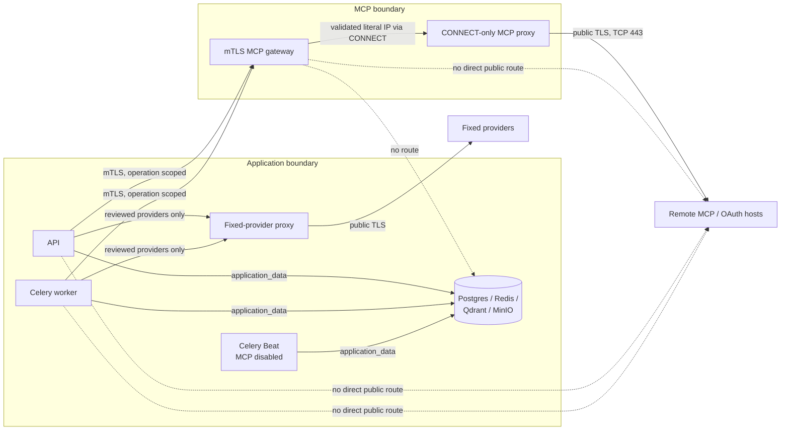

# Phase 13 MCP Connectors: configuration and isolation runbook

This guide is the production operator runbook for Geem Phase 13. It explains
how to configure the paid MCP Connectors App, deploy its isolated outbound
boundary, connect tenant-owned remote MCP servers, and prove that the boundary
is working before publication.

Geem is the model-owning MCP **client/host**. The remote server executes tools;
Geem owns model selection, discovery, authorization, the tool loop, metering,
approvals, and delivery. Phase 13 does not expose Geem as an MCP server, run
local MCP processes, support `stdio`, or allow private-network targets.

The normative product and protocol contract remains the
[Phase 13 plan](../../.cursor/plans/mcp.plan.md). This runbook is the operational
companion to that plan and to the [deployment guide](../deployment.md).

## Release state and non-negotiable gates

The production catalog row is intentionally seeded as `coming_soon`. A
`coming_soon` App cannot be checked out, installed, or admitted at runtime, so
paid release testing must use a separate release-candidate environment with the
same production topology, signed plans, and a deliberately **published** RC
catalog row. After the RC passes, publish the production row through Platform
Admin. Do not temporarily bypass status checks or invent zero/placeholder
prices to make testing succeed.

The locked production product is:

| Plan code | Connections | Tool calls/day | Billing |
| --- | ---: | ---: | --- |
| `mcp-starter` | 1 | 200 | Monthly, SAR, positive signed price |
| `mcp-team` | 3 | 1,000 | Monthly, SAR, positive signed price |
| `mcp-scale` | 10 | 5,000 | Monthly, SAR, positive signed price |

Exactly one plan must be the default. Plan order must be Starter, Team, Scale.
`app.apps_catalog.publication.validate_mcp_connectors_publish_ready()` enforces
these values, the configured `mcp_remote` adapter, and
`MCP_CONNECTOR_ENABLED=true` when an administrator publishes the App.

Do not promote Phase 13 while any of these conditions is true:

- `MCP_CONNECTOR_ENABLED` is true before the isolated gateway is proven.
- The UAT overlay is being used as isolation evidence. It deliberately gives
  the gateway direct public egress and sets its mode to `local`.
- API, worker, or gateway can open an unaudited direct public socket.
- The gateway can reach Postgres, Redis, Qdrant, MinIO, a cloud metadata
  endpoint, or any deployment-owned network.
- A public MCP endpoint needs a port other than TCP 443. The production Squid
  policy dispatches CONNECT only to port 443.
- A write has an unresolved `outcome_unknown`, or an external response has an
  unresolved delivery-unknown record.
- The exact paid checkout, renewal, installation, discovery, approval, and
  Workspace/API/Widget/direct-WhatsApp canary has not passed.

### Known release blockers in the checked-in deployment

These are operationally significant and must not be hidden by the runbook:

1. The checked-in production systemd unit does not start the Compose `mcp`
   profile or name `mcp-egress-gateway` and `mcp-egress-proxy`. Update the
   process manager before release or the boundary will not return after reboot.
2. Celery Beat loads the global application settings but intentionally has no
   MCP client private key. A shared `.env` with
   `MCP_CONNECTOR_ENABLED=true` therefore makes Beat fail closed. Keep the flag
   explicitly `false` for Beat; do **not** give Beat the client key or MCP
   network solely to make it start.
3. The current Workspace MCP panel sends a WhatsApp `AppConnection.id` where
   the API requires the exact internal `ChannelBinding.id`. Treat WhatsApp MCP
   surface binding as a release blocker until the UI/API contract is corrected
   and covered by E2E. Never guess or substitute one identifier for the other.
4. The checked-in MCP Squid policy is a broad independent deny layer, but it is
   not yet a complete duplicate of Python's non-global-address policy and does
   not ingest `MCP_EGRESS_BLOCKED_NETWORKS`. Before production promotion, make
   the proxy or an equivalent network control independently deny every reviewed
   non-global class and deployment-specific range, then add live parity probes.
5. `infra/docker-compose.yml` is a development baseline. It contains known
   Postgres/MinIO credentials and host-published ports; the tunnel overlay does
   not remove them. Never use base + tunnel alone as a production deployment.

## Supported production contract

- Remote, publicly routable HTTPS MCP servers only; deployed dispatch uses
  destination port 443.
- MCP `2026-07-28` is primary. Reviewed fallbacks, in this exact order, are
  `2025-11-25` Streamable HTTP and `2024-11-05` HTTP+SSE.
- Tools only. Prompts, resources, roots, sampling, Tasks, and elicitation are
  rejected.
- Authentication is none, one restricted static header, or MCP OAuth 2.1 with
  PKCE S256 and resource binding.
- OAuth registration is CIMD, pre-registered credentials, or Dynamic Client
  Registration.
- Only `Authorization`, `X-API-Key`, and `X-Auth-Token` are accepted as static
  authentication headers. For `Authorization`, a value without a scheme is
  normalized to `Bearer <value>`.
- Workspace-owned Experts only. Platform Experts cannot receive tenant MCP
  grants.
- One tool call per model iteration. Parallel tool calls fail closed.
- Unknown or incompatible tools are visible in inventory but never execute.
- Widget and WhatsApp are exact, default-off surface bindings. External users
  can never approve a write.

## Isolation architecture



The gateway resolves each tenant-derived hostname, rejects the entire answer
set if any address is unsafe, and asks Squid to CONNECT to the validated literal
IP. The original hostname is retained for HTTP `Host`, TLS SNI, and certificate
verification. A real dispatch resolves again; successful preflight is not a
durable allow decision. Redirect targets are revalidated separately and
cross-origin authorization is removed.

The gateway receives only an operation-scoped canonical target, bounded MCP or
OAuth payload, deadline, and ephemeral authentication material. It receives no
application `.env`, database/Redis URL, JWT key, provider key, or credential
encryption key. It does not persist payloads or emit URL/body access logs.

### Compose network map

| Service | Networks | Public route | MCP role |
| --- | --- | --- | --- |
| API | data, ingress, fixed-provider control, MCP control | No direct route | mTLS gateway client |
| Worker | data, fixed-provider control, MCP control | No direct route | mTLS gateway client; ID-only jobs |
| Beat | data only | No | Schedules ID-only jobs; MCP flag must remain false |
| Datastores | data only | No | No MCP access |
| MCP gateway | MCP control, MCP proxy control | No direct route | URL/DNS/TLS/protocol enforcement |
| MCP proxy | MCP proxy control, public egress | Yes | CONNECT/443 with independent address denies |
| App proxy | fixed-provider control, public egress | Yes | Fixed reviewed provider hosts only |
| Cloudflared | ingress, public egress | Yes | Inbound application tunnel, not MCP |

All networks except `public_egress` are declared `internal: true`. Neither MCP
service publishes a host port. API and worker set `HTTP_PROXY`/`HTTPS_PROXY` to
the fixed-provider proxy, while the MCP gateway client uses `trust_env=False`;
ordinary proxy variables cannot silently intercept or bypass MCP mTLS.
Tenant-selected MCP or OAuth hosts must never be added to the fixed-provider
proxy allowlist; they belong exclusively behind the MCP gateway.

Compose runs the gateway as UID 10001 with a read-only root filesystem, a
small no-exec `/tmp`, all capabilities dropped, `no-new-privileges`, and bounded
PID/memory limits. Its image contains the gateway package and the shared
transport-neutral outbound policy, not the application source tree. The root
`.dockerignore` excludes `.env*`, PKI, tunnel credentials, and `samples/` from
the build context. Preserve these controls when changing the image or
orchestrator.

The checked-in MCP proxy has no proxy authentication or source ACL. Its current
protection is network membership plus no published port. Keep
`public_egress` membership minimal; where the deployment threat model requires
an independent source restriction, add and verify a binding/firewall/source ACL
before release. Do not describe the current proxy policy as identical to
Python's complete non-global-address policy: it is an independent broad second
layer.

## Production deployment procedure

The commands below assume the repository is installed at an arbitrary path and
the operator starts at the repository root. Use one explicit Compose project
name and the same file set throughout.

The checked-in `docker-compose.yml` is a development topology source, not a
production file. `docker-compose.tunnel.yml` supplies Geem's production domain
and baked frontend overrides, but it does not replace development datastore
credentials or close host ports. The examples therefore require a reviewed
`docker-compose.production-hardening.yml` applied last. Do not run the `up`
command until that overlay satisfies the hardening checklist in step 5.

Set the project name explicitly before inventory, start, inspect, and smoke
commands. If the deployment uses another name, replace it consistently:

```bash
export COMPOSE_PROJECT_NAME=geem-prod
cd infra
```

### 1. Prepare application prerequisites

Before turning on MCP, the normal SaaS stack must already have:

- `APP_ENV=production` and `AUTH_REQUIRED=true`;
- public HTTPS `APP_URL` and `WORKSPACE_WEB_URL` values;
- a strong `SECRETS_ENCRYPTION_KEY` for connector credentials, OAuth tokens,
  pending arguments, and resumable loop state;
- `OPENROUTER_API_KEY` plus reviewed primary and fallback model IDs;
- for the direct-WhatsApp release canary, `OPENWA_BASE_URL`, a non-empty
  `OPENWA_API_KEY`, and a reviewed `OPENWA_TIMEOUT_SECONDS`;
- PostgreSQL migrations through `0040_mcp_external_surfaces`;
- healthy Postgres, Redis, Qdrant, MinIO, API, and worker services;
- the normal billing provider and paid App installation flow configured.

Keep `MCP_CONNECTOR_ENABLED=false` during migration, PKI provisioning, and all
negative isolation tests.

### 2. Provision dedicated mTLS PKI

Use an internal PKI or deployment secret manager in production. The host secret
directory must have exactly this shape:

```text
<MCP_EGRESS_PKI_DIR>/
├── ca/
│   └── ca.crt
├── server/
│   ├── server.crt
│   └── server.key
└── client/
    ├── client.crt
    └── client.key
```

Requirements:

- The server certificate SAN contains `mcp-egress-gateway`.
- The server leaf is valid for server authentication and the client leaf for
  client authentication.
- Certificates are mode `0644`; private keys are `0400` or `0440`.
- The gateway server key is actually readable as container UID/GID `10001`.
  Host ownership is more portable than relying on Compose file-secret UID/GID
  behavior.
- API and worker receive the client key only. The gateway receives the server
  key only. Beat receives neither.
- The checked-in Compose topology shares one client identity between API and
  worker. It authenticates the application boundary, not an individual process.
- The listener accepts client leaves signed by its configured client CA. Protect
  that CA and issue only narrowly scoped application-boundary identities.
- Use a distinct CA and identities per environment. Never reuse application
  JWT/encryption keys, provider credentials, tunnel credentials, or a public web
  certificate.
- Never deploy or mount the CA private key.

Set the host path for Compose interpolation, then verify the chain, SAN, expiry,
and matching public keys before starting containers:

```bash
export MCP_EGRESS_PKI_DIR=/srv/geem-secrets/mcp-egress

openssl verify \
  -CAfile "$MCP_EGRESS_PKI_DIR/ca/ca.crt" \
  -purpose sslserver \
  "$MCP_EGRESS_PKI_DIR/server/server.crt"

openssl verify \
  -CAfile "$MCP_EGRESS_PKI_DIR/ca/ca.crt" \
  -purpose sslclient \
  "$MCP_EGRESS_PKI_DIR/client/client.crt"

openssl x509 \
  -in "$MCP_EGRESS_PKI_DIR/server/server.crt" \
  -noout -checkhost mcp-egress-gateway

openssl x509 \
  -in "$MCP_EGRESS_PKI_DIR/server/server.crt" \
  -noout -checkend 2592000
openssl x509 \
  -in "$MCP_EGRESS_PKI_DIR/client/client.crt" \
  -noout -checkend 2592000
openssl x509 \
  -in "$MCP_EGRESS_PKI_DIR/ca/ca.crt" \
  -noout -checkend 2592000
```

`2592000` is 30 days. The two `verify` commands, SAN check, and all three
server/client/CA expiry checks must succeed. Include every intermediate in the
same rotation-window review. Compare the certificate and key public-key digests
if the gateway reports a key mismatch:

```bash
openssl x509 -in "$MCP_EGRESS_PKI_DIR/server/server.crt" -pubkey -noout \
  | openssl pkey -pubin -outform DER | openssl dgst -sha256
openssl pkey -in "$MCP_EGRESS_PKI_DIR/server/server.key" -pubout -outform DER \
  | openssl dgst -sha256
```

The two digests must match. Repeat for the client pair. See the
[PKI layout note](../../infra/mcp-egress/pki/README.md) for the repository
contract. The current base Compose mounts the client files into API/worker even
while the feature is disabled, so provision them before recreating the base
stack.

### 3. Configure the application and gateway

Copy the Phase 13 section from [`.env.example`](../../.env.example) into the
deployment `.env`. This baseline uses Geem's checked-in production hosts;
release-candidate/custom-domain deployments must replace all related hosts
consistently through their final overlay. Replace the example CIDRs with actual
deployment ranges and keep the switch off initially:

```dotenv
APP_ENV=production
AUTH_REQUIRED=true
APP_URL=https://api.geem.ai
WORKSPACE_WEB_URL=https://hub.geem.ai
SECRETS_ENCRYPTION_KEY=<secret-manager-value>

OPENROUTER_API_KEY=<secret-manager-value>
OPENROUTER_CHAT_MODEL=qwen/qwen3.8-max
OPENROUTER_CHAT_FALLBACK_MODEL=openai/gpt-5.6-terra

# Required only for the direct-WhatsApp Phase 13 release surface.
OPENWA_BASE_URL=https://whatsapp-hub.dalseen.sa
OPENWA_API_KEY=<secret-manager-value>
OPENWA_TIMEOUT_SECONDS=30

# Host-side Compose secret source, not a container mount path.
MCP_EGRESS_PKI_DIR=/srv/geem-secrets/mcp-egress

MCP_CONNECTOR_ENABLED=false
MCP_SUPPORTED_PROTOCOL_VERSIONS=2026-07-28,2025-11-25,2024-11-05
MCP_CLIENT_METADATA_URL=https://api.geem.ai/api/connectors/oauth/mcp_remote/client-metadata.json

MCP_EGRESS_GATEWAY_URL=https://mcp-egress-gateway:8443
MCP_EGRESS_APP_ENV=production
MCP_EGRESS_PROXY_URL=http://mcp-egress-proxy:3128
MCP_EGRESS_CLIENT_CERT_FILE=/run/secrets/mcp-egress/client.crt
MCP_EGRESS_CLIENT_KEY_FILE=/run/secrets/mcp-egress/client.key
MCP_EGRESS_CA_CERT_FILE=/run/secrets/mcp-egress/ca.crt
MCP_EGRESS_BLOCKED_NETWORKS=10.42.0.0/16,172.30.0.0/16
MCP_ALLOW_PRIVATE_EGRESS=false

MCP_EGRESS_MAX_REQUEST_BYTES=65536
# Tool inventories include tool JSON Schemas and can be substantially larger
# than individual runtime results. This 256 KiB default remains bounded; the
# gateway enforces an absolute 1 MiB ceiling for operator overrides.
MCP_EGRESS_MAX_RESPONSE_BYTES=262144
MCP_EGRESS_CONNECT_TIMEOUT_SECONDS=5
MCP_EGRESS_READ_TIMEOUT_SECONDS=20
MCP_EGRESS_TOTAL_TIMEOUT_SECONDS=30
MCP_MAX_REDIRECTS=3

MCP_LEGACY_SESSION_TTL_SECONDS=300
MCP_MAX_LEGACY_SESSIONS=64
MCP_MAX_TOOL_PAGES=64
MCP_MAX_CONCURRENT_OPERATIONS=128
MCP_MAX_DISCOVERED_TOOLS=512

MCP_MAX_TOOL_ITERATIONS=5
MCP_MAX_TOOLS_PER_EXPERT=32
MCP_TOOL_INVENTORY_TTL_SECONDS=300
MCP_TOOL_CALL_TIMEOUT_SECONDS=20
MCP_TOTAL_TURN_TIMEOUT_SECONDS=120
MCP_TOOL_RESULT_MAX_BYTES=32768
MCP_TOOL_RESULT_MAX_CHARS=8000
MCP_TOOL_APPROVAL_TTL_SECONDS=900
MCP_MAX_EXTERNAL_PENDING_PER_WORKSPACE=100

MCP_TOOL_PROVIDER_CAPABILITY_MATRIX='{"qwen/qwen3.8-max":["function_calling","parallel_tool_calls_false"],"openai/gpt-5.6-terra":["function_calling","parallel_tool_calls_false"]}'
```

If CIMD is not part of the deployment, leave `MCP_CLIENT_METADATA_URL` empty.
If it is enabled, it must be the public HTTPS URL of Geem's exact CIMD route;
the URL itself is used as the OAuth client identifier.

`MCP_EGRESS_PROXY_URL` is the application's required declaration of the
isolated proxy origin; URL-shape validation alone is not isolation attestation.
API and worker inherit it from `.env`, but it is **not** their general
`HTTP_PROXY`. The checked-in base Compose independently hardcodes
`EGRESS_FORWARD_PROXY_URL=http://mcp-egress-proxy:3128` for the gateway; it does
not interpolate `MCP_EGRESS_PROXY_URL`. If a deployment changes the proxy
service name or port, change both declarations and prove the resulting route.
The gateway does not receive the application `.env` wholesale.

The checked-in tunnel overlay is specific to `api.geem.ai`, `hub.geem.ai`, and
the other Geem production hosts; it overrides application URLs and frontend
build arguments. A custom-domain or release-candidate deployment must provide a
later overlay that consistently replaces API/worker `APP_URL`,
`WORKSPACE_WEB_URL`, `MCP_CLIENT_METADATA_URL`, frontend build arguments, and
Cloudflared configuration. Never combine an `api.example` CIMD URL with the
unmodified Geem tunnel overlay.

#### Settings reference

| Setting | Production rule |
| --- | --- |
| `MCP_CONNECTOR_ENABLED` | Start `false`; turn on only after live isolation succeeds. |
| `MCP_SUPPORTED_PROTOCOL_VERSIONS` | Exact reviewed order; no untested revisions. |
| `MCP_CLIENT_METADATA_URL` | Optional public HTTPS CIMD route; empty disables CIMD. |
| `MCP_EGRESS_GATEWAY_URL` | Internal HTTPS origin only; no path, query, fragment, or userinfo. Outside local/test the host is exactly `mcp-egress-gateway` or ends in `.internal`, `.svc`, or `.svc.cluster.local`. |
| `MCP_EGRESS_APP_ENV` | `production` for the isolated Compose gateway. |
| `MCP_EGRESS_PROXY_URL` | Internal plain-HTTP proxy origin with an explicit port; never public. The same internal-host allowlist as the gateway applies. |
| Client cert/key/CA file settings | Container mount paths readable by API and worker. |
| `MCP_EGRESS_BLOCKED_NETWORKS` | Every Docker, VPC, host-routed, corporate, and deployment-owned CIDR that tenants must not reach. |
| `MCP_ALLOW_PRIVATE_EGRESS` | Always `false` outside explicit local/test fixtures; startup rejects otherwise. |
| Request/response byte limits | Bound gateway ingress and remote response bodies before parsing. |
| Connect/read/total egress timeouts | Total must be at least connect; the gateway charges all transit and lock time against the earlier deadline. |
| Legacy session TTL/count | Bound in-memory legacy Streamable HTTP/SSE state. TTL is non-sliding. |
| Page/tool/concurrency limits | Bound inventory pagination, discovered inventory, and simultaneous gateway work. Keep pages at 64 until the API and gateway setting are unified. |
| Iteration/tool-result/turn limits | Bound the Geem-owned model loop and model-visible result. Total turn must be at least tool-call timeout. |
| Approval TTL/pending cap | Bound paused write approvals and outstanding external work per Workspace. |
| Capability matrix | Both exact configured model IDs must declare `function_calling` and `parallel_tool_calls_false`. |

Startup fails closed when these relationships are invalid. Do not increase a
limit merely to make a hostile or incompatible server work; first review its
wire behavior, payload size, pagination, and latency.

For a direct, non-Compose gateway deployment, map the reviewed values to the
gateway-native `EGRESS_*` names in
[`gateway/config.py`](../../apps/mcp_egress_gateway/gateway/config.py). Also set
`EGRESS_BIND_PORT=8443`, `EGRESS_SERVER_CERT_FILE`,
`EGRESS_SERVER_KEY_FILE`, `EGRESS_CLIENT_CA_FILE`,
`EGRESS_FORWARD_PROXY_URL`, `EGRESS_MAX_HEADER_BYTES=16384`, and
`EGRESS_MAX_HEADERS=64`. Bind only the private workload interface where the
orchestrator supports it. If `EGRESS_BIND_HOST=0.0.0.0` is required inside a
pod/container, a same-step default-deny ingress policy must allow only API and
worker, and no public Service/load balancer/host port may expose 8443.
Production startup requires a forward proxy.

### 4. Inventory and block deployment networks

Standard private, loopback, link-local, metadata, CGNAT, multicast, mapped,
transition, reserved, and non-global addresses are already rejected in code.
`MCP_EGRESS_BLOCKED_NETWORKS` adds deployment-specific ranges and documents the
operator's intent.

After Compose has created its networks, list their actual subnets without
rendering the application `.env`:

```bash
: "${COMPOSE_PROJECT_NAME:?export the exact deployed Compose project name}"

for logical_network in application_data application_ingress application_provider_control mcp_egress_control mcp_proxy_control public_egress; do
  network_id=$(docker network ls \
    --filter "label=com.docker.compose.project=$COMPOSE_PROJECT_NAME" \
    --filter "label=com.docker.compose.network=$logical_network" \
    --format '{{.ID}}')
  printf '%s: ' "$logical_network"
  docker network inspect "$network_id" \
    --format '{{range .IPAM.Config}}{{printf "%s " .Subnet}}{{end}}{{println}}'
done
```

Copy those subnets, VPC ranges, host bridge ranges, internal public ranges, and
cloud metadata destinations into the comma-separated setting. Recheck after an
IPAM or network change.

The custom list is passed to gateway code; it is not automatically written into
Squid. If the organization uses a publicly routed CIDR internally, add a
reviewed `acl ... dst ...` plus `http_access deny ...` before the final allow in
[`infra/mcp-egress/proxy/squid.conf`](../../infra/mcp-egress/proxy/squid.conf),
rebuild the proxy, and test both layers.

### 5. Create the production hardening overlay

Create a deployment-owned `docker-compose.production-hardening.yml`. It is a
required production input, not an optional MCP convenience overlay. At minimum
it must:

- replace `rag/rag` with secret-manager-backed Postgres credentials and override
  API, worker, and Beat `DATABASE_URL` with the matching encoded URL;
- replace `minio/change-me` in MinIO, the application settings, and `minio-init`
  with the same secret-backed values;
- remove the host port publications inherited by API, MinIO, Workspace Web,
  Platform Admin, and Landing Page when Cloudflared is the ingress, or bind only
  the explicitly reviewed loopback ports for a different ingress design;
- retain no host port for the MCP gateway or proxy;
- keep API/worker/gateway off `public_egress` and preserve the network map above;
- keep MCP explicitly disabled for Beat, which receives neither client PKI nor
  an MCP network;
- preserve the baked, no-reload production commands and remove development bind
  mounts; and
- provide the exact effective public API, Workspace, CIMD, frontend-build, and
  tunnel domains for this environment.

This fragment shows the required override pattern. It is not a substitute for
reviewing the complete merged topology:

```yaml
services:
  postgres:
    environment:
      POSTGRES_USER: ${POSTGRES_USER:?required}
      POSTGRES_PASSWORD: ${POSTGRES_PASSWORD:?required}
      POSTGRES_DB: ${POSTGRES_DB:?required}
    healthcheck:
      test: ["CMD-SHELL", "pg_isready -U $$POSTGRES_USER -d $$POSTGRES_DB"]

  minio:
    environment:
      MINIO_ROOT_USER: ${MINIO_ACCESS_KEY:?required}
      MINIO_ROOT_PASSWORD: ${MINIO_SECRET_KEY:?required}
    ports: !reset []

  minio-init:
    environment:
      MINIO_ROOT_USER: ${MINIO_ACCESS_KEY:?required}
      MINIO_ROOT_PASSWORD: ${MINIO_SECRET_KEY:?required}
      MINIO_BUCKET: ${MINIO_BUCKET:-rag-documents}
    entrypoint:
      - /bin/sh
      - -ec
      - |
        sleep 3
        mc alias set local http://minio:9000 "$$MINIO_ROOT_USER" "$$MINIO_ROOT_PASSWORD"
        mc mb -p "local/$$MINIO_BUCKET" || true
        mc anonymous set none "local/$$MINIO_BUCKET"

  api:
    environment:
      DATABASE_URL: ${DATABASE_URL:?required}
    ports: !reset []

  worker:
    environment:
      DATABASE_URL: ${DATABASE_URL:?required}

  beat:
    environment:
      DATABASE_URL: ${DATABASE_URL:?required}
      MCP_CONNECTOR_ENABLED: "false"

  workspace_web:
    ports: !reset []

  dashboard_web:
    ports: !reset []

  landpage_web:
    ports: !reset []
```

Use different Postgres and MinIO secrets. Ensure `DATABASE_URL` percent-encodes
reserved password characters and points to the internal `postgres:5432`
service in this topology. The deployment pipeline must explicitly reject
`POSTGRES_PASSWORD=rag`, `MINIO_SECRET_KEY=change-me`, and empty values. The
application `.env` values
`MINIO_ACCESS_KEY`/`MINIO_SECRET_KEY` must match the MinIO root identity shown
here. Prefer a dedicated non-root MinIO application identity when the
deployment has a reviewed provisioning flow for it.

For a fresh Postgres volume, `POSTGRES_PASSWORD` initializes the role. For an
existing `postgres_data` volume, changing Compose environment does **not**
change the stored role password. Rotate it during a reviewed maintenance window:

1. Take and verify a database backup.
2. Generate/store the new value in the secret manager, but do not restart the
   application yet.
3. Open `psql` inside the currently authorized Postgres container and use
   `\password <application-role>` so psql prompts for the new value without
   putting it in shell history. Do not put `ALTER ROLE ... PASSWORD` with a
   literal secret on a command line.
4. Update `POSTGRES_PASSWORD` and the matching percent-encoded `DATABASE_URL`,
   then recreate Postgres, API, worker, and Beat together in the maintenance
   window.
5. Prove API database readiness and authentication, then revoke the old secret
   from the manager. Never delete the volume to make environment initialization
   run again.

Changing an existing database name or role also needs an explicit SQL migration;
Compose environment alone will not create it in an initialized volume.

Apply this overlay last in every production `up`, `stop`, `ps`, and
process-manager command. Beat's static schedule can enqueue MCP job identifiers
while the worker, which has `MCP_CONNECTOR_ENABLED=true`, performs the
authorized work. Never mount the MCP client key into Beat.

### 6. Render safely, migrate, and start the boundary

First validate Compose syntax without printing expanded secrets:

```bash
docker compose \
  --env-file ../.env \
  --profile mcp \
  -f docker-compose.yml \
  -f docker-compose.tunnel.yml \
  -f docker-compose.production-hardening.yml \
  config --quiet
```

Do not paste raw `docker compose config` output into a terminal transcript or
support ticket; `env_file` values are expanded and may disclose secrets.

Build and start the complete production topology while the connector flag is
still false:

```bash
docker compose \
  --env-file ../.env \
  --profile mcp \
  -f docker-compose.yml \
  -f docker-compose.tunnel.yml \
  -f docker-compose.production-hardening.yml \
  up -d --build
```

The API container runs Alembic before Uvicorn. Confirm the live database is at
the expected head and inspect service state:

```bash
docker compose \
  --env-file ../.env \
  --profile mcp \
  -f docker-compose.yml \
  -f docker-compose.tunnel.yml \
  -f docker-compose.production-hardening.yml \
  exec -T api alembic current

docker compose \
  --env-file ../.env \
  --profile mcp \
  -f docker-compose.yml \
  -f docker-compose.tunnel.yml \
  -f docker-compose.production-hardening.yml \
  ps
```

`mcp-egress-gateway` and `mcp-egress-proxy` must be running. `ps` is not
readiness evidence by itself because these two services have no Compose
healthcheck.

Confirm the gateway has no published port. This command must print nothing:

```bash
docker compose \
  --env-file ../.env \
  --profile mcp \
  -f docker-compose.yml \
  -f docker-compose.tunnel.yml \
  -f docker-compose.production-hardening.yml \
  port mcp-egress-gateway 8443
```

Inspect the actual running containers, not only Compose syntax. The following
prints no secrets; compare every service with the network map in this guide:

```bash
set -euo pipefail

geem_compose() {
  docker compose \
    --env-file ../.env \
    --profile mcp \
    -f docker-compose.yml \
    -f docker-compose.tunnel.yml \
    -f docker-compose.production-hardening.yml \
    "$@"
}

for service in api worker beat postgres redis qdrant minio workspace_web dashboard_web landpage_web app-egress-proxy mcp-egress-gateway mcp-egress-proxy cloudflared; do
  container_id=$(geem_compose ps -q "$service")
  printf '%s: ' "$service"
  docker inspect "$container_id" \
    --format '{{range $name, $_ := .NetworkSettings.Networks}}{{printf "%s " $name}}{{end}}{{println}}'
done

for service in api minio workspace_web dashboard_web landpage_web mcp-egress-gateway mcp-egress-proxy; do
  container_id=$(geem_compose ps -q "$service")
  printf '%s host ports: ' "$service"
  docker inspect "$container_id" --format '{{json .HostConfig.PortBindings}}'
done

assert_network_services() {
  logical_network=$1
  shift
  network_id=$(docker network ls \
    --filter "label=com.docker.compose.project=$COMPOSE_PROJECT_NAME" \
    --filter "label=com.docker.compose.network=$logical_network" \
    --format '{{.ID}}')
  test -n "$network_id" || { echo "missing network: $logical_network" >&2; return 1; }

  members=$(docker network inspect "$network_id" \
    --format '{{range .Containers}}{{println .Name}}{{end}}')
  seen_services=''
  while IFS= read -r container_name; do
    test -n "$container_name" || continue
    service=$(docker inspect "$container_name" \
      --format '{{index .Config.Labels "com.docker.compose.service"}}')
    seen_services="$seen_services $service"
    allowed=false
    for expected_service in "$@"; do
      test "$service" = "$expected_service" && allowed=true
    done
    $allowed || {
      echo "unexpected $logical_network member: $container_name ($service)" >&2
      return 1
    }
  done <<< "$members"

  for expected_service in "$@"; do
    case " $seen_services " in
      *" $expected_service "*) ;;
      *) echo "missing $logical_network member: $expected_service" >&2; return 1 ;;
    esac
  done
  printf '%s: %s\n' "$logical_network" "$seen_services"
}

assert_network_services application_data \
  postgres redis qdrant minio api worker beat
assert_network_services application_ingress \
  api workspace_web dashboard_web landpage_web cloudflared
assert_network_services application_provider_control \
  api worker app-egress-proxy
assert_network_services mcp_egress_control \
  api worker mcp-egress-gateway
assert_network_services mcp_proxy_control \
  mcp-egress-gateway mcp-egress-proxy
assert_network_services public_egress \
  app-egress-proxy mcp-egress-proxy cloudflared
```

`minio-init` is a one-shot container and may no longer have a live network
endpoint after it succeeds. Verify its configured `application_data`
membership with the rendered-Compose/static topology test; do not require it
in the live `.Containers` assertion above.

With Cloudflared as ingress, every host-port result must be `{}` or `null` and
the only `public_egress` members must be `app-egress-proxy`,
`mcp-egress-proxy`, and `cloudflared`. In particular:

- API and worker must not have `public_egress`;
- gateway must have only `mcp_egress_control` and `mcp_proxy_control`;
- MCP proxy must have only `mcp_proxy_control` and `public_egress`;
- Beat and all datastores must have only `application_data`; and
- neither proxy may join `application_data`.

Verify that the running API received the expected public origins without
printing any secret:

```bash
geem_compose exec -T api python -c '
from app.core.config import get_settings
s = get_settings()
print("APP_URL=" + s.app_url)
print("WORKSPACE_WEB_URL=" + s.effective_workspace_web_url)
print("MCP_CLIENT_METADATA_URL=" + (s.mcp_client_metadata_url or "<disabled>"))
print("MCP_ALLOW_PRIVATE_EGRESS=" + str(s.mcp_allow_private_egress).lower())
'
```

The hosts must match the tunnel/frontend/provider registrations, and private
egress must print `false`. Retain secret-manager evidence that the running
Postgres password is not `rag`, the MinIO secret is not `change-me`, and the
application/init credentials match; do not prove that by printing container
environments into a ticket.

If a previously hardened application stack was already running, start proxy
and gateway first, then force-recreate API and worker so they load the
certificate mounts and settings. Keep the final hardening overlay present.

### 7. Prove positive datastore controls

The security smoke test proves that the gateway cannot reach the datastores,
but a stopped datastore would also make that negative probe pass. First prove
that the same live endpoints are reachable from the trusted API container:

```bash
docker compose \
  --env-file ../.env \
  --profile mcp \
  -f docker-compose.yml \
  -f docker-compose.tunnel.yml \
  -f docker-compose.production-hardening.yml \
  exec -T api python - \
  postgres:5432 redis:6379 qdrant:6333 minio:9000 <<'PY'
import socket
import sys

for endpoint in sys.argv[1:]:
    host, port = endpoint.rsplit(":", 1)
    with socket.create_connection((host, int(port)), 3):
        print(f"API reached {endpoint}")
PY
```

All four lines must print successfully before the gateway's negative probes
are considered evidence.

### 8. Run the live isolation gate

From `infra/`, run the checked-in test against the same Compose project:

```bash
MCP_SMOKE_COMPOSE_FILE="$PWD/docker-compose.yml" \
MCP_SMOKE_ENV_FILE="$PWD/../.env" \
./mcp-egress/verify-isolation.sh
```

If the deployment was started with `-p`, export the identical
`COMPOSE_PROJECT_NAME` before running the script. The script accepts one base
Compose file and uses the already-running project's containers; custom
multi-file topology changes still require separate rendered-network review.

Success is exit status 0 and this final line:

```text
MCP egress mTLS and network-isolation smoke passed
```

The live gate proves:

1. The API client certificate can reach the authenticated gateway health route.
2. The same TLS request without a client certificate fails.
3. API, worker, and gateway cannot open a raw socket to `1.1.1.1:443`.
4. Gateway cannot resolve/connect to `postgres:5432`, `redis:6379`,
   `qdrant:6333`, or `minio:9000`.
5. The MCP proxy rejects CONNECT to `10.0.0.1:443`.

#### Deployment-specific address-policy parity

The checked-in smoke is necessary but incomplete. Before release, extend the
live evidence to every deployment CIDR and reviewed non-global class. At a
minimum test:

- cloud metadata targets including `169.254.169.254` and `168.63.129.16`;
- one address from every `MCP_EGRESS_BLOCKED_NETWORKS` entry;
- documentation/benchmark, IPv6 ULA/link-local, mapped, and transition ranges;
- the corresponding explicit Squid deny for every class/range; and
- one controlled public HTTPS/443 MCP canary that succeeds, proving the negative
  results were not caused by a general upstream outage.

The `geem_compose` helper from step 6 can exercise gateway target validation.
This script derives a representative address from **every** configured custom
CIDR and combines it with the mandatory metadata/non-global matrix. Every
result must be HTTP 403:

```bash
geem_compose exec -T api python - <<'PY'
import ipaddress
import os

import httpx

fixed = [
    "0.0.0.1",          # 0.0.0.0/8
    "10.0.0.1",
    "100.64.0.1",
    "127.0.0.1",
    "169.254.169.254",
    "168.63.129.16",
    "172.16.0.1",
    "192.0.0.1",        # 192.0.0.0/24
    "192.0.0.192",      # provider metadata /32
    "192.0.2.1",
    "192.168.0.1",
    "198.18.0.1",
    "198.51.100.1",
    "203.0.113.1",
    "224.0.0.1",
    "240.0.0.1",
    "::",               # IPv6 unspecified
    "::1",
    "fc00::1",
    "fe80::1",
    "::ffff:127.0.0.1",
    "64:ff9b::c000:201",
    "64:ff9b:1::1",
    "2001::1",
    "2002:c000:0201::",
    "2001:db8::1",
    "ff00::1",
]

raw_custom = os.environ.get("MCP_EGRESS_BLOCKED_NETWORKS", "").strip()
if not raw_custom:
    raise SystemExit("MCP_EGRESS_BLOCKED_NETWORKS is empty")


def representative(raw_network: str) -> str:
    network = ipaddress.ip_network(raw_network.strip(), strict=False)
    return str(network.network_address + (1 if network.num_addresses > 1 else 0))


addresses = list(dict.fromkeys(
    fixed + [representative(value) for value in raw_custom.split(",") if value.strip()]
))

with httpx.Client(
    verify="/run/secrets/mcp-egress/ca.crt",
    cert=(
        "/run/secrets/mcp-egress/client.crt",
        "/run/secrets/mcp-egress/client.key",
    ),
    trust_env=False,
    timeout=10,
) as client:
    for index, raw_address in enumerate(addresses):
        address = ipaddress.ip_address(raw_address)
        host = f"[{address}]" if address.version == 6 else str(address)
        response = client.post(
            "https://mcp-egress-gateway:8443/v1/target-validation",
            json={
                "operation_id": f"release-block-probe-{index}",
                "target_url": f"https://{host}/",
                "caller_binding": "0" * 64,
                "deadline_seconds": 5,
            },
        )
        print(address, response.status_code)
        if response.status_code != 403:
            raise SystemExit(f"gateway did not deny {address}")
PY
```

Then test the independent proxy ACL with the same fixed and complete custom
list. An ACL denial must be an explicit HTTP 403; a timeout or upstream 5xx is
not policy evidence:

```bash
geem_compose exec -T mcp-egress-gateway python - <<'PY'
import ipaddress
import os
import socket

fixed = [
    "0.0.0.1",          # 0.0.0.0/8
    "10.0.0.1",
    "100.64.0.1",
    "127.0.0.1",
    "169.254.169.254",
    "168.63.129.16",
    "172.16.0.1",
    "192.0.0.1",        # 192.0.0.0/24
    "192.0.0.192",      # provider metadata /32
    "192.0.2.1",
    "192.168.0.1",
    "198.18.0.1",
    "198.51.100.1",
    "203.0.113.1",
    "224.0.0.1",
    "240.0.0.1",
    "::",               # IPv6 unspecified
    "::1",
    "fc00::1",
    "fe80::1",
    "::ffff:127.0.0.1",
    "64:ff9b::c000:201",
    "64:ff9b:1::1",
    "2001::1",
    "2002:c000:0201::",
    "2001:db8::1",
    "ff00::1",
]

raw_custom = os.environ.get("EGRESS_BLOCKED_NETWORKS", "").strip()
if not raw_custom:
    raise SystemExit("EGRESS_BLOCKED_NETWORKS is empty")


def representative(raw_network: str) -> str:
    network = ipaddress.ip_network(raw_network.strip(), strict=False)
    return str(network.network_address + (1 if network.num_addresses > 1 else 0))


addresses = list(dict.fromkeys(
    fixed + [representative(value) for value in raw_custom.split(",") if value.strip()]
))

for raw_address in addresses:
    address = ipaddress.ip_address(raw_address)
    host = f"[{address}]" if address.version == 6 else str(address)
    authority = f"{host}:443"
    with socket.create_connection(("mcp-egress-proxy", 3128), 3) as proxy:
        proxy.settimeout(3)
        proxy.sendall(
            f"CONNECT {authority} HTTP/1.1\r\n"
            f"Host: {authority}\r\nConnection: close\r\n\r\n".encode()
        )
        status = proxy.recv(256).split(b"\r\n", 1)[0]
    print(address, status.decode("ascii", "replace"))
    if b" 403 " not in status:
        raise SystemExit(f"missing explicit proxy ACL denial for {address}")
PY
```

These parity checks will fail against any range omitted from the current Squid
ACL; that is a release blocker, not a reason to weaken the gateway policy.

Also run the static topology regression in a CI/test environment that has
`apps/mcp_egress_gateway/requirements.txt` plus pytest installed; the ordinary
API virtual environment is not the gateway dependency environment. This
command assumes the shell is still in `infra/`:

```bash
(cd ../apps/mcp_egress_gateway && python -m pytest -q tests/test_compose_isolation.py)
```

The smoke test does **not** prove that a real public MCP server is reachable,
protocol-compatible, or correct on every product surface. Run a controlled
public release-canary after this negative security gate.

### 9. Enable API and worker only

After the boundary passes, change the shared deployment value to:

```dotenv
MCP_CONNECTOR_ENABLED=true
```

Keep the Beat override false, then recreate API and worker:

```bash
docker compose \
  --env-file ../.env \
  --profile mcp \
  -f docker-compose.yml \
  -f docker-compose.tunnel.yml \
  -f docker-compose.production-hardening.yml \
  up -d --force-recreate api worker

curl --fail --silent --show-error \
  https://api.geem.ai/api/health/ready
```

Application startup now verifies the internal gateway/proxy origins, readable
client PKI, protocol order, timeouts, provider key, exact model identifiers, and
capability matrix. A failure is a deployment error; do not weaken the assertion.

### 10. Make startup persistent

Every supervisor, systemd unit, aaPanel project, CI deployment, and reboot path
must include:

- `--profile mcp`;
- the base, production tunnel, and final production-hardening files;
- `mcp-egress-proxy` and `mcp-egress-gateway` when services are named
  explicitly;
- the same `--env-file` and Compose project name;
- shutdown of both MCP services on stop.

The checked-in [`geem-stack.service`](../../infra/systemd/geem-stack.service)
does not yet satisfy this list. Manual `docker compose up` is not enough for a
production release if the process manager later recreates a partial stack.

## Kubernetes or non-Compose equivalent

A different orchestrator is supported only if it preserves the same trust
boundaries:

- Start from default-deny ingress and egress policies.
- API/worker may reach application datastores, the fixed-provider proxy, and
  gateway TCP 8443, but have no direct Internet route.
- Gateway ingress accepts only API/worker on TCP 8443 with required mTLS.
- Gateway egress permits cluster DNS and MCP proxy TCP 3128 only; it has no
  datastore, application-provider, ingress, or public network attachment.
- MCP proxy ingress accepts only the gateway; its egress is public TCP 443.
- Fixed-provider and MCP proxies are separate workloads and policies.
- Give gateway a dedicated ServiceAccount, read-only root filesystem, dropped
  capabilities, no privilege escalation, bounded memory/PIDs, and only its
  server key/client CA secret.
- Give API/worker only the client key/CA. Do not mount application secrets into
  gateway or server private key into API/worker.
- Use an exec probe or an mTLS-authenticated probe. Do not add an unauthenticated
  public health endpoint to simplify liveness checks.
- Retain URL/DNS/IP/redirect checks and the independent CONNECT proxy deny
  policy; NetworkPolicy alone does not prevent DNS rebinding to an allowed
  public route.

Legacy gateway sessions are in-memory and bound to a process. Run one gateway
replica for Phase 13, or prove strict session affinity for every legacy handle.
A gateway restart safely invalidates legacy sessions; it must never cause an
ambiguous write to be retried.

## Tenant and product configuration

Infrastructure enablement does not grant any tenant access. Every paid runtime
operation still requires the published App, active installation, current active
subscription, matching plan, current tool grant, and—on external
surfaces—current companion App plus an exact target binding.

### Roles

| Action | Permission |
| --- | --- |
| Browse MCP catalog/connections/usage | `apps.view` |
| Subscribe, install, classify tools | `apps.manage` |
| Add, authenticate, reauthorize, remove server | `apps.connect` |
| Grant tools and bind exact surfaces to an Expert | `experts.update` |
| Invoke/approve own Workspace Chat call | `chat.use` |
| Decide Widget/WhatsApp writes and reconcile external delivery | `mcp_tools.approve_external` |

Owner and Admin receive `mcp_tools.approve_external` by default. It remains a
normal dynamic RBAC permission and should be assigned sparingly.

### Publish and subscribe

In Platform Admin:

1. Open the seeded **MCP Connectors** App.
2. Configure exactly the three locked plans and signed positive monthly SAR
   prices. Choose exactly one default.
3. Keep the **production** row `coming_soon`. In a separate release-candidate
   environment with an isolated database/catalog and production-equivalent
   network, configure the same plans and deliberately publish the RC row through
   Platform Admin so checkout, install, paid access, and runtime can execute.
4. Confirm the RC connector is `mcp_remote` / `tool_source`, run the full paid
   renewal and four-surface release checklist, and retain the evidence.
5. Only after the RC passes, enable the already-proven production boundary and
   publish the production row through Platform Admin so the product-specific
   validator runs. Follow with a bounded production read-only canary.

In a tenant Workspace, an authorized manager then chooses a plan, completes
hosted checkout/payment fulfillment, and installs MCP Connectors. Installation
alone is not access: the subscription must also be active. Widget and WhatsApp
dispatch additionally require a current subscription and installation for the
originating Chat Widget or WhatsApp App.

### Add a remote server

Use Workspace UI under Apps → MCP Connectors for ordinary operation. The API
examples below are useful for automation and exact contract diagnosis. They use
a logged-in Workspace session token; `X-Workspace-Id` is only a routing hint and
the backend still verifies membership.

```bash
export GEEM_API_URL=https://api.geem.ai
read -r -s -p 'Short-lived Workspace access token: ' GEEM_ACCESS_TOKEN
printf '\n'
read -r -p 'Tenant Workspace UUID: ' GEEM_WORKSPACE_ID
```

No authentication:

```bash
curl --fail --silent --show-error \
  -X POST "$GEEM_API_URL/api/apps/mcp/servers" \
  -H "Authorization: Bearer $GEEM_ACCESS_TOKEN" \
  -H "X-Workspace-Id: $GEEM_WORKSPACE_ID" \
  -H 'Content-Type: application/json' \
  --data '{
    "display_name": "Production automation",
    "server_url": "https://mcp.vendor.example/mcp",
    "auth": {"mode": "none"}
  }'
```

Restricted static authentication:

```json
{
  "display_name": "Vendor MCP",
  "server_url": "https://mcp.vendor.example/mcp",
  "auth": {
    "mode": "static",
    "header_name": "Authorization",
    "secret": "Bearer <vendor-secret>"
  }
}
```

Pre-registered OAuth:

```json
{
  "display_name": "OAuth MCP",
  "server_url": "https://mcp.vendor.example/mcp",
  "resource_uri": "https://mcp.vendor.example/",
  "auth": {
    "mode": "oauth",
    "strategy": "pre_registered",
    "expected_issuer": "https://identity.vendor.example/",
    "client_id": "<registered-client-id>",
    "client_secret": "<registered-client-secret>",
    "scopes": ["tools.read", "tools.execute"]
  }
}
```

For CIMD use `"strategy": "cimd"`; for reviewed Dynamic Client Registration
use `"strategy": "dynamic_registration"`. `expected_issuer` is strongly
recommended whenever the provider publishes a stable issuer. The current
Workspace form does not expose `resource_uri`, `expected_issuer`, or initial
OAuth `scopes`; use the API for those advanced fields until the UI supports
them. Credentials, tokens, and raw URLs containing sensitive query data must
never be put in logs, tickets, or shell history.

The target must be HTTPS without userinfo or a fragment. All DNS answers must
be globally routable and outside custom blocked ranges. Mixed safe/unsafe DNS
answers fail as a whole. In production the ultimate dispatch port must be 443.

### Complete OAuth

For an OAuth connection, start authorization:

```bash
curl --fail --silent --show-error \
  -X POST "$GEEM_API_URL/api/apps/mcp/servers/<connection-id>/oauth/start" \
  -H "Authorization: Bearer $GEEM_ACCESS_TOKEN" \
  -H "X-Workspace-Id: $GEEM_WORKSPACE_ID" \
  -H 'Content-Type: application/json' \
  --data '{"return_path":"/apps/mcp"}'
```

Open the returned `authorization_url` in the same operator's browser. The exact
callback is:

```text
https://api.geem.ai/api/connectors/oauth/mcp_remote/callback
```

After callback, inspect
`GET /api/apps/mcp/servers/<connection-id>/auth-status`. Use
`POST /api/apps/mcp/servers/<connection-id>/reauthorize` when the server marks
reauthorization required, the external principal changes, scopes change, or the
credential epoch makes grants stale. A verified same-principal token refresh
does not advance the credential epoch.

### Discover, classify, and grant tools

The safe sequence is mandatory:

1. `POST /api/apps/mcp/servers/<connection-id>/discover`
2. `GET /api/apps/mcp/servers/<connection-id>/tools`
3. Review the complete name, description, input/output schema, annotations,
   compatibility status, and definition hash.
4. Classify each accepted tool with
   `PATCH /api/apps/mcp/tools/<tool-id>` and body
   `{"classification":"read_only"}` or `{"classification":"write"}`.
5. Create an Expert grant only after the classification and outbound-data
   disclosure are accepted.

Example read-only grant:

```bash
curl --fail --silent --show-error \
  -X POST "$GEEM_API_URL/api/experts/<expert-id>/mcp-grants" \
  -H "Authorization: Bearer $GEEM_ACCESS_TOKEN" \
  -H "X-Workspace-Id: $GEEM_WORKSPACE_ID" \
  -H 'Content-Type: application/json' \
  --data '{
    "tool_id": "<tool-id>",
    "allow_workspace_chat": true,
    "allow_public_api": false,
    "unattended_write_allowed": false,
    "outbound_data_acknowledged": true,
    "unattended_write_risk_acknowledged": false
  }'
```

At least one of Workspace Chat or public API must be enabled. Unattended writes
are available only for a write-classified tool on the public API and require
both `unattended_write_allowed=true` and
`unattended_write_risk_acknowledged=true`. Workspace Chat still pauses writes
for the initiating authenticated user. The public API has no interactive write
approval path: without the explicit unattended grant, its write tool is omitted.
Prefer Workspace Chat approval where the workflow permits it.

A grant pins the exact tool definition hash, classification, connection
principal, and credential epoch. Rediscovery, reclassification, account change,
or credential change can make it inert. Re-review and create/update the grant;
never edit stored pins to bypass that safety behavior.

### Bind external surfaces

Workspace Chat and the public answer API are controlled by grant flags. Chat
Widget and direct WhatsApp require an additional exact binding:

```json
{
  "mcp_tool_grant_id": "<grant-id>",
  "surface_kind": "chat_widget",
  "widget_instance_id": "<exact-widget-instance-id>",
  "channel_binding_id": null,
  "write_policy": "deny",
  "public_risk_acknowledged": true,
  "outbound_data_acknowledged": true
}
```

Send that payload to
`POST /api/experts/<expert-id>/mcp-surface-bindings`. Exactly one target ID must
be present and must match `surface_kind`.

For Chat Widget:

- the widget is active and points to the same Workspace Expert;
- the companion Chat Widget App is paid/active;
- the widget has a non-empty exact HTTPS origin allowlist; wildcards are not
  accepted for MCP exposure;
- every grant starts unbound.

For WhatsApp/OpenWA:

- use the exact `ChannelBinding.id`, not its `AppConnection.id`;
- the channel is active, auto reply is enabled, and group replies are disabled;
- the binding points to the same Workspace Expert;
- only direct chats are eligible;
- the companion WhatsApp App is paid/active.

As noted in the release blockers, the current Workspace UI does not yet expose
the correct WhatsApp binding identifier. Do not use a database lookup as a
normal tenant workflow or claim the surface complete until the contract is
fixed.

`write_policy=deny` omits write tools from the external surface.
`workspace_operator_approval` permits a generic pending state, but only an
authenticated Workspace member with `mcp_tools.approve_external` can approve
the exact arguments. The Widget visitor or WhatsApp sender never receives an
approval capability.

After command-line management, remove the short-lived session material from
the shell environment:

```bash
unset GEEM_ACCESS_TOKEN GEEM_WORKSPACE_ID
```

## Runtime operations and observability

### Quota and paid access

Before every discovery, dispatch, or approval resume, Geem obtains a fresh
database-backed paid-App decision. Each admitted tool invocation consumes one
atomic UTC-day `tool_calls_daily` unit before egress; an admitted invocation can
therefore consume quota even if dispatch never begins. There is no authoritative
cross-request positive cache. A database or counter failure fails closed before
egress.

Use `GET /api/apps/mcp/usage` to inspect current access, connections, and daily
tool-call use. A model turn may consume multiple calls up to
`MCP_MAX_TOOL_ITERATIONS`; each invocation admitted by the quota gate consumes
one unit.

### Approvals and reconciliation

Workspace Chat approval is tied to the exact conversation, message, and
initiating user. External approvals are listed at
`GET /api/apps/mcp/external-approvals` and decided with
`POST /api/apps/mcp/external-approvals/<approval-id>` using
`{"decision":"approve"}` or `{"decision":"deny"}`.

Once a write might have crossed the gateway, Geem never retries it
automatically. A redirect or disconnect after possible dispatch becomes a 409
outcome-unknown condition and requires checking the remote system. Likewise,
list external deliveries at `GET /api/apps/mcp/external-deliveries?status=...`
and reconcile an ambiguous delivery with
`POST /api/apps/mcp/external-deliveries/<delivery-id>/reconcile` using either
`{"resolution":"confirmed_sent"}` or `{"resolution":"cancelled"}`. Reconcile;
do not resend.

### Logs and alerts

Gateway logs intentionally contain only safe categorical data such as an
operation ID, method, outcome, duration, status/code, and origin digest. Squid
access logs are disabled. Never enable request/response, authorization, token,
argument, result, or raw URL logging for debugging.

Alert on:

- gateway/proxy restart loops or absence after a deployment/reboot;
- mTLS failures, expiry inside the rotation window, or unexpected client
  authentication failures;
- `gateway_capacity`, timeout, response-size, redirect, and target-block events;
- discovery compatibility changes and stale grants;
- external approval backlog near the per-Workspace cap;
- outcome-unknown and delivery-unknown records;
- quota denial spikes or paid-access database failures;
- any successful direct-public or gateway-to-datastore probe.

### PKI rotation

Certificates are loaded at process start; changing a host file is not a
completed rotation.

1. Keep the catalog available only if the rotation is non-disruptive; otherwise
   disable new MCP admission and drain active work.
2. Issue and verify new server/client leaves and the trust bundle.
3. Replace secrets through the deployment secret manager.
4. Recreate gateway, API, and worker together. Beat remains MCP-disabled.
5. Rerun the authenticated/no-certificate mTLS checks, positive datastore
   controls, full isolation smoke, and a read-only public canary.
6. Remove the retired trust anchor only after every workload uses the new
   identity.

A restart invalidates in-memory legacy sessions. That is safe; do not retry an
ambiguous write just because its legacy session disappeared.

## UAT and local development

[`docker-compose.uat.yml`](../../infra/docker-compose.uat.yml) intentionally:

- sets gateway `APP_ENV=local`;
- clears `EGRESS_FORWARD_PROXY_URL`;
- attaches gateway directly to `public_egress`.

That overlay is useful for functional development only. It bypasses the
production proxy topology and the direct-public smoke assertion should fail.
Never attach its results to a production isolation sign-off.

`MCP_ALLOW_PRIVATE_EGRESS=true` is also local/test-only for controlled fixtures.
Both the application and gateway reject it whenever their effective `APP_ENV`
is non-local/non-test; the checked-in UAT gateway accepts it precisely because
that overlay sets `APP_ENV=local`. A real release candidate must run with
production mode, private egress false, dedicated mTLS, and the two-hop
gateway/proxy network.

## Troubleshooting

| Symptom | Likely cause | Correct response |
| --- | --- | --- |
| Beat exits after enabling MCP | Beat inherited `MCP_CONNECTOR_ENABLED=true` but has no client PKI | Apply the Beat=false rule in the final hardening overlay. Do not mount a key or MCP network. |
| Gateway restart loop / unreadable key | Host permissions do not make server key readable to UID/GID 10001 | Correct secret ownership/mode, verify mount path, recreate gateway. |
| TLS hostname or `curl` error 60 | CA mismatch, missing SAN, or expired leaf | Re-run `openssl verify`, `-checkhost`, and expiry checks; issue a correct leaf. |
| Valid client still fails TLS | Wrong signer, key pair, client EKU, or stale container secret | Verify client pair/chain, recreate API/worker/gateway, retest. |
| `egress_target_blocked` | Unsafe URL syntax, credentials in URL/query, private/non-global/mixed DNS, redirect, or custom CIDR | Correct the remote endpoint/DNS. Never allowlist a private target for production. |
| `proxy_target_blocked` | Target port is not 443, address matches Squid deny, or proxy ACL blocks it | Use a public 443 endpoint or review the provider. Do not weaken broad private denies. |
| `gateway_capacity` | Concurrent operation/session bound reached | Investigate slow/hostile servers; scale only with bounded load tests and legacy affinity. |
| Discovery succeeds but tool is unavailable | Unsupported schema/capability, unknown classification, stale definition/principal/credential pin, or expired inventory | Inspect inventory, reclassify/re-review, rediscover, reauthorize, then renew grant. |
| OAuth callback fails | Public callback/CIMD mismatch, issuer/resource mismatch, stale one-time state, or blocked discovery host | Compare exact public URLs and provider registration; restart authorization rather than reusing state. |
| Direct-public smoke succeeds | An overlay attached API/worker/gateway to a public network | Stop promotion, inspect combined networks, remove the route, recreate, rerun smoke. |
| Gateway datastore negative passes while a datastore is down | False positive control | Restore all datastores, prove API can reach each, then rerun negative gateway probes. |
| No useful Squid request logs | Intentional no-log policy | Correlate redacted gateway operation IDs and categorical codes; do not enable body/URL logs. |
| MCP works until reboot | Process manager omitted `--profile mcp` or named services | Update persistent startup/stop commands and test a controlled reboot. |
| WhatsApp binding returns not found | UI/client supplied AppConnection ID instead of ChannelBinding ID, or channel is not direct/active | Treat as the known contract blocker; do not guess IDs or bypass relational checks. |

The development base also publishes API, MinIO, and frontend ports and contains
known datastore credentials. That does not give the gateway datastore access,
but it does make base + tunnel unsafe for production. Stop promotion until the
final hardening overlay removes those bindings (or applies the explicitly
reviewed loopback ingress design) and replaces every development credential.

## Emergency disable and rollback

For immediate security containment, move the catalog to `coming_soon` or
unpublish it, set `MCP_CONNECTOR_ENABLED=false`, and force-recreate API and
worker. Stop the gateway/proxy too if the boundary itself is suspect. Confirm
that new discovery and dispatch fail closed. This prioritizes containment and
may leave remote OAuth revocation or pending work for later reconciliation.

For a planned rollback, preserve the gateway long enough to clean up safely:

1. Unpublish the App so fresh paid admission stops.
2. Deny or expire pending approvals and reconcile every ambiguous write or
   delivery; never replay it.
3. Revoke external bindings and Expert grants, then remove tenant connections
   that require best-effort remote OAuth revocation.
4. Set `MCP_CONNECTOR_ENABLED=false` and force-recreate API and worker; Beat is
   already false.
5. Confirm readiness and that new discovery/dispatch fails closed.
6. Stop gateway/proxy if required. Retain PKI and encrypted connection data
   until the rollback decision is final.

Schema downgrade is not an operational feature toggle. Prefer the closed switch
and catalog state; follow the migration rollback procedure only during a
reviewed release rollback.

## Production release checklist

- [ ] Dedicated per-environment CA, server identity, and client identity pass
  chain, EKU, SAN, key-match, permission, leaf/intermediate/CA expiry checks.
- [ ] `.env` uses production gateway/proxy origins, reviewed protocol order,
  private egress false, deployment CIDRs, bounded limits, and exact model matrix.
- [ ] Final production-hardening overlay replaces Postgres/MinIO development
  credentials, matches application/init credentials, and removes all unneeded
  host ports and development mounts/commands.
- [ ] Effective API, Workspace, CIMD, frontend-build, and tunnel domains match;
  the release candidate does not inherit production Geem domains accidentally.
- [ ] Beat explicitly has `MCP_CONNECTOR_ENABLED=false` and no client key/network.
- [ ] Migrations `0036` through `0040` are at head with the connector disabled.
- [ ] The complete Compose/process-manager topology starts both MCP services
  after a controlled reboot.
- [ ] Running-container inspection matches the exact network map and only the
  two proxies plus Cloudflared join `public_egress`.
- [ ] API positive datastore controls pass while gateway negative datastore
  probes pass against those same live services.
- [ ] Valid mTLS succeeds, no-certificate TLS fails, and no MCP host port exists.
- [ ] API, worker, and gateway direct-public probes fail; proxy private CONNECT
  probe fails.
- [ ] Gateway and proxy parity probes explicitly deny metadata, every custom
  CIDR, documentation/benchmark, IPv6, mapped, and transition classes; a public
  443 positive canary rules out a general outage.
- [ ] Static Compose isolation test and live smoke gate pass in the release
  environment.
- [ ] A controlled public 443 MCP fixture passes no-auth/static/OAuth discovery,
  bounded pagination, classification, grant, and read-only execution.
- [ ] Signed Starter/Team/Scale SAR prices and exact locked limits pass the
  product-specific publication validator.
- [ ] A separate production-topology RC catalog row is published and its paid
  checkout, fulfillment, renewal, installation, expiry/uninstall, and quota
  gates pass without stale positive access while production remains
  `coming_soon`.
- [ ] After RC sign-off, production is published only through Platform Admin
  and a bounded read-only production canary passes.
- [ ] Workspace Chat and public API pass; Widget and direct WhatsApp exact
  default-off bindings pass after the current WhatsApp ID blocker is fixed.
- [ ] Direct WhatsApp uses the reviewed OpenWA base URL, non-empty API key,
  bounded timeout, paid companion App, active direct-chat channel, and the exact
  `ChannelBinding.id`.
- [ ] Workspace/API/external write approval, expiry, tamper denial, one-dispatch,
  outcome-unknown, delivery-unknown, and reconciliation paths pass.
- [ ] Zero-grant and zero-binding paths preserve legacy behavior with no MCP
  lookup or egress.
- [ ] No unresolved ambiguous outcome/delivery remains and rollback has been
  rehearsed.

## Source-of-truth files

- [Application settings and startup assertions](../../apps/api/app/core/config.py)
- [Compose topology source (development base)](../../infra/docker-compose.yml)
- [Production tunnel overlay](../../infra/docker-compose.tunnel.yml)
- [UAT functional-only overlay](../../infra/docker-compose.uat.yml)
- [Live isolation smoke](../../infra/mcp-egress/verify-isolation.sh)
- [MCP proxy policy](../../infra/mcp-egress/proxy/squid.conf)
- [Fixed-provider proxy policy](../../infra/app-egress/proxy/squid.conf)
- [Gateway protocol and deadline contract](../../apps/mcp_egress_gateway/README.md)
- [Gateway configuration assertions](../../apps/mcp_egress_gateway/gateway/config.py)
- [Outbound URL/DNS/IP policy](../../apps/api/app/common/outbound_http.py)
- [MCP management schemas](../../apps/api/app/mcp/schemas.py)
- [Surface binding and approval schemas](../../apps/api/app/mcp/surfaces.py)
- [MCP product identifiers and locked limits](../../apps/api/app/apps_catalog/mcp_product.py)
- [Publication validator](../../apps/api/app/apps_catalog/publication.py)
